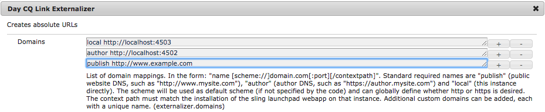

# Utilisation du partage sur les réseaux sociaux {#using-social-media-sharing-in-aem-sites}

Explorez la configuration et l’utilisation du composant Partage sur les réseaux sociaux.

>[!VIDEO](https://video.tv.adobe.com/v/18897/?quality=9&learn=on)

Cette vidéo explore les fonctionnalités suivantes du composant Partage sur les réseaux sociaux (qui fait partie de [AEM Composants principaux](https://docs.adobe.com/content/help/fr-FR/experience-manager-core-components/using/introduction.html)) à l’aide de l’exemple de site Web [We.Retail](https://github.com/Adobe-Marketing-Cloud/aem-sample-we-retail#weretail).

* 0:00 - Ajoute et configuration du composant Partage sur les réseaux sociaux
* 1:00 - Partage sur Facebook
* 3:10 - Partage sur Pinterest
* 6:25 - Utilisation du composant Partage sur les réseaux sociaux sur une page de produit

## Configuration de l&#39;extériorisateur {#externalizer-setup}

[http://localhost:4502/system/console/configMgr/com.day.cq.commons.impl.ExternalizerImpl](http://localhost:4502/system/console/configMgr/com.day.cq.commons.impl.ExternalizerImpl)

[AEM ](https://helpx.adobe.com/experience-manager/6-5/sites/developing/using/externalizer.html) externalisation doit être configuré sur AEM Author et AEM Publish pour mapper le mode d’exécution de publication au domaine accessible au public utilisé pour accéder à AEM Publish.

Dans cette vidéo, nous utilisons `/etc/hosts` pour parodier *www.example.com* pour résoudre le problème de localhost, et nous utilisons une [configuration de base du répartiteur d’AEM](https://docs.adobe.com/content/help/en/experience-manager-dispatcher/using/getting-started/dispatcher-install.html) pour permettre à www.example.com de traiter AEM Publish.

## Documents d&#39;appui {#supporting-materials}

* [Téléchargement des composants principaux AEM](https://github.com/adobe/aem-core-wcm-components/releases)
* [Télécharger We.Retail](https://github.com/Adobe-Marketing-Cloud/aem-sample-we-retail/releases)
* [Installation de Dispatcher](https://docs.adobe.com/content/help/en/experience-manager-dispatcher/using/getting-started/dispatcher-install.html)
