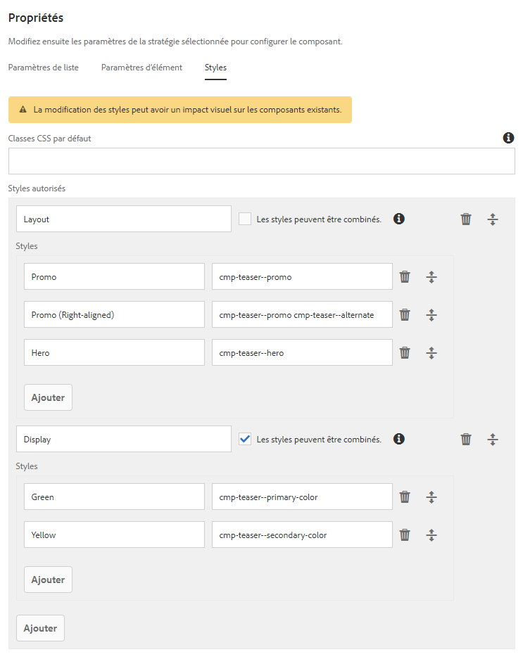
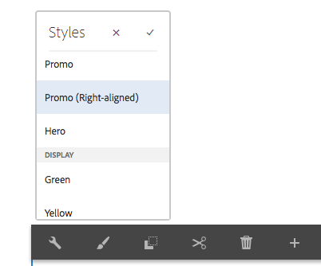
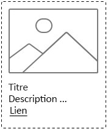

# Présentation des meilleures pratiques relatives au système de style{#understanding-style-organization-with-the-aem-style-system}

>[!NOTE]
>
>Veuillez consulter le contenu de la section [Comprendre comment coder pour le système](style-system-technical-video-understand.md)de style, afin de vous assurer que les conventions de style BEM utilisées par AEM Style System sont bien comprises.

Deux versions ou styles principaux sont mis en oeuvre pour le système de style AEM :

* **Styles de mise en page**
* **Afficher les styles**

**Les styles** de mise en page affectent de nombreux éléments d’un composant afin de créer un rendu bien défini et identifiable (conception et mise en page) du composant, souvent aligné sur un concept de marque réutilisable spécifique. Par exemple, un composant Teaser peut être présenté dans la mise en page traditionnelle à base de carte, dans un style promotionnel horizontal ou en tant que mise en page Héros superposant du texte sur une image.

**Les styles** d’affichage sont utilisés pour affecter des variations mineures des styles de mise en page. Toutefois, ils ne modifient pas la nature ou l’intention fondamentale du style de mise en page. Par exemple, un style de mise en page Héros peut avoir des styles d’affichage qui modifient le jeu de couleurs de la marque Principale en un jeu de couleurs de marque secondaire.

## Meilleures pratiques d’organisation des styles {#style-organization-best-practices}

Lors de la définition des noms de style disponibles pour les auteurs d’AEM, il est préférable d’effectuer les opérations suivantes :

* Nommer les styles à l’aide d’un vocabulaire compris par les auteurs
* Réduire le nombre d’options de style
* Exposer uniquement les options de style et les combinaisons autorisées par les normes de la marque
* Exposer uniquement les combinaisons de style ayant un effet
   * Si des combinaisons inefficaces sont mises en évidence, assurez-vous qu&#39;elles n&#39;ont pas au moins d&#39;effet négatif.

À mesure que le nombre de combinaisons de style possibles augmente pour les auteurs AEM, il existe davantage de permutations qui doivent être vérifiées et validées par rapport aux normes de la marque. Trop d&#39;options peuvent aussi embrouiller les auteurs, car il peut devenir difficile de déterminer quelle option ou combinaison est nécessaire pour produire l&#39;effet désiré.

### Noms de style et classes CSS {#style-names-vs-css-classes}

Les noms de style, ou les options présentées aux auteurs AEM, et les noms de classe CSS implémentants sont découplés en AEM.

Cela permet aux options Style d&#39;être étiquetées dans un vocabulaire clair et compris par les auteurs AEM, mais permet aux développeurs CSS de nommer les classes CSS d&#39;une manière sémantique et BAT future. Par exemple :

Un composant doit avoir les options de coloration avec les couleurs **Principales** et **secondaires** de la marque. Toutefois, les auteurs AEM connaissent les couleurs comme étant **vert** et **jaune, plutôt que le langage de conception Principal et secondaire.**

Le système de style AEM peut exposer ces styles d’affichage de coloration à l’aide d’étiquettes **vertes** et **jaunes**, tout en permettant aux développeurs CSS d’utiliser un nom sémantique de `.cmp-component--primary-color` et `.cmp-component--secondary-color` de définir l’implémentation de style réelle dans CSS.

Le nom Style de **Vert** est associé à `.cmp-component--primary-color`et **Jaune** à `.cmp-component--secondary-color`.

Si la couleur de la marque de la société change à l&#39;avenir, il suffit de modifier les implémentations uniques de `.cmp-component--primary-color` et `.cmp-component--secondary-color`, ainsi que les noms de style.

## Le composant Teaser comme exemple de cas d&#39;utilisation {#the-teaser-component-as-an-example-use-case}

Voici un exemple d’utilisation de la mise en forme d’un composant Teaser pour plusieurs styles de mise en page et d’affichage différents.

Cela permettra d’explorer comment les noms de style (exposés aux auteurs) et comment les classes CSS de support sont organisées.

### Configuration des styles de composant Teaser {#component-styles-configuration}

L&#39;image suivante montre la configuration [!UICONTROL Styles] du composant Teaser pour les variations décrites dans le cas d&#39;utilisation.

Les noms des groupes [!UICONTROL de] styles, Disposition et Affichage correspondent par hasard aux concepts généraux des styles d’affichage et Styles de mise en page utilisés pour classer conceptuellement les types de styles dans cet article.

Les noms des groupes [!UICONTROL de] styles et le nombre de groupes [!UICONTROL de] styles doivent être adaptés au cas d’utilisation des composants et aux conventions de mise en forme des composants spécifiques au projet.

Par exemple, le nom du groupe de styles **Display** aurait pu être nommé **Couleurs**.



### Menu de sélection de style {#style-selection-menu}

L’image ci-dessous affiche les auteurs du menu [!UICONTROL Style] interagissent avec pour sélectionner les styles appropriés pour le composant. Notez que les noms des groupes [!UICONTROL de] styles, ainsi que les noms des styles, sont tous exposés à l’auteur.



### Default style {#default-style}

Le style par défaut est souvent le style le plus utilisé du composant et la vue par défaut, sans style, du teaser lorsqu’il est ajouté à une page.

Selon la communauté du style par défaut, le CSS peut être appliqué directement sur le `.cmp-teaser` (sans modificateur) ou sur un `.cmp-teaser--default`.

Si les règles de style par défaut s’appliquent le plus souvent à toutes les variantes, il est préférable d’utiliser `.cmp-teaser` en tant que classes CSS du style par défaut, puisque toutes les variations doivent implicitement en hériter, en supposant que les conventions de type BEM soient respectées. Dans le cas contraire, ils doivent être appliqués par le modificateur par défaut, par exemple `.cmp-teaser--default`, qui doit à son tour être ajouté au champ Classes [CSS par défaut de la configuration de style du](#component-styles-configuration) composant, sinon ces règles de style devront être remplacées dans chaque variation.

Il est même possible d’attribuer un style &quot;nommé&quot; comme style par défaut, par exemple, le style Héros `(.cmp-teaser--hero)` défini ci-dessous, mais il est plus clair d’implémenter le style par défaut par rapport aux implémentations de classe `.cmp-teaser` ou `.cmp-teaser--default` CSS.

>[!NOTE]
>
>Notez que le style de mise en page par défaut n’a PAS de nom de style d’affichage. Cependant, l’auteur pourra sélectionner une option d’affichage dans l’outil de sélection AEM système de style.
>
>Ceci en violation des meilleures pratiques :
>
>**Exposer uniquement les combinaisons de style ayant un effet**
>
>Si un auteur sélectionne le style d’affichage **Vert** , rien ne se produit.
>
>Dans ce cas d’utilisation, nous concéderons cette violation, car tous les autres styles de mise en page doivent être colorables à l’aide des couleurs de la marque.
>
>Dans la section **Promo (alignée à droite)** ci-dessous, nous verrons comment éviter les combinaisons de style indésirables.



* **Style de mise en page**
   * Valeur par défaut
* **Style d’affichage**
   * Aucune
* **Classes** CSS efficaces : `.cmp-teaser--promo` ou `.cmp-teaser--default`

### Style promotionnel {#promo-style}

Le style **de mise en page** Promo est utilisé pour promouvoir le contenu à forte valeur ajoutée sur le site. Il est disposé horizontalement pour occuper une bande d’espace sur la page Web et doit être modifiable par couleur de marque, le style de mise en page Promo par défaut utilisant du texte noir.

Pour ce faire, un style **de** mise en page de **Promo** et les styles **d&#39;** affichage de **Green et Yellow sont configurés dans le système de style d&#39; pour le composant Teaser.******

#### Promo par défaut


* **Style de mise en page**
   * Nom du style : **Promo**
   * Classe CSS: `cmp-teaser--promo`
* **Style d’affichage**
   * Aucune
* **Classes** CSS efficaces : `.cmp-teaser--promo`

#### Principal promotionnelle


* **Style de mise en page**
   * Nom du style : **Promo**
   * Classe CSS: `cmp-teaser--promo`
* **Style d’affichage**
   * Nom du style : **Vert**
   * Classe CSS: `cmp-teaser--primary-color`
* **Classes** CSS efficaces : `cmp-teaser--promo.cmp-teaser--primary-color`

#### Promo Secondaire


* **Style de mise en page**
   * Nom du style : **Promo**
   * Classe CSS: `cmp-teaser--promo`
* **Style d’affichage**
   * Nom du style : **Jaune**
   * Classe CSS: `cmp-teaser--secondary-color`
* **Classes** CSS efficaces : `cmp-teaser--promo.cmp-teaser--secondary-color`

### Style aligné à droite {#promo-r-align}

Le style de mise en page aligné **sur la** Promo à droite est une variante du style Promo qui modifie l’emplacement de l’image et du texte (image à droite, texte à gauche).

L&#39;alignement droit, en son centre, est un style d&#39;affichage, il peut être entré dans AEM Style System en tant que style d&#39;affichage sélectionné conjointement avec le style de mise en page Promo. Cela va à l&#39;encontre de la bonne pratique consistant à :

**Exposer uniquement les combinaisons de style ayant un effet**

..qui a déjà été violé dans le style [](#default-style)par défaut.

Puisque l’alignement droit affecte uniquement le style de mise en page Promo, et non les deux autres styles de mise en page : par défaut et héros, nous pouvons créer un nouveau style de mise en page Promo (aligné à droite) qui inclut la classe CSS qui aligne à droite le contenu des styles de mise en page Promo : `cmp -teaser--alternate`.

Cette combinaison de plusieurs styles en une seule entrée Style peut également aider à réduire le nombre de styles et de permutations de style disponibles, ce qui est préférable pour réduire le plus possible.

Remarquez que le nom de la classe CSS, `cmp-teaser--alternate`, n&#39;a pas à correspondre à la nomenclature conviviale de &quot;aligné à droite&quot;.

#### Valeur par défaut alignée à droite


* **Style de mise en page**
   * Nom du style : **Promo (aligné à droite)**
   * Classes CSS: `cmp-teaser--promo cmp-teaser--alternate`
* **Style d’affichage**
   * Aucune
* **Classes** CSS efficaces : `.cmp-teaser--promo.cmp-teaser--alternate`

#### Principal aligné à droite


* **Style de mise en page**
   * Nom du style : **Promo (aligné à droite)**
   * Classes CSS: `cmp-teaser--promo cmp-teaser--alternate`
* **Style d’affichage**
   * Nom du style : **Vert**
   * Classe CSS: `cmp-teaser--primary-color`
* **Classes** CSS efficaces : `.cmp-teaser--promo.cmp-teaser--alternate.cmp-teaser--primary-color`

#### Secondaire aligné à droite


* **Style de mise en page**
   * Nom du style : **Promo (aligné à droite)**
   * Classes CSS: `cmp-teaser--promo cmp-teaser--alternate`
* **Style d’affichage**
   * Nom du style : **Jaune**
   * Classe CSS: `cmp-teaser--secondary-color`
* **Classes** CSS efficaces : `.cmp-teaser--promo.cmp-teaser--alternate.cmp-teaser--secondary-color`

### Style de héros {#hero-style}

Le style de mise en page Héros affiche l’image des composants en arrière-plan avec le titre et le lien superposés. Le style de mise en page Héros, tout comme le style de mise en page Promo, doit être colorable avec les couleurs de la marque.

Pour colorer le style de mise en page Héros avec les couleurs de la marque, les mêmes styles d’affichage que ceux utilisés pour le style de mise en page Promo peuvent être utilisés.

Par composant, le nom du style est mappé à l’ensemble unique de classes CSS, ce qui signifie que les noms de classe CSS qui colorent l’arrière-plan du style de mise en page Promo doivent colorer le texte et le lien du style de mise en page Hero.

Cela peut être obtenu de manière triviale en définissant la portée des règles CSS. Toutefois, cela nécessite que les développeurs de CSS comprennent comment ces permutations seront mises en oeuvre sur AEM.

CSS permettant de colorier l’arrière-plan du style de mise en page **Promote** avec la couleur Principale (verte) :

```css
.cmp-teaser--promo.cmp-teaser--primary--color {
   ...
   background-color: green;
   ...
}
```

CSS permettant de colorier le texte du style de mise en page **Héros** avec la couleur Principale (verte) :

```css
.cmp-teaser--hero.cmp-teaser--primary--color {
   ...
   color: green;
   ...
}
```

#### Par défaut du héros


* **Style de mise en page**
   * Nom du style : **Héros**
   * Classe CSS: `cmp-teaser--hero`
* **Style d’affichage**
   * Aucune
* **Classes** CSS efficaces : `.cmp-teaser--hero`

#### Principal de héros


* **Style de mise en page**
   * Nom du style : **Promo**
   * Classe CSS: `cmp-teaser--hero`
* **Style d’affichage**
   * Nom du style : **Vert**
   * Classe CSS: `cmp-teaser--primary-color`
* **Classes** CSS efficaces : `cmp-teaser--hero.cmp-teaser--primary-color`

#### Héros Secondaire


* **Style de mise en page**
   * Nom du style : **Promo**
   * Classe CSS: `cmp-teaser--hero`
* **Style d’affichage**
   * Nom du style : **Jaune**
   * Classe CSS: `cmp-teaser--secondary-color`
* **Classes** CSS efficaces : `cmp-teaser--hero.cmp-teaser--secondary-color`

## Ressources supplémentaires {#additional-resources}

* [Documentation du système de style](https://helpx.adobe.com/fr/experience-manager/6-5/sites/authoring/using/style-system.html)
* [Création de bibliothèques clientes AEM](https://helpx.adobe.com/fr/experience-manager/6-5/sites/developing/using/clientlibs.html)
* [Site Web de documentation de BEM (Block Element Modificateur)](https://getbem.com/)
* [Site Web de documentation LESS](https://lesscss.org/)
* [site Web jQuery](https://jquery.com/)
