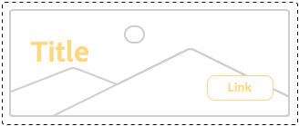

# Présentation des bonnes pratiques relatives au système de style{#understanding-style-organization-with-the-aem-style-system}

>[!NOTE]
>
>Consultez le contenu à l’adresse [Comprendre comment coder pour le système de style](style-system-technical-video-understand.md), afin de garantir une compréhension des conventions de type BEM utilisées par AEM système de style.

Deux versions ou styles principaux sont mis en oeuvre pour le système de style AEM :

* **Styles de disposition**
* **Afficher les styles**

**Styles de disposition** affectent de nombreux éléments d’un composant afin de créer un rendu bien défini et identifiable (conception et mise en page) du composant, souvent en s’alignant sur un concept de marque réutilisable spécifique. Par exemple, un composant Teaser peut être présenté dans la mise en page traditionnelle basée sur les cartes, un style promotionnel horizontal ou sous la forme d’une mise en page Héros superposant du texte sur une image.

**Afficher les styles** sont utilisées pour affecter des variations mineures des styles de mise en page. Toutefois, elles ne modifient pas la nature ou l’intention fondamentales du style de mise en page. Par exemple, un style de mise en page Héros peut avoir des styles d’affichage qui modifient le jeu de couleurs de la Principale marque au modèle de couleurs de la marque secondaire.

## Bonnes pratiques relatives à l’organisation des styles {#style-organization-best-practices}

Lors de la définition des noms de style disponibles pour les auteurs d’AEM, il est préférable de :

* Nommer les styles à l’aide d’un vocabulaire compris par les auteurs
* Minimiser le nombre d’options de style
* N’exposent que les options et combinaisons de style autorisées par les normes de marque
* N’exposent que les combinaisons de style ayant un effet
   * Si des combinaisons inefficaces sont exposées, assurez-vous qu’elles n’ont pas au moins un effet négatif.

À mesure que le nombre de combinaisons de style possibles augmente pour les auteurs d’AEM, plus il existe de permutations qui doivent être AQ et validées par rapport aux normes de la marque. Trop d’options peuvent également dérouter les auteurs, car il se peut qu’il soit difficile de déterminer quelle option ou combinaison est requise pour produire l’effet souhaité.

### Noms de style et classes CSS {#style-names-vs-css-classes}

Les noms de style ou les options présentées aux auteurs d’AEM et les noms de classe CSS d’implémentation sont découplés dans AEM.

Cela permet aux auteurs d’AEM d’étiqueter les options de style de manière claire et compréhensible, mais permet aux développeurs CSS de nommer les classes CSS d’une manière sémantique et à l’avenir. Par exemple :

Un composant doit avoir les options à colorer avec le **Principal** et **Secondaire** couleurs, cependant, les auteurs AEM connaissent les couleurs comme **vert** et **jaune**, plutôt que la langue de conception de Principal et secondaire.

Le système de style AEM peut afficher ces styles d’affichage de couleur à l’aide de libellés compatibles avec l’auteur. **Vert** et **Jaune**, tout en permettant aux développeurs CSS d’utiliser le nommage sémantique de `.cmp-component--primary-color` et `.cmp-component--secondary-color` pour définir l’implémentation du style réel dans CSS.

Nom du style de **Vert** est mappé sur `.cmp-component--primary-color`, et **Jaune** to `.cmp-component--secondary-color`.

Si la couleur de marque de l’entreprise change à l’avenir, il suffit de modifier les mises en oeuvre uniques de `.cmp-component--primary-color` et `.cmp-component--secondary-color`et les noms de style.

## Exemple de cas d’utilisation du composant Teaser {#the-teaser-component-as-an-example-use-case}

Vous trouverez ci-dessous un exemple de style d’un composant Teaser pour plusieurs styles de mise en page et d’affichage différents.

Cela permettra d’explorer la manière dont les noms de style (exposés aux auteurs) et dont les classes CSS de sauvegarde sont organisées.

### Configuration des styles du composant Teaser {#component-styles-configuration}

L’image suivante montre la variable [!UICONTROL Styles] configuration du composant Teaser pour les variations mentionnées dans le cas d’utilisation.

Le [!UICONTROL Groupe de styles] noms, mise en page et affichage, par événement, correspondent aux concepts généraux des styles d’affichage et des styles de mise en page utilisés pour catégoriser conceptuellement les types de styles dans cet article.

Le [!UICONTROL Groupe de styles] noms et nombre [!UICONTROL Groupes de styles] doit être adapté au cas d’utilisation du composant et aux conventions de style de composant spécifiques au projet.

Par exemple, la variable **Affichage** Le nom du groupe de style aurait pu être nommé **Couleurs**.


### Menu de sélection de style {#style-selection-menu}

L’image ci-dessous affiche le [!UICONTROL Style] les auteurs de menus interagissent avec pour sélectionner les styles appropriés pour le composant. Notez que [!UICONTROL Style Grpi] les noms, ainsi que les noms de style, sont tous exposés à l’auteur.


### Style par défaut {#default-style}

Le style par défaut est souvent le style le plus couramment utilisé du composant, ainsi que la vue par défaut, sans style du teaser lorsqu’il est ajouté à une page.

Selon la commune du style par défaut, le CSS peut être appliqué directement sur la page `.cmp-teaser` (sans modificateur) ou sur un `.cmp-teaser--default`.

Si les règles de style par défaut s’appliquent plus souvent que non à toutes les variantes, il est préférable d’utiliser `.cmp-teaser` comme classes CSS du style par défaut, puisque toutes les variations doivent implicitement hériter d’elles, en supposant que les conventions de type BEM soient suivies. Si ce n’est pas le cas, elles doivent être appliquées via le modificateur par défaut, tel que `.cmp-teaser--default`, qui à son tour doit être ajouté à la variable [Classes CSS par défaut de la configuration de style du composant](#component-styles-configuration) , sinon ces règles de style doivent être remplacées dans chaque variation.

Il est même possible d’attribuer un style &quot;nommé&quot; comme style par défaut, par exemple, le style Hero `(.cmp-teaser--hero)` défini ci-dessous, toutefois, il est plus clair de mettre en oeuvre le style par défaut sur la propriété `.cmp-teaser` ou `.cmp-teaser--default` Implémentations de classe CSS.

>[!NOTE]
>
>Notez que le style de mise en page par défaut n’a PAS de nom de style d’affichage, mais l’auteur peut sélectionner une option d’affichage dans l’outil de sélection AEM système de style.
>
>Cela va à l&#39;encontre de la bonne pratique :
>
>**N’exposent que les combinaisons de style ayant un effet**
>
>Si un auteur sélectionne le style d’affichage de **Vert** rien ne se passera.
>
>Dans ce cas pratique, nous concéderons cette violation, car tous les autres styles de mise en page doivent être colorables à l’aide des couleurs de la marque.
>
>Dans le **Promotion (alignée à droite)** nous allons voir ci-dessous comment empêcher les combinaisons de style indésirables.


* **Style de disposition**
   * Valeur par défaut
* **Style d’affichage**
   * Aucun
* **Classes CSS efficaces**: `.cmp-teaser--promo` ou `.cmp-teaser--default`

### Style promotionnel {#promo-style}

Le **Style de mise en page promotionnelle** est utilisé pour promouvoir du contenu à forte valeur ajoutée sur le site. Il est disposé horizontalement pour occuper une plage d’espace sur la page web et doit être stylisable par les couleurs de la marque, avec le style de mise en page Promotion par défaut en texte noir.

Pour ce faire, une **style de mise en page** de **Promo** et le **styles d’affichage** de **Vert** et **Jaune** sont configurés dans le système de style AEM pour le composant Teaser.

#### Valeur de promo par défaut


* **Style de disposition**
   * Nom du style : **Promo**
   * Classe CSS: `cmp-teaser--promo`
* **Style d’affichage**
   * Aucun
* **Classes CSS efficaces**: `.cmp-teaser--promo`

#### Principal promotionnelle


* **Style de disposition**
   * Nom du style : **Promo**
   * Classe CSS: `cmp-teaser--promo`
* **Style d’affichage**
   * Nom du style : **Vert**
   * Classe CSS: `cmp-teaser--primary-color`
* **Classes CSS efficaces**: `cmp-teaser--promo.cmp-teaser--primary-color`

#### Promo Secondaire


* **Style de disposition**
   * Nom du style : **Promo**
   * Classe CSS: `cmp-teaser--promo`
* **Style d’affichage**
   * Nom du style : **Jaune**
   * Classe CSS: `cmp-teaser--secondary-color`
* **Classes CSS efficaces**: `cmp-teaser--promo.cmp-teaser--secondary-color`

### Style aligné à droite de la promotion {#promo-r-align}

Le **Promo alignée à droite** style de mise en page est une variante du style Promotion qui modifie l’emplacement de l’image et du texte (image à droite, texte à gauche).

L&#39;alignement droit, en son centre, est un style d&#39;affichage. Il peut être entré dans le système de style AEM en tant que style d&#39;affichage sélectionné en association avec le style de mise en page Promotion. Cela enfreint la bonne pratique de :

**N’exposent que les combinaisons de style ayant un effet**

.qui a déjà été violé dans la variable [Style par défaut](#default-style).

Puisque le bon alignement affecte uniquement le style de mise en page Promotion, et non les deux autres styles de mise en page : Par défaut et hero, nous pouvons créer un style de mise en page Promotion (aligné à droite) qui inclut la classe CSS qui aligne à droite le contenu des styles de mise en page Promotion : `cmp -teaser--alternate`.

Cette combinaison de plusieurs styles en une seule entrée Style peut également contribuer à réduire le nombre de styles disponibles et de permutations de style, ce qui est préférable pour réduire le nombre.

Notez le nom de la classe CSS, `cmp-teaser--alternate`, ne doit pas nécessairement correspondre à la nomenclature conviviale de &quot;aligné à droite&quot;.

#### Valeur par défaut alignée sur la droite promo


* **Style de disposition**
   * Nom du style : **Promotion (alignée à droite)**
   * Classes CSS: `cmp-teaser--promo cmp-teaser--alternate`
* **Style d’affichage**
   * Aucun
* **Classes CSS efficaces**: `.cmp-teaser--promo.cmp-teaser--alternate`

#### Principal aligné à droite promo


* **Style de disposition**
   * Nom du style : **Promotion (alignée à droite)**
   * Classes CSS: `cmp-teaser--promo cmp-teaser--alternate`
* **Style d’affichage**
   * Nom du style : **Vert**
   * Classe CSS: `cmp-teaser--primary-color`
* **Classes CSS efficaces**: `.cmp-teaser--promo.cmp-teaser--alternate.cmp-teaser--primary-color`

#### Promo aligné à droite Secondaire


* **Style de disposition**
   * Nom du style : **Promotion (alignée à droite)**
   * Classes CSS: `cmp-teaser--promo cmp-teaser--alternate`
* **Style d’affichage**
   * Nom du style : **Jaune**
   * Classe CSS: `cmp-teaser--secondary-color`
* **Classes CSS efficaces**: `.cmp-teaser--promo.cmp-teaser--alternate.cmp-teaser--secondary-color`

### Style de héros {#hero-style}

Le style de mise en page Héros affiche l’image des composants en arrière-plan avec le titre et le lien superposés. Le style de mise en page Héros, comme le style de mise en page Promo, doit être colorable avec des couleurs de marque.

Pour colorer le style de mise en page Héros avec les couleurs de la marque, vous pouvez utiliser les mêmes styles d’affichage que ceux utilisés pour le style de mise en page Promo.

Par composant, le nom du style est mappé à un seul ensemble de classes CSS, ce qui signifie que les noms de classe CSS qui colorent l’arrière-plan du style de mise en page Promotion doivent colorer le texte et le lien du style de mise en page Héros.

Pour ce faire, il est possible d’établir une portée en définissant les règles CSS. Toutefois, cela nécessite que les développeurs CSS comprennent comment ces permutations sont appliquées sur AEM.

CSS pour colorier l’arrière-plan de la fonction **Convertir** style de mise en page avec la couleur Principale (verte) :

```css
.cmp-teaser--promo.cmp-teaser--primary--color {
   ...
   background-color: green;
   ...
}
```

CSS pour colorier le texte de la variable **Hero** style de mise en page avec la couleur Principale (verte) :

```css
.cmp-teaser--hero.cmp-teaser--primary--color {
   ...
   color: green;
   ...
}
```

#### Hero Default


* **Style de disposition**
   * Nom du style : **Hero**
   * Classe CSS: `cmp-teaser--hero`
* **Style d’affichage**
   * Aucun
* **Classes CSS efficaces**: `.cmp-teaser--hero`

#### Principal de héros


* **Style de disposition**
   * Nom du style : **Promo**
   * Classe CSS: `cmp-teaser--hero`
* **Style d’affichage**
   * Nom du style : **Vert**
   * Classe CSS: `cmp-teaser--primary-color`
* **Classes CSS efficaces**: `cmp-teaser--hero.cmp-teaser--primary-color`

#### Héros Secondaire



* **Style de disposition**
   * Nom du style : **Promo**
   * Classe CSS: `cmp-teaser--hero`
* **Style d’affichage**
   * Nom du style : **Jaune**
   * Classe CSS: `cmp-teaser--secondary-color`
* **Classes CSS efficaces**: `cmp-teaser--hero.cmp-teaser--secondary-color`

## Ressources supplémentaires {#additional-resources}

* [Documentation du système de style](https://helpx.adobe.com/fr/experience-manager/6-5/sites/authoring/using/style-system.html)
* [Création de bibliothèques clientes AEM](https://helpx.adobe.com/fr/experience-manager/6-5/sites/developing/using/clientlibs.html)
* [Site web de documentation de BEM (Block Element Modifier)](https://getbem.com/)
* [Site web de la documentation LESS](https://lesscss.org/)
* [site web jQuery](https://jquery.com/)
