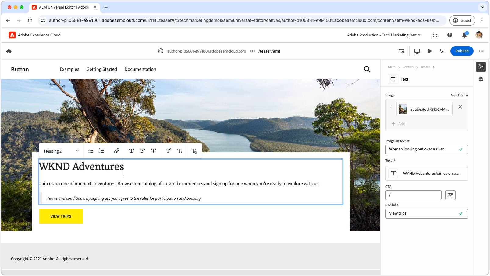
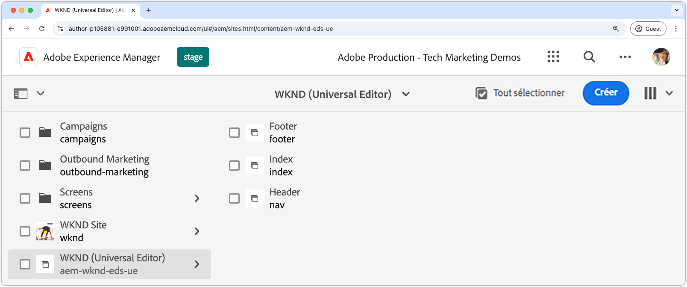

# Tutoriel de développement pour Edge Delivery Services et l’éditeur universel

Tutoriel du développeur de 

Dans ce tutoriel, vous apprendrez les principes de base de la création d’un site web AEM qui associe une création puissante à l’éditeur universel et une diffusion ultra-rapide à l’aide de Edge Delivery Services. À la fin, vous aurez une compréhension de base de la création d’un projet, de la configuration d’un environnement de développement local et de la création d’un bloc.

## Configuration du projet

Découvrez comment créer un projet de code et configurer un nouveau site dans AEM as a Cloud Service. Cette configuration permet un développement transparent avec l’éditeur universel pour la création de contenu et la diffusion rapide de contenu via les Edge Delivery Services.

<!-- CARDS 

* ./1-new-code-project.md
  {}
* ./2-new-aem-site.md

-->
<!-- START CARDS HTML - DO NOT MODIFY BY HAND -->

    

        

            

                <figure class="image x-is-16by9">
                    
                </figure>
            

            

                

                    

                        <a href="./1-new-code-project.md" target="_blank" rel="referrer" title="Créer un projet">Créer un projet</a>
                    

                    
Création d’un projet pour les Edge Delivery Services de l’éditeur universel

                

                <a href="./1-new-code-project.md" target="_blank" rel="referrer" class="spectrum-Button spectrum-Button--outline spectrum-Button--primary spectrum-Button--sizeM" style="align-self: flex-start; margin-top: 1rem;">
                    En savoir plus
                </a>
            

        

    

    

        

            

                <figure class="image x-is-16by9">
                    
                </figure>
            

            

                

                    

                        <a href="./2-new-aem-site.md" target="_blank" rel="referrer" title="Créer un nouveau site">Créer un site</a>
                    

                    
Création d’un site dans AEM Sites pour Edge Delivery Services for Universal Editor

                

                <a href="./2-new-aem-site.md" target="_blank" rel="referrer" class="spectrum-Button spectrum-Button--outline spectrum-Button--primary spectrum-Button--sizeM" style="align-self: flex-start; margin-top: 1rem;">
                    En savoir plus
                </a>
            

        

    

<!-- END CARDS HTML - DO NOT MODIFY BY HAND -->

## Configuration du développement

Découvrez comment configurer votre environnement de développement local pour permettre un développement rapide de site web. Cette configuration permet une création de site transparente avec l’éditeur universel et une diffusion de contenu efficace par le biais des Edge Delivery Services, assurant ainsi un workflow de développement fluide et optimisé.
<!-- CARDS 

* ./3-local-development-environment.md
* ./4-website-branding.md

-->
<!-- START CARDS HTML - DO NOT MODIFY BY HAND -->

    

        

            

                <figure class="image x-is-16by9">
                    
                </figure>
            

            

                

                    

                        <a href="./3-local-development-environment.md" target="_blank" rel="referrer" title="Configuration d’un environnement de développement local">Configuration d’un environnement de développement local</a>
                    

                    
Création d’un projet pour les Edge Delivery Services de l’éditeur universel

                

                <a href="./3-local-development-environment.md" target="_blank" rel="referrer" class="spectrum-Button spectrum-Button--outline spectrum-Button--primary spectrum-Button--sizeM" style="align-self: flex-start; margin-top: 1rem;">
                    En savoir plus
                </a>
            

        

    

    

        

            

                <figure class="image x-is-16by9">
                    
                </figure>
            

            

                

                    

                        <a href="./4-website-branding.md" target="_blank" rel="referrer" title="Branding du site web">Image de marque d’un site web</a>
                    

                    
Configurez des variables CSS globales et CSS et des polices web.

                

                <a href="./4-website-branding.md" target="_blank" rel="referrer" class="spectrum-Button spectrum-Button--outline spectrum-Button--primary spectrum-Button--sizeM" style="align-self: flex-start; margin-top: 1rem;">
                    En savoir plus
                </a>
            

        

    

<!-- END CARDS HTML - DO NOT MODIFY BY HAND -->

## Bloquer le développement

Découvrez comment créer un bloc en définissant son modèle de contenu et en configurant un exemple de contenu pour les tests et le développement. Explorez deux méthodes de rendu du bloc et comprenez comment le structurer pour des performances et une flexibilité optimales dans AEM et les Edge Delivery Services.

<!-- CARDS 

* ./5-new-block.md
* ./6-author-block.md
* ./7a-block-css.md
* ./7b-block-js-css.md

-->
<!-- START CARDS HTML - DO NOT MODIFY BY HAND -->

    

        

            

                <figure class="image x-is-16by9">
                    
                </figure>
            

            

                

                    

                        <a href="./5-new-block.md" target="_blank" rel="referrer" title="Création d’un bloc pour l’éditeur universel">Créer un bloc pour l’éditeur universel</a>
                    

                    
Créez un bloc.

                

                <a href="./5-new-block.md" target="_blank" rel="referrer" class="spectrum-Button spectrum-Button--outline spectrum-Button--primary spectrum-Button--sizeM" style="align-self: flex-start; margin-top: 1rem;">
                    En savoir plus
                </a>
            

        

    

    

        

            

                <figure class="image x-is-16by9">
                    
                </figure>
            

            

                

                    

                        <a href="./6-author-block.md" target="_blank" rel="referrer" title="Créer le bloc">Créez le bloc</a>
                    

                    
Créez le nouveau bloc afin qu’il puisse se développer en parallèle.

                

                <a href="./6-author-block.md" target="_blank" rel="referrer" class="spectrum-Button spectrum-Button--outline spectrum-Button--primary spectrum-Button--sizeM" style="align-self: flex-start; margin-top: 1rem;">
                    En savoir plus
                </a>
            

        

    

    

        

            

                <figure class="image x-is-16by9">
                    
                </figure>
            

            

                

                    

                        <a href="./7a-block-css.md" target="_blank" rel="referrer" title="Développement de blocs avec CSS">Bloquer le développement avec CSS</a>
                    

                    
Créez le bloc à l’aide de CSS uniquement.

                

                <a href="./7a-block-css.md" target="_blank" rel="referrer" class="spectrum-Button spectrum-Button--outline spectrum-Button--primary spectrum-Button--sizeM" style="align-self: flex-start; margin-top: 1rem;">
                    En savoir plus
                </a>
            

        

    

    

        

            

                <figure class="image x-is-16by9">
                    
                </figure>
            

            

                

                    

                        <a href="./7b-block-js-css.md" target="_blank" rel="referrer" title="Développement de blocs avec CSS et JS">Développement de blocs avec CSS et JS</a>
                    

                    
Créez un bloc à l’aide de CSS et JS.

                

                <a href="./7b-block-js-css.md" target="_blank" rel="referrer" class="spectrum-Button spectrum-Button--outline spectrum-Button--primary spectrum-Button--sizeM" style="align-self: flex-start; margin-top: 1rem;">
                    En savoir plus
                </a>
            

        

    

<!-- END CARDS HTML - DO NOT MODIFY BY HAND -->
