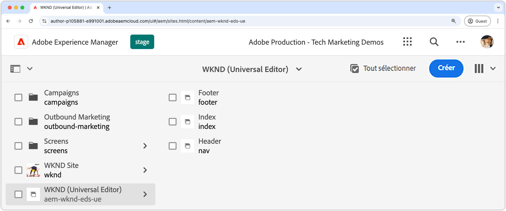

# Création d’un site AEM

Le site AEM est l’emplacement à partir duquel le contenu du site web est modifié, géré et publié. Pour créer un site AEM diffusé par le biais de Edge Delivery Services et créé à l’aide de l’éditeur universel, utilisez le modèle de site de création [Edge Delivery Services avec AEM ](https://github.com/adobe-rnd/aem-boilerplate-xwalk/releases) pour créer un site sur l’instance de création AEM.

Le site AEM est l’endroit où le contenu du site web est stocké et créé. L’expérience finale est une combinaison du contenu du site AEM et du code du [site web](./1-new-code-project.md)

Pour créer un site AEM](https://experienceleague.adobe.com/en/docs/experience-manager-cloud-service/content/edge-delivery/wysiwyg-authoring/edge-dev-getting-started#create-aem-site) suivez la [procédure détaillée décrite dans la documentation.  Vous trouverez ci-dessous un résumé des étapes, y compris les valeurs utilisées dans ce tutoriel.
1. **Créez un site** dans l’instance de création AEM. Ce tutoriel utilise les noms de site suivants :
   * Titre du site : `WKND (Universal Editor)`
   * Nom du site : `aem-wknd-eds-ue`

      * La valeur du nom du site doit correspondre au nom du chemin du site [ajouté à `paths.json`](https://experienceleague.adobe.com/en/docs/experience-manager-cloud-service/content/edge-delivery/wysiwyg-authoring/path-mapping).

2. **Importez le dernier modèle** à partir du modèle de site de création [Edge Delivery Services avec AEM](https://github.com/adobe-rnd/aem-boilerplate-xwalk/releases).
3. **Nommez le site** pour correspondre au nom du référentiel GitHub et définissez l’URL GitHub comme URL du référentiel.

## Publish du nouveau site à prévisualiser

Après avoir créé le site dans l’instance de création AEM, publiez-le dans l’aperçu Edge Delivery Services pour rendre le contenu disponible dans l’[environnement de développement local](./3-local-development-environment.md).

1. Connectez-vous à **AEM Author** et accédez à **Sites**.
2. Sélectionnez le **nouveau site** (`WKND (Universal Editor)`) et cliquez sur **Gérer les publications**.
3. Choisissez **Aperçu** sous **Destinations** et cliquez sur **Suivant**.
4. Sous **Inclure les paramètres enfants**, sélectionnez **Inclure les enfants**, désélectionnez d’autres options, puis cliquez sur **OK**.
5. Cliquez sur **Publish** pour publier le contenu du site à prévisualiser.
6. Une fois publiées pour la prévisualisation, les pages sont disponibles dans l’environnement de prévisualisation des Edge Delivery Services (les pages n’apparaîtront pas dans le service de prévisualisation AEM).
