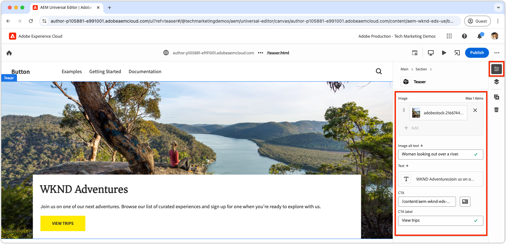

# Créer un nouveau bloc

Ce chapitre décrit le processus de création d’un bloc de teaser modifiable pour un site web Edge Delivery Services à l’aide de l’éditeur universel.


Le bloc, nommé `teaser`, présente les éléments suivants :

- **Image** : image visuellement attrayante.
- **Contenu texte** :
   - **Titre** : titre attrayant sur lequel se concentrer.
   - **Corps de texte** : contenu descriptif fournissant du contexte ou des détails, y compris des termes et conditions facultatifs.
   - **Bouton Appel à l’action (CTA)** : lien conçu pour inciter l’interaction de l’utilisateur et le guider vers un engagement ultérieur.

Le contenu du bloc `teaser` est modifiable dans l’éditeur universel, ce qui garantit sa facilité d’utilisation et de réutilisation sur l’ensemble du site web.

Notez que le bloc `teaser` est similaire au bloc `hero` du modèle standard. Par conséquent, `teaser` bloc n’est destiné qu’à servir d’exemple simple pour illustrer des concepts de développement.

## Création d’une branche Git

Pour maintenir un workflow propre et organisé, créez une branche pour chaque tâche de développement spécifique. Cela permet d’éviter les problèmes de déploiement de code incomplet ou non testé en production.

1. **Commencez à partir de la branche principale** : le fait de travailler avec le code de production le plus récent garantit une base solide.
2. **Récupérer les modifications à distance** : la récupération des dernières mises à jour de GitHub garantit que le code le plus récent est disponible avant de commencer le développement.
   - Exemple : après avoir fusionné des modifications de la branche `wknd-styles` dans `main`, récupérez les dernières mises à jour.
3. **Créer une nouvelle branche** :

```bash
# ~/Code/aem-wknd-eds-ue

$ git fetch origin  
$ git checkout -b teaser origin/main  
```

Une fois la branche `teaser` créée, vous êtes prêt à commencer à développer le bloc de teaser.

## Bloquer le dossier

Créez un dossier nommé `teaser` dans le répertoire `blocks` du projet. Ce dossier contient les fichiers JSON, CSS et JavaScript du bloc, en organisant les fichiers du bloc en un seul emplacement :

```
# ~/Code/aem-wknd-eds-ue

/blocks/teaser
```

Le nom du dossier de blocs fait office d’identifiant du bloc et est utilisé pour référencer le bloc tout au long de son développement.

## Bloquer le JSON

Le bloc JSON définit trois aspects clés du bloc :

- **Définition** : enregistre le bloc en tant que composant modifiable dans l’éditeur universel, en le liant à un modèle de bloc et éventuellement à un filtre.
- **Modèle** : spécifie les champs de création du bloc et la manière dont ces champs sont rendus en tant qu’HTML de Edge Delivery Services sémantique.
- **Filtrer** : configure les règles de filtrage pour limiter les conteneurs auxquels le bloc peut être ajouté via l’éditeur universel. La plupart des blocs ne sont pas des conteneurs, mais leurs identifiants sont ajoutés aux filtres d’autres blocs de conteneurs.

Créez un fichier à l’adresse `/blocks/teaser/_teaser.json` avec la structure initiale suivante, dans l’ordre exact. Si les clés ne sont pas dans le bon ordre, elles risquent de ne pas se construire correctement.

[!BADGE /blocks/teaser/_teaser.json]{type=Neutral tooltip="Nom de fichier de l’exemple de code ci-dessous."}

```json
{
    "definitions": [],
    "models": [],
    "filters": []
}
```

### Modèle de bloc

Le modèle de bloc est une partie essentielle de la configuration du bloc, dans la mesure où il définit :

1. L’expérience de création en définissant les champs disponibles pour modification.

   

2. Comment les valeurs du champ sont rendues dans l’HTML Edge Delivery Services.

Les modèles se voient attribuer une `id` correspondant à la définition du bloc [block](#block-definition) et incluent un tableau `fields` pour spécifier les champs modifiables.

Chaque champ du tableau `fields` comporte un objet JSON qui inclut les propriétés requises suivantes :

| Propriété JSON | Description |
|---------------|-----------------------------------------------------------------------------------------------------------------------|
| `component` | Le [type de champ](https://experienceleague.adobe.com/en/docs/experience-manager-cloud-service/content/implementing/developing/universal-editor/field-types#component-types) tel que `text`, `reference` ou `aem-content`. |
| `name` | Nom du champ, en mappant à la propriété JCR où la valeur est stockée dans AEM. |
| `label` | Libellé affiché pour les auteurs dans l’éditeur universel. |

Pour obtenir la liste complète des propriétés, y compris les propriétés facultatives, consultez la [documentation des champs de l’éditeur universel](https://experienceleague.adobe.com/en/docs/experience-manager-cloud-service/content/implementing/developing/universal-editor/field-types#fields).

#### Conception de bloc


Le bloc de teaser comprend les éléments modifiables suivants :

1. **Image** : représente le contenu visuel du teaser.
2. **Contenu texte** : inclut le titre, le corps du texte et le bouton d’appel à l’action, et se trouve dans un rectangle blanc.
   - Les **titre** et **corps de texte** peuvent être créés dans le même éditeur de texte enrichi.
   - Le **CTA** peut être créé à partir d’un champ `text` pour le **libellé** et `aem-content` champ pour le **lien**.

La conception du bloc de teaser est divisée en ces deux composants logiques (contenu d’image et de texte), ce qui garantit une expérience de création structurée et intuitive pour les utilisateurs et les utilisatrices.

### Bloquer les champs

Définissez les champs requis pour le bloc : image, texte secondaire de l’image, texte, libellé CTA et lien CTA.

>[!BEGINTABS]

>[!TAB Le bon chemin]

**Cet onglet illustre la bonne manière de modéliser le bloc de teaser.**

Le teaser se compose de deux zones logiques : image et texte. Pour simplifier le code nécessaire à l’affichage de l’HTML Edge Delivery Services comme expérience web souhaitée, le modèle de bloc doit refléter cette structure.

- Regroupez les **image** et **texte secondaire de l’image** à l’aide de [réduction du champ](https://experienceleague.adobe.com/en/docs/experience-manager-cloud-service/content/edge-delivery/wysiwyg-authoring/content-modeling#field-collapse).
- Regroupez les champs de contenu texte à l’aide de [regroupement d’éléments](https://experienceleague.adobe.com/en/docs/experience-manager-cloud-service/content/edge-delivery/wysiwyg-authoring/content-modeling#element-grouping) et [ réduction de champ pour le CTA](https://experienceleague.adobe.com/en/docs/experience-manager-cloud-service/content/edge-delivery/wysiwyg-authoring/content-modeling#field-collapse).

Si vous ne connaissez pas les notions de [réduction de champ](https://experienceleague.adobe.com/en/docs/experience-manager-cloud-service/content/edge-delivery/wysiwyg-authoring/content-modeling#field-collapse), [regroupement d’éléments](https://experienceleague.adobe.com/en/docs/experience-manager-cloud-service/content/edge-delivery/wysiwyg-authoring/content-modeling#element-grouping) ou [inférence de type](https://experienceleague.adobe.com/en/docs/experience-manager-cloud-service/content/edge-delivery/wysiwyg-authoring/content-modeling#type-inference) consultez la documentation liée avant de continuer, car elles sont essentielles pour créer un modèle de bloc bien structuré.

Dans l&#39;exemple ci-dessous :

- [Inférence de type](https://experienceleague.adobe.com/en/docs/experience-manager-cloud-service/content/edge-delivery/wysiwyg-authoring/content-modeling#type-inference) est utilisé pour créer automatiquement un élément d’HTML `` à partir du champ `image`. La réduction de champ est utilisée avec les champs `image` et `imageAlt` pour créer un élément d’HTML ``. L’attribut `src` est défini sur la valeur du champ `image`, tandis que l’attribut `alt` est défini sur la valeur du champ `imageAlt`.
- `textContent` est un nom de groupe utilisé pour classer les champs. Elle doit être sémantique, mais peut être n’importe quoi d’autre propre à ce bloc. Cela indique à l’éditeur universel de rendre tous les champs avec ce préfixe dans le même élément `<div>` dans la sortie d’HTML finale.
- La réduction du champ est également appliquée dans le groupe de `textContent` pour l’appel à l’action (CTA). Le CTA est créé en tant que `<a>` via une [inférence de type](https://experienceleague.adobe.com/en/docs/experience-manager-cloud-service/content/edge-delivery/wysiwyg-authoring/content-modeling#type-inference). Le champ `cta` est utilisé pour définir l’attribut `href` de l’élément `<a>` et le champ `ctaText` fournit le contenu textuel du lien dans les balises `<a ...>`.

[!BADGE /blocks/teaser/_teaser.json]{type=Neutral tooltip="Nom de fichier de l’exemple de code ci-dessous."}

```json
{
    "definitions": [],
    "models": [
        {
            "id": "teaser", 
            "fields": [
                {
                    "component": "reference",
                    "valueType": "string",
                    "name": "image",
                    "label": "Image",
                    "multi": false
                },
                {
                    "component": "text",
                    "valueType": "string",
                    "name": "imageAlt",
                    "label": "Image alt text",
                    "required": true
                },
                {
                    "component": "richtext",
                    "name": "textContent_text",
                    "label": "Text",
                    "valueType": "string",
                    "required": true
                },
                {
                    "component": "aem-content",
                    "name": "textContent_cta",
                    "label": "CTA",
                    "valueType": "string"
                },
                {
                    "component": "text",
                    "name": "textContent_ctaText",
                    "label": "CTA label",
                    "valueType": "string"
                }
            ]
        }
    ],
    "filters": []
}
```

Ce modèle définit les entrées de création dans l’éditeur universel pour le bloc.

L’HTML de Edge Delivery Services obtenu pour ce bloc place l’image dans le premier div et le groupe d’éléments `textContent` les champs dans le second div.

```html
<div>
    <div>
        <!-- This div contains the field-collapsed image fields  -->
        <picture>
            ...
            <source .../>            
            
        </picture>
    </div>
    <div>
        <!-- This div, via element grouping contains the textContent fields -->
        <h2>The authored title</h2>
        <p>The authored body text</p>
        <a href="/authored/cta/link">The authored CTA label</a>
    </div>
</div>        
```

Comme illustré [dans le chapitre suivant](./7a-block-css.md), cette structure d’HTML simplifie le style du bloc en tant qu’unité cohésive.

Pour comprendre les conséquences de ne pas utiliser la réduction de champ et le regroupement d’éléments, consultez l’onglet **Dans le mauvais sens** ci-dessus.

>[!TAB Dans le mauvais sens]

**Cet onglet illustre une méthode sous-optimale de modélisation du bloc de teaser, et n’est qu’une juxtaposition à la bonne méthode.**

Définir chaque champ comme champ autonome dans le modèle de bloc sans utiliser [réduction du champ](https://experienceleague.adobe.com/en/docs/experience-manager-cloud-service/content/edge-delivery/wysiwyg-authoring/content-modeling#field-collapse) et [regroupement d’éléments](https://experienceleague.adobe.com/en/docs/experience-manager-cloud-service/content/edge-delivery/wysiwyg-authoring/content-modeling#element-grouping) peut sembler tentant. Cependant, cette omission complique la mise en forme du bloc en tant qu’unité cohérente.

Par exemple, le modèle de teaser peut être défini **sans** réduction de champ ni regroupement d’éléments comme suit :

[!BADGE /blocks/teaser/_teaser.json]{type=Neutral tooltip="Nom de fichier de l’exemple de code ci-dessous."}

```json
{
    "definitions": [],
    "models": [
        {
            "id": "teaser", 
            "fields": [
                {
                    "component": "reference",
                    "valueType": "string",
                    "name": "image",
                    "label": "Image",
                    "multi": false
                },
                {
                    "component": "text",
                    "valueType": "string",
                    "name": "alt",
                    "label": "Image alt text",
                    "required": true
                },
                {
                    "component": "richtext",
                    "name": "text",
                    "label": "Text",
                    "valueType": "string",
                    "required": true
                },
                {
                    "component": "aem-content",
                    "name": "link",
                    "label": "CTA",
                    "valueType": "string"
                },
                {
                    "component": "text",
                    "name": "label",
                    "label": "CTA label",
                    "valueType": "string"
                }
            ]
        }
    ],
    "filters": []
}
```

L’HTML Edge Delivery Services du bloc effectue le rendu de la valeur de chaque champ dans un `div` séparé, ce qui complique la compréhension du contenu, l’application du style et les ajustements de la structure de l’HTML pour obtenir la conception souhaitée.

```html
<div>
    <div>
        <!-- This div contains the field-collapsed image  -->
        <picture>
            ...
            <source .../>            
            
        </picture>
    </div>
    <div>
        <p>The authored alt text</p>
    </div>
    <div>
        <h2>The authored title</h2>
        <p>The authored body text</p>
    </div>
    <div>
        <a href="/authored/cta/link">/authored/cta/link</a>
    </div>
    <div>
        The authored CTA label
    </div>
</div>        
```

Chaque champ est isolé dans son propre `div`, ce qui complique le style de l’image et du contenu textuel en tant qu’unités cohérentes. Il est possible d’obtenir la conception souhaitée avec effort et créativité, mais l’utilisation du [regroupement des éléments](https://experienceleague.adobe.com/en/docs/experience-manager-cloud-service/content/edge-delivery/wysiwyg-authoring/content-modeling#element-grouping) pour regrouper les champs de contenu de texte et du [réduction du champ](https://experienceleague.adobe.com/en/docs/experience-manager-cloud-service/content/edge-delivery/wysiwyg-authoring/content-modeling#field-collapse) pour ajouter des valeurs créées en tant qu’attributs d’élément est plus simple, plus facile et sémantiquement correcte.

Consultez l’onglet **Méthode d’écriture** ci-dessus pour savoir comment mieux modéliser le bloc de teaser.

>[!ENDTABS]


### Définition du bloc

La définition de bloc enregistre le bloc dans l’éditeur universel. Voici une répartition des propriétés JSON utilisées dans la définition de bloc :

| Propriété JSON | Description |
|---------------|-------------|
| `definition.title` | Titre du bloc tel qu’il est affiché dans les blocs **Ajouter** de l’éditeur universel. |
| `definition.id` | Identifiant unique du bloc, utilisé pour contrôler son utilisation dans `filters`. |
| `definition.plugins.xwalk.page.resourceType` | Définit le type de ressource Sling pour le rendu du composant dans l’éditeur universel. Utilisez toujours un type de ressource `core/franklin/components/block/v#/block`. |
| `definition.plugins.xwalk.page.template.name` | Nom du bloc. Il doit être en minuscules et séparé par des tirets pour correspondre au nom de dossier du bloc. Cette valeur est également utilisée pour libeller l’instance du bloc dans l’éditeur universel. |
| `definition.plugins.xwalk.page.template.model` | Associe cette définition à sa définition `model`, qui contrôle les champs de création affichés pour le bloc dans l’éditeur universel. La valeur ici doit correspondre à une valeur `model.id`. |

Voici un exemple JSON pour la définition de bloc :

[!BADGE /blocks/teaser/_teaser.json]{type=Neutral tooltip="Nom de fichier de l’exemple de code ci-dessous."}

```json
{
    "definitions": [{
      "title": "Teaser",
      "id": "teaser",
      "plugins": {
        "xwalk": {
          "page": {
            "resourceType": "core/franklin/components/block/v1/block",
            "template": {
              "name": "Teaser",
              "model": "teaser",
              "textContent_text": "<h2>Enter a title</h2><p>...and body text here!</p>",
              "textContent_cta": "/",
              "textContent_ctaText": "Click me!"
            }
          }
        }
      }
    }],
    "models": [... from previous section ...],
    "filters": []
}
```

Dans cet exemple :

- Le bloc est nommé « Teaser » et utilise le modèle `teaser` qui détermine les champs disponibles pour modification dans l’éditeur universel.
- Le bloc comprend le contenu par défaut du champ `textContent_text` , qui est une zone de texte enrichi pour le titre et le corps du texte, ainsi que des `textContent_cta` et des `textContent_ctaText` pour le lien et le libellé CTA (appel à l’action). Les noms des champs du modèle contenant le contenu initial correspondent aux noms des champs définis dans le tableau de champs du [modèle de contenu](#block-model) ;

Cette structure garantit que le bloc est configuré dans l’éditeur universel avec les champs, le modèle de contenu et le type de ressource appropriés pour le rendu.

### Bloquer les filtres

Le tableau de `filters` du bloc définit, par exemple [ blocs de conteneur ](https://experienceleague.adobe.com/en/docs/experience-manager-cloud-service/content/edge-delivery/wysiwyg-authoring/content-modeling#container), les autres blocs qui peuvent être ajoutés au conteneur. Les filtres définissent une liste d’identifiants de bloc (`model.id`) qui peuvent être ajoutés au conteneur.

[!BADGE /blocks/teaser/_teaser.json]{type=Neutral tooltip="Nom de fichier de l’exemple de code ci-dessous."}

```json
{
  "definitions": [... populated from previous section ...],
  "models": [... populated from previous section ...],
  "filters": []
}
```

Le composant Teaser n’est pas un [bloc conteneur](https://experienceleague.adobe.com/en/docs/experience-manager-cloud-service/content/edge-delivery/wysiwyg-authoring/content-modeling#container), ce qui signifie que vous ne pouvez pas y ajouter d’autres blocs. Par conséquent, son tableau `filters` reste vide. Au lieu de cela, ajoutez l’identifiant du teaser à la liste de filtres du bloc de section, de sorte que le teaser puisse être ajouté à une section.


Les blocs fournis par Adobe, tels que le bloc de section, stockent les filtres dans le dossier `models` du projet. Pour effectuer des réglages, recherchez le fichier JSON du bloc fourni par l’Adobe (par exemple, `/models/_section.json`) et ajoutez l’identifiant du teaser (`teaser`) à la liste des filtres. La configuration indique à l’éditeur universel que le composant Teaser peut être ajouté au bloc Conteneur de sections .

[!BADGE /models/_section.json]{type=Neutral tooltip="Nom de fichier de l’exemple de code ci-dessous."}

```json
{
  "definitions": [],
  "models": [],
  "filters": [
    {
      "id": "section",
      "components": [
        "text",
        "image",
        "button",
        "title",
        "hero",
        "cards",
        "columns",
        "fragment",
        "teaser"
      ]
    }
  ]
}
```

L’identifiant de définition de bloc de teaser de `teaser` est ajouté au tableau `components` .

## Afficher vos fichiers JSON

Assurez-vous que vos modifications [sont souvent imprimées](./3-local-development-environment.md#linting) afin qu’elles soient propres et cohérentes. La liaison fréquente permet de détecter les problèmes tôt et réduit le temps de développement global. La commande `npm run lint:js` répertorie également les fichiers JSON et détecte toute erreur de syntaxe.

```bash
# ~/Code/aem-wknd-eds-ue

$ npm run lint:js
```

## Créer le projet JSON

Après avoir configuré le bloc de fichiers JSON (`blocks/teaser/_teaser.json`, `models/_section.json`), ils doivent être compilés dans les fichiers `component-models.json`, `component-definitions.json` et `component-filters.json` du projet. La compilation est effectuée en exécutant les scripts npm [JSON](./3-local-development-environment.md#build-json-fragments) du projet.

```bash
# ~/Code/aem-wknd-eds-ue

$ npm run build:json
```

## Déployer la définition du bloc

Pour rendre le bloc disponible dans l’éditeur universel, le projet doit être validé et placé dans la branche d’un référentiel GitHub, dans ce cas la branche `teaser`.

Le nom de branche exact qu’utilise l’éditeur universel peut être ajusté, par utilisateur, via l’URL de l’éditeur universel.

```bash
# ~/Code/aem-wknd-eds-ue

$ git add .
$ git commit -m "Add teaser block JSON files so it is available in Universal Editor"
$ git push origin teaser
```

Lorsque l’éditeur universel est ouvert avec le paramètre de requête `?ref=teaser`, le nouveau bloc `teaser` apparaît dans la palette du bloc. Notez que le bloc n’a pas de style ; il effectue le rendu des champs du bloc en tant qu’HTML sémantique, stylisé uniquement via le [CSS global](./4-website-branding.md#global-css).
