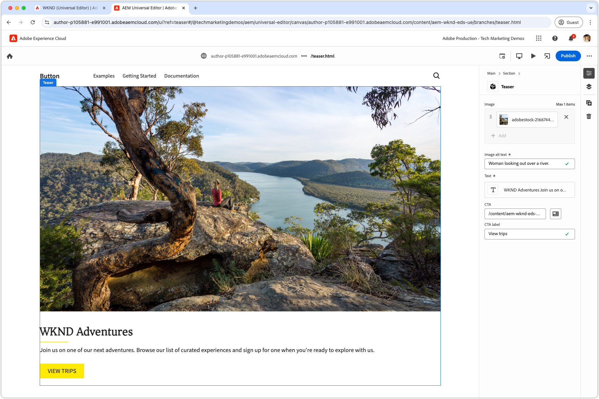

# Créer un bloc

Après avoir envoyé le [fichier JSON du bloc teaser](./5-new-block.md) à la branche `teaser`, le bloc devient modifiable dans l’éditeur universel d’AEM.

La création d’un bloc en développement est importante pour plusieurs raisons :

1. Cela permet de vérifier que la définition et le modèle du bloc sont exacts.
1. Cela permet aux développeurs et développeuses de passer en revue le code HTML sémantique du bloc, qui sert de base au développement.
1. Cela permet de déployer le contenu et le code HTML sémantique dans l’environnement de prévisualisation, ce qui accélère le développement des blocs.

## Ouvrez l’éditeur universel en utilisant le code de la branche `teaser`.

1. Connectez-vous au service de création AEM.
2. Accédez à **Sites** et sélectionnez le site (WKND (éditeur universel)) créé dans le [chapitre précédent](./2-new-aem-site.md).

   

3. Créez ou modifiez une page pour ajouter le nouveau bloc, en vous assurant que le contexte est disponible pour prendre en charge le développement local. Bien que les pages puissent être créées n’importe où sur le site, il est souvent préférable de créer des pages discrètes pour chaque nouveau corps de travail. Créez une page « dossier » nommée **Branches**. Chaque sous-page est utilisée pour prendre en charge le développement de la branche Git portant le même nom.

   

4. Sous la page **Branches**, créez une page intitulée **Teaser**, correspondant au nom de la branche de développement, puis cliquez sur **Ouvrir** pour modifier la page.

   

5. Mettez à jour l’éditeur universel pour charger le code à partir de la branche `teaser` en ajoutant `?ref=teaser` à l’URL. Veillez à ajouter le paramètre de requête **AVANT** le symbole `#`.

   

6. Sélectionnez la première section sous **Principal**, cliquez sur le bouton **Ajouter**, puis choisissez le bloc **Teaser**.

   

7. Sur la zone de travail, sélectionnez le teaser nouvellement ajouté et créez les champs sur la droite, ou via la fonctionnalité de modification en ligne.

   

8. Une fois la création terminée, sélectionnez le bouton **Publier** en haut à droite de l’éditeur universel, choisissez Publier dans la **Prévisualisation**, puis publiez les modifications dans l’environnement de prévisualisation. Les modifications sont ensuite publiées dans le domaine `aem.page` du site web.
   

9. Attendez que les modifications soient publiées pour prévisualiser, puis ouvrez la page web via l’[interface de ligne de commande AEM](./3-local-development-environment.md#install-the-aem-cli) à l’adresse [http://localhost:3000/branches/teaser](http://localhost:3000/branches/teaser).

   

Désormais, le contenu du bloc de teaser créé et le code HTML sémantique sont disponibles sur le site web de prévisualisation, prêts pour le développement à l’aide de l’interface de ligne de commande AEM dans l’environnement de développement local.
