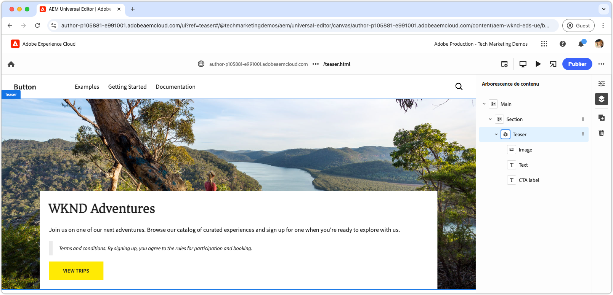

# Développer un bloc avec CSS et JavaScript

Dans le [chapitre précédent](./7b-block-js-css.md), la mise en forme d’un bloc à l’aide de CSS uniquement a été abordée. Désormais, nous nous concentrons sur le développement d’un bloc avec JavaScript et CSS.

Cet exemple montre comment améliorer un bloc de trois façons :

1. Ajout de classes CSS personnalisées.
1. Utilisation d’écouteurs d’événement pour ajouter du mouvement.
1. Gestion des conditions générales qui peuvent éventuellement être incluses dans le texte du teaser.

## Cas d’utilisation courants

Cette approche est particulièrement utile dans les scénarios suivants :

- **Gestion CSS externe :** lorsque le fichier CSS du bloc est géré en dehors d’Edge Delivery Services et ne s’aligne pas sur sa structure HTML.
- **Attributs supplémentaires :** lorsque des attributs supplémentaires, comme [ARIA](https://developer.mozilla.org/en-US/docs/Web/Accessibility/ARIA) pour l’accessibilité ou [microdonnées](https://developer.mozilla.org/fr/docs/Web/HTML/Microdata), sont requis.
- **Améliorations de JavaScript :** lorsque des fonctions interactives, comme des écouteurs d’événement, sont nécessaires.

Cette méthode repose sur la manipulation DOM JavaScript native du navigateur, mais requiert de la prudence lors de la modification du DOM, en particulier lors du déplacement d’éléments. Ces modifications peuvent perturber l’expérience de création de l’éditeur universel. Idéalement, le [modèle de contenu](./5-new-block.md#block-model) du bloc doit être soigneusement conçu pour réduire le besoin de modifications DOM importantes.

## HTML de bloc

Pour aborder le développement de blocs, commencez par examiner le DOM fourni par Edge Delivery Services. La structure est améliorée avec JavaScript et stylisée avec CSS.

>[!BEGINTABS]

>[!TAB DOM à mettre en forme]

Voici le DOM du bloc de teaser qui est la cible de la mise en forme à l’aide de JavaScript et CSS.

```html
...
<body>
    <header/>
    <main>
        <div>
            <!-- Start block HTML -->
            <div class="teaser block" data-block-name="teaser" data-block-status="loaded">
                <div>
                    <div>
                    <picture>
                        <source type="image/webp" srcset="./media_15ba2b455e29aca38c1ca653d24c40acaec8a008f.jpeg?width=2000&amp;format=webply&amp;optimize=medium" media="(min-width: 600px)">
                        <source type="image/webp" srcset="./media_15ba2b455e29aca38c1ca653d24c40acaec8a008f.jpeg?width=750&amp;format=webply&amp;optimize=medium">
                        <source type="image/jpeg" srcset="./media_15ba2b455e29aca38c1ca653d24c40acaec8a008f.jpeg?width=2000&amp;format=jpeg&amp;optimize=medium" media="(min-width: 600px)">
                        
                    </picture>
                    </div>
                </div>
                <div>
                    <div>
                    <h2 id="wknd-adventures">WKND Adventures</h2>
                    <p>Join us on one of our next adventures. Browse our list of curated experiences and sign up for one when you're ready to explore with us.</p>
                    <p class="button-container"><a href="/" title="View trips" class="button">View trips</a></p>
                    </div>
                </div>
            </div>     
            <!-- End block HTML -->
        </div>
    </main>
    <footer/>
</body>
...
```

>[!TAB Comment trouver le DOM]

Pour trouver le DOM à décorer, ouvrez la page avec le bloc non mis en forme dans votre environnement de développement local, sélectionnez le bloc et inspectez le DOM.


>[!ENDTABS]


## JavaScript de bloc

Pour ajouter la fonctionnalité JavaScript à un bloc, créez un fichier JavaScript dans le répertoire du bloc portant le même nom que le bloc, par exemple `/blocks/teaser/teaser.js`.

Le fichier JavaScript doit exporter une fonction par défaut :

```javascript
export default function decorate(block) { ... }
```

La fonction par défaut prend l’élément/l’arborescence DOM représentant le bloc dans l’HTML d’Edge Delivery Services et contient le JavaScript personnalisé exécuté lors du rendu du bloc.

Cet exemple de JavaScript effectue trois actions principales :

1. Ajoute un écouteur d’événement au bouton CTA, avec un zoom sur l’image au survol.
1. Ajoute des classes CSS sémantiques aux éléments du bloc, ce qui est utile lors de l’intégration de systèmes de conception CSS existants.
1. Ajoute une classe CSS spéciale aux paragraphes commençant par `Terms and conditions:`.

[!BADGE /blocks/teaser/teaser.js]{type=Neutral tooltip="Nom de fichier de l’exemple de code ci-dessous."}

```javascript
/* /blocks/teaser/teaser.js */

/**
 * Adds a zoom effect to image using event listeners.
 *
 * When the CTA button is hovered over, the image zooms in.
 *
 * @param {HTMLElement} block represents the block's' DOM tree
 */
function addEventListeners(block) {
  block.querySelector('.button').addEventListener('mouseover', () => {
    block.querySelector('.image').classList.add('zoom');
  });

  block.querySelector('.button').addEventListener('mouseout', () => {
    block.querySelector('.image').classList.remove('zoom');
  });
}

/**
   * Entry point to block's JavaScript.
   * Must be exported as default and accept a block's DOM element.
   * This function is called by the project's style.js, and passed the block's element.
   *
   * @param {HTMLElement} block represents the block's' DOM element/tree
   */
export default function decorate(block) {
  /* This JavaScript makes minor adjustments to the block's DOM */

  // Dress the DOM elements with semantic CSS classes so it's obvious what they are.
  // If needed we could also add ARIA roles and attributes, or add/remove/move DOM elements.

  // Add a class to the first picture element to target it with CSS
  block.querySelector('picture').classList.add('image-wrapper');

  // Use previously applied classes to target new elements
  block.querySelector('.image-wrapper img').classList.add('image');

  // Mark the second/last div as the content area (white, bottom aligned box w/ text and cta)
  block.querySelector(':scope > div:last-child').classList.add('content');

  // Mark the first H1-H6 as a title
  block.querySelector('h1,h2,h3,h4,h5,h6').classList.add('title');

  // Process each paragraph and mark it as text or terms-and-conditions
  block.querySelectorAll('p').forEach((p) => {
    const innerHTML = p.innerHTML?.trim();

    // If the paragraph starts with Terms and conditions: then style it as such
    if (innerHTML?.startsWith("Terms and conditions:")) {
      /* If a paragraph starts with '*', add a special CSS class. */
      p.classList.add('terms-and-conditions');
    }
  });

  // Add event listeners to the block
  addEventListeners(block);
}
```

## CSS de bloc

Si vous avez créé un élément `teaser.css` dans le [chapitre précédent](./7a-block-css.md) supprimez-le ou renommez-le en `teaser.css.bak`, car ce chapitre implémente un CSS différent pour le bloc de teaser.

Créez un fichier `teaser.css` dans le dossier du bloc. Ce fichier contient le code CSS qui définit le style du bloc. Ce code CSS cible les éléments du bloc et les classes CSS sémantiques spécifiques ajoutées par le JavaScript dans `teaser.js`.

Les éléments nus peuvent toujours être stylisés directement ou avec les classes CSS personnalisées appliquées. Pour les blocs plus complexes, l’application de classes CSS sémantiques peut rendre le CSS plus compréhensible et gérable, en particulier lorsque vous travaillez avec de grandes équipes sur de longues périodes.

[Comme auparavant](./7a-block-css.md#develop-a-block-with-css), définissez la portée du CSS sur `.block.teaser` à l’aide de l’[imbrication CSS](https://developer.mozilla.org/en-US/docs/Web/CSS/CSS_nesting) pour éviter tout conflit avec d’autres blocs.

[!BADGE /blocks/teaser/teaser.css]{type=Neutral tooltip="Nom de fichier de l’exemple de code ci-dessous."}

```css
/* /blocks/teaser/teaser.css */

/* Scope each selector in the block with `.block.teaser` to avoid accidental conflicts outside the block */
.block.teaser {
    animation: teaser-fade-in 1s;
    position: relative;
    width: 1600px;
    max-width: 100vw;
    left: 50%; 
    transform: translateX(-50%);
    height: 500px;
    overflow: hidden; 

    /* The teaser image */
    .image-wrapper {
        position: absolute;
        z-index: -1;
        inset: 0;
        box-sizing: border-box;
        overflow: hidden; 

        .image {
            object-fit: cover;
            object-position: center;
            width: 100%;
            height: 100%;
            transform: scale(1); 
            transition: transform 0.6s ease-in-out;

            .zoom {
                transform: scale(1.1);
            }            
        }
    }

    /* The teaser text content */
    .content {
        position: absolute;
        bottom: 0;
        left: 50%;
        transform: translateX(-50%);
        background: var(--background-color);
        padding: 1.5rem 1.5rem 1rem;
        width: 80vw;
        max-width: 1200px;
  
        .title {
            font-size: var(--heading-font-size-xl);
            margin: 0;
        }

        .title::after {
            border-bottom: 0;
        }

        p {
            font-size: var(--body-font-size-s);
            margin-bottom: 1rem;
            animation: teaser-fade-in .6s;
        
            &.terms-and-conditions {
                font-size: var(--body-font-size-xs);
                color: var(--secondary-color);
                padding: .5rem 1rem;
                font-style: italic;
                border: solid var(--light-color);
                border-width: 0 0 0 10px;
            }
        }

        /* Add underlines to links in the text */
        a:hover {
            text-decoration: underline;
        }

        /* Add specific spacing to buttons. These button CSS classes are automatically added by Edge Delivery Services. */
        .button-container {
            margin: 0;
            padding: 0;
        
            .button {   
                background-color: var(--primary-color);
                border-radius: 0;
                color: var(--dark-color);
                font-size: var(--body-font-size-xs);
                font-weight: bold;
                padding: 1em 2.5em;
                margin: 0;
                text-transform: uppercase;
            }
        }
    }
}

/** Animations 
    Scope the @keyframes to the block (teaser) to avoid accidental conflicts outside the block

    Global @keyframes can defines in styles/styles.css and used in this file.
**/
@keyframes teaser-fade-in {
    from {
        opacity: 0;
    }

    to {
        opacity: 1;
    }
}
```

## Ajouter des conditions générales

L’implémentation ci-dessus ajoute la prise en charge du style spécial des paragraphes commençant par le texte `Terms and conditions:`. Pour valider cette fonctionnalité, dans l’éditeur universel, mettez à jour le contenu textuel du bloc de teaser afin d’inclure des conditions générales.

Suivez les étapes de l’article [Créer un bloc](./6-author-block.md) et modifiez le texte pour inclure un paragraphe **Conditions générales** à la fin :

```
WKND Adventures

Join us on one of our next adventures. Browse our list of curated experiences and sign up for one when you're ready to explore with us.

Terms and conditions: By signing up, you agree to the rules for participation and booking.
```

Vérifiez que le paragraphe est rendu avec le style des conditions générales dans l’environnement de développement local. N’oubliez pas que ces modifications de code ne sont pas répercutées dans l’éditeur universel tant qu’elles ne sont pas [transmises à une branche sur GitHub](#preview-in-universal-editor) que l’éditeur universel a été configuré pour utiliser.

## Aperçu du développement

À mesure que les codes CSS et JavaScript sont ajoutés, l’environnement de développement local de l’interface de ligne de commande d’AEM recharge à chaud les modifications, ce qui permet une visualisation rapide et facile de l’impact du code sur le bloc. Pointez sur le CTA et vérifiez que l’image du teaser effectue un zoom avant et arrière.


## Appliquer lint à votre code

Veillez à [appliquer lint fréquemment](./3-local-development-environment.md#linting) à vos modifications de code pour qu’elles restent claires et cohérentes. Une application régulière de lint permet de détecter les problèmes tôt, ce qui réduit le temps de développement global. N’oubliez pas que vous ne pouvez pas fusionner votre travail de développement dans la branche `main` tant que tous les problèmes de lint ne sont pas résolus.

```bash
# ~/Code/aem-wknd-eds-ue

$ npm run lint
```

## Aperçu dans l’éditeur universel

Pour afficher les modifications dans l’éditeur universel d’AEM, ajoutez-les, validez-les et envoyez-les à la branche de référentiel Git utilisée par l’éditeur universel. Cela permet de s’assurer que l’implémentation du bloc ne perturbe pas l’expérience de création.

```bash
# ~/Code/aem-wknd-eds-ue

$ git add .
$ git commit -m "CSS and JavaScript implementation for teaser block"
$ git push origin teaser
```

Vous pouvez désormais prévisualiser les modifications dans l’éditeur universel lorsque vous ajoutez le paramètre de requête `?ref=teaser`.


