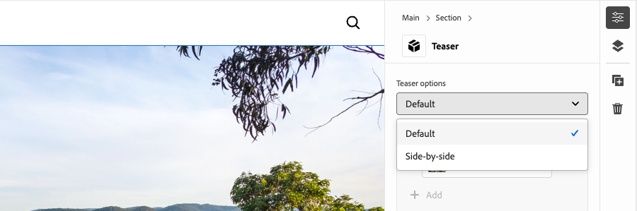

# Développement d’un bloc avec des options

Ce tutoriel s’appuie sur le tutoriel de Edge Delivery Services et de l’éditeur universel, qui vous guide tout au long du processus d’ajout d’options de bloc à un bloc. En définissant les options de bloc, vous pouvez personnaliser l’aspect et la fonctionnalité d’un bloc et permettre différentes variations en fonction des différents besoins du contenu. Cela permet une plus grande flexibilité et réutilisation dans le système de conception de votre site.

{align="center"}

Dans ce tutoriel, vous allez ajouter des options de bloc au bloc Teaser, ce qui permettra aux auteurs de choisir entre deux options d’affichage : **Par défaut** et **Côte à côte**. L’option **Par défaut** affiche l’image au-dessus et derrière le texte, tandis que l’option **Côte à côte** affiche l’image et le texte côte à côte.

## Cas d’utilisation courants :

Les cas d’utilisation courants pour l’utilisation des **options de bloc** dans le développement de **Edge Delivery Services** et de **l’éditeur universel** incluent, sans s’y limiter :

1. **Variantes de disposition :** basculez facilement entre les dispositions. Par exemple, horizontal ou vertical ou grille ou liste.
2. **Variantes de style :** basculez facilement entre les thèmes ou les traitements visuels. Par exemple, le mode clair ou sombre ou le texte grand ou petit.
3. **Contrôle de l’affichage du contenu :** basculer la visibilité des éléments ou basculer entre les styles de contenu (compact ou détaillé).

Ces options offrent flexibilité et efficacité dans la création de blocs dynamiques et adaptables.

Ce tutoriel présente le cas d’utilisation des variations de mise en page, dans lequel le bloc Teaser peut être affiché dans deux mises en page différentes : **Par défaut** et **Côte à côte**.

## Modèle de bloc

Pour ajouter des options de bloc au bloc Teaser, ouvrez son fragment JSON à l’adresse `/block/teaser/_teaser.json` et ajoutez un nouveau champ à la définition de modèle. Ce champ définit sa propriété `name` sur `classes`, qui est un champ protégé utilisé par AEM pour stocker les options de bloc, qui sont appliquées au HTML Edge Delivery Services du bloc.

### Configurations de champ

Les onglets ci-dessous illustrent différentes manières de configurer les options de bloc dans le modèle de bloc, y compris la sélection unique avec une seule classe CSS, la sélection unique avec plusieurs classes CSS et la sélection multiple avec plusieurs classes CSS. Ce tutoriel [met en œuvre l’approche plus simple](#field-configuration-for-this-tutorial) utilisée dans **select avec une seule classe CSS**.

>[!BEGINTABS]

>[!TAB Sélectionner avec une seule classe CSS]

Ce tutoriel explique comment utiliser un type d’entrée `select` (liste déroulante) pour permettre aux auteurs de choisir une option de bloc unique, qui est ensuite appliquée comme une classe CSS unique correspondante.

{align="center"}

#### Modèle de bloc

L&#39;option **Default** est représentée par une chaîne vide (`""`), tandis que l&#39;option **Side-by-Side** utilise `"side-by-side"`. Les **nom** et **valeur** de l’option n’ont pas nécessairement à être identiques, mais la **valeur** détermine la ou les classes CSS appliquées à l’HTML du bloc. Par exemple, la valeur de l’option **Côte à côte** peut être `layout-10` au lieu de `side-by-side`. Cependant, il est préférable d’utiliser des noms à la signification sémantique pour les classes CSS, afin d’assurer la clarté et la cohérence des valeurs d’option.

[!BADGE /blocks/teaser/_teaser.json]{type=Neutral tooltip="Nom de fichier de l’exemple de code ci-dessous."}

```json{highlight="4,8,9-18"}
...
"fields": [
    {
        "component": "select",
        "name": "classes",
        "value": "",
        "label": "Teaser options",
        "valueType": "string",
        "options": [
            {
                "name": "Default",
                "value": ""
            },
            {
                "name": "Side-by-side",
                "value": "side-by-side"
            }
        ]
    }
]
...
```

#### Bloquer HTML

Lorsque l’auteur sélectionne une option, la valeur correspondante est ajoutée en tant que classe CSS à l’HTML du bloc :

- Si **Default** est sélectionné :

  ```html
  <div class="block teaser">
      <!-- Block content here -->
  </div>
  ```

- Si l’option **Côte à côte** est sélectionnée :

  ```html
  <div class="block teaser side-by-side">
      <!-- Block content here -->
  </div>
  ```

Cela permet d’appliquer un style différent et un JavaScript conditionnel en fonction de l’ouverture choisie.


>[!TAB Sélection avec plusieurs classes CSS]

**Cette approche n’est pas utilisée dans ce tutoriel, mais elle illustre une autre méthode et des options de bloc avancées.**

Le type d’entrée `select` permet aux auteurs de choisir une option de bloc unique, qui peut éventuellement être mappée à plusieurs classes CSS. Pour ce faire, répertoriez les classes CSS comme valeurs délimitées par des espaces.

{align="center"}

#### Modèle de bloc

Par exemple, l’option **Côte à côte** peut prendre en charge les variations dans lesquelles l’image s’affiche à gauche (`side-by-side left`) ou à droite (`side-by-side right`).

[!BADGE /blocks/teaser/_teaser.json]{type=Neutral tooltip="Nom de fichier de l’exemple de code ci-dessous."}

```json{highlight="4,8,9-21"}
...
"fields": [
    {
        "component": "select",
        "name": "classes",
        "value": "",
        "label": "Teaser options",
        "valueType": "string",
        "options": [
            {
                "name": "Default",
                "value": ""
            },
            {
                "name": "Side-by-side with Image on left",
                "value": "side-by-side left"
            },
            {
                "name": "Side-by-side with Image on right",
                "value": "side-by-side right"
            }
        ]
    }
]
...
```

#### Bloquer HTML

Lorsque l’auteur sélectionne une option, la valeur correspondante est appliquée sous la forme d’un ensemble de classes CSS séparées par des espaces dans l’HTML du bloc :

- Si **Default** est sélectionné :

  ```html
  <div class="block teaser">
      <!-- Block content here -->
  </div>
  ```

- Si l’option **Côte à côte avec l’image sur la gauche** est sélectionnée :

  ```html
  <div class="block teaser side-by-side left">
      <!-- Block content here -->
  </div>
  ```

- Si l’option **Côte à côte avec l’image sur la droite** est sélectionnée :

  ```html
  <div class="block teaser side-by-side right">
      <!-- Block content here -->
  </div>
  ```

Cela permet d’appliquer un style différent et un JavaScript conditionnel en fonction de l’option choisie.


>[!TAB Sélection multiple avec plusieurs classes CSS]

**Cette approche n’est pas utilisée dans ce tutoriel, mais elle illustre une autre méthode et des options de bloc avancées.**

Le type d’entrée `"component": "multiselect"` permet à l’auteur de sélectionner plusieurs options simultanément. Cela permet des permutations complexes de l’aspect du bloc en combinant plusieurs choix de conception.

{align="center"}

### Modèle de bloc

Par exemple, les options **Côte à côte**, **Image à gauche** et **Image à droite** peuvent prendre en charge des variations où l’image est positionnée à gauche (`side-by-side left`) ou à droite (`side-by-side right`).

[!BADGE /blocks/teaser/_teaser.json]{type=Neutral tooltip="Nom de fichier de l’exemple de code ci-dessous."}

```json{highlight="4,6,8,10-21"}
...
"fields": [
    {
        "component": "multiselect",
        "name": "classes",
        "value": [],
        "label": "Teaser options",
        "valueType": "array",
        "options": [
            {
                "name": "Side-by-side",
                "value": "side-by-side"
            },
            {
                "name": "Image on left",
                "value": "left"
            },
            {
                "name": "Image on right",
                "value": "right"
            }
        ]
    }
]
...
```

#### Bloquer HTML

Lorsque l’auteur sélectionne plusieurs options, les valeurs correspondantes sont appliquées en tant que classes CSS séparées par des espaces dans l’HTML du bloc :

- Si les options **Côte à côte** et **Image à gauche** sont sélectionnées :

  ```html{highlight="1"}
  <div class="block teaser side-by-side left">
      <!-- Block content here -->
  </div>
  ```

- Si les options **Côte à côte** et **Image à droite** sont sélectionnées :

  ```html{highlight="1"}
  <div class="block teaser side-by-side right">
      <!-- Block content here -->
  </div>
  ```

Bien que la sélection multiple offre de la flexibilité, elle ajoute de la complexité à la gestion des permutations de conception. Sans restriction, les sélections en conflit peuvent entraîner des expériences rompues ou hors marque.

Par exemple :

- **Image à gauche** ou **Image à droite** sans sélectionner **Côte à côte** les applique implicitement à **Par défaut**, qui définit toujours l’image comme arrière-plan. Par conséquent, l’alignement à gauche et à droite n’est pas pertinent.
- Les options **Image à gauche** et **Image à droite** sont contradictoires.
- Sélectionner **Côte à côte** sans **Image à gauche** ou **Image à droite** peut être considéré comme ambigu, car la position de l’image n’est pas spécifiée.

Pour éviter les problèmes et créer de la confusion lors de l’utilisation de la sélection multiple, assurez-vous que les options sont bien planifiées et que toutes les permutations sont testées. La sélection multiple fonctionne mieux pour des améliorations simples et sans conflit, comme les options « volumineuses » ou « mises en surbrillance », que pour les choix de modification de la disposition.


>[!TAB Option par défaut]

**Cette approche n’est pas utilisée dans ce tutoriel, mais elle illustre une autre méthode et des options de bloc avancées.**

Les options de bloc peuvent être définies par défaut lors de l’ajout d’une nouvelle instance de bloc à une page dans l’éditeur universel. Pour ce faire, définissez la valeur par défaut de la propriété `classes` dans la définition du [ bloc ](../5-new-block.md#block-definition).

#### Définition du bloc

Dans l’exemple ci-dessous, l’option par défaut est définie sur **Côte à côte** en attribuant la propriété `value` du champ `classes` à `side-by-side`. L’entrée d’option de bloc correspondante dans le modèle de bloc est facultative.

Vous pouvez également définir plusieurs entrées pour le même bloc, chacune avec un nom et une classe différents. Cela permet à l’éditeur universel d’afficher des entrées de bloc distinctes, chacune préconfigurée avec une option de bloc spécifique. Bien qu’ils apparaissent en tant que blocs distincts dans l’éditeur, la base de code contient un seul bloc dont le rendu est effectué dynamiquement en fonction de l’option sélectionnée.

[!BADGE /blocks/teaser/_teaser.json]{type=Neutral tooltip="Nom de fichier de l’exemple de code ci-dessous."}

```json{highlight="12"}
{
    "definitions": [{
      "title": "Teaser",
      "id": "teaser",
      "plugins": {
        "xwalk": {
          "page": {
            "resourceType": "core/franklin/components/block/v1/block",
            "template": {
              "name": "Teaser",
              "model": "teaser",
              "classes": "side-by-side",
              "textContent_text": "<h2>Enter a title</h2><p>...and body text here!</p>",
              "textContent_cta": "/",
              "textContent_ctaText": "Click me!"
            }
          }
        }
      }
    }],
    "models": [... from previous section ...],
    "filters": []
}
```

>[!ENDTABS]


### Configuration de champ pour ce tutoriel


Dans ce tutoriel, nous utiliserons l’approche Sélectionner avec une seule classe CSS décrite ci-dessus dans le premier onglet, qui permet deux options de bloc discrètes : **Par défaut** et **Côte à côte**.

Dans la définition du modèle au sein du fragment JSON du bloc, ajoutez un seul champ de sélection pour les options de bloc. Ce champ permet aux créateurs et aux créatrices de choisir entre la mise en page par défaut et une mise en page côte à côte.

[!BADGE /blocks/teaser/_teaser.json]{type=Neutral tooltip="Nom de fichier de l’exemple de code ci-dessous."}

```json{highlight="7-24"}
{
    "definitions": [...],
    "models": [
        {
            "id": "teaser", 
            "fields": [
                {
                    "component": "select",
                    "name": "classes",
                    "value": "",
                    "label": "Teaser options",
                    "description": "",
                    "valueType": "string",
                    "options": [
                        {
                            "name": "Default",
                            "value": ""
                        },
                        {
                            "name": "Side-by-side",
                            "value": "side-by-side"
                        }
                    ]
                },
                {
                    "component": "reference",
                    "valueType": "string",
                    "name": "image",
                    "label": "Image",
                    "multi": false
                },
                {
                    "component": "text",
                    "valueType": "string",
                    "name": "imageAlt",
                    "label": "Image alt text",
                    "required": true
                },
                {
                    "component": "richtext",
                    "name": "textContent_text",
                    "label": "Text",
                    "valueType": "string",
                    "required": true
                },
                {
                    "component": "aem-content",
                    "name": "textContent_cta",
                    "label": "CTA",
                    "valueType": "string"
                },
                {
                    "component": "text",
                    "name": "textContent_ctaText",
                    "label": "CTA label",
                    "valueType": "string"
                }
            ]
        }
    ],
    "filters": []
}
```

## Mettre à jour le bloc dans l’éditeur universel

Pour rendre l’entrée des options de bloc mises à jour disponible dans l’éditeur universel, déployez les modifications de code JSON sur GitHub, créez une page, ajoutez et créez le bloc Teaser avec l’option **Côte à côte**, puis publiez la page à prévisualiser. Une fois publiée, chargez la page dans l’environnement de développement local pour le codage.

### Pousser les modifications vers GitHub

Pour que l’entrée des options de bloc mises à jour soit disponible dans l’éditeur universel afin de définir les options de bloc et de développer par rapport à l’HTML résultante, le projet doit être lié et les modifications doivent être transmises à une branche GitHub, dans ce cas, la branche `block-options`.

```bash
# ~/Code/aem-wknd-eds-ue

# Lint the changes to catch any syntax errors
$ npm run lint 

$ git add .
$ git commit -m "Add Teaser block option to JSON file so it is available in Universal Editor"
$ git push origin teaser
```

### Créer une page de test

Dans le service de création AEM, créez une page pour ajouter le bloc Teaser pour le développement. En suivant les conventions du chapitre [Créer un bloc](../6-author-block.md) du tutoriel de développement de [Edge Delivery Services et de l’éditeur universel](../0-overview.md), créez une page de test sous une page de `branches`, en lui donnant le nom de la branche Git sur laquelle vous travaillez, dans ce cas, `block-options`.

### Créer le bloc

Modifiez la nouvelle page **Options de bloc** dans l’éditeur universel et ajoutez le bloc **Teaser**. Veillez à ajouter le paramètre de requête `?ref=block-options` à l’URL pour charger la page à l’aide du code de la branche GitHub `block-options`,

La boîte de dialogue de bloc comprend désormais une liste déroulante **Options de teaser** avec des sélections **Par défaut** et **Côte à côte**. Sélectionnez **Côte à côte** et effectuez la création de contenu restante.

{align="center"}

Vous pouvez éventuellement ajouter deux blocs **Teaser**, l’un défini sur **Par défaut** et l’autre sur **Côte à côte**. Cela vous permet de prévisualiser les deux options côte à côte pendant le développement et garantit que l’implémentation de **Côte à côte** n’affecte pas l’option **Par défaut**.

### Publier pour prévisualisation

Une fois le bloc de teaser ajouté à la page, [publiez la page à prévisualiser](../6-author-block.md) à l’aide de **Gérer les publications** et de l’administrateur du site de l’auteur AEM.

## Bloquer HTML

Pour commencer le développement par blocs, commencez par examiner la structure DOM exposée par l’aperçu Edge Delivery Services. Le modèle DOM a été amélioré avec JavaScript et stylisé avec CSS, ce qui fournit la base pour créer et personnaliser le bloc.

>[!BEGINTABS]

>[!TAB DOM à décorer]

Vous trouverez ci-dessous le DOM du bloc Teaser, avec l’option de bloc **Côte à côte** sélectionnée, qui est la cible à décorer à l’aide de JavaScript et CSS.

```html{highlight="7"}
...
<body>
    <header/>
    <main>
        <div>
            <!-- Start block HTML -->
            <div class="teaser block side-by-side" data-block-name="teaser" data-block-status="loaded">
                <div>
                    <div>
                    <picture>
                        <source type="image/webp" srcset="./media_15ba2b455e29aca38c1ca653d24c40acaec8a008f.jpeg?width=2000&amp;format=webply&amp;optimize=medium" media="(min-width: 600px)">
                        <source type="image/webp" srcset="./media_15ba2b455e29aca38c1ca653d24c40acaec8a008f.jpeg?width=750&amp;format=webply&amp;optimize=medium">
                        <source type="image/jpeg" srcset="./media_15ba2b455e29aca38c1ca653d24c40acaec8a008f.jpeg?width=2000&amp;format=jpeg&amp;optimize=medium" media="(min-width: 600px)">
                        
                    </picture>
                    </div>
                </div>
                <div>
                    <div>
                    <h2 id="wknd-adventures">WKND Adventures</h2>
                    <p>Join us on one of our next adventures. Browse our list of curated experiences and sign up for one when you're ready to explore with us.</p>
                    <p>Terms and conditions: By signing up, you agree to the rules for participation and booking.</p>
                    <p class="button-container"><a href="/" title="View trips" class="button">View trips</a></p>
                    </div>
                </div>
            </div>     
            <!-- End block HTML -->
        </div>
    </main>
    <footer/>
</body>
...
```

>[!TAB Comment trouver le DOM ]

Pour trouver le DOM à décorer, ouvrez la page avec le bloc dans votre environnement de développement local, sélectionnez le bloc à l’aide des outils de développement de votre navigateur web et inspectez le DOM. Cela vous permettra d&#39;identifier les éléments pertinents à décorer.

{align="center"}

>[!ENDTABS]

## Bloquer CSS

Modifiez les `blocks/teaser/teaser.css` pour ajouter des styles CSS spécifiques pour l’option **Côte à côte**. Ce fichier contient le CSS par défaut du bloc.

Pour modifier les styles de l’option **Côte à côte**, ajoutez une nouvelle règle CSS étendue dans le fichier `teaser.css` qui cible les blocs de teaser configurés avec la classe `side-by-side`.

```css
.block.teaser.side-by-side { ... }
```

Vous pouvez également utiliser l’imbrication CSS pour une version plus concise :

```css
.block.teaser {
    ... Default teaser block styles ...

    &.side-by-side {
        ... Side-by-side teaser block styles ...
    }
}
```

Dans la règle de `&.side-by-side`, ajoutez les propriétés CSS nécessaires pour appliquer un style au bloc lorsque la classe `side-by-side` est appliquée.

Une approche courante consiste à réinitialiser les styles par défaut en appliquant des `all: initial` aux sélecteurs partagés, puis en ajoutant les styles requis pour la variante `side-by-side`. Si la plupart des styles sont partagés entre les options, le remplacement de propriétés spécifiques peut être plus facile. Cependant, si plusieurs sélecteurs doivent être modifiés, la réinitialisation de tous les styles et la réapplication des seuls styles nécessaires peuvent rendre le code plus clair et plus facile à gérer.
[!BADGE /blocks/teaser/teaser.css]{type=Neutral tooltip="Nom de fichier de l’exemple de code ci-dessous."}

```css
/* /blocks/teaser/teaser.css */

/* Scope each selector in the block with `.block.teaser` to avoid accidental conflicts outside the block */
.block.teaser {
    animation: teaser-fade-in 1s;
    position: relative;
    width: 1600px;
    max-width: 100vw;
    left: 50%; 
    transform: translateX(-50%);
    height: 500px;
    overflow: hidden; 


    /* The teaser image */
    .image-wrapper {
        position: absolute;
        z-index: -1;
        inset: 0;
        box-sizing: border-box;
        overflow: hidden; 

        .image {
            object-fit: cover;
            object-position: center;
            width: 100%;
            height: 100%;
            transform: scale(1); 
            transition: transform 0.6s ease-in-out;

            .zoom {
                transform: scale(1.1);
            }            
        }
    }

    /* The teaser text content */
    .content {
        position: absolute;
        bottom: 0;
        left: 50%;
        transform: translateX(-50%);
        background: var(--background-color);
        padding: 1.5rem 1.5rem 1rem;
        width: 80vw;
        max-width: 1200px;
  
        .title {
            font-size: var(--heading-font-size-xl);
            margin: 0;
        }

        .title::after {
            border-bottom: 0;
        }

        p {
            font-size: var(--body-font-size-s);
            margin-bottom: 1rem;
            animation: teaser-fade-in .6s;
        }

        p.terms-and-conditions {
            font-size: var(--body-font-size-xs);
            color: var(--secondary-color);
            padding: .5rem 1rem;
            font-style: italic;
            border: solid var(--light-color);
            border-width: 0 0 0 10px;
        }

        /* Add underlines to links in the text */
        a:hover {
            text-decoration: underline;
        }

        /* Add specific spacing to buttons. These button CSS classes are automatically added by Edge Delivery Services. */
        .button-container {
            margin: 0;
            padding: 0;        

            .button {   
                background-color: var(--primary-color);
                border-radius: 0;
                color: var(--dark-color);
                font-size: var(--body-font-size-xs);
                font-weight: bold;
                padding: 1em 2.5em;
                margin: 0;
                text-transform: uppercase;
            }
        }
    }

    /**
    *  Add styling for the side-by-side variant 
    **/

    /* This evaluates to .block.teaser.side-by-side */
    &.side-by-side {    
        /* Since this default teaser option doesn't have a style (such as `.default`), we use `all: initial` to reset styles rather than overriding individual styles. */
        all: initial;
        display: flex;
        margin: auto;
        max-width: 900px;

        .image-wrapper {
            all: initial;
            flex: 2;
            overflow: hidden;                 
            
            * {
                height: 100%;
            }        

            .image {
                object-fit: cover;
                object-position: center;
                width: 100%;
                height: 100%;
                transform: scale(1); 
                transition: transform 0.6s ease-in-out;                

                &.zoom {
                    /* This option has a different zoom level than the default */
                    transform: scale(1.5);
                }
            }
        }

        .content {
            all: initial;
            flex: 1;
            background-color: var(--light-color);
            padding: 3.5em 2em 2em;
            font-size: var(--body-font-size-s);
            font-family: var(--body-font-family);
            text-align: justify;
            text-justify: newspaper;
            hyphens: auto;

            p.terms-and-conditions {
                border: solid var(--text-color);
                border-width: 0;
                padding-left: 0;
                text-align: left;
            }
        }

        /* Media query for mobile devices */
        @media (width <= 900px) {
            flex-direction: column; /* Stack elements vertically on mobile */
        }
    }
}

/** Animations 
    Scope the @keyframes to the block (teaser) to avoid accidental conflicts outside the block

    Global @keyframes can defines in styles/styles.css and used in this file.
**/
@keyframes teaser-fade-in {
    from {
        opacity: 0;
    }

    to {
        opacity: 1;
    }
}
```


## Bloquer le JavaScript

L’identification de la ou des options actives du bloc est simple en vérifiant les classes appliquées à l’élément de bloc. Dans cet exemple, nous devons ajuster l’emplacement d’application des styles `.image-wrapper` en fonction de l’option active.

La fonction `getOptions` renvoie un tableau de classes appliquées au bloc, à l’exclusion des `block` et des `teaser` (car tous les blocs ont la classe `block`, et tous les blocs Teaser ont la classe `teaser`). Toutes les classes restantes dans le tableau indiquent les options actives. Si le tableau est vide, l’option par défaut est appliquée.

```javascript
function getOptions(block) {
  // Get the block's classes, excluding 'block' and 'teaser'; anything remaining is a block option.
  return [...block.classList].filter((c) => !['block', 'teaser'].includes(c));
}
```

Cette liste d’options peut être utilisée pour exécuter de manière conditionnelle une logique personnalisée dans le JavaScript du bloc :

```javascript
if (getOptions(block).includes('side-by-side')) {
  /* For side-by-side teaser, add the image-wrapper to a higher-level div to support CSS */
  block.querySelector(':scope > div:first-child').classList.add('image-wrapper');
} else if (!getOptions(block)) {
  /* For the default option, add the image-wrapper to the picture element to support CSS */
  block.querySelector('picture').classList.add('image-wrapper');
}
```

Le fichier JavaScript complet mis à jour pour le bloc de teaser avec les options Par défaut et Côte à côte est le suivant :

[!BADGE /blocks/teaser/teaser.js]{type=Neutral tooltip="Nom de fichier de l’exemple de code ci-dessous."}

```javascript
/* /blocks/teaser/teaser.js */

/**
 * Block options are applied as classes to the block's DOM element
 * alongside the `block` and `<block-name>` classes.
 *
 * @param {HTMLElement} block represents the block's DOM element/tree
 */
function getOptions(block) {
  // Get the block's classes, excluding 'block' and 'teaser'.
  return [...block.classList].filter((c) => !['block', 'teaser'].includes(c));
}

/**
 * Adds a zoom effect to the image using event listeners.
 *
 * When the CTA button is hovered over, the image zooms in.
 *
 * @param {HTMLElement} block represents the block's DOM tree
 */
function addEventListeners(block) {
  block.querySelector('.button').addEventListener('mouseover', () => {
    block.querySelector('.image').classList.add('zoom');
  });

  block.querySelector('.button').addEventListener('mouseout', () => {
    block.querySelector('.image').classList.remove('zoom');
  });
}

/**
 * Entry point to the block's JavaScript.
 * Must be exported as default and accept a block's DOM element.
 * This function is called by the project's style.js, passing the block's element.
 *
 * @param {HTMLElement} block represents the block's DOM element/tree
 */
export default function decorate(block) {
  /* Common treatments for all options */
  block.querySelector(':scope > div:last-child').classList.add('content');
  block.querySelector('h1,h2,h3,h4,h5,h6').classList.add('title');
  block.querySelector('img').classList.add('image');

  // Process each paragraph and mark it as text or terms-and-conditions
  block.querySelectorAll('p').forEach((p) => {
    const innerHTML = p.innerHTML?.trim();
    if (innerHTML?.startsWith('Terms and conditions:')) {
      p.classList.add('terms-and-conditions');
    }
  });

  /* Conditional treatments for specific options */
  if (getOptions(block).includes('side-by-side')) {
    /* For side-by-side teaser, add the image-wrapper to a higher-level div to support CSS */
    block.querySelector(':scope > div:first-child').classList.add('image-wrapper');
  } else if (!getOptions(block)) {
    /* For the default option, add the image-wrapper to the picture element to support CSS */
    block.querySelector('picture').classList.add('image-wrapper');
  }

  addEventListeners(block);
}
```

## Aperçu du développement

À mesure que les feuilles CSS et JavaScript sont ajoutées, l’environnement de développement local de l’interface de ligne de commande d’AEM recharge à chaud les modifications, ce qui permet une visualisation rapide et facile de l’impact du code sur le bloc. Pointez sur le CTA et vérifiez que l’image du teaser effectue un zoom avant et arrière.


## Étiqueter votre code

Veillez à [peindre fréquemment](../3-local-development-environment.md#linting) vos modifications de code pour le garder propre et cohérent. Une liaison régulière permet de détecter les problèmes tôt, ce qui réduit le temps de développement global. N’oubliez pas que vous ne pouvez pas fusionner votre travail de développement dans la branche `main` tant que tous les problèmes de liaison ne sont pas résolus.

```bash
# ~/Code/aem-wknd-eds-ue

$ npm run lint
```

## Aperçu dans l’éditeur universel

Pour afficher les modifications dans l’éditeur universel d’AEM, ajoutez-les, validez-les et envoyez-les à la branche de référentiel Git utilisée par l’éditeur universel. Cela permet de s’assurer que l’implémentation du bloc ne perturbe pas l’expérience de création.

```bash
# ~/Code/aem-wknd-eds-ue

$ git add .
$ git commit -m "CSS and JavaScript implementation for Teaser block option Side-by-side"
# JSON files are compiled automatically and added to the commit via a Husky pre-commit hook
$ git push origin block-options
```

Désormais, les modifications sont visibles dans l’éditeur universel lors de l’utilisation du paramètre de requête `?ref=block-options`.

{align="center"}


## Félicitations.

Vous avez maintenant exploré les options de bloc dans Edge Delivery Services et l’éditeur universel, ce qui vous donne les outils nécessaires pour personnaliser et rationaliser l’édition de contenu avec une plus grande flexibilité. Commencez à appliquer ces options dans vos projets pour améliorer l’efficacité et maintenir la cohérence.

Pour découvrir les bonnes pratiques et les techniques avancées, consultez la [documentation de l’éditeur universel](https://experienceleague.adobe.com/en/docs/experience-manager-cloud-service/content/edge-delivery/wysiwyg-authoring/create-block#block-options).
