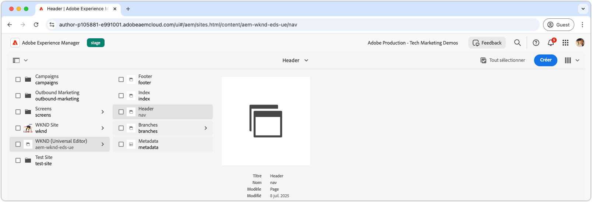
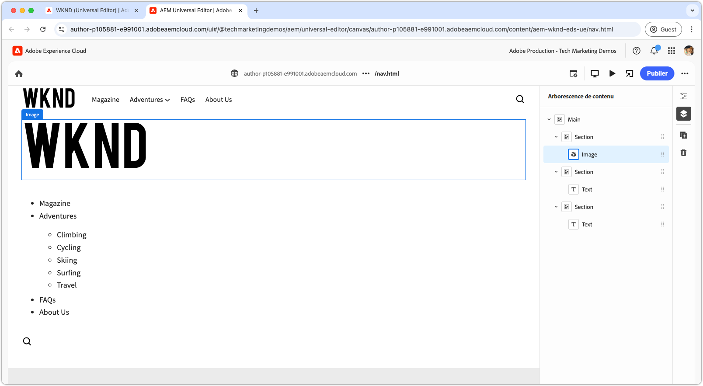
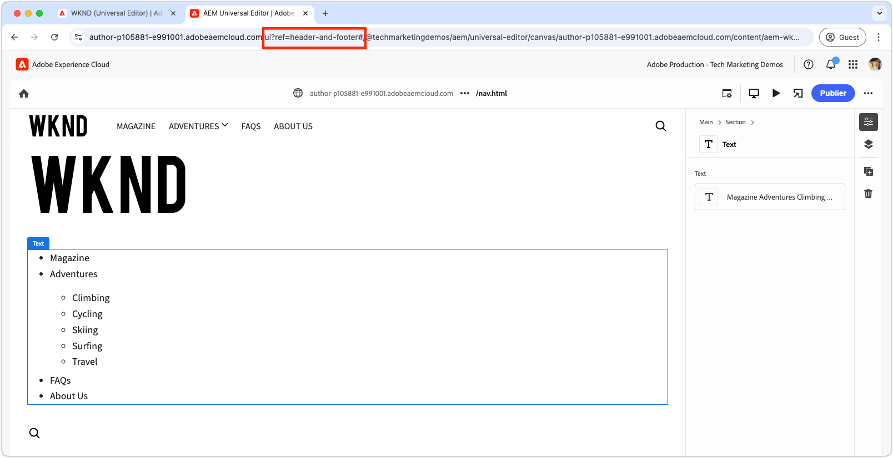
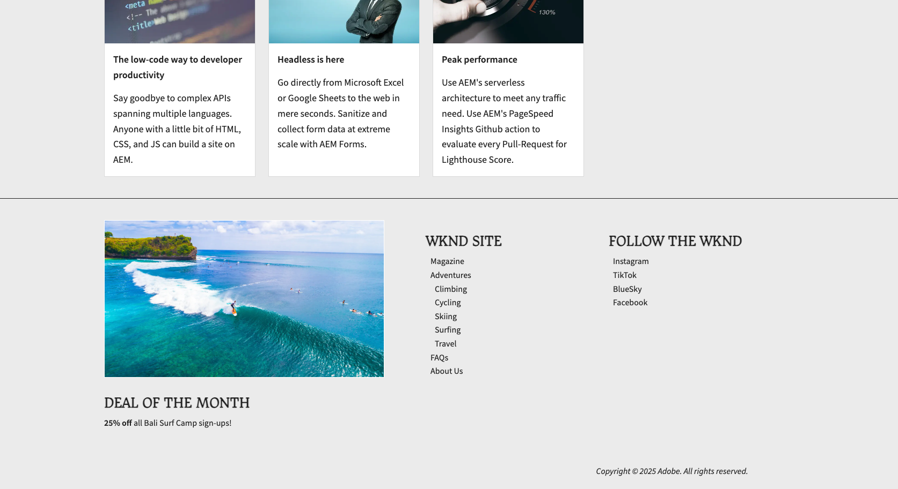
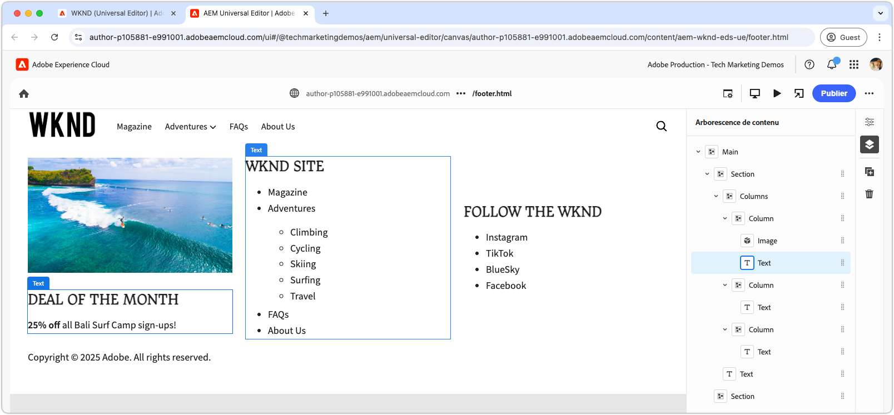

# Développer un en-tête et un pied de page

{align="center"}

Les en-têtes et pieds de page jouent un rôle unique dans Edge Delivery Services (EDS), car ils sont directement liés aux éléments de `<header>` et de `<footer>` HTML. Contrairement au contenu standard des pages, elles sont gérées séparément et peuvent être mises à jour indépendamment sans avoir à purger l’intégralité du cache de page. Bien que leur implémentation réside dans le projet de code sous la forme de blocs sous `blocks/header` et `blocks/footer`, les auteurs peuvent modifier leur contenu par le biais de pages AEM dédiées qui peuvent contenir n’importe quelle combinaison de blocs.

## Bloc d’en-tête

{align="center"}

L’en-tête est un bloc spécial lié à l’élément de `<header>` Edge Delivery Services HTML.
L’élément `<header>` est livré vide et renseigné via XHR (AJAX) sur une page AEM distincte.
Cela permet de gérer l’en-tête indépendamment du contenu de la page et de le mettre à jour sans avoir à purger entièrement le cache de toutes les pages.

Le bloc d’en-tête est chargé de demander le fragment de page AEM contenant le contenu de l’en-tête et d’en effectuer le rendu dans l’élément `<header>`.

[!BADGE /blocks/header/header.js]{type=Neutral tooltip="Nom de fichier de l’exemple de code ci-dessous."}

```javascript
import { getMetadata } from '../../scripts/aem.js';
import { loadFragment } from '../fragment/fragment.js';

...

export default async function decorate(block) {
  // load nav as fragment

  // Get the path to the AEM page fragment that defines the header content from the <meta name="nav"> tag. This is set via the site's Metadata file.
  const navMeta = getMetadata('nav');

  // If the navMeta is not defined, use the default path `/nav`.
  const navPath = navMeta ? new URL(navMeta, window.location).pathname : '/nav';

  // Make an XHR (AJAX) call to request the AEM page fragment and serialize it to a HTML DOM tree.
  const fragment = await loadFragment(navPath);
  
  // Add the content from the fragment HTML to the block and decorate it as needed
  ...
}
```

La fonction `loadFragment()` effectue une requête XHR (AJAX) à `${navPath}.plain.html` qui renvoie un rendu EDS HTML de l’HTML de la page AEM qui existe dans la balise `<main>` de la page, traite son contenu avec les blocs qu’il peut contenir et renvoie l’arborescence DOM mise à jour.

## Créer la page d’en-tête

Avant de développer le bloc d’en-tête, vous devez d’abord créer son contenu dans l’éditeur universel pour disposer de quelque chose en fonction duquel le développer.

Le contenu de l’en-tête réside dans une page AEM dédiée nommée `nav`.

{align="center"}

Pour créer l’en-tête :

1. Ouvrez la page `nav` dans l’éditeur universel.
1. Remplacez le bouton par défaut par un **bloc Image** contenant le logo WKND
1. Mettez à jour le menu de navigation dans le **bloc de texte** en :
   - Ajout des liens de navigation souhaités
   - Création d’éléments de sous-navigation si nécessaire
   - Définition de tous les liens vers la page d’accueil (`/`) pour l’instant

{align="center"}

### Publier pour prévisualisation

Avec la page d’en-tête mise à jour, [publiez la page à prévisualiser](../6-author-block.md).

Comme le contenu de l’en-tête réside sur sa propre page (la page `nav`), vous devez publier cette page spécifiquement pour que les modifications d’en-tête prennent effet. La publication d’autres pages qui utilisent l’en-tête ne met pas à jour le contenu de l’en-tête sur Edge Delivery Services.

## Bloquer HTML

Pour commencer le développement par blocs, commencez par examiner la structure DOM exposée par l’aperçu Edge Delivery Services. Le modèle DOM a été amélioré avec JavaScript et stylisé avec CSS, ce qui fournit la base pour créer et personnaliser le bloc.

Comme l’en-tête est chargé en tant que fragment, nous devons examiner l’HTML renvoyée par la requête XHR une fois qu’elle a été injectée dans le DOM et décorée via `loadFragment()`. Pour ce faire, inspectez le DOM dans les outils de développement du navigateur.


>[!BEGINTABS]

>[!TAB DOM à décorer]

Voici l’HTML de la page d’en-tête après son chargement à l’aide du `header.js` fourni et son injection dans le DOM :

```html
<header class="header-wrapper">
  <div class="header block" data-block-name="header" data-block-status="loaded">
    <div class="nav-wrapper">
      <nav id="nav" aria-expanded="true">
        <div class="nav-hamburger">
          <button type="button" aria-controls="nav" aria-label="Close navigation">
            <span class="nav-hamburger-icon"></span>
          </button>
        </div>
        <div class="section nav-brand" data-section-status="loaded" style="">
          <div class="default-content-wrapper">
            <p class="">
              <a href="#" title="Button" class="">Button</a>
            </p>
          </div>
        </div>
        <div class="section nav-sections" data-section-status="loaded" style="">
          <div class="default-content-wrapper">
            <ul>
              <li aria-expanded="false">Examples</li>
              <li aria-expanded="false">Getting Started</li>
              <li aria-expanded="false">Documentation</li>
            </ul>
          </div>
        </div>
        <div class="section nav-tools" data-section-status="loaded" style="">
          <div class="default-content-wrapper">
            <p>
              <span class="icon icon-search">
                
              </span>
            </p>
          </div>
        </div>
      </nav>
    </div>
  </div>
</header>
```

>[!TAB Comment trouver le DOM ]

Pour rechercher et examiner l’élément `<header>` de la page dans les outils de développement du navigateur web.

{align="center"}

>[!ENDTABS]


## Bloquer le JavaScript

Le fichier `/blocks/header/header.js` du modèle de projet [AEM Boilerplate XWalk](https://github.com/adobe-rnd/aem-boilerplate-xwalk) fournit JavaScript pour la navigation, notamment des menus déroulants et un affichage mobile réactif.

Bien que le script `header.js` soit souvent fortement personnalisé pour correspondre à la conception d’un site, il est essentiel de conserver les premières lignes dans `decorate()`, qui récupèrent et traitent le fragment de page d’en-tête.

[!BADGE /blocks/header/header.js]{type=Neutral tooltip="Nom de fichier de l’exemple de code ci-dessous."}

```javascript
export default async function decorate(block) {
  // load nav as fragment
  const navMeta = getMetadata('nav');
  const navPath = navMeta ? new URL(navMeta, window.location).pathname : '/nav';
  const fragment = await loadFragment(navPath);
  ...
```

Le code restant peut être modifié en fonction des besoins de votre projet.

Selon les exigences de l’en-tête, le code standard peut être ajusté ou supprimé. Dans ce tutoriel, nous utiliserons le code fourni et l’améliorerons en ajoutant un lien hypertexte autour de la première image créée, afin de la lier à la page d’accueil du site.

Le code du modèle traite le fragment de page d’en-tête, en supposant qu’il se compose de trois sections dans l’ordre suivant :

1. **Section Marque** - Contient le logo et est mis en forme avec la classe `.nav-brand`.
2. **Section des sections** - Définit le menu principal du site et est stylisé avec des `.nav-sections`.
3. **Section Outils** - Inclut des éléments tels que la recherche, la connexion/déconnexion et le profil, stylisés avec des `.nav-tools`.

Pour créer un lien hypertexte entre l’image du logo et la page d’accueil, nous mettons à jour le bloc JavaScript comme suit :

>[!BEGINTABS]

>[!TAB JavaScript mis à jour]

Le code mis à jour enveloppant l’image de logo avec un lien vers la page d’accueil du site (`/`) est illustré ci-dessous :

[!BADGE /blocks/header/header.js]{type=Neutral tooltip="Nom de fichier de l’exemple de code ci-dessous."}

```javascript
export default async function decorate(block) {

  ...
  const navBrand = nav.querySelector('.nav-brand');
  
  // WKND: Turn the picture (image) into a linked site logo
  const logo = navBrand.querySelector('picture');
  
  if (logo) {
    // Replace the first section's contents with the authored image wrapped with a link to '/' 
    navBrand.innerHTML = `<a href="/" aria-label="Home" title="Home" class="home">${logo.outerHTML}</a>`;
    // Make sure the logo is not lazy loaded as it's above the fold and can affect page load speed
    navBrand.querySelector('img').settAttribute('loading', 'eager');
  }

  const navSections = nav.querySelector('.nav-sections');
  if (navSections) {
    // WKND: Remove Edge Delivery Services button containers and buttons from the nav sections links
    navSections.querySelectorAll('.button-container, .button').forEach((button) => {
      button.classList = '';
    });

    ...
  }
  ...
}
```

>[!TAB JavaScript original]

Voici le `header.js` d’origine généré à partir du modèle :

[!BADGE /blocks/header/header.js]{type=Neutral tooltip="Nom de fichier de l’exemple de code ci-dessous."}

```javascript
export default async function decorate(block) {
  ...
  const navBrand = nav.querySelector('.nav-brand');
  const brandLink = navBrand.querySelector('.button');
  if (brandLink) {
    brandLink.className = '';
    brandLink.closest('.button-container').className = '';
  }

  const navSections = nav.querySelector('.nav-sections');
  if (navSections) {
    navSections.querySelectorAll(':scope .default-content-wrapper > ul > li').forEach((navSection) => {
      if (navSection.querySelector('ul')) navSection.classList.add('nav-drop');
      navSection.addEventListener('click', () => {
        if (isDesktop.matches) {
          const expanded = navSection.getAttribute('aria-expanded') === 'true';
          toggleAllNavSections(navSections);
          navSection.setAttribute('aria-expanded', expanded ? 'false' : 'true');
        }
      });
    });
  }
  ...
}
```

>[!ENDTABS]


## Bloquer CSS

Mettez à jour le `/blocks/header/header.css` pour le mettre en forme en fonction de la marque WKND.

Nous allons ajouter le CSS personnalisé au bas de la `header.css` pour faciliter la visualisation et la compréhension des modifications du tutoriel. Bien que ces styles puissent être directement intégrés dans les règles CSS du modèle, leur séparation permet d’illustrer ce qui a été modifié.

Puisque nous ajoutons nos nouvelles règles après le jeu d’origine, nous les encapsulerons avec un sélecteur CSS `header .header.block nav` pour nous assurer qu’elles ont priorité sur les règles de modèle.

[!BADGE /blocks/header/header.css]{type=Neutral tooltip="Nom de fichier de l’exemple de code ci-dessous."}

```css
/* /blocks/header/header.css */

... Existing CSS generated by the template ...

/* Add the following CSS to the end of the header.css */

/** 
* WKND customizations to the header 
* 
* These overrides can be incorporated into the provided CSS,
* however they are included discretely in thus tutorial for clarity and ease of addition.
* 
* Because these are added discretely
* - They are added to the bottom to override previous styles.
* - They are wrapped in a header .header.block nav selector to ensure they have more specificity than the provided CSS.
* 
**/

header .header.block nav {
  /* Set the height of the logo image.
     Chrome natively sets the width based on the images aspect ratio */
  .nav-brand img {
    height: calc(var(--nav-height) * .75);
    width: auto;
    margin-top: 5px;
  }
  
  .nav-sections {
    /* Update menu items display properties */
    a {
      text-transform: uppercase;
      background-color: transparent;
      color: var(--text-color);
      font-weight: 500;
      font-size: var(--body-font-size-s);
    
      &:hover {
        background-color: auto;
      }
    }

    /* Adjust some spacing and positioning of the dropdown nav */
    .nav-drop {
      &::after {
        transform: translateY(-50%) rotate(135deg);
      }
      
      &[aria-expanded='true']::after {
        transform: translateY(50%) rotate(-45deg);
      }

      & > ul {
        top: 2rem;
        left: -1rem;      
       }
    }
  }
```

## Aperçu du développement

Au fur et à mesure du développement du CSS et du JavaScript, l’environnement de développement local de l’interface de ligne de commande d’AEM recharge à chaud les modifications, ce qui permet une visualisation rapide et facile de l’impact du code sur le bloc. Pointez sur le CTA et vérifiez que l’image du teaser effectue un zoom avant et arrière.

{align="center"}

## Étiqueter votre code

Veillez à [peindre fréquemment](../3-local-development-environment.md#linting) vos modifications de code pour le garder propre et cohérent. Une liaison régulière permet de détecter les problèmes tôt, ce qui réduit le temps de développement global. N’oubliez pas que vous ne pouvez pas fusionner votre travail de développement dans la branche `main` tant que tous les problèmes de liaison ne sont pas résolus.

```bash
# ~/Code/aem-wknd-eds-ue

$ npm run lint
```

## Aperçu dans l’éditeur universel

Pour afficher les modifications dans l’éditeur universel d’AEM, ajoutez-les, validez-les et envoyez-les à la branche de référentiel Git utilisée par l’éditeur universel. Cela permet de s’assurer que l’implémentation du bloc ne perturbe pas l’expérience de création.

```bash
# ~/Code/aem-wknd-eds-ue

$ git add .
$ git commit -m "CSS and JavaScript implementation for Header block"
# JSON files are compiled automatically and added to the commit via a Husky pre-commit hook
$ git push origin header-and-footer
```

Désormais, les modifications sont visibles dans l’éditeur universel lors de l’utilisation du paramètre de requête `?ref=header-and-footer`.

{align="center"}

## Pied de page

Comme l’en-tête, le contenu du pied de page est créé sur une page AEM dédiée, dans ce cas la page Pied de page (`footer`). Le pied de page suit le même modèle de chargement en tant que fragment et est décoré avec des éléments CSS et JavaScript.

>[!BEGINTABS]

>[!TAB Pied de page]

Le pied de page doit être implémenté avec une disposition à trois colonnes contenant les éléments suivants :

- Une colonne de gauche avec une promotion (image et texte)
- Une colonne centrale avec des liens de navigation
- Une colonne de droite avec des liens vers les médias sociaux
- Une ligne en bas couvrant les trois colonnes avec le copyright

{align="center"}

>[!TAB Contenu du pied de page ]

Utilisez le bloc Colonnes de la page Pied de page pour créer l’effet à trois colonnes.

| Colonne 1 | Colonne 2 | Colonne 3 |
| ---------|----------------|---------------|
| Image | En-tête 3 | En-tête 3 |
| Texte | Liste des liens | Liste des liens |

{align="center"}

>[!TAB Code du pied de page]

Le code CSS ci-dessous définit le style du bloc de pied de page avec une disposition à trois colonnes, un espacement cohérent et une typographie. L’implémentation du pied de page utilise uniquement le JavaScript fourni par le modèle.

[!BADGE /blocks/footer/footer.css]{type=Neutral tooltip="Nom de fichier de l’exemple de code ci-dessous."}

```css
/* /blocks/footer/footer.css */

footer {
  background-color: var(--light-color);

  .block.footer {
    border-top: solid 1px var(--dark-color);
    font-size: var(--body-font-size-s);

    a { 
      all: unset;
      
      &:hover {
        text-decoration: underline;
        cursor: pointer;
      }
    }

    img {
      width: 100%;
      height: 100%;
      object-fit: cover;
      border: solid 1px white;
    }

    p {
      margin: 0;
    }

    ul {
      list-style: none;
      padding: 0;
      margin: 0;

      li {
        padding-left: .5rem;
      }
    }

    & > div {
      margin: auto;
      max-width: 1200px;
    }

    .columns > div {
      gap: 5rem;
      align-items: flex-start;

      & > div:first-child {
        flex: 2;
      }
    }

    .default-content-wrapper {
      padding-top: 2rem;
      margin-top: 2rem;
      font-style: italic;
      text-align: right;
    }
  }
}

@media (width >= 900px) {
  footer .block.footer > div {
    padding: 40px 32px 24px;
  }
}
```


>[!ENDTABS]

## Félicitations.

Vous avez maintenant exploré la manière dont les en-têtes et pieds de page sont gérés et développés dans Edge Delivery Services et l’éditeur universel. Vous avez appris comment ils sont :

- Créés sur des pages AEM dédiées séparément du contenu principal.
- Chargement asynchrone en tant que fragments pour activer les mises à jour indépendantes
- JavaScript et CSS pour des expériences de navigation réactives
- Intégration transparente à l’éditeur universel pour une gestion de contenu facile

Ce modèle offre une approche flexible et gérable pour la mise en œuvre de composants de navigation à l’échelle du site.

Pour découvrir les bonnes pratiques et les techniques avancées, consultez la [documentation de l’éditeur universel](https://experienceleague.adobe.com/en/docs/experience-manager-cloud-service/content/edge-delivery/wysiwyg-authoring/create-block#block-options).
