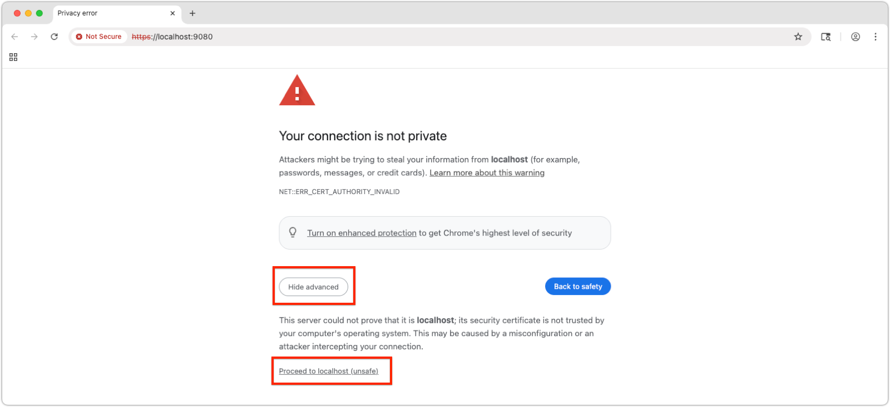
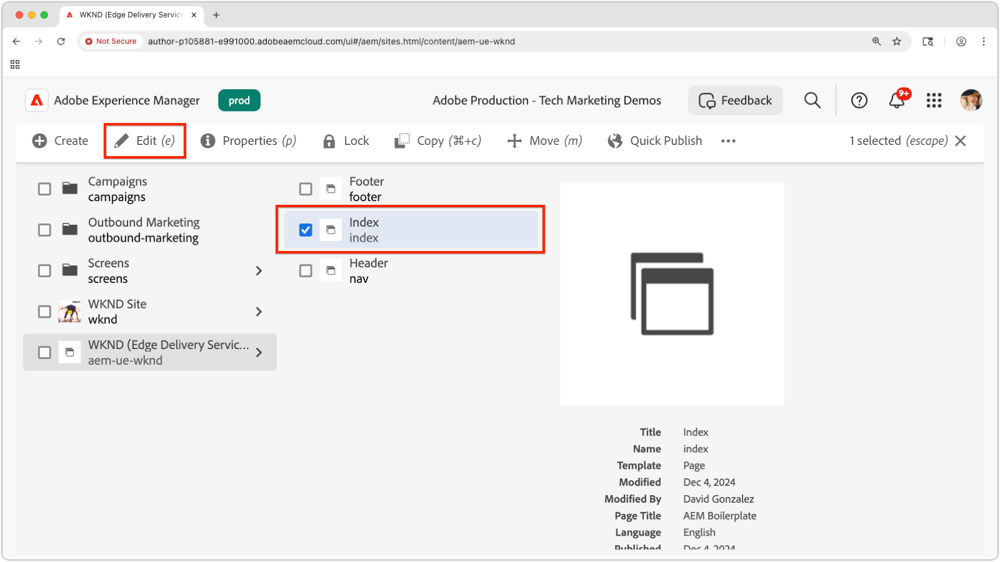

# Prévisualiser une extension locale de l’éditeur universel

>[!TIP]
> Découvrez comment [créer une extension d’éditeur universel](https://developer.adobe.com/uix/docs/services/aem-universal-editor/).

Pour prévisualiser une extension de l’éditeur universel pendant le développement, vous devez :

1. Exécutez l’extension localement.
2. Acceptez le certificat auto-signé.
3. Ouvrez une page dans l’éditeur universel.
4. Mettez à jour l’URL de l’emplacement pour charger l’extension locale.

## Exécuter l’extension localement

Cela suppose que vous avez déjà créé une extension [Universal Editor](https://developer.adobe.com/uix/docs/services/aem-universal-editor/) et que vous souhaitez la prévisualiser lors des tests et du développement en local.

Démarrez votre extension Éditeur universel avec :

```bash
$ aio app run
```

Vous verrez une sortie du type :

```
To view your local application:
  -> https://localhost:9080
To view your deployed application in the Experience Cloud shell:
  -> https://experience.adobe.com/?devMode=true#/custom-apps/?localDevUrl=https://localhost:9080
```

Votre extension est exécutée à l’adresse `https://localhost:9080` par défaut.


## Accepter le certificat auto-signé

L’éditeur universel requiert HTTPS pour charger les extensions. Étant donné que le développement local utilise un certificat auto-signé, votre navigateur doit explicitement lui faire confiance.

Ouvrez un nouvel onglet du navigateur et accédez à la sortie de l’URL d’extension locale à l’aide de la commande `aio app run` :

```
https://localhost:9080
```

Votre navigateur affiche un avertissement de certificat. Acceptez le certificat pour continuer.



Une fois acceptée, la page d’espace réservé de l’extension locale s’affiche :


## Ouverture d’une page dans l’éditeur universel

Ouvrez l’éditeur universel via la [console Éditeur universel](https://experience.adobe.com/#/@myOrg/aem/editor/canvas/) ou en modifiant une page dans AEM Sites qui utilise l’éditeur universel :




## Charger l’extension

Dans l’éditeur universel, recherchez le champ **Emplacement** au centre supérieur de l’interface. Développez-la et mettez à jour la **URL dans le champ Emplacement**, **que la barre d’adresse du navigateur**.

Ajoutez les paramètres de requête suivants :

* `devMode=true` : active le mode de développement pour l’éditeur universel.
* `ext=https://localhost:9080` - Charge votre extension exécutée localement.

Exemple :

```
https://author-pXXX-eXXX.adobeaemcloud.com/content/aem-ue-wknd/index.html?devMode=true&ext=https://localhost:9080
```


## Prévisualiser l’extension

Effectuez un **rechargement dur** du navigateur pour vous assurer que l’URL mise à jour est utilisée.

L’éditeur universel charge désormais votre extension locale uniquement dans votre session de navigateur.

Toutes les modifications de code que vous apportez localement sont répercutées immédiatement.


