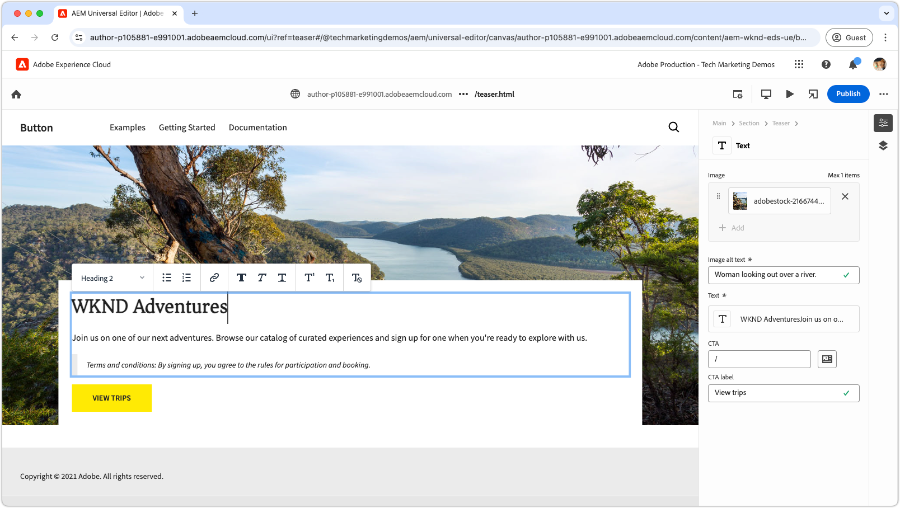

# Vidéos Edge Delivery Services

Découvrez comment rendre les sites web plus rapides avec Edge Delivery Services.

>[!VIDEO](https://video.tv.adobe.com/v/3427989/?learn=on)

Consultez la [documentation](https://experienceleague.adobe.com/fr/docs/experience-manager-cloud-service/content/edge-delivery/overview) pour obtenir des détails complets sur Edge Delivery Services et ses fonctionnalités.

## Tutoriels pour les développeurs et développeuses Edge Delivery Services

<!-- CARDS 

* https://experienceleague.adobe.com/en/docs/experience-manager-cloud-service/content/edge-delivery/build/tutorial
  {title = Document-based authoring and Edge Delivery Services tutorial}
  {description = Learn how to create Edge Delivery Services web sites authored using Document-based authoring.}
  {cta = Start the tutorial}

* ./developing/universal-editor/0-overview.md
  {title = Universal Editor and Edge Delivery Services tutorial}
  {description = Learn the basics of creating an Edge Delivery Services web sites authored with Universal Editor.}
  {cta = Start the tutorial}

-->
<!-- START CARDS HTML - DO NOT MODIFY BY HAND -->

    

        

            

                <figure class="image x-is-16by9">
                    
                </figure>
            

            

                

                    

                        <a href="https://experienceleague.adobe.com/fr/docs/experience-manager-cloud-service/content/edge-delivery/build/tutorial" target="_blank" rel="referrer" title="Tutoriel sur la création basée sur des documents et Edge Delivery Services">Tutoriel sur la création basée sur des documents et Edge Delivery Services</a>
                    

                    
Découvrez comment créer des sites web Edge Delivery Services créés à l’aide de la création basée sur les documents.

                

                <a href="https://experienceleague.adobe.com/fr/docs/experience-manager-cloud-service/content/edge-delivery/build/tutorial" target="_blank" rel="referrer" class="spectrum-Button spectrum-Button--outline spectrum-Button--primary spectrum-Button--sizeM" style="align-self: flex-start; margin-top: 1rem;">
Démarrer le tutoriel
</a>
            

        

    

    

        

            

                <figure class="image x-is-16by9">
                    
                </figure>
            

            

                

                    

                        <a href="./developing/universal-editor/0-overview.md" target="_blank" rel="referrer" title="Tutoriel sur l’éditeur universel et Edge Delivery Services">Tutoriel sur l’éditeur universel et Edge Delivery Services</a>
                    

                    
Découvrez les principes de base de la création de sites web Edge Delivery Services à l’aide de l’éditeur universel.

                

                <a href="./developing/universal-editor/0-overview.md" target="_blank" rel="referrer" class="spectrum-Button spectrum-Button--outline spectrum-Button--primary spectrum-Button--sizeM" style="align-self: flex-start; margin-top: 1rem;">
Démarrer le tutoriel
</a>
            

        

    

<!-- END CARDS HTML - DO NOT MODIFY BY HAND -->

## Prise en main d’Edge Delivery Services

    <!-- Prerequisites -->
    

      

        

          <figure class="image is-16by9">
            
          </figure>
        

        

          

            
5 minutes

            

              <a href="./developing/prerequisites.md" title="Prérequis">Conditions préalables pour l’équipe de développement</a>
            

            
Éléments nécessaires pour commencer le développement avec Edge Delivery Services.

            <a href="./developing/prerequisites.md" class="spectrum-Button
              spectrum-Button--outline spectrum-Button--primary
              spectrum-Button--sizeM">
Regarder la vidéo
</a>
          

        

      

    
 
    <!-- Setting up your Repository-->
    

      

        

          <figure class="image is-16by9">
            
          </figure>
        

        

          

            
1 minute

            

              <a href="./developing/aem-boilerplate.md" title="Utiliser le modèle standard">Modèle standard AEM</a>
            

            
Utilisez le modèle standard AEM pour configurer le référentiel de code.

            <a href="./developing/aem-boilerplate.md" class="spectrum-Button
              spectrum-Button--outline spectrum-Button--primary
              spectrum-Button--sizeM">
Regarder la vidéo
</a>
          

        

      

    

    <!-- Linking Google Drive -->
    

      

        

          <figure class="image is-16by9">
            
          </figure>
        

        

          

            
1 minute

            

              <a href="./developing/content-repository.md" title="Lier Google Drive">Lier Google Drive</a>
            

            
Utilisez Google Drive comme référentiel pour tout le contenu.

            <a href="./developing/content-repository.md" class="spectrum-Button
              spectrum-Button--outline spectrum-Button--primary
              spectrum-Button--sizeM">
Regarder la vidéo
</a>
          

        

      

    

    <!-- Link Sharepoint --->
    

      

        

          <figure class="image is-16by9">
            
          </figure>
        

        

          

            
1 minute

            

              <a href="./developing/content-repository.md" title="Lier Sharepoint">Lier SharePoint</a>
            

            
Utilisez SharePoint comme référentiel pour tout votre contenu.

            <a href="./developing/content-repository.md"
              class="spectrum-Button spectrum-Button--outline
              spectrum-Button--primary spectrum-Button--sizeM">
Regarder la vidéo
</a>
          

        

      

    

    <!-- Previewing and Publishing Content -->
    

      

        

          <figure class="image is-16by9">
            
          </figure>
        

        

          

            
1 minute

            

              <a href="./developing/preview-and-publish.md" title="Prévisualiser et publier du contenu">Prévisualiser et publier du contenu</a>
            

            
Prévisualisez et publiez du contenu à l’aide du sidekick d’AEM.

            <a href="./developing/preview-and-publish.md" class="spectrum-Button
              spectrum-Button--outline spectrum-Button--primary
              spectrum-Button--sizeM">
Regarder la vidéo
</a>
          

        

      

    

    <!-- Using the Sidekick -->
    

      

        

          <figure class="image is-16by9">
            
          </figure>
        

        

          

            
1 minute

            

              <a href="./developing/sidekick.md" title="Utiliser le sidekick">Utiliser le sidekick d’AEM</a>
            

            
Découvrez comment utiliser le sidekick d’AEM.

            <a href="./developing/sidekick.md" class="spectrum-Button
              spectrum-Button--outline spectrum-Button--primary
              spectrum-Button--sizeM">
Regarder la vidéo
</a>
          

        

      

    

 <!-- Document Structure -->
    

      

        

          <figure class="image is-16by9">
            
          </figure>
        

        

          

            
1 minute

            

              <a href="./developing/document-structure.md" title="Structure des documents">Structure de document</a>
            

            
Explorez la structure du document, y compris le contenu par défaut, les sections et les blocs. 

            <a href="./developing/document-structure.md" class="spectrum-Button
              spectrum-Button--outline spectrum-Button--primary
              spectrum-Button--sizeM">
Regarder la vidéo
</a>
          

        

      

    
  
     <!--Local Development -->
    

      

        

          <figure class="image is-16by9">
            
          </figure>
        

        

          

            
2 minutes

            

              <a href="./developing/local-development.md" title="Développement local">Développement local</a>
            

            
Configurez votre environnement de développement local.

            <a href="./developing/local-development.md" class="spectrum-Button
              spectrum-Button--outline spectrum-Button--primary
              spectrum-Button--sizeM">
Regarder la vidéo
</a>
          

        

      

    

    <!--Integrate with Git -->
    

      

        

          <figure class="image is-16by9">
            
          </figure>
        

        

          

            
2 minutes

            

              <a href="./developing/git.md" title="Intégrer à Git">Intégrer à Git</a>
            

            
Configurez Git et Edge Delivery Services.

            <a href="./developing/git.md" class="spectrum-Button
              spectrum-Button--outline spectrum-Button--primary
              spectrum-Button--sizeM">
Regarder la vidéo
</a>
          

        

      

    

## Vidéos pratiques

    <!--Create RSS Feeds -->
    

      

        

          <figure class="image is-16by9">
            
          </figure>
        

        

          

            
2 minutes

            

              <a href="./how-to/rss.md" title="Créer des flux RSS">Créer des flux RSS</a>
            

            
Découvrez comment créer des flux RSS.

            <a href="./how-to/rss.md" class="spectrum-Button
              spectrum-Button--outline spectrum-Button--primary
              spectrum-Button--sizeM">
Regarder la vidéo
</a>
          

        

      

    

    <!--Social Media Sharing -->
    

      

        

          <figure class="image is-16by9">
            
          </figure>
        

        

          

            
2 minutes

            

              <a href="./how-to/social-media-sharing.md" title="Partage sur les médias sociaux">Partage sur les médias sociaux</a>
            

            
Découvrez comment optimiser votre contenu pour le partage sur les médias sociaux.

            <a href="./how-to/social-media-sharing.md" class="spectrum-Button
              spectrum-Button--outline spectrum-Button--primary
              spectrum-Button--sizeM">
Regarder la vidéo
</a>
          

        

      

    

    <!--Delete a Page -->
    

      

        

          <figure class="image is-16by9">
            
          </figure>
        

        

          

            
2 minutes

            

              <a href="./how-to/delete-page.md" title="Supprimer des pages">Supprimer des pages</a>
            

            
Découvrez comment supprimer des pages.

            <a href="./how-to/delete-page.md" class="spectrum-Button
              spectrum-Button--outline spectrum-Button--primary
              spectrum-Button--sizeM">
Regarder la vidéo
</a>
          

        

      

    
    
  

