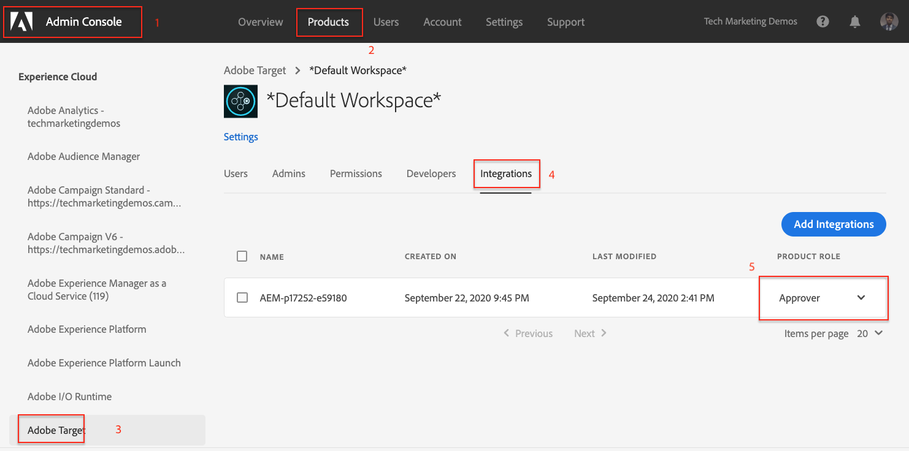

# Exporter le fragment d’expérience vers Adobe Target {#experience-fragment-target}

Découvrez comment exporter AEM fragment d’expérience en tant qu’offres Adobe Target.

>[!VIDEO](https://video.tv.adobe.com/v/41245?quality=12&learn=on)

## Étapes suivantes

+ [Création d’une activité Target à l’aide d’offres de fragments d’expérience](./create-target-activity.md)

## Résolution des problèmes

### Échec de l’exportation des fragments d’expérience vers Target

#### Erreur

L’exportation de fragments d’expérience vers Adobe Target sans les autorisations appropriées dans Adobe Admin Console entraîne l’erreur suivante sur le service AEM Author :

    

... et les messages de journal suivants dans le journal `aemerror` :

    

#### Résolution

1. Connectez-vous à [Admin Console](https://adminconsole.adobe.com/) avec les droits d’administration pour le profil de produit Adobe Target utilisé, mais l’intégration AEM
2. Sélectionnez __Produits > Adobe Target > Profil de produit__
3. Sous l’onglet __Intégrations__ , sélectionnez l’intégration de votre AEM en tant qu’environnement de Cloud Service (même nom que le projet d’Adobe I/O).
4. Attribuer le rôle __Éditeur__ ou __Approbateur__

   

L’ajout de l’autorisation correcte à votre intégration Adobe Target devrait résoudre cette erreur.

## Liens pris en charge

+ [Débogueur Adobe Experience Cloud - Chrome](https://chrome.google.com/webstore/detail/adobe-experience-cloud-de/ocdmogmohccmeicdhlhhgepeaijenapj)
+ [Débogueur Adobe Experience Cloud - Firefox](https://addons.mozilla.org/en-US/firefox/addon/adobe-experience-platform-dbg/)