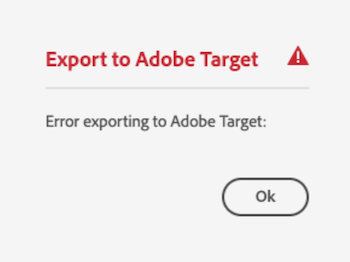
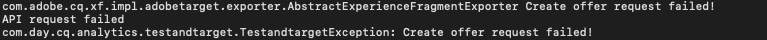

# Export Experience Fragment to Adobe Target {#experience-fragment-target}

Découvrez comment exporter AEM fragment d’expérience en tant qu’Offres Adobe Target.

>[!VIDEO](https://video.tv.adobe.com/v/41245?quality=12&learn=on)

## Étapes suivantes

+ [Création d’une Activité de Cible à l’aide d’Offres de fragments d’expérience](./create-target-activity.md)

## Résolution des incidents

### Echec de l’exportation de fragments d’expérience vers la Cible

#### Erreur

L’exportation du fragment d’expérience vers Adobe Target sans les autorisations appropriées dans Adobe Admin Console entraîne l’erreur suivante sur le service Auteur AEM :

    

... et les messages de journal suivants dans le `aemerror` journal :

    

#### Résolution

1. Connectez-vous au [Admin Console](https://adminconsole.adobe.com/) avec des droits d’administration pour le Profil de produits Adobe Target utilisé mais l’intégration AEM
2. Sélectionnez __Produits > Adobe Target > Profil de produit.__
3. Sous l&#39;onglet __Intégrations__ , sélectionnez l&#39;intégration de votre AEM en tant qu&#39;environnement Cloud Service (même nom que le projet d&#39;E/S Adobe).
4. Attribuer un rôle __Editeur__ ou __Approbateur__

   

Ajouter l’autorisation correcte à votre intégration Adobe Target devrait résoudre cette erreur.

## Liens pris en charge

+ [Débogueur Adobe Experience Cloud - Chrome](https://chrome.google.com/webstore/detail/adobe-experience-cloud-de/ocdmogmohccmeicdhlhhgepeaijenapj)
+ [Débogueur Adobe Experience Cloud - Firefox](https://addons.mozilla.org/en-US/firefox/addon/adobe-experience-platform-dbg/)