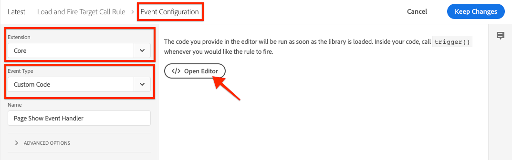
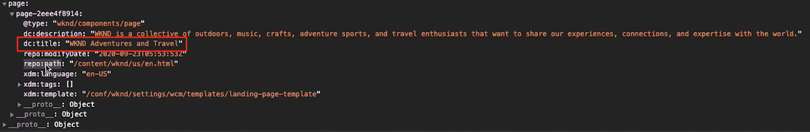

# Charger et déclencher un appel de Cible {#load-fire-target}

Découvrez comment charger, transférer des paramètres à la demande de page et déclencher un appel de Cible à partir de la page de votre site à l’aide d’une règle de lancement. Les informations de page Web sont récupérées et transmises sous forme de paramètres à l&#39;aide de la couche de données du client Adobe qui vous permet de collecter et de stocker des données sur l&#39;expérience des visiteurs sur une page Web, puis de faciliter l&#39;accès à ces données.

>[!VIDEO](https://video.tv.adobe.com/v/41243?quality=12&learn=on)

## Règle de chargement de page

La couche de données du client Adobe est une couche de données pilotée par événement. Une fois la couche de données Page AEM chargée, elle déclenche un événement `cmp:show`. Dans la vidéo, la règle `Launch Library Loaded` est appelée à l’aide d’un événement personnalisé. Vous trouverez ci-dessous les fragments de code utilisés dans la vidéo pour le événement personnalisé ainsi que pour les éléments de données.

### Page personnalisée affichée Événement{#page-event}



Dans la propriété Launch, ajoutez un nouveau **Événement** à la **règle**.

+ __Extension:__ Core
+ __type d&#39;événement:Code__ personnalisé
+ __Nom : gestionnaire de Événements d’affichage de__ page (ou descriptif)

Appuyez sur le bouton __Ouvrir l’éditeur__ et collez-le dans le fragment de code suivant. Ce code __doit__ être ajouté à la __configuration de Événement__ et à une __action__ ultérieure.

```javascript
// Define the event handler function
var pageShownEventHandler = function(coreComponentEvent) {

    // Check to ensure event trigger via AEM Core Components is shaped correctly
    if (coreComponentEvent.hasOwnProperty("eventInfo") && 
        coreComponentEvent.eventInfo.hasOwnProperty("path")) {
    
        // Debug the AEM Component path the show event is associated with
        console.debug("cmp:show event: " + coreComponentEvent.eventInfo.path);

        // Create the Launch Event object
        var launchEvent = {
            // Include the ID of the AEM Component that triggered the event
            id: coreComponentEvent.eventInfo.path,
            // Get the state of the AEM Component that triggered the event           
            component: window.adobeDataLayer.getState(coreComponentEvent.eventInfo.path)
        };

        //Trigger the Launch Rule, passing in the new `event` object
        // the `event` obj can now be referenced by the reserved name `event` by other Launch data elements
        // i.e `event.component['someKey']`
        trigger(launchEvent);
   }
}

// With the AEM Core Component event handler, that proxies the event and relevant information to Adobe Launch, defined above...

// Initialize the adobeDataLayer global object in a safe way
window.adobeDataLayer = window.adobeDataLayer || [];

// Push the event custom listener onto the Adobe Data Layer
window.adobeDataLayer.push(function (dataLayer) {
   // Add event listener for the `cmp:show` event, and the custom `pageShownEventHandler` function as the callback
   dataLayer.addEventListener("cmp:show", pageShownEventHandler);
});
```

Une fonction personnalisée définit le `pageShownEventHandler` et écoute les événements émis par AEM Core Components, extrait les informations pertinentes du composant principal, les regroupe dans un objet événement et déclenche le Événement de lancement avec les informations de événement dérivées à sa charge utile.

La règle de lancement est déclenchée à l&#39;aide de la fonction `trigger(...)` du lancement, __uniquement__ disponible dans la définition de fragment de code personnalisé du Événement de la règle.

La fonction `trigger(...)` prend un objet événement comme paramètre qui, à son tour, est exposé dans les éléments de données de lancement, par un autre nom réservé dans Lancement nommé `event`. Les éléments de données du lancement peuvent désormais référencer les données de cet objet de événement à partir de l&#39;objet `event` en utilisant une syntaxe telle que `event.component['someKey']`.

Si `trigger(...)` est utilisé en dehors du contexte d&#39;un type d&#39;événement de code personnalisé de Événement (par exemple, dans une action), l&#39;erreur JavaScript `trigger is undefined` est générée sur le site Web intégré à la propriété Launch.


### Éléments de données


Les éléments de données de lancement d&#39;Adobe mappent les données de l&#39;objet de événement [déclenché dans le événement Page affichée personnalisé](#page-event) aux variables disponibles dans Adobe Target, via le type d&#39;élément de données Code personnalisé de l&#39;extension de base.

#### Elément de données d’ID de page

```
if (event && event.id) {
    return event.id;
}
```

Ce code renvoie l&#39;ID unique généré par le composant principal.


### Elément de données Chemin de page

```
if (event && event.component && event.component.hasOwnProperty('repo:path')) {
    return event.component['repo:path'];
}
```

Ce code renvoie le chemin de la page AEM.


### Elément de données Titre de page

```
if (event && event.component && event.component.hasOwnProperty('dc:title')) {
    return event.component['dc:title'];
}
```

Ce code renvoie le titre de la page AEM.



## Résolution des incidents

### Pourquoi mes mbox ne se déclenchent-elles pas sur mes pages Web ?

#### Message d’erreur lorsque le cookie mboxDisable n’est pas défini.


```
> AT: [page-init] Adobe Target content delivery is disabled. Ensure that you can save cookies to your current domain, there is no "mboxDisable" cookie and there is no "mboxDisable" parameter in the query string.
```

#### Solution

Les clients cibles utilisent parfois des instances basées sur le cloud avec Cible pour effectuer des tests ou à des fins simples de BAT de concept. Ces domaines, et beaucoup d&#39;autres, font partie de la Liste du suffixe public.
Les navigateurs modernes n’enregistreront pas les cookies si vous utilisez ces domaines, sauf si vous personnalisez le paramètre `cookieDomain` à l’aide de `targetGlobalSettings()`.

```
window.targetGlobalSettings = {  
   cookieDomain: 'your-domain' //set the cookie directly on this subdomain, for example: 'publish-p1234-e5678.adobeaemcloud.com'
};
```

## Étapes suivantes

+ [Exporter le fragment d’expérience vers Adobe Target](./export-experience-fragment-target.md)

## Liens pris en charge

+ [Documentation de la couche de données du client Adobe](https://github.com/adobe/adobe-client-data-layer/wiki)
+ [Débogueur Adobe Experience Cloud - Chrome](https://chrome.google.com/webstore/detail/adobe-experience-cloud-de/ocdmogmohccmeicdhlhhgepeaijenapj)
+ [Débogueur Adobe Experience Cloud - Firefox](https://addons.mozilla.org/en-US/firefox/addon/adobe-experience-platform-dbg/)
+ [Utilisation de la couche de données du client Adobe et de la documentation des composants principaux](https://docs.adobe.com/content/help/fr-FR/experience-manager-core-components/using/developing/data-layer/overview.html)
+ [Présentation du débogueur Adobe Experience Platform](https://docs.adobe.com/content/help/en/platform-learn/tutorials/data-ingestion/web-sdk/introduction-to-the-experience-platform-debugger.html)