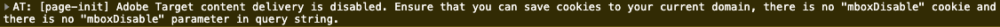

# Charger et déclencher un appel de Cible {#load-fire-target}

Découvrez comment charger, transférer des paramètres à la demande de page et déclencher un appel de Cible à partir de la page de votre site à l’aide d’une règle de lancement. Les informations de page sont récupérées et transmises en tant que paramètres à l’aide de la couche de données du client Adobe qui vous permet de collecter et de stocker des données sur l’expérience des visiteurs sur une page Web, puis de faciliter l’accès à ces données.

>[!VIDEO](https://video.tv.adobe.com/v/41243?quality=12&learn=on)

## Règle de chargement de page

La couche de données du client Adobe est une couche de données pilotée par événement. Lorsque la couche de données Page AEM est chargée, elle déclenche un événement `cmp:show` . Dans la vidéo, la `Launch Library Loaded` règle est appelée à l’aide d’un événement personnalisé. Vous trouverez ci-dessous les fragments de code utilisés dans la vidéo pour le événement personnalisé ainsi que pour les éléments de données.

### Événement personnalisé

Le fragment de code ci-dessous ajoute un écouteur de événement en poussant une fonction dans la couche de données. Lorsque le `cmp:show` événement est déclenché, la `pageShownEventHandler` fonction est appelée. Dans cette fonction, quelques vérifications d’intégrité sont ajoutées et un nouveau `dataObject` est créé avec l’état le plus récent de la couche de données pour le composant qui a déclenché le événement.

Une fois que cela `trigger(dataObject)` a été appelé. `trigger()` est un nom réservé dans Lancement et déclenche la règle de lancement. Nous transmettons l&#39;objet événement en tant que paramètre qui sera à son tour exposé par un autre nom réservé dans Lancement nommé événement. Les éléments de données du lancement peuvent désormais référencer diverses propriétés telles que : `event.component['someKey']`.

```javascript
var pageShownEventHandler = function(evt) {
// defensive coding to avoid a null pointer exception
if(evt.hasOwnProperty("eventInfo") && evt.eventInfo.hasOwnProperty("path")) {
   //trigger Launch Rule and pass event
   console.debug("cmp:show event: " + evt.eventInfo.path);
   var event = {
      //include the id of the component that triggered the event
      id: evt.eventInfo.path,
      //get the state of the component that triggered the event
      component: window.adobeDataLayer.getState(evt.eventInfo.path)
   };

      //Trigger the Launch Rule, passing in the new `event` object
      // the `event` obj can now be referenced by the reserved name `event` by other Launch data elements
      // i.e `event.component['someKey']`
      trigger(event);
   }
}

//set the namespace to avoid a potential race condition
window.adobeDataLayer = window.adobeDataLayer || [];
//push the event listener for cmp:show into the data layer
window.adobeDataLayer.push(function (dl) {
   //add event listener for `cmp:show` and callback to the `pageShownEventHandler` function
   dl.addEventListener("cmp:show", pageShownEventHandler);
});
```

### ID de page de couche de données

```
if(event && event.id) {
    return event.id;
}
```


### Chemin d’accès à la page

```
if(event && event.component && event.component.hasOwnProperty('repo:path')) {
    return event.component['repo:path'];
}
```


### Titre de la page

```
if(event && event.component && event.component.hasOwnProperty('dc:title')) {
    return event.component['dc:title'];
}
```


### Problèmes courants

#### Pourquoi mes mbox ne se déclenchent-elles pas sur mes pages Web ?

**Message d’erreur lorsque le cookie mboxDisable n’est pas défini.**



**Solution**

Les clients cibles utilisent parfois des instances basées sur le cloud avec Cible pour effectuer des tests ou à des fins simples de BAT de concept. Ces domaines, et beaucoup d&#39;autres, font partie de la Liste du suffixe public.
Les navigateurs modernes n’enregistrent pas les cookies si vous utilisez ces domaines, sauf si vous personnalisez le `cookieDomain` paramètre `targetGlobalSettings()`.

```
window.targetGlobalSettings = {  
   cookieDomain: 'your-domain' //set the cookie directly on this subdomain 
};
```

## Liens pris en charge

* [Documentation de la couche de données du client Adobe](https://github.com/adobe/adobe-client-data-layer/wiki)
* [Débogueur Adobe Experience Cloud - Chrome](https://chrome.google.com/webstore/detail/adobe-experience-cloud-de/ocdmogmohccmeicdhlhhgepeaijenapj)
* [Débogueur Adobe Experience Cloud - Firefox](https://addons.mozilla.org/en-US/firefox/addon/adobe-experience-platform-dbg/)
* [Utilisation de la couche de données du client Adobe et de la documentation des composants principaux](https://docs.adobe.com/content/help/en/experience-manager-core-components/using/developing/data-layer/overview.html)
* [Présentation du débogueur Adobe Experience Platform](https://docs.adobe.com/content/help/en/platform-learn/tutorials/data-ingestion/web-sdk/introduction-to-the-experience-platform-debugger.html)