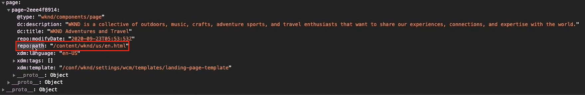

# Charger et déclencher un appel Target {#load-fire-target}

Découvrez comment charger, transférer des paramètres à une requête de page et déclencher un appel Target à partir de la page de votre site à l’aide d’une règle Launch. Les informations de page web sont récupérées et transmises en tant que paramètres à l’aide de la couche de données client Adobe qui vous permet de collecter et de stocker des données sur l’expérience des visiteurs sur une page web, puis d’accéder facilement à ces données.

>[!VIDEO](https://video.tv.adobe.com/v/41243?quality=12&learn=on)

## Règle de chargement de page

La couche de données client Adobe est une couche de données pilotée par les événements. Lorsque la couche de données Page AEM est chargée, elle déclenche un événement `cmp:show` . Dans la vidéo, la règle `Launch Library Loaded` est appelée à l’aide d’un événement personnalisé. Vous trouverez ci-dessous les fragments de code utilisés dans la vidéo pour l’événement personnalisé ainsi que pour les éléments de données.

### Événement Page vue personnalisée{#page-event}


Dans la propriété Launch, ajoutez un nouvel **événement** à la **règle**

+ __Extension :__ Core
+ __Type d’événement :__ Code personnalisé
+ __Nom :__ Gestionnaire d’événements de présentation de page (ou descriptif)

Appuyez sur le bouton __Ouvrir l’éditeur__ et collez-le dans le fragment de code suivant. Ce code __doit__ être ajouté à la __Configuration de l’événement__ et une __Action__ ultérieure.

```javascript
// Define the event handler function
var pageShownEventHandler = function(coreComponentEvent) {

    // Check to ensure event trigger via AEM Core Components is shaped correctly
    if (coreComponentEvent.hasOwnProperty("eventInfo") && 
        coreComponentEvent.eventInfo.hasOwnProperty("path")) {
    
        // Debug the AEM Component path the show event is associated with
        console.debug("cmp:show event: " + coreComponentEvent.eventInfo.path);

        // Create the Launch Event object
        var launchEvent = {
            // Include the ID of the AEM Component that triggered the event
            id: coreComponentEvent.eventInfo.path,
            // Get the state of the AEM Component that triggered the event           
            component: window.adobeDataLayer.getState(coreComponentEvent.eventInfo.path)
        };

        //Trigger the Launch Rule, passing in the new `event` object
        // the `event` obj can now be referenced by the reserved name `event` by other Launch data elements
        // i.e `event.component['someKey']`
        trigger(launchEvent);
   }
}

// With the AEM Core Component event handler, that proxies the event and relevant information to Adobe Launch, defined above...

// Initialize the adobeDataLayer global object in a safe way
window.adobeDataLayer = window.adobeDataLayer || [];

// Push the event custom listener onto the Adobe Data Layer
window.adobeDataLayer.push(function (dataLayer) {
   // Add event listener for the `cmp:show` event, and the custom `pageShownEventHandler` function as the callback
   dataLayer.addEventListener("cmp:show", pageShownEventHandler);
});
```

Une fonction personnalisée définit la balise `pageShownEventHandler` et écoute les événements émis par les composants principaux d’AEM, fournit les informations appropriées au composant principal, le regroupe dans un objet d’événement et déclenche l’événement Launch avec les informations d’événement dérivées à sa charge utile.

La règle Launch est déclenchée à l’aide de la fonction `trigger(...)` de Launch, __uniquement__ disponible dans la définition de fragment de code personnalisé d’un événement de règle.

La fonction `trigger(...)` utilise un objet d’événement comme paramètre qui, à son tour, est exposé dans les éléments de données Launch par un autre nom réservé dans Launch appelé `event`. Les éléments de données de Launch peuvent désormais référencer des données à partir de cet objet d’événement à partir de l’objet `event` en utilisant une syntaxe du type `event.component['someKey']`.

Si `trigger(...)` est utilisé en dehors du contexte du type d’événement Code personnalisé d’un événement (par exemple, dans une action), l’erreur JavaScript `trigger is undefined` est générée sur le site Web intégré à la propriété Launch.


### Éléments de données


Les éléments de données Adobe Launch mappent les données de l’objet d’événement [déclenché dans l’événement Page vue personnalisé](#page-event) aux variables disponibles dans Adobe Target, via le type d’élément de données de code personnalisé de l’extension Core.

#### Élément de données ID de page

```
if (event && event.id) {
    return event.id;
}
```

Ce code renvoie l’identifiant unique généré par le composant principal.


### Élément de données de chemin de page

```
if (event && event.component && event.component.hasOwnProperty('repo:path')) {
    return event.component['repo:path'];
}
```

Ce code renvoie le chemin d’accès de la page AEM.



### Élément de données de titre de page

```
if (event && event.component && event.component.hasOwnProperty('dc:title')) {
    return event.component['dc:title'];
}
```

Ce code renvoie le titre de la page AEM.


## Résolution des problèmes

### Pourquoi mes mbox ne se déclenchent-elles pas sur mes pages web ?

#### Message d’erreur lorsque le cookie mboxDisable n’est pas défini


```
> AT: [page-init] Adobe Target content delivery is disabled. Ensure that you can save cookies to your current domain, there is no "mboxDisable" cookie and there is no "mboxDisable" parameter in the query string.
```

#### Solution

Les clients Target utilisent parfois des instances basées sur le cloud avec Target à des fins de test ou de preuve de concept. Ces domaines, et bien d’autres, font partie de la liste des suffixes publics .
Les navigateurs modernes n’enregistrent pas les cookies si vous utilisez ces domaines, sauf si vous personnalisez le paramètre `cookieDomain` à l’aide de `targetGlobalSettings()`.

```
window.targetGlobalSettings = {  
   cookieDomain: 'your-domain' //set the cookie directly on this subdomain, for example: 'publish-p1234-e5678.adobeaemcloud.com'
};
```

## Étapes suivantes

+ [Exportation du fragment d’expérience vers Adobe Target](./export-experience-fragment-target.md)

## Liens pris en charge

+ [Documentation sur la couche de données client Adobe](https://github.com/adobe/adobe-client-data-layer/wiki)
+ [Débogueur Adobe Experience Cloud - Chrome](https://chrome.google.com/webstore/detail/adobe-experience-cloud-de/ocdmogmohccmeicdhlhhgepeaijenapj)
+ [Débogueur Adobe Experience Cloud - Firefox](https://addons.mozilla.org/en-US/firefox/addon/adobe-experience-platform-dbg/)
+ [Utilisation de la couche de données client Adobe et de la documentation des composants principaux](https://experienceleague.adobe.com/docs/experience-manager-core-components/using/developing/data-layer/overview.html?lang=fr)
+ [Présentation du débogueur Adobe Experience Platform](https://experienceleague.adobe.com/docs/debugger-learn/tutorials/experience-platform-debugger/introduction-to-the-experience-platform-debugger.html)