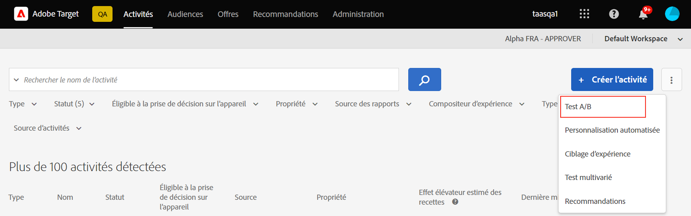
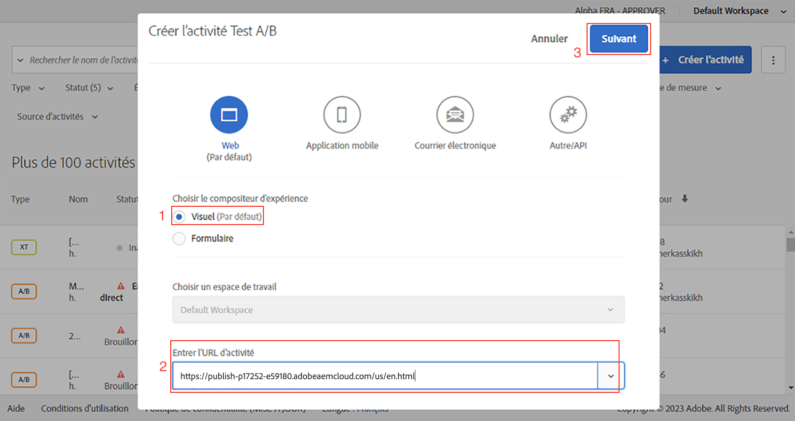
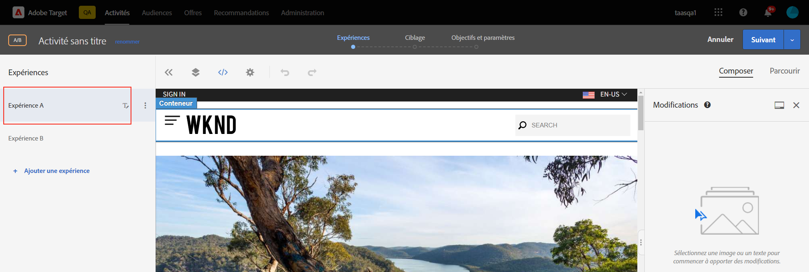
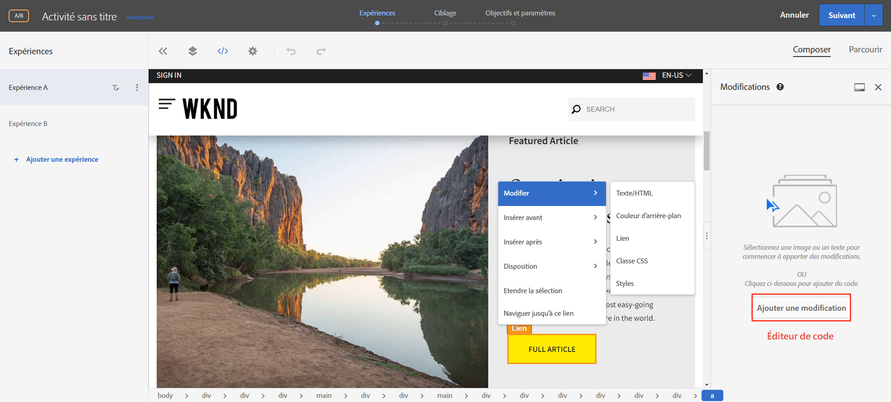
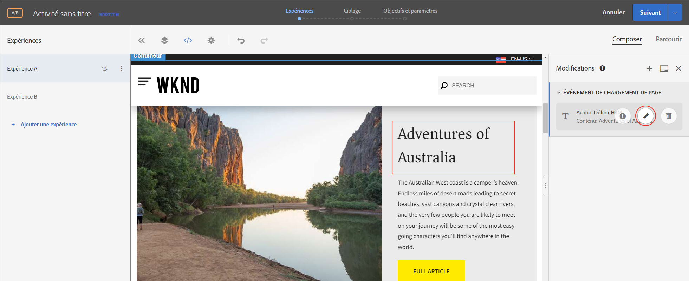
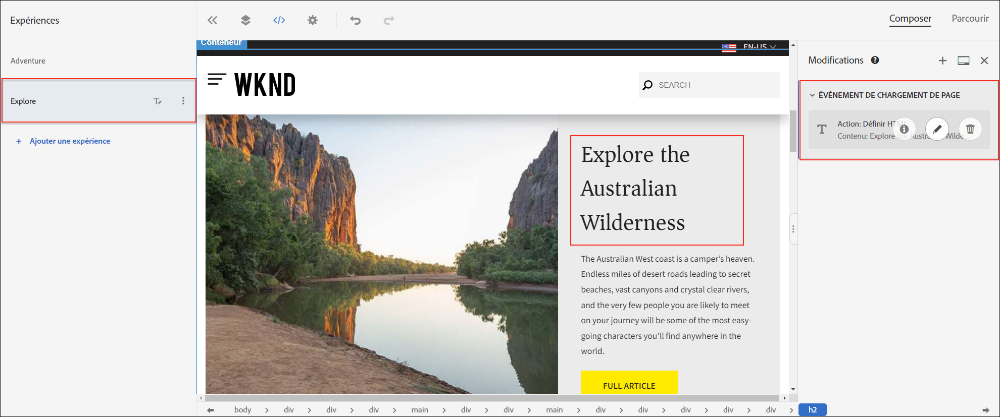
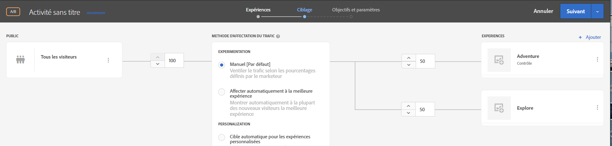
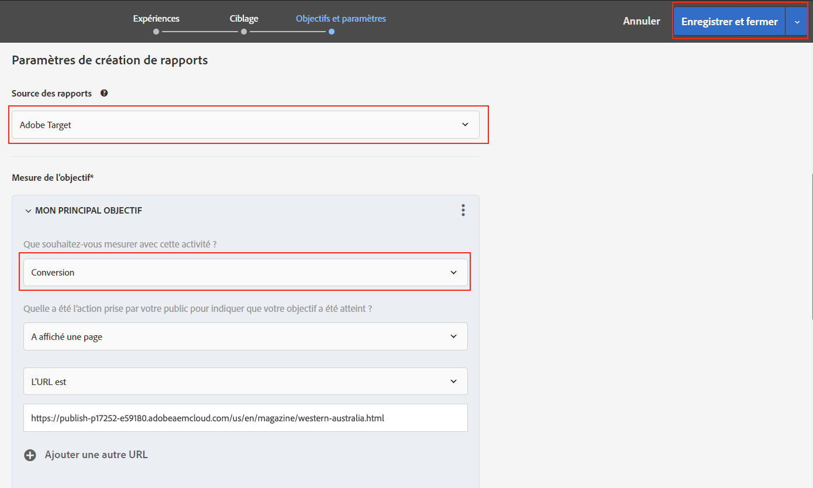
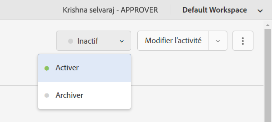
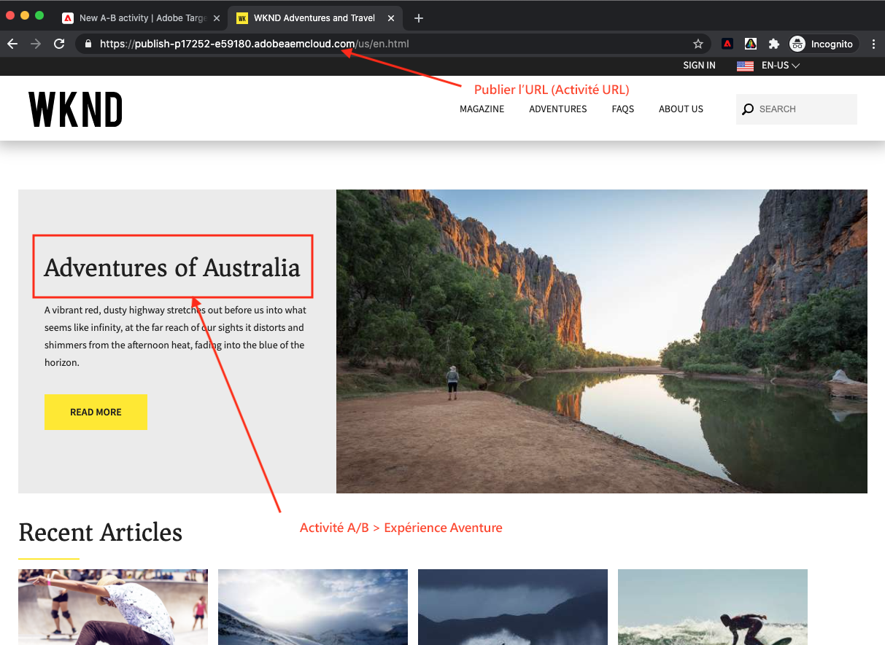

# Personnalisation à l’aide du compositeur d’expérience visuelle {#personalization-vec}

Découvrez comment créer une Activité de test A/B à l’aide du compositeur d’expérience visuelle (VEC).

## Conditions préalables

Pour utiliser le compositeur d’expérience visuelle sur un site Web AEM, la configuration suivante doit être effectuée :

1. [Ajouter Adobe Target sur votre site Web AEM](./add-target-launch-extension.md)
1. [Déclencher un appel Adobe Target à partir du lancement](./load-and-fire-target.md)

## Présentation du scénario

La page d&#39;accueil du site WKND présente les activités locales ou la meilleure chose à faire dans une ville sous la forme de cartes d&#39;information. En tant que spécialiste du marketing, vous avez reçu la tâche de modifier la page d&#39;accueil, en apportant des modifications au texte de la section aventure et en comprenant comment elle améliore la conversion.

## Procédure de création d’un test A/B à l’aide du compositeur d’expérience visuelle

1. Connectez-vous à [Adobe Experience Cloud](https://experience.adobe.com/), appuyez sur __Cible__, accédez à l&#39;onglet __Activités__.

   + Si __Cible__ ne s&#39;affiche pas sur le tableau de bord Experience Cloud, assurez-vous que l&#39;organisation d&#39;Adobe appropriée est sélectionnée dans le sélecteur d&#39;organisation situé en haut à droite et que l&#39;accès à la Cible a été accordé à votre utilisateur dans [Adobe Admin Console](https://adminconsole.adobe.com/).

1. Cliquez sur le bouton **Créer une Activité**, puis sélectionnez **Test A/B** activité.

   

1. Sélectionnez l’option **Compositeur visuel d’expérience**, indiquez l’URL de l’Activité, puis cliquez sur **Suivant**.

   

1. Le compositeur d’expérience visuelle affiche deux onglets sur le côté gauche après avoir créé une activité : *Expérience A* et *Expérience B*. Sélectionnez une expérience dans la liste. Vous pouvez ajouter de nouvelles expériences à la liste à l’aide du bouton **Ajouter l’expérience**.

   

1. Sélectionnez une image ou un texte sur votre page pour le début de la modification ou utilisez l’éditeur de code pour sélectionner et utiliser l’élément HTML.

   

1. Remplacez le texte de *Camping in Western Australia* par *Adventures of Australia*. Une liste de modifications ajoutées à une expérience s’affiche sous Modifications. Vous pouvez cliquer et modifier l’élément modifié pour vue son sélecteur CSS et le nouveau contenu qui y est ajouté.

   

1. Renommez *Expérience A* en *Aventure*.
1. De même, mettez à jour le texte sur *Expérience B* de *Camping in Western Australia* à *Explore the Australian Wilderness*.

   

1. Cliquez sur **Suivant** pour passer au ciblage et conservons une affectation manuelle du trafic comprise entre 50 et 50 entre les deux expériences.

   

1. Pour Objectifs et paramètres, choisissez la source de Rapports comme Adobe Target et sélectionnez la mesure Objectif comme Conversion avec une action de vue de page.

   

1. Attribuez un nom à votre activité et enregistrez.
1. Activez votre activité enregistrée pour activer vos modifications.

   

1. Ouvrez la page de votre site (URL de l’Activité de l’étape 3) dans un nouvel onglet et vous devriez pouvoir vue l’une ou l’autre des expériences (Aventure ou Exploration) à partir de notre activité de test A/B.

   

## Résumé

Dans ce chapitre, un spécialiste du marketing a été en mesure de créer une expérience à l’aide du compositeur d’expérience visuelle en faisant glisser et déposer, en permutant et en modifiant la mise en page et le contenu d’une page Web sans modifier le code pour exécuter un test.

## Liens pris en charge

+ [Débogueur Adobe Experience Cloud - Chrome](https://chrome.google.com/webstore/detail/adobe-experience-cloud-de/ocdmogmohccmeicdhlhhgepeaijenapj)
+ [Débogueur Adobe Experience Cloud - Firefox](https://addons.mozilla.org/en-US/firefox/addon/adobe-experience-platform-dbg/)
