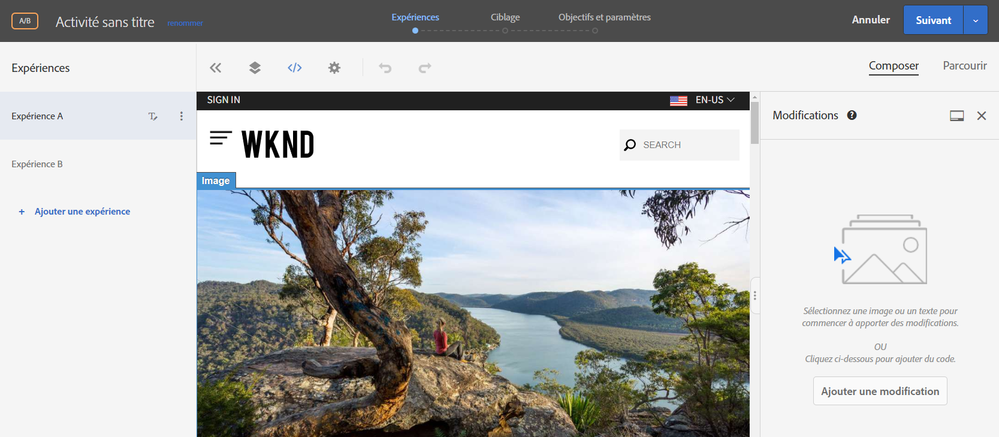
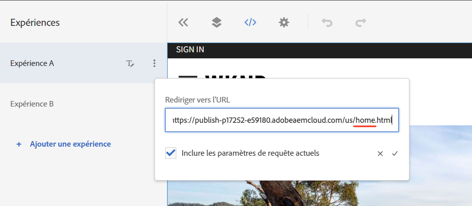
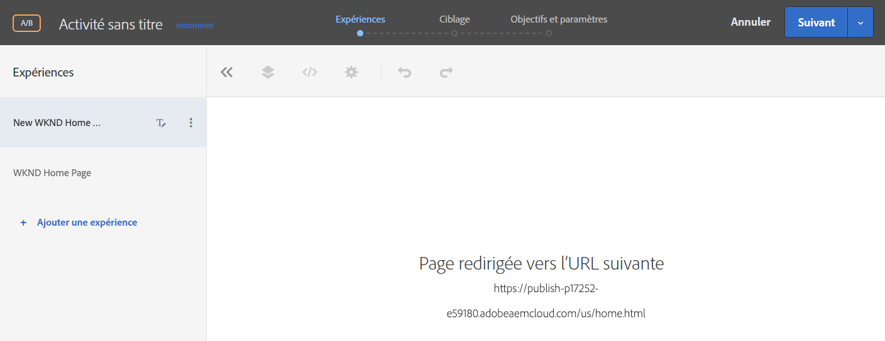
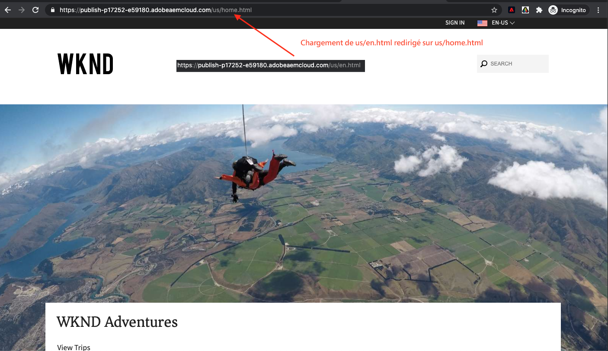

# Personnalisation de l’expérience de la page Web complète {#personalization-fpe}

Découvrez comment créer une activité pour rediriger les pages de votre site hébergées sur AEM vers une nouvelle page à l’aide de Adobe Target.

Avant de créer une Activité dans Cible, vous devez effectuer la configuration :

1. [Intégrer l&#39;Experience Platform Launch et l&#39;AEM](https://docs.adobe.com/content/help/en/experience-manager-learn/sites/integrations/experience-platform-launch/overview.html)

## Présentation du scénario

Le site WKND a repensé sa page d&#39;accueil et souhaite rediriger ses visiteurs pages d&#39;accueil actuels vers la nouvelle page d&#39;accueil. En même temps, vous devez également comprendre comment la nouvelle page d&#39;accueil permet d’améliorer l’engagement des utilisateurs et les recettes. En tant que spécialiste du marketing, vous avez reçu la tâche de créer une activité pour rediriger les visiteurs vers la nouvelle page d&#39;accueil. Explorons la page d&#39;accueil du site WKND et apprenons comment créer une activité à l&#39;aide de Adobe Target.

## Procédure de création d’un test A/B à l’aide du compositeur d’expérience visuelle

1. Connectez-vous à Adobe Target et accédez à l’onglet Activités.
1. Cliquez sur le bouton **Créer une Activité** , puis sélectionnez **activité de test** A/B.

   

1. Sélectionnez l’option Compositeur **d’expérience** visuelle, fournissez l’URL de l’Activité, puis cliquez sur **Suivant.**

   

1. Le compositeur d’expérience visuelle affiche deux onglets sur le côté gauche après avoir créé une activité : *Expérience A* et *Expérience B*. Sélectionnez une expérience dans la liste. Vous pouvez ajouter de nouvelles expériences à la liste à l’aide du bouton **Ajouter l’expérience** .

   

1. Options de vue disponibles pour l’expérience A, puis sélectionnez l’option **Rediriger vers l’URL** et fournissez une URL pour la nouvelle page d&#39;accueil de site WKND.

   

1. Renommer *l’expérience A* en *nouvelle Page d&#39;accueil* WKND et *l’expérience B* en Page d&#39;accueil *WKND*

   

1. Cliquez sur **Suivant** pour passer au ciblage et conserver une affectation manuelle du trafic de 50 à 50 entre les deux expériences.

   

1. Pour Objectifs et paramètres, choisissez la source de Rapports comme Adobe Target et sélectionnez la mesure Objectif comme Conversion avec une action de vue de page.

   

1. Attribuez un nom à votre activité et enregistrez.
1. Activez votre activité enregistrée pour activer vos modifications.

   

1. Ouvrez la page de votre site (URL de l’Activité de l’étape 3) dans un nouvel onglet et vous devriez pouvoir vue l’une des expériences (Page d&#39;accueil WKND ou nouvelle Page d&#39;accueil WKND) de notre activité de test A/B. `us/en.html` redirige vers `us/home.html`.

   

## Résumé

En tant que spécialiste du marketing, vous avez pu créer une activité de redirection des pages de votre site hébergées sur AEM vers une nouvelle page à l’aide de Adobe Target.

## Liens pris en charge

* [Débogueur Adobe Experience Cloud - Chrome](https://chrome.google.com/webstore/detail/adobe-experience-cloud-de/ocdmogmohccmeicdhlhhgepeaijenapj)
* [Débogueur Adobe Experience Cloud - Firefox](https://addons.mozilla.org/en-US/firefox/addon/adobe-experience-platform-dbg/)

