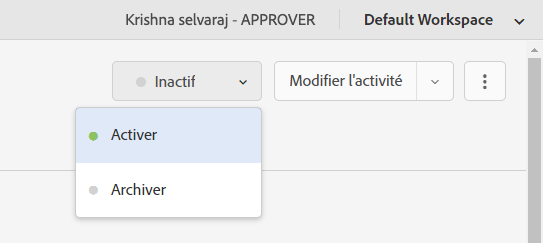

# Personnalisation de l’expérience de la page web complète {#personalization-fpe}

Découvrez comment créer une activité pour rediriger les pages de votre site hébergées sur AEM vers une nouvelle page à l’aide d’Adobe Target.

## Prérequis

Pour personnaliser les pages complètes d’un site web AEM, la configuration suivante doit être effectuée :

1. [Ajout d’Adobe Target à votre site web AEM](./add-target-launch-extension.md)
1. [Déclencher un appel Adobe Target à partir de Launch](./load-and-fire-target.md)

## Présentation du scénario

Le site WKND a repensé sa page d’accueil et souhaite rediriger les visiteurs de sa page d’accueil actuelle vers la nouvelle page d’accueil. En même temps, vous devez également comprendre comment la nouvelle page d’accueil contribue à améliorer l’engagement et les recettes des utilisateurs. En tant que marketeur, vous avez reçu la tâche de créer une activité pour rediriger les visiteurs vers la nouvelle page d’accueil. Explorons la page d’accueil du site WKND et apprenons à créer une activité à l’aide d’Adobe Target.

## Procédure de création d’un test A/B à l’aide du compositeur d’expérience visuelle (VEC)

1. Connectez-vous à Adobe Target et accédez à l’onglet Activités .
1. Cliquez sur le bouton **Créer l’activité** puis sélectionnez l’activité **Test A/B**

   

1. Sélectionnez l’option **Compositeur d’expérience visuelle**, fournissez l’URL d’activité, puis cliquez sur **Suivant**

   

1. Le compositeur d’expérience visuelle affiche deux onglets sur le côté gauche après la création d’une activité : *Expérience A* et *Expérience B*. Sélectionnez une expérience dans la liste. Vous pouvez ajouter de nouvelles expériences à la liste à l’aide du bouton **Ajouter une expérience**.

   

1. Affichez les options disponibles pour l’expérience A, puis sélectionnez l’option **Rediriger vers l’URL** et fournissez l’URL de la nouvelle page d’accueil du site WKND.

   

1. Renommez *Expérience A* en *Nouvelle page d’accueil WKND* et *Expérience B* en *Page d’accueil WKND*

   

1. Cliquez sur **Suivant** pour passer au ciblage et conserver une affectation manuelle du trafic de 50 à 50 entre les deux expériences.

   

1. Pour les objectifs et les paramètres, choisissez la source de création de rapports comme Adobe Target et sélectionnez la mesure Objectif comme Conversion avec une action de page vue.

   

1. Attribuez un nom à votre activité et enregistrez.
1. Activez votre activité enregistrée pour mettre vos modifications en ligne.

   

1. Ouvrez la page de votre site (URL d’activité de l’étape 3) dans un nouvel onglet et vous devriez pouvoir afficher l’une des expériences (page d’accueil WKND ou nouvelle page d’accueil WKND) de notre activité de test A/B. `us/en.html` redirige vers  `us/home.html`.

   

## Résumé

En tant que marketeur, vous avez été en mesure de créer une activité pour rediriger les pages de votre site hébergées sur AEM vers une nouvelle page à l’aide d’Adobe Target.

## Liens pris en charge

* [Débogueur Adobe Experience Cloud - Chrome](https://chrome.google.com/webstore/detail/adobe-experience-cloud-de/ocdmogmohccmeicdhlhhgepeaijenapj)
* [Débogueur Adobe Experience Cloud - Firefox](https://addons.mozilla.org/en-US/firefox/addon/adobe-experience-platform-dbg/)

