# Analyser les données avec Analysis Workspace

Découvrez comment mapper les données capturées d’un site Adobe Experience Manager aux mesures et aux dimensions dans les suites de rapports Adobe Analytics. Découvrez comment créer un tableau de bord de rapports détaillé à l&#39;aide de la fonction Analysis Workspace de Adobe Analytics.

## Ce que vous allez créer

L&#39;équipe marketing de WKND souhaite déterminer les boutons d&#39;appel à l&#39;action (CTA) les plus performants sur la page d&#39;accueil. Dans ce didacticiel, nous allons créer un nouveau projet en Analysis Workspace pour visualiser les performances des différents boutons CTA et comprendre le comportement des utilisateurs sur le site. Les informations suivantes sont capturées à l’aide d’Adobe Analytics lorsqu’un utilisateur clique sur un bouton d’appel à l’action (CTA) sur la page d&#39;accueil WKND.

**Variables Analytics**

Les variables Analytics actuellement suivies sont les suivantes :

* `eVar5` -  `Page template`
* `eVar6` - `Page Id`
* `eVar7` -  `Page last modified date`
* `eVar8` -  `CTA Button Id`
* `eVar9` -  `Page Name`
* `event8` -  `CTA Button Click event`
* `prop8` -  `CTA Button Id`

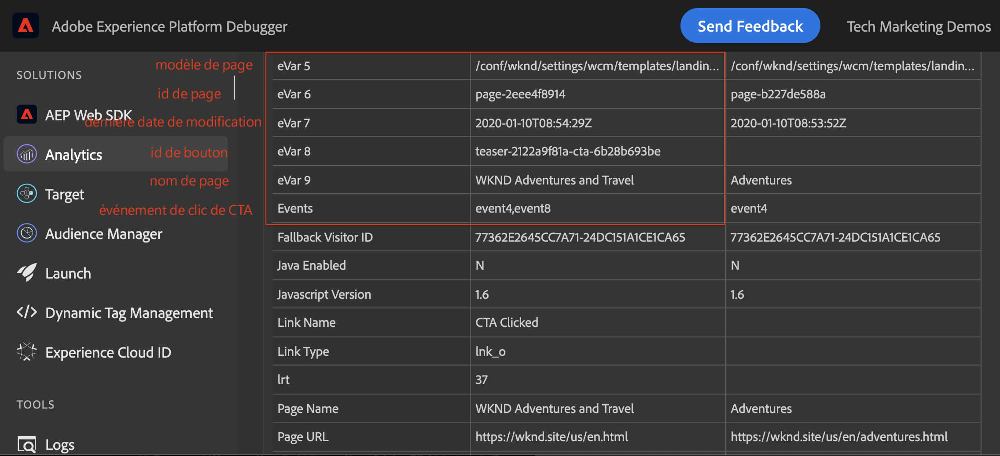

### Objectifs {#objective}

1. Créez une suite de rapports ou utilisez une suite de rapports existante.
1. Configurez les [variables de conversion (eVars)](https://docs.adobe.com/content/help/en/analytics/admin/admin-tools/conversion-variables/conversion-var-admin.html) et [Événements de réussite (Événements)](https://docs.adobe.com/help/en/analytics/admin/admin-tools/success-events/success-event.html) dans la suite de rapports.
1. Créez un [projet Analysis Workspace](https://docs.adobe.com/content/help/en/analytics/analyze/analysis-workspace/home.html) pour analyser les données à l’aide d’outils qui vous permettent de créer, d’analyser et de partager rapidement des informations.
1. Partagez le projet Analysis Workspace avec d’autres membres de l’équipe.

## Conditions préalables

Ce didacticiel est la suite du composant [Suivi des clics avec Adobe Analytics](./track-clicked-component.md) et suppose que vous avez :

* Une **propriété de lancement** avec l&#39;extension [Adobe Analytics](https://docs.adobe.com/content/help/fr-FR/launch/using/extensions-ref/adobe-extension/analytics-extension/overview.html) activée
* **Adobe** Analytics/dev report suite ID et serveur de suivi. Consultez la documentation suivante pour [créer une nouvelle suite de rapports](https://docs.adobe.com/content/help/en/analytics/admin/manage-report-suites/new-report-suite/new-report-suite.html).
* [Extension ](https://docs.adobe.com/content/help/en/platform-learn/tutorials/data-ingestion/web-sdk/introduction-to-the-experience-platform-debugger.html) de navigateur Experience Platform Debuggerbrowser configurée avec votre propriété Launch chargée sur  [https://wknd.site/us/en.](https://wknd.site/us/en.html) htmlun site AEM avec la couche de données d&#39;Adobe activée.

## Variables de conversion (eVars) et Événements de réussite (Événement)

La variable de conversion Custom Insight (ou eVar) est placée dans le code d’Adobe des pages Web sélectionnées de votre site. Son Principal objectif est de segmenter les mesures de réussite de conversion dans les rapports marketing personnalisés. Un eVar peut être basé sur les visites et fonctionner de la même manière que les cookies. Les valeurs transmises aux variables d’eVar suivent l’utilisateur pendant une période prédéterminée.

Lorsqu&#39;un eVar est défini sur une valeur visiteur, l&#39;Adobe mémorise automatiquement cette valeur jusqu&#39;à ce qu&#39;elle arrive à expiration. Tout événement de réussite rencontré par un visiteur alors que la valeur de l&#39;eVar est principale est comptabilisé en fonction de la valeur de l&#39;eVar.

Les eVars sont mieux utilisées pour mesurer les causes et les effets, comme par exemple :

* Quelles sont les campagnes internes qui ont influencé les recettes ?
* Quelles bannières publicitaires ont finalement abouti à une inscription ?
* Nombre de fois où une recherche interne a été utilisée avant de passer une commande

Les événements de réussite sont des actions qui peuvent être suivies. Vous déterminez ce qu&#39;est un événement de réussite. Par exemple, si un visiteur clique sur un bouton CTA, le événement de clics peut être considéré comme un événement de réussite.

### Configurer des eVars

1. Dans la page d&#39;accueil Adobe Experience Cloud, sélectionnez votre organisation et lancez Adobe Analytics.

   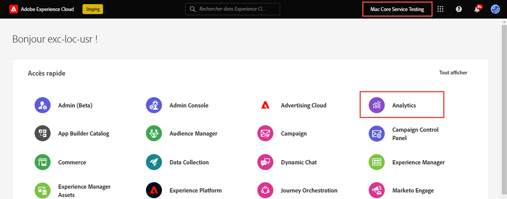

1. Dans la barre d’outils Analytics, cliquez sur **Admin** > **Report Suites** et recherchez votre suite de rapports.

   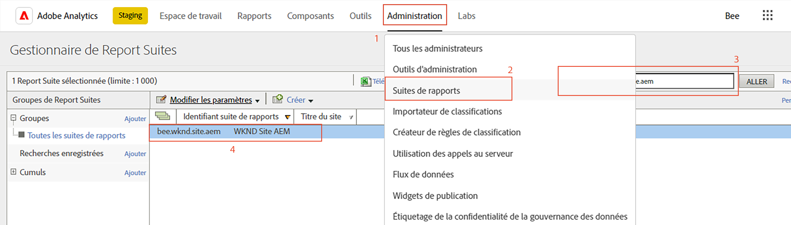

1. Sélectionnez Report Suite > **Modifier les paramètres** > **Conversion** > **Variables de conversion**

   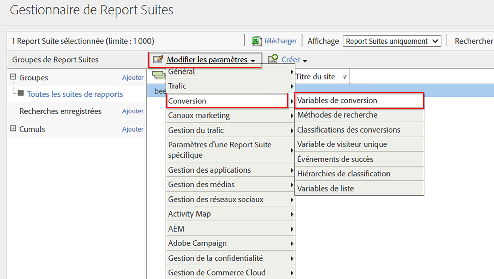

1. A l&#39;aide de l&#39;option **Ajouter**, créons des variables de conversion pour mapper le schéma comme suit :

   * `eVar5` -   `Page Template`
   * `eVar6` -  `Page ID`
   * `eVar7` -  `Last Modified Date`
   * `eVar8` -  `Button Id`
   * `eVar9` -  `Page Name`

   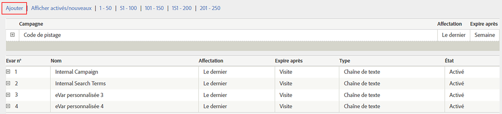

1. Fournissez un nom et une description appropriés pour chaque eVar et **Enregistrez** vos modifications. Nous utiliserons ces eVars pour créer un projet Analysis Workspace dans la section suivante. Ainsi, un nom convivial rend les variables facilement détectables.

   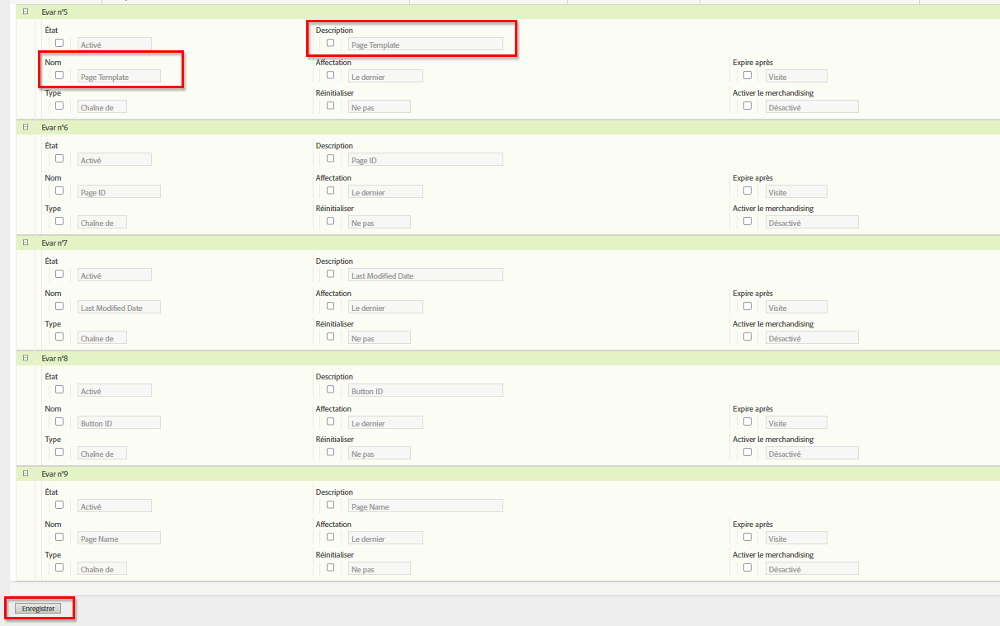

### Configuration des Événements de réussite

Ensuite, créons un événement pour effectuer le suivi du clic sur le bouton CTA.

1. Dans la fenêtre **Gestionnaire de Report Suites**, sélectionnez **Identifiant de Report Suite** et cliquez sur **Modifier les paramètres**.
1. Cliquez sur **Conversion** > **Événements de réussite**.
1. A l&#39;aide de l&#39;option **Ajouter nouveau**, créez un événement de réussite personnalisé pour suivre le clic sur le bouton CTA, puis **Enregistrer** vos modifications.
   * `Event` : `event8`
   * `Name`:`CTA Click`
   * `Type`:`Counter`

   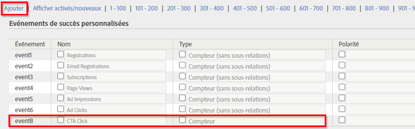

## Créer un projet en Analysis Workspace {#workspace-project}

Analysis Workspace est un outil de navigation flexible qui vous permet de créer des analyses et de partager rapidement des informations. L’interface par glisser-déposer vous permet de concevoir votre analyse, d’ajouter des visualisations pour donner vie aux données, de traiter un jeu de données, de partager et de planifier des projets avec toute personne de votre organisation.

Ensuite, créez un nouveau [projet](https://docs.adobe.com/content/help/en/analytics/analyze/analysis-workspace/build-workspace-project/t-freeform-project.html) pour créer un tableau de bord qui analysera les performances des boutons CTA sur l&#39;ensemble du site.

1. Dans la barre d’outils Analytics, sélectionnez **Espace de travail** et cliquez sur **Créer un projet**.

   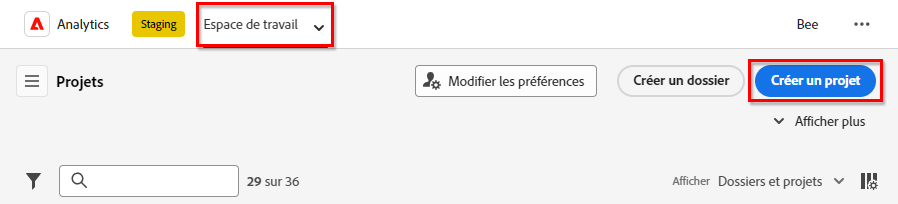

1. Choisissez d&#39;effectuer un début à partir d&#39;un **projet vierge** ou sélectionnez l&#39;un des modèles prédéveloppés, fournis par Adobe ou des modèles personnalisés créés par votre organisation. Plusieurs modèles sont disponibles, selon l’analyse ou le cas d’utilisation que vous avez en tête. [En savoir ](https://docs.adobe.com/content/help/en/analytics/analyze/analysis-workspace/build-workspace-project/starter-projects.html) plus sur les différentes options de modèle disponibles.

   Dans votre projet Workspace, les panneaux, les tableaux, les visualisations et les composants sont accessibles à partir du rail de gauche. Ce sont les blocs de construction de votre projet.

   * **[Composants](https://docs.adobe.com/content/help/en/analytics/analyze/analysis-workspace/components/analysis-workspace-components.html)**  - Les composants sont des dimensions, des mesures, des segments ou des plages de dates, qui peuvent tous être combinés dans un tableau à structure libre au début pour répondre à la question de votre entreprise. Veillez à vous familiariser avec chaque type de composant avant de plonger dans votre analyse. Une fois que vous avez maîtrisé la terminologie des composants, vous pouvez commencer à faire glisser et déposer votre analyse dans un tableau à structure libre.
   * **[Visualisations](https://docs.adobe.com/content/help/en/analytics/analyze/analysis-workspace/visualizations/freeform-analysis-visualizations.html)**  - Les visualisations, telles qu’une barre ou un graphique en courbes, sont ensuite ajoutées au-dessus des données afin de les rendre visibles. Dans le rail de l’extrême gauche, sélectionnez l’icône Visualisations centrale pour afficher la liste complète des visualisations disponibles.
   * **[Panneaux](https://docs.adobe.com/content/help/en/analytics/analyze/analysis-workspace/panels/panels.html)**  - Un panneau est un ensemble de tableaux et de visualisations. Vous pouvez accéder aux panneaux à partir de l’icône située en haut à gauche de l’espace de travail. Les panneaux s’avèrent utiles lorsque vous souhaitez organiser vos projets en fonction des périodes, des suites de rapports ou des cas d’utilisation des analyses. Les types de panneau suivants sont disponibles en Analysis Workspace :

   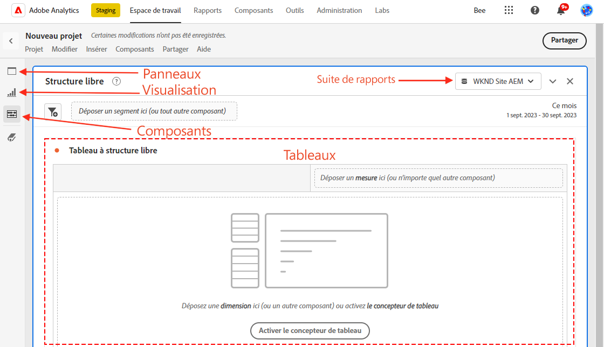

### Visualisation des données Ajoutées avec Analysis Workspace

Ensuite, créez un tableau pour créer une représentation visuelle de la façon dont les utilisateurs interagissent avec les boutons Appel à l&#39;action (CTA) sur la page d&#39;accueil du site WKND. Pour créer une telle représentation, utilisons les données collectées dans le composant [Suivi des clics avec Adobe Analytics](./track-clicked-component.md). Vous trouverez ci-dessous un résumé rapide des données suivies pour les interactions des utilisateurs avec les boutons d’appel à l’action du site WKND.

* `eVar5` -   `Page template`
* `eVar6` -  `Page Id`
* `eVar7` -  `Page last modified date`
* `eVar8` -  `CTA Button Id`
* `eVar9` -  `Page Name`
* `event8` -  `CTA Button Click event`
* `prop8` -  `CTA Button Id`

1. Faites glisser et déposez le composant de dimension **Page** sur le tableau à structure libre. Vous devez maintenant pouvoir vue une visualisation qui affiche le nom de page (eVar9) et les Vues de page correspondantes (occurrences) affichées dans le tableau.

   

1. Faites glisser et déposez la mesure **CTA Click** (événement8) sur la mesure des occurrences et remplacez-la. Vous pouvez désormais vue une visualisation qui affiche le nom de page (eVar9) et un nombre correspondant de événements de clics CTA sur une page.

   

1. Décomposons la page par page selon son type de modèle. Sélectionnez la mesure de modèle de page à partir de composants, puis faites glisser la mesure Modèle de page sur la dimension Nom de page. Vous pouvez désormais vue le nom de page ventilé par type de modèle.

   * **Avant**

      

   * **Après**

      

1. Pour comprendre comment les utilisateurs interagissent avec les boutons CTA lorsqu&#39;ils se trouvent sur les pages du site WKND, nous devons ventiler davantage la mesure Modèle de page en ajoutant la mesure ID de bouton (eVar8).

   

1. Vous trouverez ci-dessous une représentation visuelle du site WKND ventilée en fonction de son modèle de page et ventilée en fonction de l’interaction de l’utilisateur avec les boutons Cliquer pour agir du site WKND (CTA).

   

1. Vous pouvez remplacer la valeur ID de bouton par un nom plus convivial à l’aide des classifications Adobe Analytics. Vous pouvez en savoir plus sur la création d’une classification pour une mesure spécifique [ici](https://docs.adobe.com/content/help/en/analytics/components/classifications/c-classifications.html). Dans ce cas, nous avons une mesure de classification `Button Section (Button ID)` configurée pour `eVar8` qui mappe l&#39;ID de bouton sur un nom convivial.

   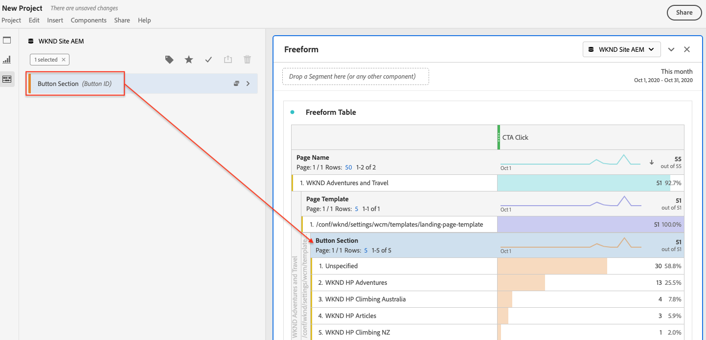

## Ajouter la classification à une variable Analytics

### Classifications des conversions

La classification d’Analytics permet de classer les données de variable d’Analytics, puis d’afficher les données de différentes manières lors de la génération de rapports. Pour améliorer l’affichage de l’identifiant de bouton dans le rapport Espace de travail Analytics, créons une variable de classification pour l’identifiant de bouton (eVar8). Lors de la classification, vous établissez une relation entre la variable et les métadonnées qui y sont associées.

Ensuite, créons une variable Classification pour Analytics.

1. Dans le menu de la barre d&#39;outils **Admin**, sélectionnez **Report Suites**.
1. Sélectionnez **Identifiant de Report Suite** dans la fenêtre **Gestionnaire de Report Suites** et cliquez sur **Modifier les paramètres** > **Conversion** > **Classifications des conversions**

   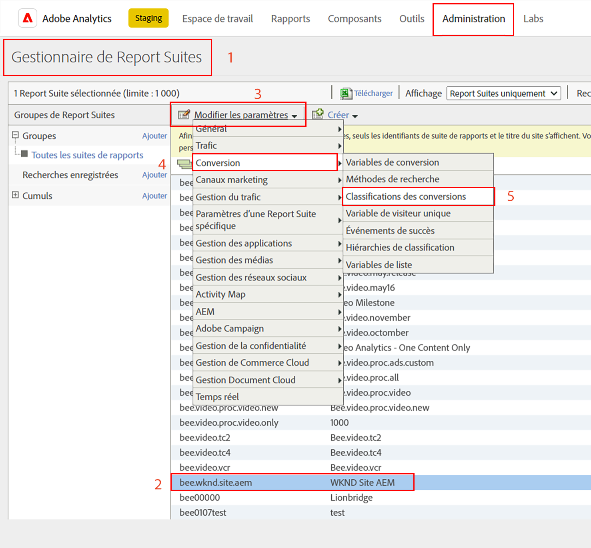

1. Dans la liste déroulante **Sélectionner le type de classification**, sélectionnez la variable (ID eVar8-Bouton) pour ajouter une classification.
1. Cliquez sur la flèche située à droite de la variable Classification répertoriée sous la section Classifications pour ajouter une nouvelle classification.

   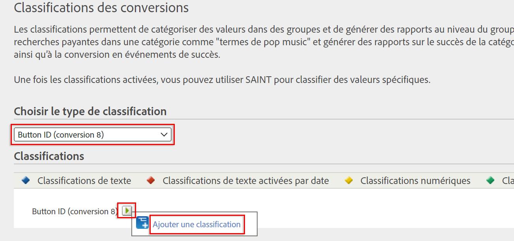

1. Dans la boîte de dialogue **Modifier une classification**, indiquez un nom approprié pour la classification de texte. Un composant de dimension portant le nom de la classification de texte est créé.

   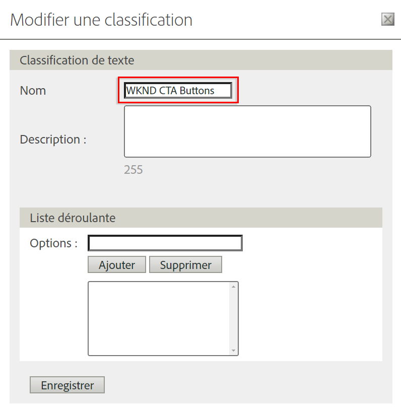

1. **Enregistrez vos modifications.**

### Importateur de classifications

Utilisez l’importateur pour télécharger des classifications dans Adobe Analytics. Vous pouvez également exporter les données en vue de les mettre à jour avant une importation. Les données que vous importez à l’aide de l’outil d’importation doivent être dans un format spécifique. L’Adobe vous permet de télécharger un modèle de données contenant tous les détails d’en-tête appropriés dans un fichier de données délimité par des tabulations. Vous pouvez ajouter vos nouvelles données à ce modèle, puis importer le fichier de données dans le navigateur via FTP.

#### Modèle de classification

Avant d’importer des classifications dans des rapports marketing, vous pouvez télécharger un modèle qui vous aide à créer un fichier de données de classification. Le fichier de données utilise les classifications souhaitées sous forme d’en-têtes de colonne, puis classe le jeu de données de rapports sous les en-têtes de classification appropriés.

Ensuite, téléchargeons le modèle de classification de la variable Id de bouton (eVar8)

1. Accédez à **Admin** > **Importateur de classifications**
1. Téléchargeons un modèle de classification pour la variable de conversion à partir de l&#39;onglet **Télécharger le modèle**.
   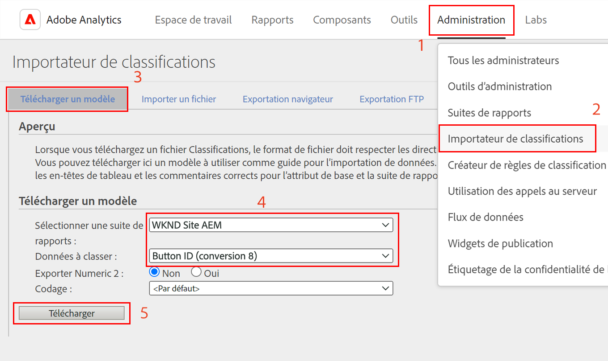

1. Dans l’onglet Télécharger un modèle, spécifiez la configuration du modèle de données.
   * **Sélectionner une Report Suite**  : Sélectionnez la suite de rapports à utiliser dans le modèle. La suite de rapports et le jeu de données doivent correspondre.
   * **Données à classifier**  : Sélectionnez le type de données pour le fichier de données. Le menu inclut tous les rapports de vos suites de rapports qui sont configurés pour les classifications.
   * **Encodage**  : Sélectionnez l’encodage des caractères pour le fichier de données. Le format de codage par défaut est UTF-8.

1. Cliquez sur **Télécharger** et enregistrez le fichier de modèle sur votre système local. Le fichier de modèle est un fichier de données délimité par des tabulations (extension de nom de fichier .tab) qui est pris en charge par la plupart des tableurs.
1. Ouvrez le fichier de données délimitées par des tabulations à l’aide d’un éditeur de votre choix.
1. Ajoutez l’ID de bouton (eVar9) et un nom de bouton correspondant au fichier délimité par des tabulations pour chaque valeur eVar9 de l’étape 9 de la section.

   

1. **** Enregistrez le fichier délimité par des tabulations.
1. Accédez à l&#39;onglet **Importer un fichier**.
1. Configurez la destination pour l&#39;importation du fichier.
   * **Sélectionner une Report Suite**  : AEM du site WKND (suite de rapports)
   * **Données à classer**  : Id De Bouton (Variable De Conversion eVar 8)
1. Cliquez sur l&#39;option **Choisir un fichier** pour télécharger le fichier délimité par des tabulations depuis votre système, puis cliquez sur **Importer un fichier**.

   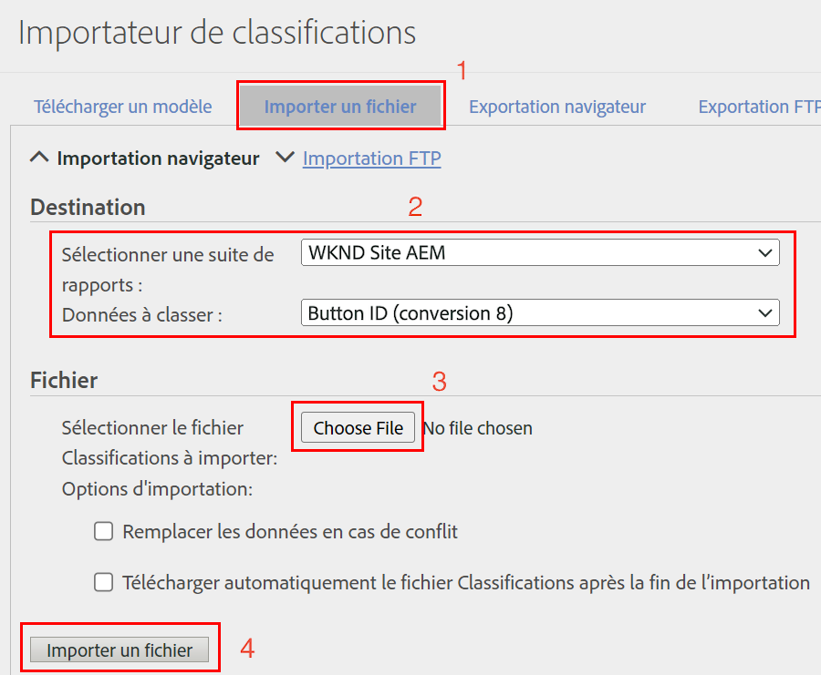

   >[!NOTE]
   >
   > Une importation réussie affiche immédiatement les modifications appropriées dans une exportation. Toutefois, les modifications des données dans les rapports peuvent prendre jusqu’à quatre heures lors de l’utilisation d’une importation de navigateur et jusqu’à 24 heures lors de l’utilisation d’une importation FTP.

#### Remplacer la variable de conversion par la variable de classification

1. Dans la barre d’outils Analytics, sélectionnez **Espace de travail** et ouvrez l’espace de travail que nous avons créé dans [Créer un projet dans Analysis Workspace](#workspace-project) section de ce didacticiel.

   

1. Ensuite, remplacez la mesure **Id de bouton** de votre espace de travail qui affiche l&#39;ID d&#39;un bouton d&#39;appel à l&#39;action (CTA) par le nom de classification créé à l&#39;étape précédente.

1. Dans l’outil de recherche de composant, recherchez **Boutons CTA WKND** et faites glisser et déposez la dimension **Boutons DEC WKND (Id de bouton)** sur la mesure Id de bouton et remplacez-la.

   * **Avant**

      
   * **Après**

      

1. Vous pouvez remarquer que la mesure Id de bouton qui contenait l&#39;id de bouton d&#39;un bouton d&#39;appel à l&#39;action (CTA) est maintenant remplacée par un nom correspondant fourni dans le modèle de classification.
1. Comparons le tableau de l’espace de travail Analytics à la Page d&#39;accueil WKND et comprenons le nombre de clics sur les boutons CTA et son analyse. D’après les données du tableau à structure libre de l’espace de travail, il est clair que 22 fois les utilisateurs ont cliqué sur le bouton **SKI NOW** et quatre fois sur le bouton WKND Page d&#39;accueil Camping en Australie occidentale **Lire plus**.

   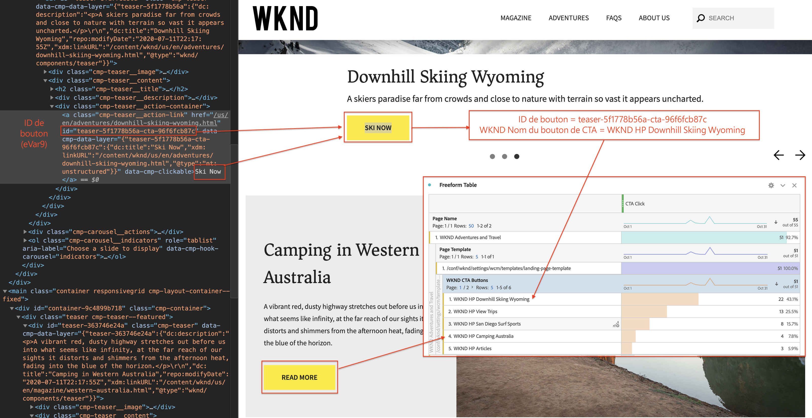

1. Veillez à enregistrer votre projet Adobe Analytics Workspace et à fournir un nom et une description corrects. Vous pouvez éventuellement ajouter des balises à un projet d’espace de travail.

   

1. Après avoir enregistré votre projet, vous pouvez le partager avec d&#39;autres collègues ou collègues à l&#39;aide de l&#39;option Partager.

   

## Félicitations ! 

Vous venez d’apprendre comment mapper les données capturées d’un site Adobe Experience Manager à des mesures et des dimensions dans les suites de rapports Adobe Analytics, effectuer une classification pour les mesures et créer un tableau de bord de rapports détaillé à l’aide de la fonctionnalité Analysis Workspace de Adobe Analytics.

