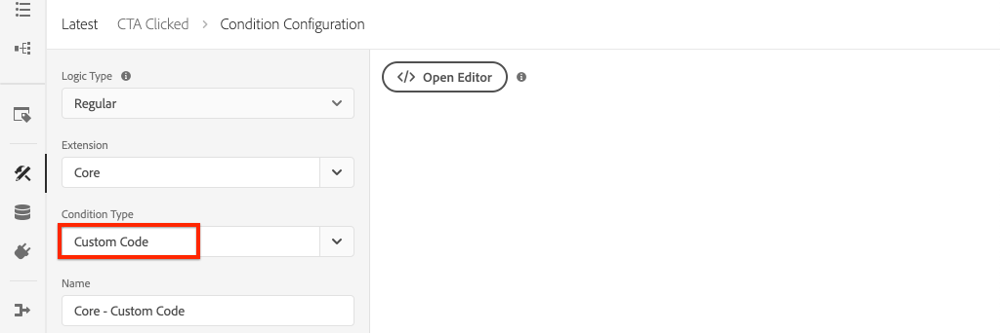

# Suivi des composants cliqués avec Adobe Analytics

Utilisez la [couche de données client d’Adobe pilotée par l’événement avec les composants principaux d’AEM](https://docs.adobe.com/content/help/fr-FR/experience-manager-core-components/using/developing/data-layer/overview.html) pour effectuer le suivi des clics sur des composants spécifiques d’un site Adobe Experience Manager. Découvrez comment utiliser des règles dans Experience Platform Launch pour écouter les événements de clics, filtrer par composant et envoyer les données à une instance Adobe Analytics avec une balise de lien de suivi.

## Ce que vous allez créer

L’équipe marketing WKND souhaite déterminer les boutons CTA (Appel à l’action) les plus performants sur la page d’accueil. Dans ce tutoriel, nous allons ajouter une nouvelle règle dans Experience Platform Launch qui écoute les événements `cmp:click` provenant des composants **Teaser** et **Bouton** et envoyer l’identifiant du composant et un nouvel événement à Adobe Analytics avec la balise de lien de suivi.


### Objectifs {#objective}

1. Créez une règle basée sur un événement dans Launch en fonction de l’événement `cmp:click`.
1. Filtrez les différents événements par type de ressource de composant.
1. Définissez l’identifiant du composant sur lequel l’utilisateur a cliqué et envoyez l’événement Adobe Analytics avec la balise de lien de suivi.

## Prérequis

Ce tutoriel est la suite de la section [Collecter les données de page avec Adobe Analytics](./collect-data-analytics.md) et suppose que vous disposez des éléments suivants :

* Une **propriété Launch** avec l’extension [Adobe Analytics](https://docs.adobe.com/content/help/fr-FR/launch/using/extensions-ref/adobe-extension/analytics-extension/overview.html) activée
* **Adobe de l’identifiant de suite de rapports** Analytics/dev et du serveur de suivi. Consultez la documentation suivante pour [créer une suite de rapports](https://docs.adobe.com/content/help/en/analytics/admin/manage-report-suites/new-report-suite/new-report-suite.html).
* [Extension de navigateur ](https://docs.adobe.com/content/help/en/platform-learn/tutorials/data-ingestion/web-sdk/introduction-to-the-experience-platform-debugger.html) DebuggerExperience Platform configurée avec votre propriété Launch chargée sur  [https://wknd.site/us/en.](https://wknd.site/us/en.html) htmlor un site AEM avec la couche de données d’Adobe activée.

## Inspect du schéma de bouton et de teaser

Avant d’établir des règles dans Launch, il est utile de consulter le schéma [pour le bouton et le teaser](https://docs.adobe.com/content/help/en/experience-manager-core-components/using/developing/data-layer/overview.html#item) et de les examiner dans l’implémentation de la couche de données.

1. Accédez à [https://wknd.site/us/en.html](https://wknd.site/us/en.html)
1. Ouvrez les outils de développement du navigateur et accédez à la **console**. Exécutez la commande suivante :

   ```js
   adobeDataLayer.getState();
   ```

   Cette opération renvoie l’état actuel de la couche de données client Adobe.

   

1. Développez la réponse et recherchez les entrées affectées du préfixe `button-` et de l’entrée `teaser-xyz-cta`. Vous devriez voir un schéma de données comme suit :

   Schéma de bouton :

   ```json
   button-2e6d32893a:
       @type: "wknd/components/button"
       dc:title: "View All"
       parentId: "page-2eee4f8914"
       repo:modifyDate: "2020-07-11T22:17:55Z"
       xdm:linkURL: "/content/wknd/us/en/magazine.html"
   ```

   Schéma du teaser :

   ```json
   teaser-da32481ec8-cta-adf3c09db9:
       @type: "wknd/components/teaser/cta"
       dc:title: "Surf's Up"
       parentId: "teaser-da32481ec8"
       xdm:linkURL: "/content/wknd/us/en/magazine/san-diego-surf.html"
   ```

   Ils sont basés sur le [schéma d’élément de composant/conteneur](https://docs.adobe.com/content/help/en/experience-manager-core-components/using/developing/data-layer/overview.html#item). La règle que nous allons créer dans Launch utilisera ce schéma.

## Création d’une règle CTA sélectionnée

La couche de données client Adobe est une couche de données pilotée par **event**. Lorsque l’utilisateur clique sur un composant principal, un événement `cmp:click` est distribué via la couche de données. Créez ensuite une règle pour écouter l’événement `cmp:click`.

1. Accédez à Experience Platform Launch et à la propriété Web intégrée au site AEM.
1. Accédez à la section **Règles** de l’interface utilisateur de Launch, puis cliquez sur **Ajouter une règle**.
1. Nommez la règle **CTA cliqué**.
1. Cliquez sur **Événements** > **Ajouter** pour ouvrir l’assistant **Configuration d’événement**.
1. Sous **Type d’événement**, sélectionnez **Code personnalisé**.

   

1. Cliquez sur **Ouvrir l’éditeur** dans le panneau principal et saisissez le fragment de code suivant :

   ```js
   var componentClickedHandler = function(evt) {
      // defensive coding to avoid a null pointer exception
      if(evt.hasOwnProperty("eventInfo") && evt.eventInfo.hasOwnProperty("path")) {
         //trigger Launch Rule and pass event
         console.debug("cmp:click event: " + evt.eventInfo.path);
         var event = {
            //include the path of the component that triggered the event
            path: evt.eventInfo.path,
            //get the state of the component that triggered the event
            component: window.adobeDataLayer.getState(evt.eventInfo.path)
         };
   
         //Trigger the Launch Rule, passing in the new `event` object
         // the `event` obj can now be referenced by the reserved name `event` by other Launch data elements
         // i.e `event.component['someKey']`
         trigger(event);
      }
   }
   
   //set the namespace to avoid a potential race condition
   window.adobeDataLayer = window.adobeDataLayer || [];
   //push the event listener for cmp:click into the data layer
   window.adobeDataLayer.push(function (dl) {
      //add event listener for `cmp:click` and callback to the `componentClickedHandler` function
      dl.addEventListener("cmp:click", componentClickedHandler);
   });
   ```

   Le fragment de code ci-dessus ajoute un écouteur d’événement en [insérant une fonction](https://github.com/adobe/adobe-client-data-layer/wiki#pushing-a-function) dans la couche de données. Lorsque l’événement `cmp:click` est déclenché, la fonction `componentClickedHandler` est appelée. Dans cette fonction, quelques contrôles d’intégrité sont ajoutés et un nouvel objet `event` est construit avec le dernier [état de la couche de données](https://github.com/adobe/adobe-client-data-layer/wiki#getstate) pour le composant qui a déclenché l’événement.

   Ensuite, `trigger(event)` est appelé. `trigger()` est un nom réservé dans Launch qui &quot;déclenche&quot; la règle Launch. Nous transmettons l’objet `event` en tant que paramètre qui sera à son tour exposé par un autre nom réservé dans Launch nommé `event`. Les éléments de données de Launch peuvent désormais référencer diverses propriétés comme suit : `event.component['someKey']`.

1. Enregistrez les modifications.
1. Ensuite, sous **Actions** cliquez sur **Ajouter** pour ouvrir l’assistant **Configuration de l’action**.
1. Sous **Type d’action**, sélectionnez **Code personnalisé**.

   

1. Cliquez sur **Ouvrir l’éditeur** dans le panneau principal et saisissez le fragment de code suivant :

   ```js
   console.debug("Component Clicked");
   console.debug("Component Path: " + event.path);
   console.debug("Component type: " + event.component['@type']);
   console.debug("Component text: " + event.component['dc:title']);
   ```

   L’objet `event` est transmis à partir de la méthode `trigger()` appelée dans l’événement personnalisé. `component` est l’état actuel du composant dérivé de la couche de données  `getState` qui a déclenché le clic.

1. Enregistrez les modifications et exécutez un [build](https://docs.adobe.com/content/help/en/launch/using/reference/publish/builds.html) dans Launch pour convertir le code en [environnement](https://docs.adobe.com/content/help/en/launch/using/reference/publish/environments.html) utilisé sur votre site AEM.

   >[!NOTE]
   >
   > Il peut s’avérer très utile d’utiliser le [débogueur Adobe Experience Platform](https://docs.adobe.com/content/help/en/platform-learn/tutorials/data-ingestion/web-sdk/introduction-to-the-experience-platform-debugger.html) pour passer le code incorporé à un environnement **de développement**.

1. Accédez au [site WKND](https://wknd.site/us/en.html) et ouvrez les outils de développement pour afficher la console. Sélectionnez **Conserver le journal**.

1. Cliquez sur l’un des boutons **Teaser** ou **Bouton** CTA pour accéder à une autre page.

   

1. Observez dans la console de développement que la règle **CTA ayant fait l’objet d’un clic** a été déclenchée :

   

## Création d’éléments de données

Créez ensuite un élément de données pour capturer l’identifiant et le titre du composant sur lequel l’utilisateur a cliqué. Rappelez-vous dans l’exercice précédent que la sortie de `event.path` ressemblait à `component.button-b6562c963d` et que la valeur de `event.component['dc:title']` ressemblait à &quot;View Trips&quot;.

### Identifiant du composant

1. Accédez à Experience Platform Launch et à la propriété Web intégrée au site AEM.
1. Accédez à la section **Éléments de données** et cliquez sur **Ajouter un nouvel élément de données**.
1. Pour **Nom**, saisissez **ID de composant**.
1. Pour **Type d’élément de données**, sélectionnez **Code personnalisé**.

   

1. Cliquez sur **Ouvrir l’éditeur** et saisissez ce qui suit dans l’éditeur de code personnalisé :

   ```js
   if(event && event.path && event.path.includes('.')) {
       // split on the `.` to return just the component ID
       return event.path.split('.')[1];
   }
   ```

   Enregistrez les modifications.

   >[!NOTE]
   >
   > N’oubliez pas que l’objet `event` est rendu disponible et défini sur la portée en fonction de l’événement qui a déclenché la **règle** dans Launch. La valeur d’un élément de données n’est pas définie tant que l’élément de données n’est pas *référencé* dans une règle. Par conséquent, il est sans risque d’utiliser cet élément de données à l’intérieur d’une règle telle que la règle **CTA cliquée** créée dans l’exercice précédent *mais* ne serait pas utilisable en toute sécurité dans d’autres contextes.

### Libellé du composant 

1. Accédez à la section **Éléments de données** et cliquez sur **Ajouter un nouvel élément de données**.
1. Pour **Nom**, saisissez **Titre du composant**.
1. Pour **Type d’élément de données**, sélectionnez **Code personnalisé**.
1. Cliquez sur **Ouvrir l’éditeur** et saisissez ce qui suit dans l’éditeur de code personnalisé :

   ```js
   if(event && event.component && event.component.hasOwnProperty('dc:title')) {
       return event.component['dc:title'];
   }
   ```

   Enregistrez les modifications.

## Ajouter une condition à la règle Cliqué CTA

Ensuite, mettez à jour la règle **CTA cliquée** pour vous assurer que la règle ne se déclenche que lorsque l’événement `cmp:click` est déclenché pour un **teaser** ou un **bouton**. Puisque le CTA du teaser est considéré comme un objet distinct dans la couche de données, il est important de vérifier le parent pour vérifier qu’il provient d’un teaser.

1. Dans l’interface utilisateur de Launch, accédez à la règle **CTA cliquée** créée précédemment.
1. Sous **Conditions** cliquez sur **Ajouter** pour ouvrir l’assistant **Configuration de condition**.
1. Pour **Type de condition**, sélectionnez **Code personnalisé**.

   

1. Cliquez sur **Ouvrir l’éditeur** et saisissez ce qui suit dans l’éditeur de code personnalisé :

   ```js
   if(event && event.component && event.component.hasOwnProperty('@type')) {
       // console.log("Event Type: " + event.component['@type']);
       //Check for Button Type OR Teaser CTA type
       if(event.component['@type'] === 'wknd/components/button' ||
          event.component['@type'] === 'wknd/components/teaser/cta') {
           return true;
       }
   }
   
   // none of the conditions are met, return false
   return false;
   ```

   Le code ci-dessus vérifie d’abord si le type de ressource provient d’un **bouton**, puis vérifie si le type de ressource provient d’une CTA dans un **teaser**.

1. Enregistrez les modifications.

## Définition des variables Analytics et déclenchement de la balise Lien de suivi

Actuellement, la règle **CTA cliquée** génère simplement une instruction console. Ensuite, utilisez les éléments de données et l’extension Analytics pour définir les variables Analytics sous la forme d’une **action**. Nous définirons également une action supplémentaire pour déclencher le **lien de suivi** et envoyer les données collectées à Adobe Analytics.

1. Dans la règle **CTA cliquée** **remove** l’action **Core - Custom Code** (instructions de la console) :

   

1. Sous Actions, cliquez sur **Ajouter** pour ajouter une nouvelle action.
1. Définissez le type **Extension** sur **Adobe Analytics** et définissez le **Type d’action** sur **Définir des variables**.

1. Définissez les valeurs suivantes pour **eVars**, **Props** et **Events** :

   * `evar8` - `%Component ID%`
   * `prop8` -  `%Component ID%`
   * `event8`

   

   >[!NOTE]
   >
   > Ici, `%Component ID%` est utilisé, car il garantit un identifiant unique pour l’CTA sur lequel l’utilisateur a cliqué. L’un des inconvénients potentiels de l’utilisation de `%Component ID%` est que le rapport Analytics contiendra des valeurs telles que `button-2e6d32893a`. L’utilisation de `%Component Title%` donnerait un nom plus convivial à l’homme, mais la valeur peut ne pas être unique.

1. Ajoutez ensuite une action supplémentaire à droite de **Adobe Analytics - Set Variables** en appuyant sur l’icône **plus** :

   

1. Définissez le type **Extension** sur **Adobe Analytics** et définissez le **Type d’action** sur **Envoyer la balise**.
1. Sous **Tracking**, définissez le bouton radio sur **`s.tl()`**.
1. Pour **Type de lien** choisissez **Lien personnalisé** et pour **Nom de lien** définissez la valeur sur : **`%Component Title%: CTA Clicked`** :

   

   Cela combinera la variable dynamique de l’élément de données **Titre du composant** et la chaîne statique **CTA cliqué**.

1. Enregistrez les modifications. La règle **CTA cliquée** doit maintenant avoir la configuration suivante :

   

   * **1.** Prêtez attention à l’ `cmp:click` événement.
   * **2.** Vérifiez que l’événement a été déclenché par un  **** teaser de  **bouton**.
   * **3.** Définissez des variables Analytics pour afin d’effectuer le suivi de l’ **** identifiant de composant en tant qu’ **eVar**,  **prop** et un  **événement**.
   * **4.** Envoyez la balise Lien de suivi Analytics (et ne la  **** traitez pas comme une page vue).

1. Enregistrez toutes les modifications et créez votre bibliothèque Launch, en effectuant la promotion vers l’environnement approprié.

## Validation de la balise de lien de suivi et de l’appel Analytics

Maintenant que la règle **CTA cliquée** envoie la balise Analytics, vous devriez être en mesure de voir les variables de suivi Analytics à l’aide du débogueur Experience Platform.

1. Ouvrez le [site WKND](https://wknd.site/us/en.html) dans votre navigateur.
1. Cliquez sur l’icône Debugger  pour ouvrir Debugger Experience Platform.
1. Assurez-vous que le débogueur mappe la propriété Launch à *votre environnement de développement*, comme décrit précédemment et que la **journalisation de la console** est cochée.
1. Ouvrez le menu Analytics et vérifiez que la suite de rapports est définie sur *votre* suite de rapports.

   

1. Dans le navigateur, cliquez sur l’un des boutons **Teaser** ou **Bouton** CTA pour accéder à une autre page.

   

1. Revenez au débogueur Experience Platform, faites défiler l’écran vers le bas et développez **Requêtes réseau** > *Votre suite de rapports*. Vous devriez être en mesure de trouver le jeu **eVar**, **prop** et **event**.

   

1. Revenez au navigateur et ouvrez la console de développement. Accédez au pied de page du site et cliquez sur l’un des liens de navigation :

   

1. Observez dans la console du navigateur que le message *&quot;Code personnalisé&quot; pour la règle &quot;CTA cliqué&quot; n’a pas été rempli*.

   En effet, le composant Navigation ne déclenche pas d’événement `cmp:click` *mais* en raison de la vérification du par rapport au type de ressource, aucune action n’est effectuée.

   >[!NOTE]
   >
   > Si vous ne voyez aucun journal de la console, assurez-vous que **Journalisation de la console** est coché sous **Launch** dans le débogueur Experience Platform.

## Félicitations ! 

Vous venez d’utiliser la couche de données client et l’Experience Platform Launch Adobe pilotés par les événements pour effectuer le suivi des clics sur des composants spécifiques d’un site Adobe Experience Manager.