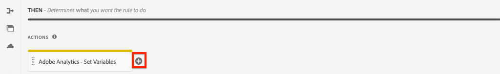

# Suivre les éléments cliqués avec Adobe Analytics

>[!NOTE]
>
>Adobe Experience Platform Launch a été rebaptisé en tant que suite de technologies de collecte de données dans Adobe Experience Platform. Plusieurs modifications terminologiques ont par conséquent été apportées à la documentation du produit. Reportez-vous aux [document](https://experienceleague.adobe.com/docs/experience-platform/tags/term-updates.html) pour une référence consolidée des modifications terminologiques.

Utilisation de l’événement [Adobe de la couche de données client avec les composants principaux AEM](https://experienceleague.adobe.com/docs/experience-manager-core-components/using/developing/data-layer/overview.html?lang=fr) pour effectuer le suivi des clics sur des composants spécifiques d’un site Adobe Experience Manager. Découvrez comment utiliser des règles dans la propriété de balise pour écouter les événements de clic, filtrer par composant et envoyer les données à une Adobe Analytics avec une balise de lien de suivi.

## Ce que vous allez construire {#what-build}

L’équipe marketing WKND s’intéresse à savoir laquelle `Call to Action (CTA)` les boutons sont les plus performants sur la page d’accueil. Dans ce tutoriel, ajoutons une règle à la propriété de balise qui écoute les `cmp:click` des événements de **Teaser** et **Bouton** composants. Ensuite, envoyez l’identifiant du composant et un nouvel événement à Adobe Analytics à côté de la balise de lien de suivi.


### Objectifs {#objective}

1. Créez une règle pilotée par un événement dans la propriété de balise qui capture la variable `cmp:click` .
1. Filtrez les différents événements par type de ressource de composant.
1. Définissez l’identifiant du composant et envoyez un événement à Adobe Analytics avec la balise de lien de suivi.

## Conditions préalables

Ce tutoriel est une suite [Collecte de données de page avec Adobe Analytics](./collect-data-analytics.md) et suppose que vous avez :

* A **Propriété de balise** avec le [Extension Adobe Analytics](https://experienceleague.adobe.com/docs/experience-platform/tags/extensions/client/analytics/overview.html?lang=fr) enabled
* **Adobe Analytics** identifiant de suite de rapports test/dev et serveur de suivi. Consultez la documentation suivante pour [création d’une suite de rapports](https://experienceleague.adobe.com/docs/analytics/admin/admin-tools/manage-report-suites/c-new-report-suite/new-report-suite.html).
* [Débogueur Experience Platform](https://experienceleague.adobe.com/docs/platform-learn/data-collection/debugger/overview.html) l’extension de navigateur configurée avec votre propriété de balise chargée sur la propriété [Site WKND](https://wknd.site/us/en.html) ou un site AEM avec la couche de données d’Adobe activée.

## Inspect du schéma de bouton et de teaser

Avant de créer des règles dans la propriété de balise, il est utile de consulter la section [schéma du bouton et du teaser](https://experienceleague.adobe.com/docs/experience-manager-core-components/using/developing/data-layer/overview.html#item) et inspectez-les dans l’implémentation de la couche de données.

1. Accédez à [Page d’accueil WKND](https://wknd.site/us/en.html)
1. Ouvrez les outils de développement du navigateur et accédez au **Console**. Exécutez la commande suivante :

   ```js
   adobeDataLayer.getState();
   ```

   Le code ci-dessus renvoie l’état actuel de la couche de données client Adobe.

   

1. Développez la réponse et recherchez les entrées affectées du préfixe `button-` et  `teaser-xyz-cta` entrée . Vous devriez voir un schéma de données comme suit :

   Schéma de bouton :

   ```json
   button-2e6d32893a:
       @type: "wknd/components/button"
       dc:title: "View All"
       parentId: "page-2eee4f8914"
       repo:modifyDate: "2020-07-11T22:17:55Z"
       xdm:linkURL: "/content/wknd/us/en/magazine.html"
   ```

   Schéma du teaser :

   ```json
   teaser-da32481ec8-cta-adf3c09db9:
       @type: "wknd/components/teaser/cta"
       dc:title: "Surf's Up"
       parentId: "teaser-da32481ec8"
       xdm:linkURL: "/content/wknd/us/en/magazine/san-diego-surf.html"
   ```

   Les détails des données ci-dessus sont basés sur la variable [Schéma d’élément de composant/conteneur](https://experienceleague.adobe.com/docs/experience-manager-core-components/using/developing/data-layer/overview.html#item). La nouvelle règle de balise utilise ce schéma.

## Créer une règle CTA sur laquelle un utilisateur a cliqué

La couche de données client Adobe est une **event** couche de données pilotée. Chaque fois qu’un composant principal fait l’objet d’un clic sur une `cmp:click` est distribué via la couche de données. Pour écouter le `cmp:click` , créons une règle .

1. Accédez à Experience Platform et à la propriété de balise intégrée au site AEM.
1. Accédez au **Règles** dans l’interface utilisateur de la propriété de balise, puis cliquez sur **Ajouter une règle**.
1. Attribuer un nom à la règle **CTA cliqué**.
1. Cliquez sur **Événements** > **Ajouter** pour ouvrir le **Configuration d’événement** assistant.
1. Pour **Type d’événement** champ, sélectionnez **Code personnalisé**.

   

1. Cliquez sur **Ouvrir l’éditeur** dans le panneau principal et saisissez le fragment de code suivant :

   ```js
   var componentClickedHandler = function(evt) {
      // defensive coding to avoid a null pointer exception
      if(evt.hasOwnProperty("eventInfo") && evt.eventInfo.hasOwnProperty("path")) {
         //trigger Tag Rule and pass event
         console.debug("cmp:click event: " + evt.eventInfo.path);
         var event = {
            //include the path of the component that triggered the event
            path: evt.eventInfo.path,
            //get the state of the component that triggered the event
            component: window.adobeDataLayer.getState(evt.eventInfo.path)
         };
   
         //Trigger the Tag Rule, passing in the new `event` object
         // the `event` obj can now be referenced by the reserved name `event` by other Tag Property data elements
         // i.e `event.component['someKey']`
         trigger(event);
      }
   }
   
   //set the namespace to avoid a potential race condition
   window.adobeDataLayer = window.adobeDataLayer || [];
   //push the event listener for cmp:click into the data layer
   window.adobeDataLayer.push(function (dl) {
      //add event listener for `cmp:click` and callback to the `componentClickedHandler` function
      dl.addEventListener("cmp:click", componentClickedHandler);
   });
   ```

   Le fragment de code ci-dessus ajoute un écouteur d’événement par [publication d’une fonction](https://github.com/adobe/adobe-client-data-layer/wiki#pushing-a-function) dans la couche de données. Lorsque la variable `cmp:click` est déclenché. `componentClickedHandler` est appelée. Dans cette fonction, quelques contrôles d’intégrité sont ajoutés et un nouveau `event` est créé avec la dernière [état de la couche de données](https://github.com/adobe/adobe-client-data-layer/wiki#getstate) pour le composant qui a déclenché l’événement.

   Enfin, le `trigger(event)` est appelée. Le `trigger()` est un nom réservé dans la propriété tag et il **triggers** la règle. Le `event` est transmis en tant que paramètre qui, à son tour, est exposé par un autre nom réservé dans la propriété tag . Les éléments de données de la propriété de balise peuvent désormais référencer diverses propriétés à l’aide d’un fragment de code comme `event.component['someKey']`.

1. Enregistrez les modifications.
1. Suivant sous **Actions** click **Ajouter** pour ouvrir le **Configuration d’action** assistant.
1. Pour **Type d’action** champ, choisissez **Code personnalisé**.

   

1. Cliquez sur **Ouvrir l’éditeur** dans le panneau principal et saisissez le fragment de code suivant :

   ```js
   console.debug("Component Clicked");
   console.debug("Component Path: " + event.path);
   console.debug("Component type: " + event.component['@type']);
   console.debug("Component text: " + event.component['dc:title']);
   ```

   Le `event` est transmis à partir de `trigger()` appelée dans l’événement personnalisé. Le `component` est l’état actuel du composant dérivé de la couche de données. `getState()` et est l’élément qui a déclenché le clic.

1. Enregistrez les modifications et exécutez une [build](https://experienceleague.adobe.com/docs/experience-platform/tags/publish/builds.html) dans la propriété tag pour promouvoir le code vers la propriété [environnement](https://experienceleague.adobe.com/docs/experience-platform/tags/publish/environments/environments.html?lang=fr) utilisé sur votre site AEM.

   >[!NOTE]
   >
   > Il peut s’avérer utile d’utiliser la variable [Débogueur Adobe Experience Platform](https://experienceleague.adobe.com/docs/platform-learn/data-collection/debugger/overview.html) pour changer le code incorporé en **Développement** environnement.

1. Accédez au [Site WKND](https://wknd.site/us/en.html) et ouvrez les outils de développement pour afficher la console. Sélectionnez également le **Conserver le journal** .

1. Cliquez sur l’une des **Teaser** ou **Bouton** Boutons CTA pour accéder à une autre page.

   

1. Observez dans la console de développement que la variable **CTA cliqué** a été déclenchée :

   

## Création d’éléments de données

Créez ensuite un élément de données pour capturer l’identifiant et le titre du composant sur lequel l’utilisateur a cliqué. Rappelez dans l’exercice précédent le résultat de `event.path` était similaire à `component.button-b6562c963d` et la valeur de `event.component['dc:title']` C’était un peu comme &quot;View Trips&quot;.

### Identifiant du composant

1. Accédez à Experience Platform et à la propriété de balise intégrée au site AEM.
1. Accédez au **Éléments de données** et cliquez sur **Ajouter un élément de données**.
1. Pour **Nom** champ, entrer **Identifiant du composant**.
1. Pour **Type d’élément de données** champ, sélectionnez **Code personnalisé**.

   

1. Cliquez sur **Ouvrir l’éditeur** et saisissez ce qui suit dans l’éditeur de code personnalisé :

   ```js
   if(event && event.path && event.path.includes('.')) {
       // split on the `.` to return just the component ID
       return event.path.split('.')[1];
   }
   ```

1. Enregistrez les modifications.

   >[!NOTE]
   >
   > Rappelez-vous que la variable `event` est rendu disponible et défini sur la portée en fonction de l’événement qui a déclenché la variable **Règle** dans la propriété de balise. La valeur d’un élément de données n’est pas définie tant que l’élément de données n’est pas *référencé* dans une règle. Par conséquent, il est sans risque d’utiliser cet élément de données dans une règle comme la variable **Page chargée** règle créée à l’étape précédente *mais* ne serait pas utilisable en toute sécurité dans d’autres contextes.


### Titre du composant

1. Accédez au **Éléments de données** et cliquez sur **Ajouter un élément de données**.
1. Pour **Nom** champ, entrer **Titre du composant**.
1. Pour **Type d’élément de données** champ, sélectionnez **Code personnalisé**.
1. Cliquez sur **Ouvrir l’éditeur** et saisissez ce qui suit dans l’éditeur de code personnalisé :

   ```js
   if(event && event.component && event.component.hasOwnProperty('dc:title')) {
       return event.component['dc:title'];
   }
   ```

1. Enregistrez les modifications.

## Ajouter une condition à la règle Cliqué CTA

Mettez ensuite à jour la variable **CTA cliqué** afin de s’assurer que la règle ne se déclenche que lorsque la variable `cmp:click` est déclenché pour un événement **Teaser** ou **Bouton**. Puisque le CTA du teaser est considéré comme un objet distinct dans la couche de données, il est important de vérifier le parent pour vérifier qu’il provient d’un teaser.

1. Dans l’interface utilisateur de la propriété de balise, accédez au **CTA cliqué** règle créée précédemment.
1. Sous **Conditions** click **Ajouter** pour ouvrir le **Configuration de condition** assistant.
1. Pour **Type de condition** champ, sélectionnez **Code personnalisé**.

   

1. Cliquez sur **Ouvrir l’éditeur** et saisissez ce qui suit dans l’éditeur de code personnalisé :

   ```js
   if(event && event.component && event.component.hasOwnProperty('@type')) {
       // console.log("Event Type: " + event.component['@type']);
       //Check for Button Type OR Teaser CTA type
       if(event.component['@type'] === 'wknd/components/button' ||
          event.component['@type'] === 'wknd/components/teaser/cta') {
           return true;
       }
   }
   
   // none of the conditions are met, return false
   return false;
   ```

   Le code ci-dessus vérifie d’abord si le type de ressource provient d’une **Bouton** ou si le type de ressource provient d’une CTA au sein d’une **Teaser**.

1. Enregistrez les modifications.

## Définition des variables Analytics et déclenchement de la balise Lien de suivi

Actuellement, la variable **CTA cliqué** génère simplement une instruction console. Ensuite, utilisez les éléments de données et l’extension Analytics pour définir les variables Analytics en tant que **action**. Définissons également une action supplémentaire pour déclencher la variable **Suivi du lien** et envoyer les données collectées à Adobe Analytics.

1. Dans le **CTA cliqué** règle, **remove** la valeur **Core - Code personnalisé** action (les instructions de la console) :

   

1. Sous Actions, cliquez sur **Ajouter** pour créer une action.
1. Définissez la variable **Extension** saisir **Adobe Analytics** et définissez la variable **Type d’action** to  **Définition de variables**.

1. Définissez les valeurs suivantes pour **eVars**, **Propriétés**, et **Événements**:

   * `evar8` - `%Component ID%`
   * `prop8` - `%Component ID%`
   * `event8`

   

   >[!NOTE]
   >
   > Ici `%Component ID%` est utilisé, car il garantit un identifiant unique pour l’CTA sur lequel l’utilisateur a cliqué. Un inconvénient potentiel de l’utilisation de `%Component ID%` est que le rapport Analytics contient des valeurs telles que `button-2e6d32893a`. En utilisant la variable `%Component Title%` donnerait un nom plus humain, mais la valeur pourrait ne pas être unique.

1. Ajoutez ensuite une action supplémentaire à droite du **Adobe Analytics - Définition de variables** en appuyant sur le bouton **plus** icon :

   

1. Définissez la variable **Extension** saisir **Adobe Analytics** et définissez la variable **Type d’action** to  **Envoyer la balise**.
1. Sous **Tracking** Définir le bouton radio sur **`s.tl()`**.
1. Pour **Type de lien** champ, choisissez **Lien personnalisé** et **Nom du lien** définissez la valeur sur : **`%Component Title%: CTA Clicked`**:

   

   La configuration ci-dessus combine la variable dynamique à partir de l’élément de données. **Titre du composant** et la chaîne statique **CTA cliqué**.

1. Enregistrez les modifications. Le **CTA cliqué** doit maintenant avoir la configuration suivante :

   

   * **1.** Écoute de la `cmp:click` .
   * **2.** Vérifiez que l’événement a été déclenché par une **Bouton** ou **Teaser**.
   * **3.** Définissez les variables Analytics pour effectuer le suivi de la variable **Identifiant du composant** as a **eVar**, **prop** et un **event**.
   * **4.** Envoyez la balise de lien de suivi Analytics (et procédez comme suit : **not** le traiter comme une page vue).

1. Enregistrez toutes les modifications et créez votre bibliothèque de balises, en effectuant la promotion vers l’environnement approprié.

## Validation de la balise de lien de suivi et de l’appel Analytics

Maintenant que la variable **CTA cliqué** envoie la balise Analytics. Vous devriez pouvoir voir les variables de suivi Analytics à l’aide du débogueur Experience Platform.

1. Ouvrez le [Site WKND](https://wknd.site/us/en.html) dans votre navigateur.
1. Cliquez sur l’icône Debugger .  pour ouvrir le débogueur Experience Platform.
1. Assurez-vous que le débogueur mappe la propriété de balise à *your* Environnement de développement, comme décrit précédemment et **Journalisation de la console** est cochée.
1. Ouvrez le menu Analytics et vérifiez que la suite de rapports est définie sur *your* suite de rapports.

   

1. Dans le navigateur, cliquez sur l’une des **Teaser** ou **Bouton** Boutons CTA pour accéder à une autre page.

   

1. Revenez au débogueur Experience Platform, faites défiler l’écran vers le bas et développez . **Requêtes réseau** > *Votre suite de rapports*. Vous devriez être en mesure de trouver la variable **eVar**, **prop**, et **event** définie.

   

1. Revenez au navigateur et ouvrez la console de développement. Accédez au pied de page du site et cliquez sur l’un des liens de navigation :

   

1. Observez le message dans la console du navigateur. *&quot;Code personnalisé&quot; pour la règle &quot;CTA cliqué&quot; n’a pas été respectée*.

   Le message ci-dessus est dû au fait que le composant Navigation déclenche une `cmp:click` event *mais* en raison de [Condition à la règle](#add-a-condition-to-the-cta-clicked-rule) qui vérifie le type de ressource sans action.

   >[!NOTE]
   >
   > Si vous ne voyez aucun journal de la console, assurez-vous que **Journalisation de la console** est coché sous **Balises Experience Platform** dans le débogueur Experience Platform.

## Félicitations.

Vous venez d’utiliser la couche de données client et la balise Adobe pilotée par l’événement dans Experience Platform pour effectuer le suivi des clics sur des composants spécifiques d’un site AEM.
