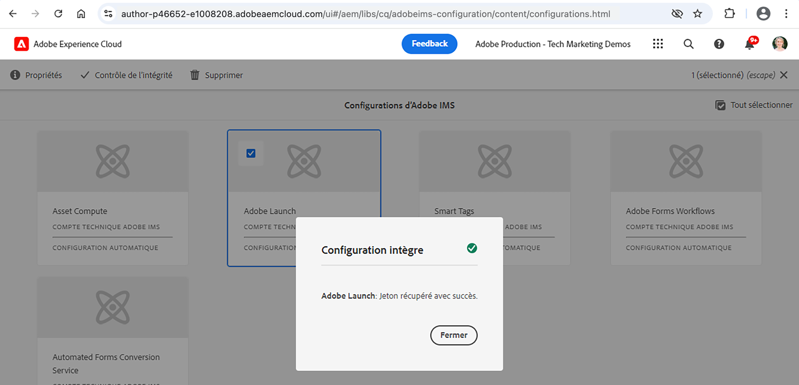

# Connexion d’AEM avec la propriété de balise à l’aide d’IMS{#connect-aem-and-tag-property-using-ims}

>[!NOTE]
>
>Le processus de changement de nom d’Adobe Experience Platform Launch en tant qu’ensemble de technologies de collecte de données est en cours de mise en oeuvre dans l’interface utilisateur, le contenu et la documentation d’AEM produit. Par conséquent, le terme Launch est toujours utilisé ici.

Découvrez comment connecter AEM avec la propriété de balise à l’aide de la configuration IMS (système Identity Management) dans AEM. Cette configuration authentifie AEM avec l’API Launch et permet à AEM de communiquer via les API Launch pour accéder aux propriétés de balise.

## Création ou réutilisation d’une configuration IMS

La configuration IMS à l’aide du projet de console Adobe Developer est requise pour intégrer AEM à la propriété de balise nouvellement créée. Cette configuration permet à AEM de communiquer avec l’application Balises à l’aide des API de Launch et IMS gère l’aspect sécurité de cette intégration.

Chaque fois qu’un AEM en tant qu’environnement de Cloud Service est configuré, quelques configurations IMS telles que Asset compute, Adobe Analytics et Adobe Launch sont automatiquement créées. La création automatique **Adobe Launch** La configuration IMS peut être utilisée ou une nouvelle configuration IMS doit être créée si vous utilisez AEM environnement 6.X.

Vérification créée automatiquement **Adobe Launch** Configuration IMS à l’aide des étapes suivantes.

1. Dans AEM, ouvrez le menu **Outils**

1. Dans la section Sécurité , sélectionnez Configurations d’Adobe IMS.

1. Sélectionnez la **Adobe Launch** carte et clic **Propriétés**, passez en revue les détails de la section **Certificat** et **Compte** onglets. Cliquez ensuite sur **Annuler** pour renvoyer sans modifier les détails créés automatiquement.

1. Sélectionnez la **Adobe Launch** et cette fois-ci, cliquez sur **Contrôle de l’intégrité**, vous devriez voir le **Succès** comme ci-dessous.

   

## Étapes suivantes

[Création d’une configuration de Cloud Service Launch dans AEM](create-aem-launch-cloud-service.md)
