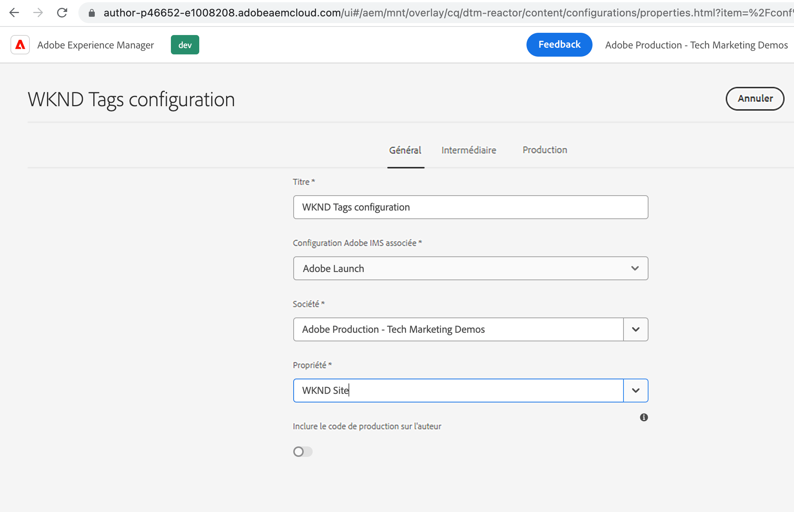
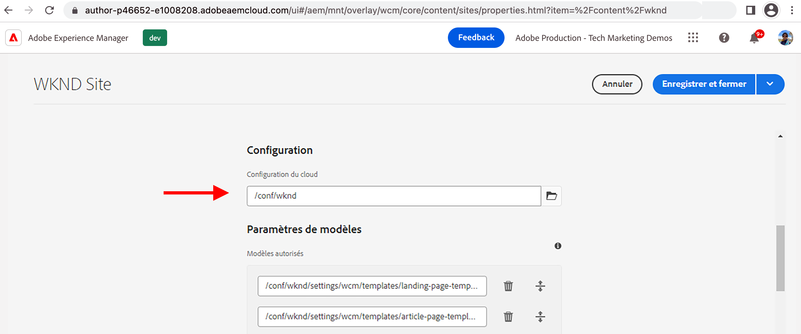
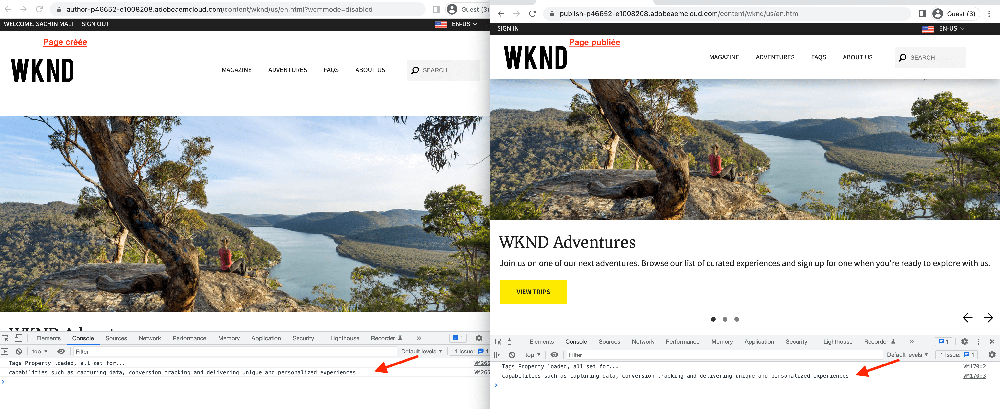

# Création d’une configuration de Cloud Service Launch dans AEM {#create-launch-cloud-service}

>[!NOTE]
>
>Le processus de changement de nom d’Adobe Experience Platform Launch en tant qu’ensemble de technologies de collecte de données est en cours de mise en oeuvre dans l’interface utilisateur, le contenu et la documentation d’AEM produit. Par conséquent, le terme Launch est toujours utilisé ici.

Découvrez comment créer une configuration de Cloud Service Launch dans Adobe Experience Manager. AEM configuration du Cloud Service Launch peut ensuite être appliquée à un site existant et le chargement des bibliothèques de balises peut être observé dans les environnements Auteur et Publication.

## Création du service cloud Launch

Créez la configuration du service cloud de Launch en suivant les étapes ci-dessous.

1. Dans la **Outils** menu, sélectionnez **Cloud Services** et cliquez sur **Adobe les configurations Launch**

1. Sélectionnez le dossier de configuration de votre site ou sélectionnez **Site WKND** (si vous utilisez le projet de guide WKND), puis cliquez sur **Créer**

1. Dans la _Général_ , nommez votre configuration à l’aide de l’onglet **Titre** et sélectionnez **Adobe Launch** de la _Configuration Adobe IMS associée_ menu déroulant. Sélectionnez ensuite le nom de votre société dans le _Société_ dans le menu déroulant, sélectionnez la propriété créée précédemment à partir de _Propriété_ menu déroulant.

1. Dans la _Évaluation_ et _Production_ conservez les configurations par défaut. Toutefois, il est recommandé de revoir et de modifier les configurations pour la configuration de production réelle, en particulier le _Chargement asynchrone de la bibliothèque_ bascule en fonction de vos exigences de performances et d’optimisation. Notez également que la variable _URI de bibliothèque_ est différente pour l’évaluation et la production.

1. Enfin, cliquez sur **Créer** pour terminer les services cloud de Launch.

   

## Application du service cloud Launch au site

Pour charger la propriété Tag et ses bibliothèques sur le site AEM, la configuration du service cloud de Launch est appliquée au site. À l’étape précédente, la configuration du service cloud est créée sous le dossier du nom du site (site WKND). Elle doit donc être appliquée automatiquement. Vérifiez-la.

1. Dans la **Navigation** menu, sélectionnez **Sites** icône .

1. Sélectionnez la page racine du site AEM, puis cliquez sur **Propriétés**. Ensuite, accédez au **Avancé** sous **Configuration** , vérifiez que la valeur de configuration du cloud pointe vers votre site spécifique. `conf` dossier.

   

## Vérification du chargement de la propriété de balise sur les pages de création et de publication

Il est maintenant temps de vérifier que la propriété Tag et ses bibliothèques sont chargées sur la page de site AEM.

1. Ouvrez votre page de site préférée dans la **Afficher comme publié(e)** , dans la console du navigateur, le message du journal doit s’afficher. Il s’agit du même message provenant du fragment de code JavaScript de la règle de propriété de balise qui est déclenché lorsque _Bibliothèque chargée (Haut de page)_ est déclenché.

1. Pour vérifier lors de la publication, commencez par publier votre **Service cloud de Launch** et ouvrez la page du site sur l’instance de publication.

   

Félicitations ! Vous avez terminé l’intégration AEM et de la balise de collecte de données qui injecte du code JavaScript dans votre site AEM sans mettre à jour le code de projet d’AEM.

## Défi : mettre à jour et publier la règle dans la propriété Tag

Tirer parti des leçons apprises lors des précédentes [Création d’une propriété de balise](./create-tag-property.md) pour relever le défi simple, mettez à jour la règle existante afin d’ajouter une instruction de console supplémentaire et d’utiliser _Flux de publication_ déployez-le sur le site AEM.

## Étapes suivantes

[Débogage d’une implémentation de balises](debug-tags-implementation.md)
