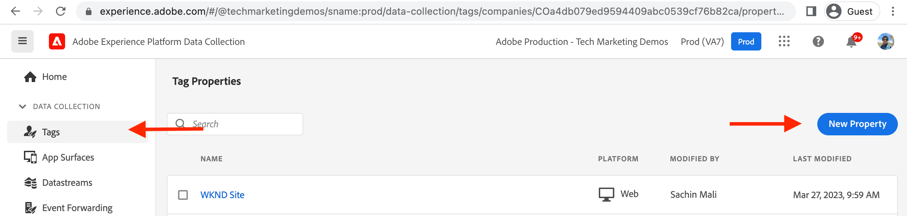

# Création d’une propriété de balise {#create-tag-property}

Découvrez comment créer une propriété Tag avec la configuration minimale à intégrer à Adobe Experience Manager. Les utilisateurs découvrent l’interface utilisateur des balises et découvrent les extensions, les règles et les workflows de publication.

>[!VIDEO](https://video.tv.adobe.com/v/38553?quality=12&learn=on)

## Création de propriétés de balise

Pour créer une propriété Tag, procédez comme suit.

1. Dans le navigateur, accédez au [Accueil de Adobe Experience Cloud](https://experience.adobe.com/) et connectez-vous à l’aide de votre Adobe ID.

1. Cliquez sur le bouton **Collecte de données** de l’application _Accès rapide_ de la page d’accueil de Adobe Experience Cloud.

1. Cliquez sur le bouton **Balises** dans le volet de navigation de gauche, puis cliquez sur **Nouvelle propriété** dans le coin supérieur droit.

1. Nommez votre propriété Tag à l’aide du **Nom** champ obligatoire. Pour le champ Domaines , saisissez votre nom de domaine ou, si vous utilisez AEM environnement as a Cloud Service, saisissez `adobeaemcloud.com` et cliquez sur **Enregistrer**.

   

## Création d’une règle

Ouvrez la propriété Tag nouvellement créée en cliquant sur son nom dans le **Propriétés de balise** vue. Également sous _Mon activité récente_ vous devriez constater que l’extension Core y a été ajoutée. L’extension de balise Core est l’extension par défaut et fournit les types d’événements fondamentaux tels que le chargement de la page, le navigateur, les formulaires et d’autres types d’événements, voir [Présentation de l’extension Core](https://experienceleague.adobe.com/docs/experience-platform/tags/extensions/client/core/overview.html) pour plus d’informations.

Les règles vous permettent de spécifier ce qui doit se produire lorsque le visiteur interagit avec votre site AEM. Pour simplifier les choses, consignons deux messages dans la console du navigateur afin de démontrer comment l’intégration de balises de collecte de données peut injecter du code JavaScript dans votre site AEM sans mettre à jour AEM code du projet.

Pour créer une règle, procédez comme suit.

1. Cliquez sur **Règles** de la _CRÉATION_ de la navigation de gauche, puis cliquez sur **Créer une règle**

1. Nommez votre règle à l’aide de la variable **Nom** champ obligatoire.

1. Cliquez sur **Ajouter** de la _ÉVÉNEMENTS_ , puis dans la section _Configuration d’événement_ formulaire, dans la variable **Type d’événement** menu déroulant _Bibliothèque chargée (Haut de page)_ et cliquez sur **Conserver les modifications**.

1. Cliquez sur **Ajouter** de la _ACTIONS_ , puis dans la section _Configuration d’action_ formulaire, dans la variable **Type d’action** menu déroulant _Code personnalisé_ et cliquez sur **Ouvrir l’éditeur**.

1. Dans le _Modifier le code_ modale, saisissez le fragment de code JavaScript suivant, puis cliquez sur **Enregistrer**, puis cliquez sur **Conserver les modifications**.

   ```javascript
   console.log('Tags Property loaded, all set for...');
   console.log('capabilities such as capturing data, conversion tracking and delivering unique and personalized experiences');
   ```

1. Cliquez sur **Enregistrer** pour terminer le processus de création de règle.

   

## Ajouter une bibliothèque et la publier

La propriété Tag _Règles_ sont activées à l’aide d’une bibliothèque ; considérez la bibliothèque comme un module contenant du code JavaScript. Activez la règle nouvellement créée en suivant les étapes.

1. Cliquez sur **Flux de publication** de la _PUBLICATION_ de la navigation de gauche, puis cliquez sur **Ajouter une bibliothèque**

1. Nommez votre bibliothèque à l’aide de la fonction **Nom** champ et sélectionnez _Development(development)_ option pour **Environnement** menu déroulant.

1. Pour sélectionner toutes les ressources modifiées depuis la création de la propriété Tag, cliquez sur **+ Ajouter toutes les ressources modifiées**. Cette action ajoute la règle nouvellement créée et la ressource d’extension principale à la bibliothèque . Cliquez sur **Enregistrement et création pour le développement**.

1. Une fois la bibliothèque créée pour la **Développement** piste de nage, utilisation _ellipses_ sélectionnez la variable **Envoyer pour approbation**

1. Ensuite, dans le **Envoyé** piste de nage utilisant _ellipses_ sélectionnez la variable **Approuver pour publication**, également **Créer et publier dans l’environnement de production** dans le **Approuvé** piste de nage.


L’étape ci-dessus complète la création simple de la propriété Tag qui comporte une règle pour consigner un message dans la console du navigateur lorsque la page est chargée. La règle et l’extension Core sont également publiées en créant une bibliothèque .

## Étapes suivantes

[Connexion d’AEM avec la propriété de balise à l’aide d’IMS](connect-aem-tag-property-using-ims.md)


## Ressources supplémentaires {#additional-resources}

* [Création d’une propriété de balise](https://experienceleague.adobe.com/docs/platform-learn/implement-in-websites/configure-tags/create-a-property.html)
