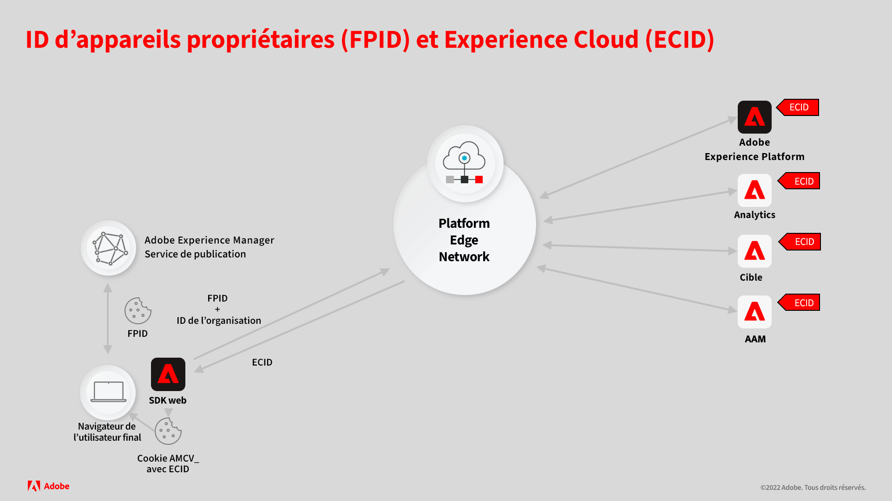
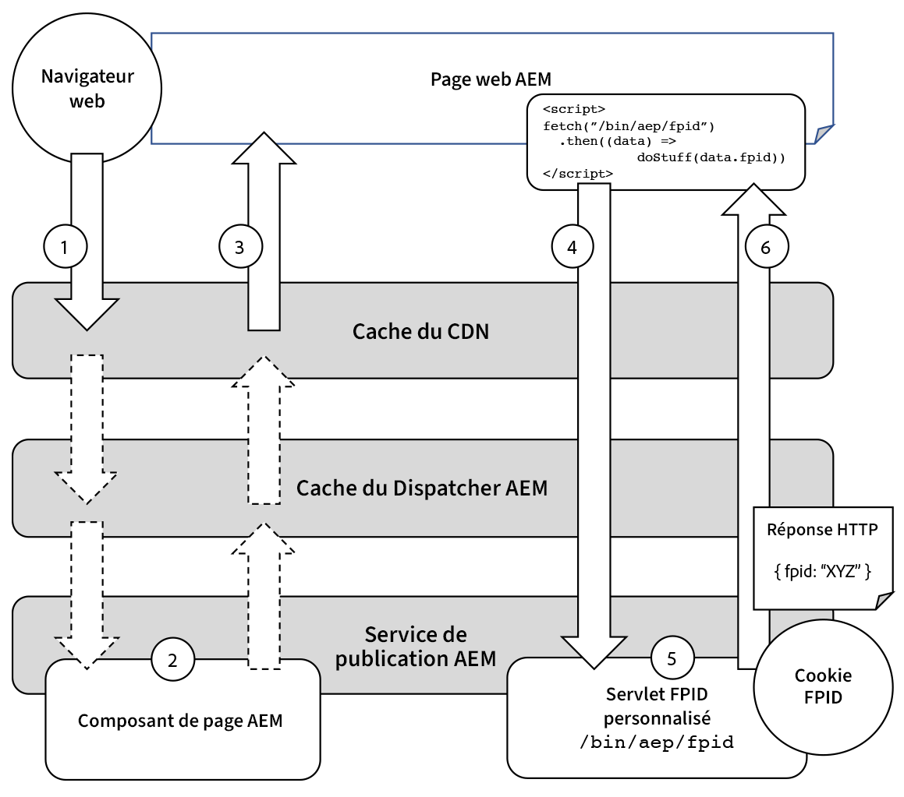

# Générer des FPID Experience Platform avec AEM Sites

Pour intégrer Adobe Experience Manager (AEM) Sites à Adobe Experience Platform (AEP), AEM doit générer et gérer un cookie FPID unique (identifiant d’appareil propriétaire) afin de suivre de manière unique l’activité des utilisateurs et utilisatrices.

Lisez la documentation de support pour [découvrir les détails du fonctionnement conjoint des identifiants d’appareil propriétaire et des identifiants Experience Cloud](https://experienceleague.adobe.com/docs/platform-learn/data-collection/edge-network/generate-first-party-device-ids.html?lang=fr).

Vous trouverez ci-dessous un aperçu du fonctionnement des FPID lors de l’utilisation d’AEM comme hôte web.



## Générer et conserver le FPID avec AEM

Le service de publication AEM optimise les performances en mettant en cache autant de requêtes que possible dans les caches du réseau CDN et du Dispatcher AEM.

Il est impératif que les requêtes HTTP qui génèrent le cookie FPID unique par utilisateur ou utilisatrice et renvoient la valeur FPID ne soient jamais mises en cache et diffusées directement depuis le service de publication AEM, qui peut implémenter la logique pour garantir l’unicité.

Évitez de générer le cookie FPID sur les demandes de pages web ou d’autres ressources pouvant être mises en cache, car la combinaison de l’exigence d’unicité du FPID rendrait ces ressources impossibles à mettre en cache.

Le diagramme suivant décrit la manière dont le service de publication AEM gère les FPID.



1. Le navigateur web demande une page web hébergée par AEM. La demande peut être diffusée à l’aide d’une copie mise en cache de la page web du cache du réseau CDN ou du cache du Dispatcher AEM.
1. Si la page web ne peut pas être diffusée à partir des caches du réseau CDN ou du Dispatcher AEM, la requête atteint le service de publication AEM et celui-ci génère la page web demandée.
1. La page web est alors renvoyée au navigateur web, remplissant les caches qui n’ont pas pu servir la requête. Avec AEM, attendez-vous à ce que le taux d’accès au cache du réseau CDN et du Dispatcher AEM soit supérieur à 90 %.
1. La page web contient du code JavaScript qui effectue une requête XHR (AJAX) asynchrone impossible à mettre en cache vers un servlet FPID personnalisé dans le service de publication AEM. Puisqu’il s’agit d’une requête impossible à mettre en cache (en raison de son paramètre de requête aléatoire et de ses en-têtes Cache-Control), elle n’est jamais mise en cache par le réseau CDN ou le Dispatcher AEM et atteint toujours le service de publication AEM pour générer la réponse.
1. Le servlet FPID personnalisé du service de publication AEM traite la demande, en générant un nouveau FPID lorsqu’aucun cookie FPID existant n’est trouvé ou en prolongeant la durée de vie de tout cookie FPID existant. Le servlet renvoie également le FPID dans le corps de la réponse pour une utilisation par JavaScript côté client. Heureusement, la logique du servlet FPID personnalisé est légère, ce qui empêche cette requête d’affecter les performances du service de publication AEM.
1. La réponse pour la requête XHR est envoyée au navigateur avec le cookie FPID et le FPID au format JSON dans le corps de la réponse pour être utilisée par le SDK web Platform.

## Exemple de code

Le code et la configuration suivants peuvent être déployés vers le service de publication AEM pour créer un point d’entrée qui génère ou prolonge la durée de vie d’un cookie FPID existant et renvoie le FPID au format JSON.

### Servlet de cookie FPID AEM

Un point d’entrée HTTP AEM doit être créé pour générer ou prolonger un cookie FPID à l’aide d’un [servlet Sling](https://sling.apache.org/documentation/the-sling-engine/servlets.html#registering-a-servlet-using-java-annotations-1).

+ Le servlet est lié à `/bin/aem/fpid`, car l’authentification n’est pas requise pour y accéder. Si une authentification est requise, liez-vous à un type de ressource Sling.
+ Le servlet accepte les requêtes GET HTTP. La réponse est marquée par `Cache-Control: no-store` pour empêcher la mise en cache, mais ce point d’entrée doit également être demandé en utilisant des paramètres uniques de requête de contournement de la mémoire cache.

Lorsqu’une requête HTTP atteint le servlet, ce dernier vérifie si un cookie FPID existe sur la requête :

+ Si oui, étendez la durée de vie du cookie et collectez sa valeur pour écrire dans la réponse.
+ Si ce n’est pas le cas, générez un nouveau cookie FPID et enregistrez la valeur pour écrire dans la réponse.

Le servlet écrit ensuite le FPID à la réponse en tant qu’objet JSON dans le formulaire : `{ fpid: "<FPID VALUE>" }`.

Il est important de fournir le FPID au client ou à la cliente dans le corps puisque le cookie FPID est marqué `HttpOnly`, ce qui signifie que seul le serveur peut lire sa valeur et que JavaScript côté client ne peut pas le faire.

La valeur FPID du corps de la réponse est utilisée pour paramétrer les appels à l’aide du SDK web Platform.

Vous trouverez ci-dessous un exemple de code d’un point d’entrée de servlet AEM (disponible via `HTTP GET /bin/aep/fpid`) qui génère ou actualise un cookie FPID et renvoie le FPID au format JSON.

+ `core/src/main/java/com/adobe/aem/guides/wkndexamples/core/aep/impl/FpidServlet.java`

```java
package com.adobe.aem.guides.wkndexamples.core.aep.impl;

import com.google.gson.JsonObject;
import org.apache.sling.api.SlingHttpServletRequest;
import org.apache.sling.api.SlingHttpServletResponse;
import org.apache.sling.api.servlets.SlingAllMethodsServlet;
import org.osgi.service.component.annotations.Component;
import org.slf4j.Logger;
import org.slf4j.LoggerFactory;

import javax.servlet.Servlet;
import javax.servlet.http.Cookie;
import java.io.IOException;
import java.util.UUID;

import static org.apache.sling.api.servlets.ServletResolverConstants.SLING_SERVLET_PATHS;
import static org.apache.sling.api.servlets.ServletResolverConstants.SLING_SERVLET_METHODS;

@Component(
        service = {Servlet.class},
        property = {
                SLING_SERVLET_PATHS + "=/bin/aep/fpid",
                SLING_SERVLET_METHODS + "=GET"
        }
)
public class FpidServlet extends SlingAllMethodsServlet {
    private static final Logger log = LoggerFactory.getLogger(FpidServlet.class);
    private static final String COOKIE_NAME = "FPID";
    private static final String COOKIE_PATH = "/";
    private static final int COOKIE_MAX_AGE = 60 * 60 * 24 * 30 * 13;
    private static final String JSON_KEY = "fpid";

    @Override
    protected final void doGet(SlingHttpServletRequest request, SlingHttpServletResponse response) throws IOException {
        // Try to get an existing FPID cookie, this will give us the user's current FPID if it exists
        final Cookie existingCookie = request.getCookie(COOKIE_NAME);

        String cookieValue;

        if (existingCookie == null) {
            //  If no FPID cookie exists, Create a new FPID UUID
            cookieValue = UUID.randomUUID().toString();
        } else {
            // If a FPID cookie exists. get its FPID UUID so it's life can be extended
            cookieValue = existingCookie.getValue();
        }

        // Add the newly generate FPID value, or the extended FPID value to the response
        // Use addHeader(..), as we need to set SameSite=Lax (and addCoookie(..) does not support this)
        response.addHeader("Set-Cookie",
                COOKIE_NAME + "=" + cookieValue + "; " +
                        "Max-Age=" + COOKIE_MAX_AGE + "; " +
                        "Path=" + COOKIE_PATH + "; " +
                        "HttpOnly; " +
                        "Secure; " +
                        "SameSite=Lax");
        
        // Avoid caching the response in any cache
        response.addHeader("Cache-Control", "no-store");

        // Since the FPID is HttpOnly, JavaScript cannot read it (only the server can)
        // Write the FPID to the response as JSON so client JavaScript can access it.
        final JsonObject json = new JsonObject();
        json.addProperty(JSON_KEY, cookieValue);
        
        // The JSON `{ fpid: "11111111-2222-3333-4444-55555555" }` is returned in the response
        response.setContentType("application/json");
        response.getWriter().write(json.toString());
    }
}
```

### Script HTML

Un script JavaScript personnalisé côté client doit être ajouté à la page pour appeler de manière asynchrone le servlet, générer ou actualiser le cookie FPID et renvoyer le FPID dans la réponse.

Ce script JavaScript est généralement ajouté à la page à l’aide de l’une des méthodes suivantes :

+ [Balises dans Adobe Experience Platform](https://experienceleague.adobe.com/docs/experience-platform/tags/home.html?lang=fr)
+ [Bibliothèque cliente AEM](https://experienceleague.adobe.com/docs/experience-manager-cloud-service/content/implementing/developing/full-stack/clientlibs.html?lang=fr)

L’appel XHR au servlet FPID d’AEM personnalisé est rapide, bien qu’asynchrone, de sorte qu’il est possible pour un utilisateur ou une utilisatrice de consulter une page web diffusée par AEM et de quitter le site avant que la requête ne puisse être terminée.
Si cela se produit, le même processus effectue une nouvelle tentative au chargement de la page suivante d’une page web à partir d’AEM.

La requête HTTP GET au servlet FPID AEM (`/bin/aep/fpid`) est configurée avec un paramètre de requête aléatoire afin de s’assurer que toute infrastructure entre le navigateur et le service de publication AEM ne met pas en cache la réponse de la requête.
De même, l’en-tête de requête `Cache-Control: no-store` est ajouté pour éviter la mise en cache.

Lors d’un appel du servlet FPID AEM, le FPID est récupéré à partir de la réponse JSON et utilisé par le [SDK web Platform](https://experienceleague.adobe.com/docs/platform-learn/implement-web-sdk/tags-configuration/install-web-sdk.html?lang=fr) pour l’envoyer aux API Experience Platform.

Pour plus d’informations sur l’[utilisation de FPID dans identityMap](https://experienceleague.adobe.com/docs/experience-platform/edge/identity/first-party-device-ids.html?lang=fr#identityMap), consultez la documentation d’Experience Platform.

```javascript
...
<script>
    // Invoke the AEM FPID servlet, and then do something with the response

    fetch(`/bin/aep/fpid?_=${new Date().getTime() + '' + Math.random()}`, { 
            method: 'GET',
            headers: {
                'Cache-Control': 'no-store'
            }
        })
        .then((response) => response.json())
        .then((data) => { 
            // Get the FPID from JSON returned by AEM's FPID servlet
            console.log('My FPID is: ' + data.fpid);

            // Send the `data.fpid` to Experience Platform APIs            
        });
</script>
```

### Filtre d’autorisation du Dispatcher

Enfin, les requêtes HTTP GET au servlet FPID personnalisé doivent être autorisées dans la configuration `filter.any` du Dispatcher AEM.

Si cette configuration du Dispatcher n’est pas implémentée correctement, les requêtes HTTP GET vers `/bin/aep/fpid` entraînent une erreur 404.

+ `dispatcher/src/conf.dispatcher.d/filters/filters.any`

```
/1099 { /type "allow" /method "GET" /url "/bin/aep/fpid" }
```

## Ressources Experience Platform

Consultez la documentation suivante d’Experience Platform pour en savoir plus sur les identifiants d’appareils propriétaires (FPID) et la gestion des données d’identité avec le SDK web Platform.

+ [Générer des identifiants d’appareil propriétaire](https://experienceleague.adobe.com/docs/platform-learn/data-collection/edge-network/generate-first-party-device-ids.html?lang=fr)
+ [Identifiants d’appareil propriétaire dans le SDK web Platform](https://experienceleague.adobe.com/docs/experience-platform/edge/identity/first-party-device-ids.html?lang=fr)
+ [Données d’identité dans le SDK web Platform](https://experienceleague.adobe.com/docs/experience-platform/edge/identity/overview.html?lang=fr)
