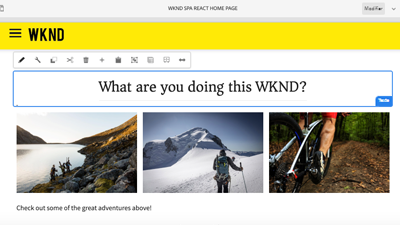

# Présentation {#overview}

Adobe Experience Manager (AEM) Sites est une plate-forme de gestion d’expérience de pointe. Ce guide d&#39;utilisation contient des vidéos et des didacticiels sur les nombreuses fonctionnalités et fonctionnalités d&#39;AEM Sites.

## Nouveautés

* **[Utilisation de lancements avec AEM Sites (vidéo)](./page-authoring/launches.md)**

   *Découvrez les lancements de sites AEM et comment ils peuvent être utilisés pour préparer le contenu d’un site Web en vue d’une prochaine version.*

* **[Personnaliser la couche de données du client Adobe avec les composants AEM (didacticiel)](./integrations/adobe-client-data-layer/data-layer-customize.md)**

   *Découvrez comment mettre à jour la couche de données du client Adobe avec le contenu des composants AEM personnalisés.*

* **[Prise en main de AEM GraphQL sans en-tête (didacticiel)](https://experienceleague.adobe.com/docs/experience-manager-learn/getting-started-with-aem-headless/graphql/overview.html?lang=fr)**

   *Comment exposer le contenu d’AEM à consommer par une application mobile native à l’aide des API AEM GraphQL.*

* **[Utilisation de fragments de contenu (série de vidéos)](./content-fragments/content-fragments-feature-video-use.md)**

   *Les fragments de contenu sont des éléments de contenu indépendants du canal qui peuvent être réutilisés.*

* **[Utilisation de SPA Editor (Vidéo)](./spa-editor/spa-editor-framework-feature-video-use.md)**

   *Découvrez les fonctionnalités d’édition AEM pour les applications d’une seule page (SPA).*

## Sélection du personnel

<table>
<tr>
  <td>
    
    

      <a href="https://docs.adobe.com/content/help/en/experience-manager-learn/getting-started-wknd-tutorial-develop/overview.html">
    <strong>Prise en main d’AEM Sites</strong>
    </a>
    

    

    <em>Guide de prise en main destiné aux développeurs souhaitant implémenter l’AEM Sites.</em>
    

  </td>
  <td>
    
    

    <a href="https://docs.adobe.com/content/help/en/experience-manager-learn/getting-started-with-aem-headless/overview.html">
    <strong>Prise en main d’AEM sans affichage</strong>
    </a>
    

    

    <em>Guide de prise en main pour les développeurs qui cherchent à utiliser AEM comme CMS sans tête.</em>
    

  </td>
  <td>
    
     

      <a href="https://docs.adobe.com/content/help/en/experience-manager-learn/spa-react-tutorial/overview.html">
        <strong>Prise en main de AEM SPA Editor</strong>
      </a>
    

    

    <em>Guide de prise en main destiné aux développeurs pour l’intégration d’une seule page d’applications (SPA) avec AEM.</em>
    

  </td>
</tr>
</table>

## Ressources supplémentaires

* [Experience League - Explorez AEM](https://experienceleague.adobe.com/#recommended/solutions/experience-manager)
* [Documentation de création AEM Sites](https://helpx.adobe.com/experience-manager/6-5/sites/authoring/user-guide.html)
* [Documentation sur le développement d’AEM Sites](https://helpx.adobe.com/experience-manager/6-5/sites/developing/user-guide.html)
* [Documentation de l’administration AEM Sites](https://helpx.adobe.com/experience-manager/6-5/sites/administering/user-guide.html)
* [AEM Sites Deploying Documentation](https://helpx.adobe.com/fr/experience-manager/6-5/sites/deploying/user-guide.html)
* [Tutoriels d’AEM as a Cloud Service](/help/cloud-service/overview.md)
* [Tutoriels d’AEM Assets](/help/assets/overview.md)
* [Tutoriels d’AEM Forms](/help/forms/overview.md)
* [Tutoriels d’AEM Foundation](/help/foundation/overview.md)
