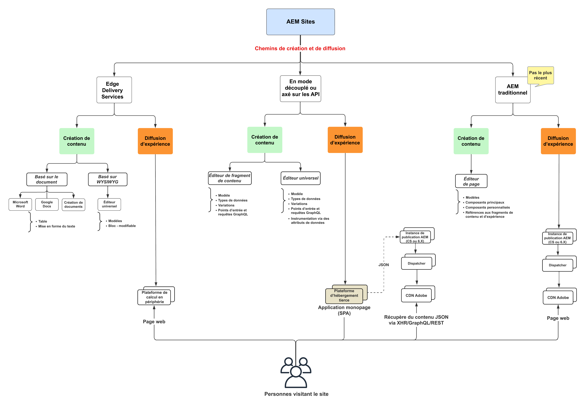

# Vidéos et tutoriels sur AEM Sites {#overview}

{{edge-delivery-services}}

Adobe Experience Manager (AEM) Sites est une plateforme de gestion de l’expérience de premier plan. Ce guide d’utilisation contient des vidéos et des tutoriels sur les nombreuses fonctions et capacités d’AEM Sites.

## Trois façons de créer avec AEM Sites

AEM Sites propose trois méthodes de création, de création et de diffusion d’expériences. Que vous créiez des pages entières, optimisiez les performances Edge ou optimisiez des applications découplées, AEM Sites offre des options flexibles pour répondre aux besoins de votre projet :

1. Les sites web **Edge Delivery Services** exploitent la création basée sur des documents ou l’éditeur universel d’Adobe pour créer du contenu, qui est ensuite activé, puis diffusé aux utilisateurs finaux par Edge Delivery Services en tant que pages web HTML. Cette option est principalement destinée aux _projets nouveaux et existants_ qui nécessitent des performances, une évolutivité et une vitesse élevées.
1. **Découplées/API-first** les expériences web utilisent l’éditeur de fragment de contenu ou l’éditeur universel pour créer du contenu, qui est ensuite activé et diffusé par l’instance de publication AEM au format JSON. Cette option est principalement destinée aux _projets nouveaux et existants_ qui nécessitent une diffusion découplée du contenu vers des applications mobiles, des applications d’une seule page (SPA) ou d’autres applications découplées.
1. **AEM traditionnel** n’est pas l’approche la plus récente pour créer des expériences web à l’aide d’AEM Sites. AEM traditionnel utilise l’éditeur de page de l’auteur AEM pour créer du contenu, qui est ensuite activé et diffusé aux utilisateurs finaux par les pages web AEM Publier en tant que HTML . AEM traditionnel est recommandé pour les _projets existants_.

Ces options sont conçues pour répondre aux divers besoins des organisations marketing, afin de fournir des expériences personnalisées et attrayantes à grande vitesse et à grande échelle sur n’importe quel canal ou appareil.

>[!IMPORTANT]
>
> **Edge Delivery Services** est la dernière méthode de génération avec AEM Sites. Il est conçu pour fournir des sites web hautes performances à grande échelle, en exploitant la puissance d’Adobe Edge Network.

Le diagramme suivant illustre les différents chemins d’accès :

{width="700" zoomable="yes"}

### Comparer les méthodes de création avec AEM Sites

Le tableau suivant présente une comparaison de haut niveau des trois chemins d’accès. Il se concentre sur les nuances de création de contenu et de diffusion d’expérience de chaque chemin.

|            | Edge Delivery Services | Découplé / API-First | AEM traditionnel |
|---------------------|------------------------------|---------------------------------|---------------------------------------------|
| **Idéal Pour** | Sites web ayant des besoins élevés en termes de trafic, de performances et d’évolutivité | Applications mobiles, SPA et autres applications découplées | Projets existants (approche la plus récente) |
| **Outils de création** | Création basée sur des documents, éditeur universel | Fragments de contenu, éditeur universel | Éditeur de page |
| **Magasin de contenu créé** | Documents pour l’auteur AEM (JCR) | Auteur AEM (JCR) | Auteur AEM (JCR) |
| **Diffusion** | Edge Delivery Services | Publication AEM (avec réseau CDN Adobe + Dispatcher) | Publication AEM (avec réseau CDN Adobe + Dispatcher) |
| **Boutique de contenu de diffusion** | Edge Delivery Services | Publication AEM (JCR) | Publication AEM (JCR) |
| **Format de diffusion** | HTML | JSON | HTML |
| **Technologie de développement** | JavaScript, CSS | Tous (par exemple, Swift, React, etc.) | Java™, JavaScript, CSS |
| **Étape de mise en œuvre** | Projets nouveaux et existants | Projets nouveaux et existants | Projets existants uniquement |

## Tutoriels

Découvrez chacun des trois chemins d’accès à créer avec AEM Sites au moyen des tutoriels suivants :

<!-- CARDS

* https://www.aem.live/docs/
  {title = Edge Delivery Services - Guides}
  {description = Explore Edge Delivery Services with comprehensive guides. The Build, Publish, and Launch guides cover everything you need to get started with EDS.}
  {image = ./assets/edge-delivery-services.png}
  {target = _blank}
* https://experienceleague.adobe.com/fr/docs/experience-manager-learn/getting-started-with-aem-headless/overview
  {title = Headless/API-First - Tutorials}
  {description = Learn how to build headless applications powered by AEM content. Tutorials cover frameworks like iOS, Android, and React—choose what fits your stack.}
  {image = ./assets/headless.png}
  {target = _self}
* https://experienceleague.adobe.com/fr/docs/experience-manager-learn/getting-started-wknd-tutorial-develop/overview
  {title = Traditional AEM - WKND Tutorial}
  {description = Learn how to build a sample AEM Sites project using the WKND tutorial. This guide walks you through project setup, Core Components, Editable Templates, client-side libraries, and component development.}
  {image = ./assets/aem-wknd-spa-editor-tutorial.png}
  {target = _self}
-->
<!-- START CARDS HTML - DO NOT MODIFY BY HAND -->

    

        

            

                <figure class="image x-is-16by9">
                    
                </figure>
            

            

                

                    

                        <a href="https://www.aem.live/docs/" target="_blank" rel="referrer" title="Edge Delivery Services - Guides">Edge Delivery Services - Guides</a>
                    

                    
Explorez Edge Delivery Services avec des guides complets. Les guides de création, de publication et de lancement couvrent tout ce dont vous avez besoin pour commencer à utiliser EDS.

                

                <a href="https://www.aem.live/docs/" target="_blank" rel="referrer" class="spectrum-Button spectrum-Button--outline spectrum-Button--primary spectrum-Button--sizeM" style="align-self: flex-start; margin-top: 1rem;">
En savoir plus
</a>
            

        

    

    

        

            

                <figure class="image x-is-16by9">
                    
                </figure>
            

            

                

                    

                        <a href="https://experienceleague.adobe.com/fr/docs/experience-manager-learn/getting-started-with-aem-headless/overview" target="_self" rel="referrer" title="Headless/API-First - Tutoriels">Headless/API-First - Tutoriels</a>
                    

                    
Découvrez comment créer des applications découplées optimisées par du contenu AEM. Les tutoriels couvrent des structures telles qu’iOS, Android et React et vous permettent de choisir celles qui correspondent à votre pile.

                

                <a href="https://experienceleague.adobe.com/fr/docs/experience-manager-learn/getting-started-with-aem-headless/overview" target="_self" rel="referrer" class="spectrum-Button spectrum-Button--outline spectrum-Button--primary spectrum-Button--sizeM" style="align-self: flex-start; margin-top: 1rem;">
En savoir plus
</a>
            

        

    

    

        

            

                <figure class="image x-is-16by9">
                    
                </figure>
            

            

                

                    

                        <a href="https://experienceleague.adobe.com/fr/docs/experience-manager-learn/getting-started-wknd-tutorial-develop/overview" target="_self" rel="referrer" title="AEM traditionnel - Tutoriel WKND">AEM traditionnel - Tutoriel WKND</a>
                    

                    
Découvrez comment créer un exemple de projet AEM Sites à l’aide du tutoriel WKND. Ce guide vous guide tout au long de la configuration du projet, des composants principaux, des modèles modifiables, des bibliothèques côté client et du développement de composants.

                

                <a href="https://experienceleague.adobe.com/fr/docs/experience-manager-learn/getting-started-wknd-tutorial-develop/overview" target="_self" rel="referrer" class="spectrum-Button spectrum-Button--outline spectrum-Button--primary spectrum-Button--sizeM" style="align-self: flex-start; margin-top: 1rem;">
En savoir plus
</a>
            

        

    

<!-- END CARDS HTML - DO NOT MODIFY BY HAND -->

## Ressources supplémentaires

* [Documentation sur la création sur AEM Sites.](https://experienceleague.adobe.com/fr/docs/experience-manager-65/content/sites/authoring/essentials/first-steps)
* [Documentation sur le développement sur AEM Sites.](https://experienceleague.adobe.com/fr/docs/experience-manager-65/content/implementing/developing/introduction/getting-started)
* [Documentation sur l’administration sur AEM Sites.](https://experienceleague.adobe.com/fr/docs/experience-manager-65/content/sites/administering/home)
* [Documentation sur le déploiement sur AEM Sites.](https://experienceleague.adobe.com/fr/docs/experience-manager-65/content/implementing/deploying/introduction/platform)
* [Tutoriels sur AEM as a Cloud Service](/help/cloud-service/overview.md)
* [Tutoriels sur AEM Assets](/help/assets/overview.md)
* [Tutoriels sur AEM Forms](/help/forms/overview.md)
* [Tutoriels sur AEM Foundation](/help/foundation/overview.md)
