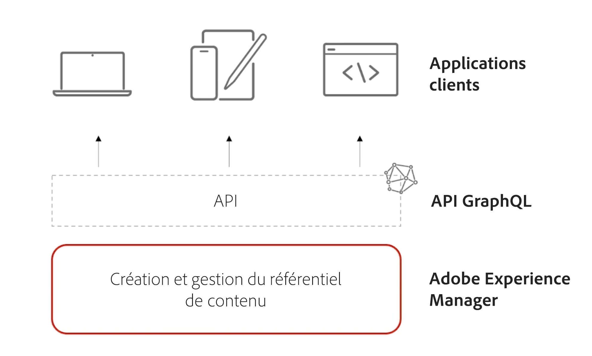

# Vidéos et tutoriels sur AEM Sites {#overview}

{{edge-delivery-services}}

Adobe Experience Manager (AEM) Sites est la plateforme de gestion de l’expérience d’Adobe qui permet la création, la gestion et la diffusion d’expériences digitales, que ce soit par le biais d’un site web, d’une application mobile ou de tout autre canal numérique.

## Trois façons de fournir des expériences avec AEM Sites

AEM Sites propose trois méthodes de génération, de création et de diffusion d’expériences. Que vous créiez des sites web, optimisiez les performances Edge ou optimisiez des applications découplées, AEM Sites offre des options flexibles pour répondre aux besoins de votre projet :

1. **Edge Delivery Services** les expériences utilisent Edge Network d’Adobe pour diffuser du contenu à grande vitesse et à faible latence. Le service optimise automatiquement le contenu pour l’appareil consommateur, les moteurs de recherche et les agents GenAI. Les auteurs créent du contenu à l’aide de l’éditeur universel Adobe ou de la création documentaire.
1. Les expériences **découplées/API-first** utilisent la publication AEM pour diffuser du contenu sous forme d’API JSON sur HTTP pour les applications mobiles, les applications d’une seule page (SPA) ou d’autres clients découplés. Les auteurs créent du contenu à l’aide de l’éditeur de fragment de contenu ou de l’éditeur universel.
1. Les expériences **AEM traditionnelles** utilisent l’instance de publication AEM pour diffuser du contenu sous forme de pages web HTML. Les auteurs créent du contenu à l’aide de l’éditeur de page de l’auteur AEM. Cette option est préférable pour les projets existants ou les projets déjà migrés.

Les trois options sont des approches solides, et le meilleur choix dépend de votre cas d’utilisation et de vos besoins organisationnels. Chaque approche permet aux équipes de fournir des expériences personnalisées et attrayantes à la vitesse et à l’échelle sur n’importe quel canal ou appareil.

>[!IMPORTANT]
>
> **Edge Delivery Services** est la méthode la plus récente et la plus avancée pour diffuser des sites web avec AEM. Il associe la vitesse et l’évolutivité d’Edge Network d’Adobe à des options de création modernes. Bien que Edge Delivery Services soit recommandé pour les nouveaux projets, AEM Sites continue à prendre en charge les approches découplées et traditionnelles, afin que vous puissiez choisir le chemin qui correspond le mieux à vos besoins.

Le diagramme suivant illustre les différentes options de création d’expériences avec AEM Sites :

{width="700" zoomable="yes"}

### Comparer les méthodes de création avec AEM Sites

Le tableau suivant présente une comparaison générale des trois chemins. Il se concentre sur les nuances de création de contenu et de diffusion d’expérience de chaque chemin.

|            | Edge Delivery Services | Découplé/Axé sur des API | AEM traditionnel |
|---------------------|------------------------------|---------------------------------|---------------------------------------------|
| **Idéal pour** | Sites web ayant des besoins élevés en termes de trafic, de performances et d’évolutivité | Applications mobiles, SPA et autres applications découplées | Projets existants ou projets migrés |
| **Outils de création** | Création basée sur des documents, éditeur universel, éditeur de page | Fragments de contenu, éditeur universel | Éditeur de page, éditeur universel |
| **Magasin de contenu créé** | Documents ou instance de création AEM (JCR) | Instance de création AEM (JCR) | Instance de création AEM (JCR) |
| **Diffusion** | Edge Delivery Services | Publication AEM (avec réseau CDN Adobe + Dispatcher) | Publication AEM (avec réseau CDN Adobe + Dispatcher) |
| **Magasin de contenu de diffusion** | Edge Delivery Services | Instance de publication AEM (JCR) | Instance de publication AEM (JCR) |
| **Format de diffusion** | HTML | JSON | HTML |
| **Technologie de développement** | JavaScript, CSS | Tous (par exemple, Swift, React, etc.) | Java™, HTL, JavaScript, CSS |
| **Prise en charge des robots de recherche et des agents GenAI** | Optimisé pour les robots, les moteurs de recherche et les agents GenAI | Fonctionne pour les robots et les agents, mais peut nécessiter un rendu côté serveur ou une configuration supplémentaire | Convient aux robots, mais les performances peuvent être plus lentes que celles de Edge Delivery Services |

## Migration depuis AMS ou On-Premise

Si vous migrez d’AMS ou On-Premise (OTP) vers AEM as a Cloud Service, Adobe vous incite à évaluer la possibilité de passer directement à Edge Delivery Services. L’effort ne dépasse généralement pas la migration vers l’instance de publication AEM as a Cloud Service, tout en offrant des performances plus rapides et une plus grande évolutivité. Si vous décidez que Edge Delivery Services n’est pas le bon choix pour vous à ce stade, ou si les autres approches répondent mieux à vos besoins, elles restent des options entièrement prises en charge et valides pour votre projet.

## Tutoriels

Explorez plus en détail les trois approches de création avec AEM Sites. Les tutoriels ci-dessous vous expliquent le fonctionnement de chaque option, les outils utilisés et quand les utiliser.

<!-- CARDS

* https://www.aem.live/docs/
  {title = Edge Delivery Services - Guides}
  {description = Explore Edge Delivery Services with comprehensive guides. The Build, Publish, and Launch guides cover everything you need to get started with Edge Delivery Services.}
  {image = ./assets/edge-delivery-services.png}
  {target = _blank}
* https://experienceleague.adobe.com/fr/docs/experience-manager-learn/getting-started-with-aem-headless/overview
  {title = Headless/API-First - Tutorials}
  {description = Learn how to build headless applications powered by AEM content. Tutorials cover frameworks like iOS, Android, and React—choose what fits your stack.}
  {image = ./assets/headless.png}
  {target = _self}
* https://experienceleague.adobe.com/fr/docs/experience-manager-learn/getting-started-wknd-tutorial-develop/overview
  {title = Traditional AEM - WKND Tutorial}
  {description = Learn how to build a sample AEM Sites project using the WKND tutorial. This guide walks you through project setup, Core Components, Editable Templates, client-side libraries, and component development.}
  {image = ./assets/aem-wknd-spa-editor-tutorial.png}
  {target = _self}
-->
<!-- START CARDS HTML - DO NOT MODIFY BY HAND -->

    

        

            

                <figure class="image x-is-16by9">
                    
                </figure>
            

            

                

                    

                        <a href="https://www.aem.live/docs/" target="_blank" rel="referrer" title="Edge Delivery Services - Guides">Edge Delivery Services - Guides</a>
                    

                    
Explorez Edge Delivery Services avec des guides complets. Les guides de création, de publication et de lancement couvrent tout ce dont vous avez besoin pour commencer à utiliser Edge Delivery Services.

                

                <a href="https://www.aem.live/docs/" target="_blank" rel="referrer" class="spectrum-Button spectrum-Button--outline spectrum-Button--primary spectrum-Button--sizeM" style="align-self: flex-start; margin-top: 1rem;">
En savoir plus
</a>
            

        

    

    

        

            

                <figure class="image x-is-16by9">
                    
                </figure>
            

            

                

                    

                        <a href="https://experienceleague.adobe.com/fr/docs/experience-manager-learn/getting-started-with-aem-headless/overview" target="_self" rel="referrer" title="Découplé/Axé sur des API - Tutoriels">Découplé/Axé sur des API - Tutoriels</a>
                    

                    
Découvrez comment créer des applications découplées optimisées par du contenu AEM. Les tutoriels couvrent des frameworks tels qu’iOS, Android et React. Choisissez ce qui correspond à votre pile.

                

                <a href="https://experienceleague.adobe.com/fr/docs/experience-manager-learn/getting-started-with-aem-headless/overview" target="_self" rel="referrer" class="spectrum-Button spectrum-Button--outline spectrum-Button--primary spectrum-Button--sizeM" style="align-self: flex-start; margin-top: 1rem;">
En savoir plus
</a>
            

        

    

    

        

            

                <figure class="image x-is-16by9">
                    
                </figure>
            

            

                

                    

                        <a href="https://experienceleague.adobe.com/fr/docs/experience-manager-learn/getting-started-wknd-tutorial-develop/overview" target="_self" rel="referrer" title="AEM traditionnel - Tutoriel WKND">AEM traditionnel - Tutoriel WKND</a>
                    

                    
Découvrez comment créer un exemple de projet AEM Sites à l’aide du tutoriel WKND. Ce guide vous accompagne tout au long de la configuration du projet, des composants principaux, des modèles modifiables, des bibliothèques côté client et du développement de composants.

                

                <a href="https://experienceleague.adobe.com/fr/docs/experience-manager-learn/getting-started-wknd-tutorial-develop/overview" target="_self" rel="referrer" class="spectrum-Button spectrum-Button--outline spectrum-Button--primary spectrum-Button--sizeM" style="align-self: flex-start; margin-top: 1rem;">
En savoir plus
</a>
            

        

    

<!-- END CARDS HTML - DO NOT MODIFY BY HAND -->

## Ressources supplémentaires

* [Documentation sur la création sur AEM Sites.](https://experienceleague.adobe.com/fr/docs/experience-manager-65/content/sites/authoring/essentials/first-steps)
* [Documentation sur le développement sur AEM Sites.](https://experienceleague.adobe.com/fr/docs/experience-manager-65/content/implementing/developing/introduction/getting-started)
* [Documentation sur l’administration sur AEM Sites.](https://experienceleague.adobe.com/fr/docs/experience-manager-65/content/sites/administering/home)
* [Documentation sur le déploiement sur AEM Sites.](https://experienceleague.adobe.com/fr/docs/experience-manager-65/content/implementing/deploying/introduction/platform)
* [Tutoriels sur AEM as a Cloud Service](/help/cloud-service/overview.md)
* [Tutoriels sur AEM Assets](/help/assets/overview.md)
* [Tutoriels sur AEM Forms](/help/forms/overview.md)
* [Tutoriels sur AEM Foundation](/help/foundation/overview.md)
