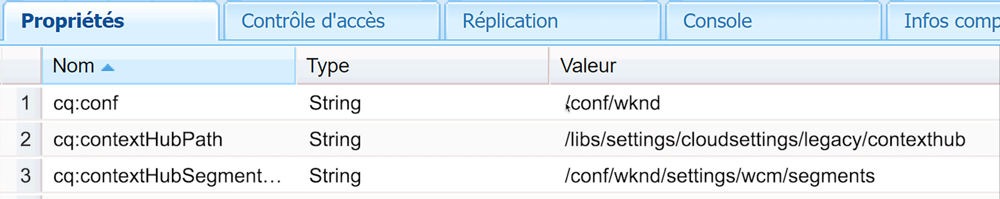

# Configuration de ContextHub pour la personnalisation {#set-up-contexthub}

ContextHub est une structure pour stocker, manipuler et présenter des données contextuelles. L’API JavaScript ContextHub vous permet d’accéder aux magasins pour créer, mettre à jour et supprimer des données si nécessaire. En tant que tel, ContextHub représente une couche de données sur vos pages. Cette page décrit comment ajouter un hub de contexte à vos pages de site AEM.

>[!VIDEO](https://video.tv.adobe.com/v/23765/?quality=9&learn=on)

>[!NOTE]
>
>Nous utilisons le site de référence WKND pour cette vidéo et elle ne fait pas partie de AEM version. Vous pouvez télécharger la [dernière version ici](https://github.com/adobe/aem-guides-wknd/releases).

Ajoutez ContextHub sur vos pages pour activer les fonctionnalités ContextHub et pour créer un lien vers les bibliothèques JavaScript ContextHub. L’API JavaScript ContextHub permet d’accéder aux données contextuelles gérées par ContextHub.

## Ajout de ContextHub à un composant de page {#adding-contexthub-to-a-page-component}

Pour activer les fonctionnalités ContextHub et créer un lien vers les bibliothèques JavaScript ContextHub, incluez le composant `contexthub` dans la section `<head>` de votre page Web. Le code HTML de votre composant de page ressemble à l’exemple suivant :

```java
<!--/* Include Context Hub */-->
<sly data-sly-resource="${'contexthub' @ resourceType='granite/contexthub/components/contexthub'}"/>
*/-->
```

## Configuration du site et segments ContextHub {#site-configuration-and-contexthub-segments}

ContextHub propose un moteur de segmentation qui gère les segments et détermine les segments qui sont résolus pour le contexte actuel. Plusieurs segments sont définis. Vous pouvez utiliser l’API Javascript pour [déterminer les segments résolus](https://helpx.adobe.com/experience-manager/6-5/sites/developing/using/ch-adding.html#DeterminingResolvedContextHubSegments). Activez les segments ContextHub pour votre site sous [[!UICONTROL Navigateur de configuration]](https://docs.adobe.com/content/help/fr-FR/experience-manager-cloud-service/implementing/developing/configurations.html).

## Créer des segments {#create-segments}

Créez AEM segments qui agissent comme des règles pour les teasers. Autrement dit, ils définissent quand le contenu d&#39;une bande-annonce apparaît sur une page Web. Le contenu peut cibler les besoins et centres d’intérêts spécifiques des visiteurs en fonction du ou des segments correspondants.

## Affectation de la configuration de cloud, du chemin de segment et du chemin ContextHub à votre site {#assigning-cloud-configuration-segment-path-and-contexthub-path-to-your-site}

Affectation du chemin de configuration Cloud, du chemin de segmentation et du chemin ContextHub au noeud racine du site afin de créer une expérience personnalisée pour votre audience. A l’aide de ContextHub, vous pouvez manipuler les données contextuelles et tester les segments résolus.



Vous pouvez en savoir plus sur ContextHub et la segmentation ci-dessous :

* [ContextHub](https://helpx.adobe.com/experience-manager/6-5/sites/developing/using/contexthub.html)
* [Ajouter le concentrateur de contexte sur la page et accéder aux magasins](https://helpx.adobe.com/experience-manager/6-5/sites/developing/using/ch-adding.html)
* [Compréhension de la segmentation](https://helpx.adobe.com/experience-manager/6-5/sites/classic-ui-authoring/using/classic-personalization-campaigns-segmentation.html)
* [Configuration de la segmentation avec ContextHub](https://helpx.adobe.com/experience-manager/6-5/sites/administering/using/segmentation.html)
