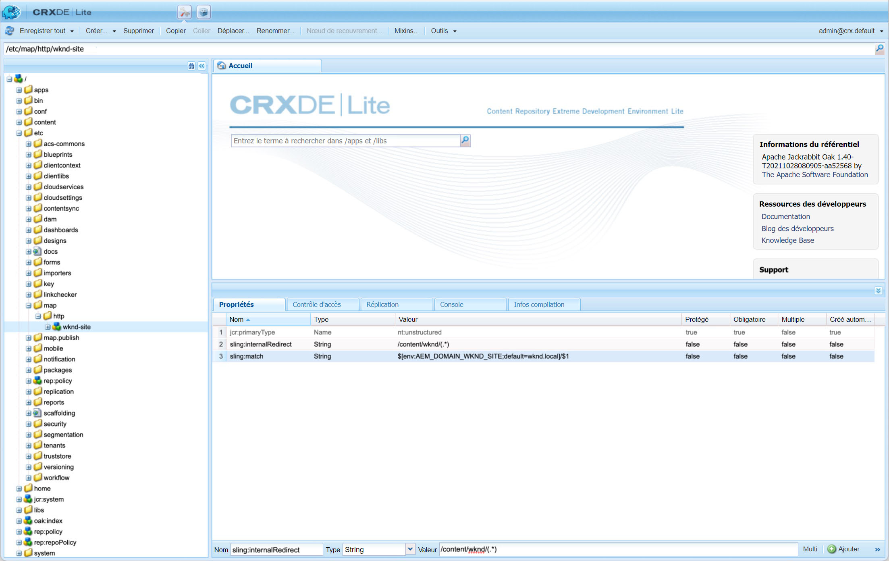

# Plans de site

Découvrez comment optimiser votre SEO en créant des plans de site pour AEM Sites.

>[!WARNING]
>
>Cette vidéo présente l’utilisation des URL relatives dans le plan du site. Les plans de site [doivent utiliser des URL absolues](https://sitemaps.org/protocol.html). Consultez la section [Configurations](#absolute-sitemap-urls) pour savoir comment activer les URL absolues, car cela n’est pas abordé dans la vidéo ci-dessous.

>[!VIDEO](https://video.tv.adobe.com/v/337960?quality=12&learn=on)

## Configurations

### URL absolues du plan du site{#absolute-sitemap-urls}

Le plan du site AEM prend en charge les URL absolues en utilisant le [mappage Sling](https://sling.apache.org/documentation/the-sling-engine/mappings-for-resource-resolution.html). Pour ce faire, créez des nœuds de mappage sur les services AEM générant des plans de site (généralement le service de publication AEM).

Un exemple de définition de nœud de mappage Sling pour `https://wknd.com` peut être défini sous `/etc/map/https` comme suit :

| Chemin d’accès | Nom de la propriété | Type de propriété | Valeur de propriété |
|------|----------|---------------|-------|
| `/etc/map/https/wknd-site` | `jcr:primaryType` | Chaîne | `nt:unstructured` |
| `/etc/map/https/wknd-site` | `sling:internalRedirect` | Chaîne | `/content/wknd/(.*)` |
| `/etc/map/https/wknd-site` | `sling:match` | Chaîne | `wknd.com/$1` |

La capture d’écran ci-dessous illustre une configuration similaire, mais pour `http://wknd.local` (mappage de nom d’hôte local s’exécutant sur `http`).




### Configuration OSGi du planificateur de plan du site

Définit la [configuration d’usine OSGi](http://localhost:4502/system/console/configMgr/org.apache.sling.sitemap.impl.SitemapScheduler) pour la fréquence (à l’aide des [expressions cron](http://www.cronmaker.com/)) à laquelle les plans de site sont générés/regénérés et mis en cache dans AEM.

`ui.config/src/main/jcr_content/apps/wknd/osgiconfig/config.publish`

```json
{
  "scheduler.name": "WKND Sitemaps",
  "scheduler.expression": "0 0 2 1/1 * ? *",
  "searchPath": "/content/wknd"
}
```

### Règle de filtre d’autorisation de Dispatcher

Autorisez les requêtes HTTP pour les fichiers d’index et de plan du site.

`dispatcher/src/conf.dispatcher.d/filters/filters.any`

```
...

# Allow AEM sitemaps
/0200 { /type "allow" /path "/content/*" /selectors '(sitemap-index|sitemap)' /extension "xml" }
```

### Règle de réécriture du serveur web Apache

Assurez-vous que les requêtes HTTP du plan du site `.xml` sont acheminées vers la bonne page AEM sous-jacente. Si le raccourcissement des URL n’est pas utilisé ou si des mappages Sling sont utilisés pour obtenir le raccourcissement des URL, cette configuration n’est pas nécessaire.

`dispatcher/src/conf.d/rewrites/rewrite.rules`

```
...
RewriteCond %{REQUEST_URI} (.html|.jpe?g|.png|.svg|.xml)$
RewriteRule ^/(.*)$ /content/${CONTENT_FOLDER_NAME}/$1 [PT,L]
```

## Ressources

+ [Documentation relative au plan du site AEM](https://experienceleague.adobe.com/docs/experience-manager-cloud-service/content/overview/seo-and-url-management.html?lang=fr)
+ [Documentation relative au plan du site Apache Sling](https://github.com/apache/sling-org-apache-sling-sitemap#readme)
+ [Documentation relative au plan du site sitemap.org](https://www.sitemaps.org/protocol.html)
+ [Documentation relative au fichier d’index du plan du site sitemap.org](https://www.sitemaps.org/protocol.html#index)
+ [Cronmaker](http://www.cronmaker.com/)