# Développer avec l&#39;AEM SPA Editor - Hello World Tutorial {#developing-with-the-aem-spa-editor-hello-world-tutorial}

>[!WARNING]
>
> Ce didacticiel est **obsolète**. Il est recommandé de procéder comme suit : [Prise en main de l’éditeur SPA AEM et de Angular](https://docs.adobe.com/content/help/fr-FR/experience-manager-learn/spa-angular-tutorial/overview.html) ou [Prise en main de l’éditeur de l’ et réaction](https://docs.adobe.com/content/help/fr-FR/experience-manager-learn/spa-react-tutorial/overview.html)

aem SPA Editor prend en charge la modification contextuelle d’une ou de plusieurs applications d’une seule page. Ce didacticiel présente SPA développement à utiliser avec AEM Editor JS SDK. Le didacticiel étendra l&#39;application de Journal We.Retail en ajoutant un composant Hello World personnalisé. Les utilisateurs peuvent compléter le didacticiel à l’aide des structures Réagir ou Angular.

>[!NOTE]
>
> La fonction Éditeur d’application à page unique (SPA) nécessite AEM Service Pack 2 6.4 ou version ultérieure.
>
> L’éditeur SPA est la solution recommandée pour les projets qui nécessitent un rendu côté client SPA structure (par exemple, Réagir ou Angulaire).

## Lecture prérequise {#prereq}

Ce didacticiel vise à mettre en évidence les étapes nécessaires pour associer un composant SPA à un composant AEM afin d’activer la modification en contexte. Les utilisateurs qui commencent ce tutoriel doivent connaître les concepts de base du développement avec Adobe Experience Manager, AEM, ainsi que le développement avec React of Angular framework. Ce didacticiel porte à la fois sur les tâches de développement dorsales et frontales.

Il est recommandé de passer en revue les ressources suivantes avant de commencer ce didacticiel :

* [Vidéo](spa-editor-framework-feature-video-use.md)  sur SPA Editor Feature Video - Présentation vidéo de SPA Editor et de l’application de Journal We.Retail.
* [Didacticiel](https://reactjs.org/tutorial/tutorial.html)  React.js - Présentation du développement avec la structure React.
* [Didacticiel](https://angular.io/tutorial)  angulaire - Présentation du développement avec Angular

## Environnement de développement local {#local-dev}

Ce didacticiel est conçu pour :

[Adobe Experience Manager 6.5](https://helpx.adobe.com/fr/experience-manager/6-5/release-notes.html ) ou  [Adobe Experience Manager 6.4](https://helpx.adobe.com/fr/experience-manager/6-4/sites/deploying/using/technical-requirements.html) +  [Service Pack 5](https://helpx.adobe.com/fr/experience-manager/6-4/release-notes/sp-release-notes.html)

Dans ce didacticiel, les technologies et outils suivants doivent être installés :

1. [Java 11](https://downloads.experiencecloud.adobe.com/content/software-distribution/en/general.html)
2. [Apache Maven - 3.3.1+](https://maven.apache.org/)
3. [Node.js - 8.11.1+](https://nodejs.org/en/) et npm 5.6.0+ (npm est installé avec node.js)

Le doublon vérifie l&#39;installation des outils ci-dessus en ouvrant un nouveau terminal et en exécutant les opérations suivantes :

```shell
$ java -version
java version "11 +"

$ mvn -version
Apache Maven 3.3.9

$ node --version
v8.11.1

$ npm --version
6.1.0
```

## Présentation {#overview}

Le concept de base est de mapper un composant SPA à un composant AEM. aem composants, exécution côté serveur, exportation de contenu sous la forme de JSON. Le contenu JSON est consommé par le SPA, exécutant côté client dans le navigateur. Un mappage 1:1 entre les composants SPA et un composant AEM est créé.

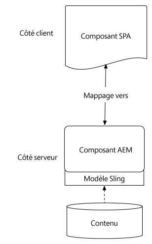

Les structures populaires [réagissez JS](https://reactjs.org/) et [Angular](https://angular.io/) sont prises en charge. Les utilisateurs peuvent compléter ce tutoriel en angulaire ou en réagissant, quel que soit le cadre dans lequel ils se sentent le plus à l&#39;aise.

## Configuration du projet {#project-setup}

SPA développement a un pied dans le développement AEM, et l&#39;autre dehors. L&#39;objectif est de permettre SPA développement de manière indépendante, et (surtout) indépendante de l&#39;AEM.

* SPA projets peuvent fonctionner indépendamment du projet AEM pendant le développement frontal.
* Les outils de création et les technologies de pointe tels que Webpack, NPM, [!DNL Grunt] et [!DNL Gulp]continuent d&#39;être utilisés.
* Pour construire pour AEM, le projet SPA est compilé et automatiquement inclus dans le projet AEM.
* Packages AEM standard utilisés pour déployer le SPA dans l’AEM.

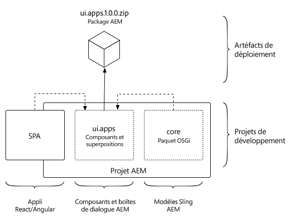

*SPA développement a un pied dans le développement AEM, et l&#39;autre dans le développement extérieur - ce qui permet au développement SPA de se produire de façon indépendante et (surtout) indépendante de l&#39;.*

L&#39;objectif de ce didacticiel est d&#39;étendre l&#39;application de Journal We.Retail à un nouveau composant. Début en téléchargeant le code source de l’application de Journal We.Retail et en le déployant sur un AEM local.

1. **** Téléchargez le dernier code de Journal  [We.Retail depuis GitHub](https://github.com/adobe/aem-sample-we-retail-journal).

   Ou cloner le référentiel à partir de la ligne de commande :

   ```shell
   $ git clone git@github.com:adobe/aem-sample-we-retail-journal.git
   ```

   >[!NOTE]
   >
   >Le tutoriel fonctionnera avec la branche **master** avec la version **1.2.1-SNAPSHOT** du projet.

1. La structure suivante doit être visible :

   

   Le projet contient les modules maven suivants :

   * `all`: Incorpore et installe l’ensemble du projet dans un seul package.
   * `bundles`: Contient deux lots OSGi : commons et noyau qui contiennent  [!DNL Sling Models] et d&#39;autres codes Java.
   * `ui.apps`: contient les parties /apps du projet, à savoir les clientlibs JS et CSS, les composants, les configurations spécifiques au mode d’exécution.
   * `ui.content`: contient le contenu structurel et les configurations (`/content`,  `/conf`)
   * `react-app`: Application Web.Retail Journal React. Il s&#39;agit à la fois d&#39;un module Maven et d&#39;un projet webpack.
   * `angular-app`: Application angulaire du Journal We.Retail. Il s&#39;agit à la fois d&#39;un module [!DNL Maven] et d&#39;un projet webpack.

1. Ouvrez une nouvelle fenêtre de terminal et exécutez la commande suivante pour créer et déployer l’application entière sur une instance d’AEM locale s’exécutant sur [http://localhost:4502](http://localhost:4502).

   ```shell
   $ cd <src>/aem-sample-we-retail-journal
   $ mvn -PautoInstallSinglePackage clean install
   ```

   >[!NOTE]
   >
   > Dans ce projet, le profil Maven pour construire et assembler l&#39;ensemble du projet est `autoInstallSinglePackage`

   >[!CAUTION]
   >
   > Si vous recevez une erreur au cours de la génération, [vérifiez que votre fichier Maven settings.xml contient le référentiel d’artefacts Maven d’Adobe](https://helpx.adobe.com/experience-manager/kb/SetUpTheAdobeMavenRepository.html).

1. Accédez à:

   * [http://localhost:4502/editor.html/content/we-retail-journal/react/en/home.html](http://localhost:4502/editor.html/content/we-retail-journal/react/en/home.html)
   * [http://localhost:4502/editor.html/content/we-retail-journal/angular/en/home.html](http://localhost:4502/editor.html/content/we-retail-journal/angular/en/home.html)

   L’application de Journal We.Retail doit être affichée dans l’éditeur AEM Sites.

1. En mode [!UICONTROL Modifier], sélectionnez un composant à modifier et mettez à jour le contenu.

   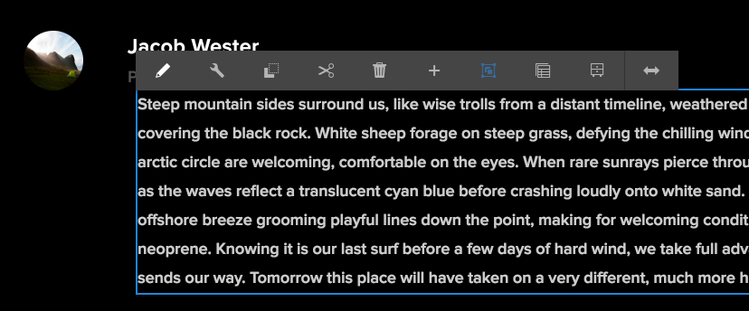

1. Sélectionnez l&#39;icône [!UICONTROL Propriétés de la page] pour ouvrir [!UICONTROL Propriétés de la page]. Sélectionnez [!UICONTROL Modifier le modèle] pour ouvrir le modèle de la page.

   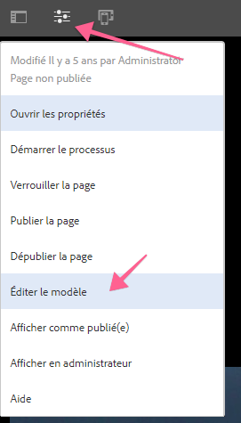

1. Dans la dernière version de SPA Editor, [Les modèles modifiables](https://helpx.adobe.com/experience-manager/6-5/sites/developing/using/page-templates-editable.html) peuvent être utilisés de la même manière que dans les implémentations traditionnelles de Sites. Ceci sera réexaminé ultérieurement avec notre composant personnalisé.

   >[!NOTE]
   >
   > Seuls AEM 6.5 et AEM 6.4 + **Service Pack 5** prennent en charge les modèles modifiables.

## Présentation du développement {#development-overview}

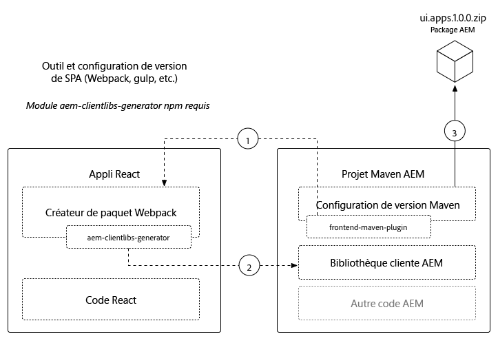

SPA itérations de développement se produisent indépendamment de l&#39;AEM. Lorsque le SPA est prêt à être déployé en AEM, les étapes de haut niveau suivantes ont lieu (comme illustré ci-dessus).

1. La génération de projet AEM est appelée, ce qui déclenche à son tour la génération du projet SPA. Le Journal We.Retail utilise le module externe [**frontend-maven-plugin**](https://github.com/eirslett/frontend-maven-plugin).
1. Le projet SPA [**aem-clientlib-generator**](https://www.npmjs.com/package/aem-clientlib-generator) intègre le SPA compilé en tant que bibliothèque cliente d’un projet d’.
1. Le projet AEM génère un module AEM, y compris le SPA compilé, ainsi que tout autre code d&#39; de prise en charge.

## Créer un composant AEM {#aem-component}

**Persona : Développeur AEM**

Un composant AEM sera d’abord créé. Le composant AEM est responsable du rendu des propriétés JSON lues par le composant Réagir. Le composant AEM est également chargé de fournir une boîte de dialogue pour toutes les propriétés modifiables du composant.

A l&#39;aide de [!DNL Eclipse] ou d&#39;un autre [!DNL IDE], importez le projet We.Retail Journal Maven.

1. Mettez à jour le réacteur **pom.xml** pour supprimer le module externe [!DNL Apache Rat]. Ce module externe vérifie chaque fichier pour s’assurer qu’il existe un en-tête de licence. Pour nos besoins, nous n&#39;avons pas besoin de nous préoccuper de cette fonctionnalité.

   Dans **aem-sample-we-retail-journal/pom.xml** remove **apache-rate-plugin** :

   ```xml
   <!-- Remove apache-rat-plugin -->
   <plugin>
           <groupId>org.apache.rat</groupId>
           <artifactId>apache-rat-plugin</artifactId>
           <configuration>
               <excludes combine.children="append">
                   <exclude>*</exclude>
                       ...
               </excludes>
           </configuration>
           <executions>
                   <execution>
                       <phase>verify</phase>
                       <goals>
                           <goal>check</goal>
                       </goals>
               </execution>
           </executions>
       </plugin>
   ```

1. Dans le module **we-commerce-journal-content** (`<src>/aem-sample-we-retail-journal/ui.apps`), créez un nouveau noeud sous `ui.apps/jcr_root/apps/we-retail-journal/components` nommé **helloworld** de type **cq:Component**.
1. Ajoutez les propriétés suivantes au composant **helloworld**, représenté en XML (`/helloworld/.content.xml`) ci-dessous :

   ```xml
   <?xml version="1.0" encoding="UTF-8"?>
   <jcr:root xmlns:cq="http://www.day.com/jcr/cq/1.0" xmlns:jcr="http://www.jcp.org/jcr/1.0"
       jcr:description="Hello World Component for We.Retail Journal"
       jcr:primaryType="cq:Component"
       jcr:title="Hello World"
       componentGroup="We.Retail Journal" />
   ```

   

   >[!NOTE]
   >
   > Pour illustrer la fonction Modèles modifiables, nous avons délibérément défini le `componentGroup="Custom Components"`. Dans un projet réel, il est préférable de minimiser le nombre de groupes de composants, de sorte qu’un meilleur groupe serait &quot;[!DNL We.Retail Journal]&quot; pour correspondre aux autres composants de contenu.
   >
   > Seuls AEM 6.5 et AEM 6.4 + **Service Pack 5** prennent en charge les modèles modifiables.

1. Une boîte de dialogue sera ensuite créée pour permettre la configuration d&#39;un message personnalisé pour le composant **Hello World**. Sous `/apps/we-retail-journal/components/helloworld`, ajoutez un nom de noeud **cq:dialog** de **nt:unstructured**.
1. Le **cq:dialog** affiche un seul champ de texte qui conserve le texte dans une propriété nommée **[!DNL message]**. Au-dessous du nouveau **cq:dialog** ajoutez les noeuds et propriétés suivants, représentés en XML ci-dessous (`helloworld/_cq_dialog/.content.xml`) :

   ```xml
   <?xml version="1.0" encoding="UTF-8"?>
   <jcr:root xmlns:sling="http://sling.apache.org/jcr/sling/1.0" xmlns:cq="http://www.day.com/jcr/cq/1.0" xmlns:jcr="http://www.jcp.org/jcr/1.0" xmlns:nt="http://www.jcp.org/jcr/nt/1.0"
       jcr:primaryType="nt:unstructured"
       jcr:title="We.Retail Journal - Hello World"
       sling:resourceType="cq/gui/components/authoring/dialog">
       <content
           jcr:primaryType="nt:unstructured"
           sling:resourceType="granite/ui/components/coral/foundation/container">
           <items jcr:primaryType="nt:unstructured">
               <tabs
                   jcr:primaryType="nt:unstructured"
                   sling:resourceType="granite/ui/components/coral/foundation/tabs"
                   maximized="{Boolean}true">
                   <items jcr:primaryType="nt:unstructured">
                       <properties
                           jcr:primaryType="nt:unstructured"
                           jcr:title="Properties"
                           sling:resourceType="granite/ui/components/coral/foundation/container"
                           margin="{Boolean}true">
                           <items jcr:primaryType="nt:unstructured">
                               <columns
                                   jcr:primaryType="nt:unstructured"
                                   sling:resourceType="granite/ui/components/coral/foundation/fixedcolumns"
                                   margin="{Boolean}true">
                                   <items jcr:primaryType="nt:unstructured">
                                       <column
                                           jcr:primaryType="nt:unstructured"
                                           sling:resourceType="granite/ui/components/coral/foundation/container">
                                           <items jcr:primaryType="nt:unstructured">
                                               <message
                                                   jcr:primaryType="nt:unstructured"
                                                   sling:resourceType="granite/ui/components/coral/foundation/form/textfield"
                                                   fieldLabel="Message"
                                                   name="./message"
                                                   required="{Boolean}true"/>
                                           </items>
                                       </column>
                                   </items>
                               </columns>
                           </items>
                       </properties>
                   </items>
               </tabs>
           </items>
       </content>
   </jcr:root>
   ```

   

   La définition de noeud XML ci-dessus crée une boîte de dialogue avec un seul champ de texte qui permet à un utilisateur de saisir un &quot;message&quot;. Notez la propriété `name="./message"` dans le noeud `<message />`. Il s’agit du nom de la propriété qui sera stockée dans le JCR dans AEM.

1. Une boîte de dialogue de stratégie vide sera ensuite créée (`cq:design_dialog`). La boîte de dialogue Stratégie est nécessaire pour afficher le composant dans l’éditeur de modèles. Pour ce cas d&#39;utilisation simple, il s&#39;agira d&#39;une boîte de dialogue vide.

   Sous `/apps/we-retail-journal/components/helloworld`, ajoutez un nom de noeud `cq:design_dialog` de `nt:unstructured`.

   La configuration est représentée en XML ci-dessous (`helloworld/_cq_design_dialog/.content.xml`).

   ```xml
   <?xml version="1.0" encoding="UTF-8"?>
   <jcr:root xmlns:sling="http://sling.apache.org/jcr/sling/1.0" xmlns:cq="http://www.day.com/jcr/cq/1.0" xmlns:jcr="http://www.jcp.org/jcr/1.0" xmlns:nt="http://www.jcp.org/jcr/nt/1.0"
   jcr:primaryType="nt:unstructured" />
   ```

1. Déployez la base de code vers AEM à partir de la ligne de commande :

   ```shell
   $ cd <src>/aem-sample-we-retail-journal/content
   $ mvn -PautoInstallPackage clean install
   ```

   Dans [CRXDE Lite](http://localhost:4502/crx/de/index.jsp#/apps/we-retail-journal/global/components/helloworld), vérifiez que le composant a été déployé en inspectant le dossier sous `/apps/we-retail-journal/components:`

   

## Créer un modèle Sling {#create-sling-model}

**Persona : Développeur AEM**

Un [!DNL Sling Model] est ensuite créé pour sauvegarder le composant [!DNL Hello World]. Dans un cas d’utilisation WCM traditionnel, [!DNL Sling Model] implémente toute logique métier et un script de rendu côté serveur (HTL) effectue un appel à [!DNL Sling Model]. Le script de rendu reste ainsi relativement simple.

[!DNL Sling Models] sont également utilisées dans le cas d’utilisation SPA pour implémenter la logique métier côté serveur. La différence est que dans le cas d’utilisation de [!DNL SPA], [!DNL Sling Models] expose ses méthodes comme JSON sérialisé.

>[!NOTE]
>
>Il est recommandé aux développeurs d’utiliser [AEM Composants principaux](https://docs.adobe.com/content/help/fr-FR/experience-manager-core-components/using/introduction.html) lorsque cela est possible. Entre autres fonctionnalités, les composants principaux fournissent [!DNL Sling Models] une sortie JSON &quot;SPA-ready&quot;, ce qui permet aux développeurs de se concentrer davantage sur la présentation frontale.

1. Dans l’éditeur de votre choix, ouvrez le projet **we-commerce-journal-commons** ( `<src>/aem-sample-we-retail-journal/bundles/commons`).
1. Dans le package `com.adobe.cq.sample.spa.commons.impl.models` :
   * Créez une nouvelle classe nommée `HelloWorld`.
   * Ajouter une interface d’implémentation pour `com.adobe.cq.export.json.ComponentExporter.`

   

   L&#39;interface `ComponentExporter` doit être implémentée pour que [!DNL Sling Model] soit compatible avec AEM Content Services.

   ```java
    package com.adobe.cq.sample.spa.commons.impl.models;
   
    import com.adobe.cq.export.json.ComponentExporter;
   
    public class HelloWorld implements ComponentExporter {
   
        @Override
        public String getExportedType() {
            return null;
        }
    }
   ```

1. Ajoutez une variable statique nommée `RESOURCE_TYPE` pour identifier le type de ressource du composant [!DNL HelloWorld] :

   ```java
    ...
    public class HelloWorld implements ComponentExporter {
   
        static final String RESOURCE_TYPE = "we-retail-journal/components/helloworld";
   
        ...
    }
   ```

1. Ajoutez les annotations OSGi pour `@Model` et `@Exporter`. L&#39;annotation `@Model` enregistre la classe sous la forme [!DNL Sling Model]. L&#39;annotation `@Exporter` expose les méthodes sous forme de JSON sérialisé à l&#39;aide de la structure [!DNL Jackson Exporter].

   ```java
   import org.apache.sling.api.SlingHttpServletRequest;
   import org.apache.sling.models.annotations.Exporter;
   import org.apache.sling.models.annotations.Model;
   import com.adobe.cq.export.json.ExporterConstants;
   ...
   
   @Model(
           adaptables = SlingHttpServletRequest.class,
           adapters = {ComponentExporter.class},
           resourceType = HelloWorld.RESOURCE_TYPE
   )
   @Exporter(
           name = ExporterConstants.SLING_MODEL_EXPORTER_NAME, 
           extensions = ExporterConstants.SLING_MODEL_EXTENSION
   )
   public class HelloWorld implements ComponentExporter {
   
   ...
   ```

1. Mettez en oeuvre la méthode `getDisplayMessage()` pour renvoyer la propriété JCR `message`. Utilisez l&#39;annotation [!DNL Sling Model] de `@ValueMapValue` pour faciliter la récupération de la propriété `message` stockée sous le composant. L&#39;annotation `@Optional` est importante, car lorsque le composant est ajouté pour la première fois à la page, `message` ne sera pas renseigné.

   Dans le cadre de la logique métier, une chaîne, &quot;**Hello**&quot;, sera précédée du message.

   ```java
   import org.apache.sling.models.annotations.injectorspecific.ValueMapValue;
   import org.apache.sling.models.annotations.Optional;
   
   ...
   
   public class HelloWorld implements ComponentExporter {
   
      static final String RESOURCE_TYPE = "we-retail-journal/components/helloworld";
   
      private static final String PREPEND_MSG = "Hello";
   
       @ValueMapValue @Optional
       private String message;
   
       public String getDisplayMessage() {
           if(message != null && message.length() > 0) {
               return PREPEND_MSG + " "  + message;
           }
           return null;
       }
   
   ...
   ```

   >[!NOTE]
   >
   > Le nom de la méthode `getDisplayMessage` est important. Lorsque [!DNL Sling Model] est sérialisé avec [!DNL Jackson Exporter], il est exposé en tant que propriété JSON : `displayMessage`. [!DNL Jackson Exporter] sérialisera et exposera toutes les méthodes `getter` qui ne prennent pas de paramètre (sauf si explicitement indiqué pour ignorer). Plus tard, dans l’application Réagir / Angular, nous lirons cette valeur de propriété et l’afficherons dans le cadre de l’application.

   La méthode `getExportedType` est également importante. La valeur du composant `resourceType` sera utilisée pour &quot;mapper&quot; les données JSON au composant frontal (Angular / React). Nous étudierons cette question dans la section suivante.

1. Implémentez la méthode `getExportedType()` pour renvoyer le type de ressource du composant `HelloWorld`.

   ```java
    @Override
       public String getExportedType() {
           return RESOURCE_TYPE;
       }
   ```

   Le code complet de [**HelloWorld.java** se trouve ici.](https://github.com/Adobe-Marketing-Cloud/aem-guides/blob/master/spa-helloworld-guide/src/bundles/commons/HelloWorld.java)

1. Déployez le code vers AEM à l’aide d’Apache Maven :

   ```shell
   $ cd <src>/sample-we-retail-spa-content/bundles/commons
   $ mvn -PautoInstallPackage clean install
   ```

   Vérifiez le déploiement et l&#39;enregistrement de [!DNL Sling Model] en accédant à [[!UICONTROL Status] > [!UICONTROL Sling Models]](http://localhost:4502/system/console/status-slingmodels) dans la console OSGi.

   Vous devez voir que le modèle Sling `HelloWorld` est lié au type de ressource Sling `we-retail-journal/components/helloworld` et qu&#39;il est enregistré comme [!DNL Sling Model Exporter Servlet] :

   ```shell
   com.adobe.cq.sample.spa.commons.impl.models.HelloWorld - we-retail-journal/components/helloworld
   com.adobe.cq.sample.spa.commons.impl.models.HelloWorld exports 'we-retail-journal/components/helloworld' with selector 'model' and extension '[Ljava.lang.String;@6480f3e5' with exporter 'jackson'
   ```

## Créer un composant de réaction {#react-component}

**Persona : Développeur frontal**

Ensuite, le composant Réagir sera créé. Ouvrez le module **response-app** ( `<src>/aem-sample-we-retail-journal/react-app`) à l’aide de l’éditeur de votre choix.

>[!NOTE]
>
> N&#39;hésitez pas à sauter cette section si vous êtes intéressé par [Développement angulaire](#angular-component).

1. Dans le dossier `react-app`, accédez au dossier src. Développez le dossier de composants pour vue les fichiers de composants de Réagir existants.

   

1. Ajoutez un nouveau fichier sous le dossier de composants nommé `HelloWorld.js`.
1. Ouvrez `HelloWorld.js`. Ajoutez une instruction d&#39;importation pour importer la bibliothèque de composants Réagir. Ajoutez une deuxième instruction d&#39;importation pour importer l&#39;aide `MapTo` fournie par l&#39;Adobe. L&#39;assistance `MapTo` fournit un mappage du composant Réagir au JSON du composant AEM.

   ```js
   import React, {Component} from 'react';
   import {MapTo} from '@adobe/cq-react-editable-components';
   ```

1. Sous les importations, créez une nouvelle classe appelée `HelloWorld` qui étend l&#39;interface Réagir `Component`. Ajoutez la méthode `render()` requise à la classe `HelloWorld`.

   ```js
   import React, {Component} from 'react';
   import {MapTo} from '@adobe/cq-react-editable-components';
   
   class HelloWorld extends Component {
   
       render() {
   
       }
   }
   ```

1. L&#39;assistance `MapTo` inclut automatiquement un objet nommé `cqModel` dans les props du composant Réagir. Le `cqModel` comprend toutes les propriétés exposées par le [!DNL Sling Model].

   Souvenez-vous que le [!DNL Sling Model] créé précédemment contient une méthode `getDisplayMessage()`. `getDisplayMessage()` est converti en une clé JSON nommée  `displayMessage` lors de la sortie.

   Implémentez la méthode `render()` pour générer une balise `h1` contenant la valeur `displayMessage`. [JSX](https://reactjs.org/docs/introducing-jsx.html), une extension de syntaxe à JavaScript, est utilisé pour renvoyer l’annotation finale du composant.

   ```js
   ...
   
   class HelloWorld extends Component {
       render() {
   
           if(this.props.displayMessage) {
               return (
                   <div className="cmp-helloworld">
                       <h1 className="cmp-helloworld_message">{this.props.displayMessage}</h1>
                   </div>
               );
           }
           return null;
       }
   }
   ```

1. Mettez en oeuvre une méthode de modification de la configuration. Cette méthode est transmise par l&#39;aide `MapTo` et fournit à l&#39;éditeur AEM des informations pour afficher un espace réservé au cas où le composant serait vide. Cela se produit lorsque le composant est ajouté au SPA mais n’a pas encore été créé. Ajoutez les éléments suivants sous la classe `HelloWorld` :

   ```js
   ...
   
   class HelloWorld extends Component {
       ...
   }
   
   const HelloWorldEditConfig = {
   
       emptyLabel: 'Hello World',
   
       isEmpty: function(props) {
           return !props || !props.displayMessage || props.displayMessage.trim().length < 1;
       }
   };
   
   ...
   ```

1. À la fin du fichier, appelez l&#39;assistance `MapTo`, en transmettant la classe `HelloWorld` et la classe `HelloWorldEditConfig`. Le composant Réagir sera alors mappé au composant AEM en fonction du type de ressource du composant AEM : `we-retail-journal/components/helloworld`.

   ```js
   MapTo('we-retail-journal/components/helloworld')(HelloWorld, HelloWorldEditConfig);
   ```

   Le code terminé pour [**HelloWorld.js** se trouve ici.](https://github.com/Adobe-Marketing-Cloud/aem-guides/blob/master/spa-helloworld-guide/src/react-app/components/HelloWorld.js)

1. Ouvrez le fichier `ImportComponents.js`. Il se trouve à `<src>/aem-sample-we-retail-journal/react-app/src/ImportComponents.js`.

   Ajoutez une ligne pour exiger `HelloWorld.js` avec les autres composants du lot JavaScript compilé :

   ```js
   ...
     require('./components/Text');
     require('./components/Image');
     require('./components/HelloWorld');
   ...
   ```

1. Dans le dossier `components`, créez un nouveau fichier nommé `HelloWorld.css` en tant que frère de `HelloWorld.js.` Renseignez le fichier avec ce qui suit pour créer un style de base pour le composant `HelloWorld` :

   ```css
   /* HelloWorld.css to style HelloWorld component */
   
   .cmp-helloworld_message {
       text-align: center;
       color: #ff505e;
       text-transform: unset;
       letter-spacing: unset;
   }
   ```

1. Ouvrez à nouveau `HelloWorld.js` et mettez à jour sous les instructions d&#39;importation pour exiger `HelloWorld.css` :

   ```js
   import React, {Component} from 'react';
   import {MapTo} from '@adobe/cq-react-editable-components';
   
   require('./HelloWorld.css');
   
   ...
   ```

1. Déployez le code vers AEM à l’aide d’Apache Maven :

   ```shell
   $ cd <src>/sample-we-retail-spa-content
   $ mvn -PautoInstallSinglePackage clean install
   ```

1. Dans [CRXDE-Lite](http://localhost:4502/crx/de/index.jsp#/apps/we-retail-journal/react/clientlibs/we-retail-journal-react/js/app.js), ouvrez `/apps/we-retail-journal/react/clientlibs/we-retail-journal-react/js/app.js`. Effectuez une recherche rapide de HelloWorld dans app.js pour vérifier que le composant React a été inclus dans l’application compilée.

   >[!NOTE]
   >
   > **app.** js correspond à l’application React fournie. Le code n&#39;est plus lisible par l&#39;homme. La commande `npm run build` a déclenché une compilation optimisée qui génère du code JavaScript compilé qui peut être interprété par les navigateurs modernes.


## Créer un composant angulaire {#angular-component}

**Persona : Développeur frontal**

>[!NOTE]
>
> N&#39;hésitez pas à sauter cette section si vous souhaitez uniquement développer React.

Ensuite, le composant angulaire sera créé. Ouvrez le module **angular-app** (`<src>/aem-sample-we-retail-journal/angular-app`) à l’aide de l’éditeur de votre choix.

1. Dans le dossier `angular-app`, accédez à son dossier `src`. Développez le dossier de composants pour vue des fichiers de composants angulaires existants.

   

1. Ajoutez un nouveau dossier sous le dossier de composants nommé `helloworld`. Sous le dossier `helloworld`, ajoutez de nouveaux fichiers nommés `helloworld.component.css, helloworld.component.html, helloworld.component.ts`.

   ```plain
   /angular-app
       /src
           /app
               /components
   +                /helloworld
   +                    helloworld.component.css
   +                    helloworld.component.html
   +                    helloworld.component.ts
   ```

1. Ouvrez `helloworld.component.ts`. Ajoutez une instruction import pour importer les classes Angular `Component` et `Input`. Créez un nouveau composant, en pointant `styleUrls` et `templateUrl` sur `helloworld.component.css` et `helloworld.component.html`. Enfin, exportez la classe `HelloWorldComponent` avec l&#39;entrée `displayMessage` attendue.

   ```js
   //helloworld.component.ts
   
   import { Component, Input } from '@angular/core';
   
   @Component({
     selector: 'app-helloworld',
     host: { 'class': 'cmp-helloworld' },
     styleUrls:['./helloworld.component.css'],
     templateUrl: './helloworld.component.html',
   })
   
   export class HelloWorldComponent {
     @Input() displayMessage: string;
   }
   ```

   >[!NOTE]
   >
   > Si vous vous souvenez du [!DNL Sling Model] créé précédemment, il existait une méthode **getDisplayMessage()**. Le JSON sérialisé de cette méthode sera **displayMessage**, que nous lisons maintenant dans l’application Angular.

1. Ouvrez `helloworld.component.html` pour inclure une balise `h1` qui imprime la propriété `displayMessage` :

   ```html
   <h1 *ngIf="displayMessage" class="cmp-helloworld_message">
       {{displayMessage}}
   </h1>
   ```

1. Mettez à jour `helloworld.component.css` pour inclure certains styles de base pour le composant.

   ```css
   :host-context {
       display: block;
   };
   
   .cmp-helloworld {
       display:block;
   }
   .cmp-helloworld_message {
       text-align: center;
       color: #ff505e;
       text-transform: unset;
       letter-spacing: unset;
   }
   ```

1. Mettre à jour `helloworld.component.spec.ts` avec le banc d&#39;essai suivant :

   ```js
   import { async, ComponentFixture, TestBed } from '@angular/core/testing';
   
   import { HelloWorldComponent } from './helloworld.component';
   
       describe('HelloWorld', () => {
       let component: HelloWorldComponent;
       let fixture: ComponentFixture<HelloWorldComponent>;
   
       beforeEach(async(() => {
           TestBed.configureTestingModule({
           declarations: [ HelloWorldComponent ]
           })
           .compileComponents();
       }));
   
       beforeEach(() => {
           fixture = TestBed.createComponent(HelloWorldComponent);
           component = fixture.componentInstance;
           fixture.detectChanges();
       });
   
       it('should create', () => {
           expect(component).toBeTruthy();
       });
   });
   ```

1. Mise à jour suivante `src/components/mapping.ts` pour inclure `HelloWorldComponent`. Ajoutez un `HelloWorldEditConfig` qui marquera l’espace réservé dans l’éditeur AEM avant que le composant n’ait été configuré. Enfin, ajoutez une ligne pour mapper le composant AEM au composant Angular avec l&#39;aide `MapTo`.

   ```js
   // src/components/mapping.ts
   
   import { HelloWorldComponent } from "./helloworld/helloworld.component";
   
   ...
   
   const HelloWorldEditConfig = {
   
       emptyLabel: 'Hello World',
   
       isEmpty: function(props) {
           return !props || !props.displayMessage || props.displayMessage.trim().length < 1;
       }
   };
   
   ...
   
   MapTo('we-retail-journal/components/helloworld')(HelloWorldComponent, HelloWorldEditConfig);
   ```

   Le code complet de [**mapping.ts** se trouve ici.](https://github.com/Adobe-Marketing-Cloud/aem-guides/blob/master/spa-helloworld-guide/src/angular-app/mapping.ts)

1. Mettez à jour `src/app.module.ts` pour mettre à jour le **NgModule**. Ajoutez **`HelloWorldComponent`** en tant que **déclaration** qui appartient à **AppModule**. Ajoutez également `HelloWorldComponent` en tant que **entryComponent** afin qu’il soit compilé et dynamiquement inclus dans l’application au fur et à mesure que le modèle JSON est traité.

   ```js
   import { HelloWorldComponent } from './components/helloworld/helloworld.component';
   
   ...
   
   @NgModule({
     imports: [BrowserModule.withServerTransition({ appId: 'we-retail-sample-angular' }),
       SpaAngularEditableComponentsModule,
     AngularWeatherWidgetModule.forRoot({
       key: "37375c33ca925949d7ba331e52da661a",
       name: WeatherApiName.OPEN_WEATHER_MAP,
       baseUrl: 'http://api.openweathermap.org/data/2.5'
     }),
       AppRoutingModule,
       BrowserTransferStateModule],
     providers: [ModelManagerService,
       { provide: APP_BASE_HREF, useValue: '/' }],
     declarations: [AppComponent,
       TextComponent,
       ImageComponent,
       WeatherComponent,
       NavigationComponent,
       MenuComponent,
       MainContentComponent,
       HelloWorldComponent],
     entryComponents: [TextComponent,
       ImageComponent,
       WeatherComponent,
       NavigationComponent,
       MainContentComponent,
       HelloWorldComponent],
     bootstrap: [AppComponent]
    })
   ```

   Le code terminé pour [**app.module.ts** se trouve ici.](https://github.com/Adobe-Marketing-Cloud/aem-guides/blob/master/spa-helloworld-guide/src/angular-app/app.module.ts)

1. Déployez le code vers AEM à l’aide de Maven :

   ```shell
   $ cd <src>/sample-we-retail-spa-content
   $ mvn -PautoInstallSinglePackage clean install
   ```

1. Dans [CRXDE-Lite](http://localhost:4502/crx/de/index.jsp#/apps/we-retail-journal/angular/clientlibs/we-retail-journal-angular/js/main.js), ouvrez `/apps/we-retail-journal/angular/clientlibs/we-retail-journal-angular/js/main.js`. Effectuez une recherche rapide de **HelloWorld** dans `main.js` pour vérifier que le composant Angular a été inclus.

   >[!NOTE]
   >
   > **main.** js l’application Angular fournie. Le code n&#39;est plus lisible par l&#39;homme. La commande npm run build a déclenché une compilation optimisée qui génère du code JavaScript compilé qui peut être interprété par les navigateurs modernes.

## Mise à jour du modèle {#template-update}

1. Accédez au modèle modifiable pour les versions de réaction et/ou angulaire :

   * (Angular) [http://localhost:4502/editor.html/conf/we-retail-journal/angular/settings/wcm/templates/we-retail-angular-weather-template/structure.html](http://localhost:4502/editor.html/conf/we-retail-journal/angular/settings/wcm/templates/we-retail-angular-weather-template/structure.html)
   * (Réaction) [http://localhost:4502/editor.html/conf/we-retail-journal/react/settings/wcm/templates/we-retail-react-weather-template/structure.html](http://localhost:4502/editor.html/conf/we-retail-journal/react/settings/wcm/templates/we-retail-react-weather-template/structure.html)

1. Sélectionnez le [!UICONTROL Conteneur de mise en page ] principal et sélectionnez l&#39;icône [!UICONTROL Stratégie] pour ouvrir sa stratégie :

   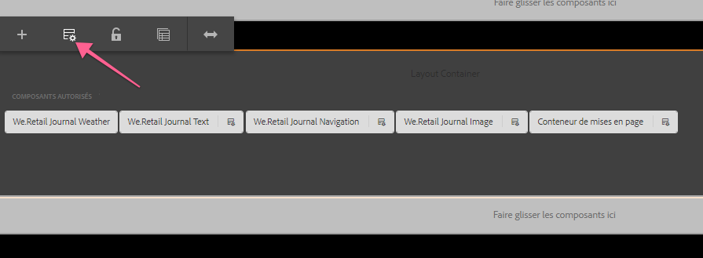

   Sous **[!UICONTROL Propriétés]** > **[!UICONTROL Composants autorisés]**, recherchez **[!DNL Custom Components]**. Vous devriez voir le composant **[!DNL Hello World]**, puis le sélectionner. Enregistrez vos modifications en cochant la case située dans le coin supérieur droit.

   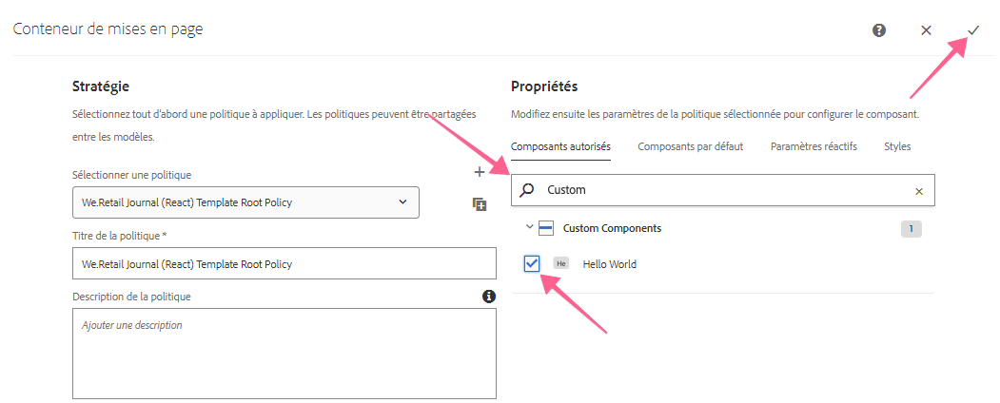

1. Après l’enregistrement, vous devriez voir le composant **[!DNL HelloWorld]** comme composant autorisé dans le [!UICONTROL Conteneur de mise en page].

   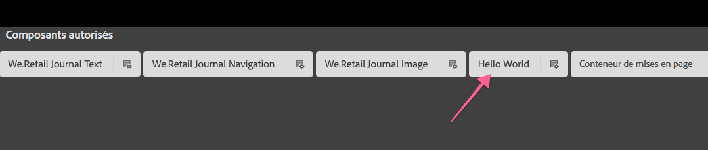

   >[!NOTE]
   >
   > Seuls AEM 6.5 et AEM 6.4.5 prennent en charge la fonction Modèle modifiable de l’éditeur de SPA. Si vous utilisez AEM 6.4, vous devez configurer manuellement la stratégie pour les composants autorisés par le biais du CRXDE Lite : `/conf/we-retail-journal/react/settings/wcm/policies/wcm/foundation/components/responsivegrid/default` ou `/conf/we-retail-journal/angular/settings/wcm/policies/wcm/foundation/components/responsivegrid/default`

   CRXDE Lite présentant les configurations de stratégie mises à jour pour [!UICONTROL Composants autorisés] dans le [!UICONTROL Conteneur de mise en page] :

   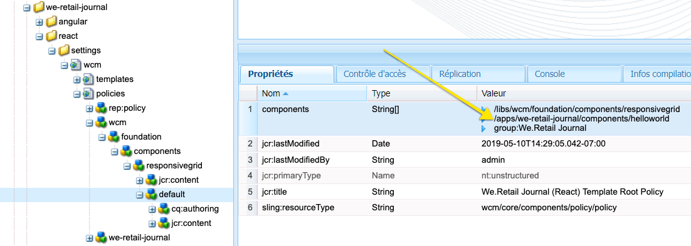

## Assemblage {#putting-together}

1. Accédez aux pages Angular ou React :

   * [http://localhost:4502/editor.html/content/we-retail-journal/react/en/home.html](http://localhost:4502/editor.html/content/we-retail-journal/react/en/home.html)
   * [http://localhost:4502/editor.html/content/we-retail-journal/angular/en/home.html](http://localhost:4502/editor.html/content/we-retail-journal/angular/en/home.html)

1. Recherchez le composant **[!DNL Hello World]** et faites glisser et déposez le composant **[!DNL Hello World]** sur la page.

   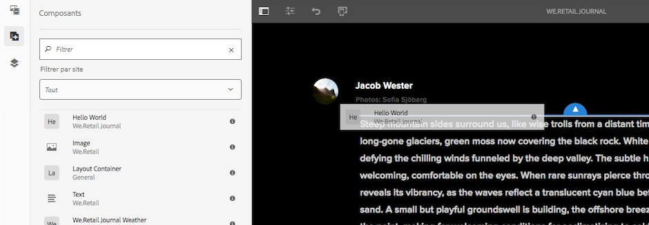

   L’espace réservé doit apparaître.

   

1. Sélectionnez le composant et ajoutez un message dans la boîte de dialogue, par exemple &quot;Monde&quot; ou &quot;Votre nom&quot;. Enregistrez les modifications.

   

   Notez que la chaîne &quot;Hello&quot; est toujours précédée du message. Il s&#39;agit du résultat de la logique de `HelloWorld.java` [!DNL Sling Model].

## Étapes suivantes {#next-steps}

[Solution terminée pour le composant HelloWorld](assets/spa-editor-helloworld-tutorial-use/aem-sample-we-retail-journal-HelloWorldSolution.zip)

* Code source complet pour [[!DNL We.Retail Journal] sur GitHub](https://github.com/adobe/aem-sample-we-retail-journal)
* Consultez un didacticiel plus détaillé sur le développement de Réagir avec [[!DNL Getting Started with the AEM SPA Editor - WKND Tutorial]](https://helpx.adobe.com/experience-manager/kt/sites/using/getting-started-spa-wknd-tutorial-develop.html)

## Résolution des incidents {#troubleshooting}

### Impossible de créer le projet dans Eclipse {#unable-to-build-project-in-eclipse}

**Erreur :** Erreur lors de l&#39;importation du  [!DNL We.Retail Journal] projet dans Eclipse pour les exécutions d&#39;objectif non reconnues :

`Execution npm install, Execution npm run build, Execution default-analyze-classes*`


**Résolution** : Cliquez sur Terminer pour les résoudre ultérieurement. Cela ne doit pas empêcher l&#39;achèvement du tutoriel.

**Erreur** : Le module React  `react-app`ne se construit pas correctement lors d&#39;une génération Maven.

**Résolution :** Essayez de supprimer le  `node_modules` dossier situé sous l&#39;application  **réagir**. Réexécutez la commande Apache Maven `mvn  clean install -PautoInstallSinglePackage` à partir de la racine du projet.

### Dépendances insatisfaites dans AEM {#unsatisfied-dependencies-in-aem}

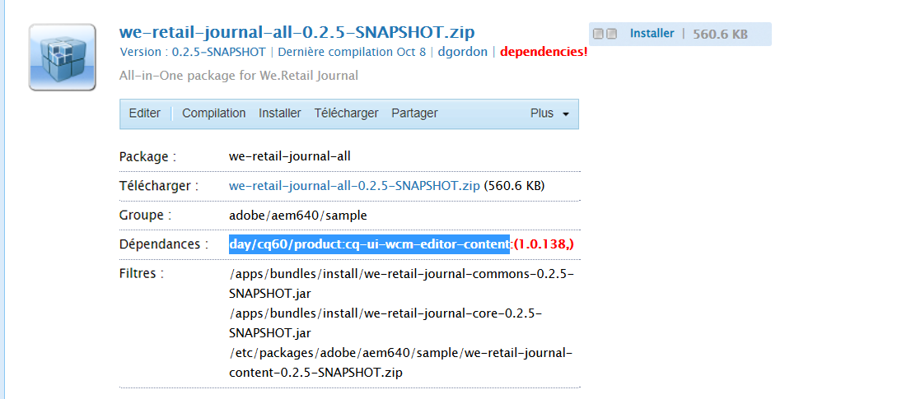

Si une dépendance d&#39;AEM n&#39;est pas satisfaite, que ce soit dans le **[!UICONTROL AEM Package Manager]** ou dans la **[!UICONTROL console Web]** (console Felix), cela indique que la fonction de l&#39;éditeur de  n&#39;est pas disponible.

### Le composant ne s&#39;affiche pas

**Erreur** : Même après un déploiement réussi et la vérification que les versions compilées des applications React/Angular comportent le  `helloworld` composant mis à jour, mon composant ne s’affiche pas lorsque je le fais glisser sur la page. Je peux voir le composant dans l’interface utilisateur AEM.

**Résolution** : Effacez l&#39;historique/le cache de votre navigateur et/ou ouvrez un nouveau navigateur ou utilisez le mode Incognito. Si cela ne fonctionne pas, invalidez le cache de bibliothèque client sur l’instance d’AEM locale. aem tente de mettre en cache de grandes bibliothèques clientes afin d&#39;être efficace. Il peut arriver que l’invalidation manuelle du cache soit nécessaire pour résoudre les problèmes de mise en cache du code obsolète.

Accédez à : [http://localhost:4502/libs/granite/ui/content/dumplibs.rebuild.html](http://localhost:4502/libs/granite/ui/content/dumplibs.rebuild.html) et cliquez sur Invalider le cache. Revenez à votre page Réagir/Angulaire et actualisez la page.


