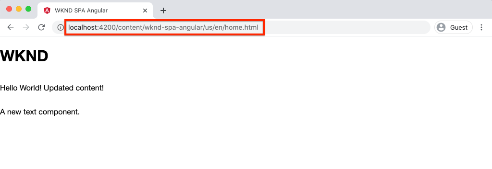

# Intégration d’une application d’une seule page {#integrate-spa}

Comprenez comment le code source d’une application d’une seule page (SPA) écrite en angular peut être intégré à un projet Adobe Experience Manager (AEM). Apprenez à utiliser des outils frontaux modernes, comme un serveur de développement webpack, pour développer rapidement l’application d’une seule page par rapport à l’API de modèle JSON AEM.

## Intention

1. Comprendre comment le projet SPA est intégré à l’AEM avec les bibliothèques côté client.
2. Découvrez comment utiliser un serveur de développement local pour le développement frontal dédié.
3. Explorez l’utilisation d’un **proxy** et d’un fichier **fictif** statique pour le développement par rapport à l’API de modèle JSON AEM.

## Ce que vous allez construire

Ce chapitre ajoute un `Header` composant simple à l’application d’une seule page. Dans le processus d&#39;élaboration de ce `Header` composant statique, on utilisera plusieurs approches pour élaborer AEM ZPS.


*L’application d’une seule page est étendue pour ajouter un`Header`composant statique.*

## Conditions préalables

Examiner les outils et les instructions nécessaires à la mise en place d&#39;un environnement [de développement](overview.md#local-dev-environment)local.

### Obtention du code

1. Téléchargez le point de départ de ce didacticiel via Git :

   ```shell
   $ git clone git@github.com:adobe/aem-guides-wknd-spa.git
   $ cd aem-guides-wknd-spa
   $ git checkout Angular/integrate-spa-start
   ```

2. Déployez la base de code sur une instance AEM locale à l’aide de Maven :

   ```shell
   $ mvn clean install -PautoInstallSinglePackage
   ```

   Si vous utilisez [AEM 6.x](overview.md#compatibility) , ajoutez le `classic` profil :

   ```shell
   $ mvn clean install -PautoInstallSinglePackage -Pclassic
   ```

Vous pouvez toujours vue le code fini sur [GitHub](https://github.com/adobe/aem-guides-wknd-spa/tree/Angular/integrate-spa-solution) ou le retirer localement en passant à la branche `Angular/integrate-spa-solution`.

## Approche d&#39;intégration {#integration-approach}

Deux modules ont été créés dans le cadre du projet AEM : `ui.apps` et `ui.frontend`.

Le `ui.frontend` module est un projet [webpack](https://webpack.js.org/) qui contient tout le code source de l’application d’une seule page. La majorité des travaux de développement et de test de l’application d’une seule page seront réalisés dans le projet webpack. Lorsqu’une génération de production est déclenchée, l’application d’une seule page est créée et compilée à l’aide de webpack. Les artefacts compilés (CSS et Javascript) sont copiés dans le `ui.apps` module qui est ensuite déployé sur l’exécution AEM.


*Description de haut niveau de l’intégration de l’application d’une seule page.*

Des informations supplémentaires sur la version frontale sont [disponibles ici](https://docs.adobe.com/content/help/en/experience-manager-core-components/using/developing/archetype/uifrontend-angular.html).

## inspect : intégration de l’application d’une seule page {#inspect-spa-integration}

Ensuite, examinez le `ui.frontend` module pour comprendre l’application d’une seule page qui a été générée automatiquement par l’archétype [du projet](https://docs.adobe.com/content/help/en/experience-manager-core-components/using/developing/archetype/uifrontend-angular.html)AEM.

1. Dans l&#39;IDE de votre choix, ouvrez l&#39;AEM Project for the WKND SPA. Ce didacticiel utilisera l&#39;IDE [du code](https://docs.adobe.com/content/help/en/experience-manager-learn/cloud-service/local-development-environment-set-up/development-tools.html#microsoft-visual-studio-code)Visual Studio.

   

2. Développez et inspectez le `ui.frontend` dossier. Open the file `ui.frontend/package.json`

3. Sous `dependencies` cette page, vous trouverez plusieurs informations relatives à `@angular`:

   ```json
   "@angular/animations": "~9.1.11",
   "@angular/common": "~9.1.11",
   "@angular/compiler": "~9.1.11",
   "@angular/core": "~9.1.11",
   "@angular/forms": "~9.1.10",
   "@angular/platform-browser": "~9.1.10",
   "@angular/platform-browser-dynamic": "~9.1.10",
   "@angular/router": "~9.1.10",
   ```

   Le `ui.frontend` module est une application [](https://angular.io) angulaire générée à l’aide de l’outil [d’interface de ligne de commande](https://angular.io/cli) angulaire qui inclut le routage.

4. Il existe également trois dépendances avec `@adobe`:

   ```json
   "@adobe/cq-angular-editable-components": "^2.0.2",
   "@adobe/cq-spa-component-mapping": "^1.0.3",
   "@adobe/cq-spa-page-model-manager": "^1.1.3",
   ```

   Les modules ci-dessus constituent l’ [SPA Editor JS SDK](https://docs.adobe.com/content/help/en/experience-manager-65/developing/headless/spas/spa-blueprint.html) et offrent la fonctionnalité permettant de mapper les composants SPA à AEM Composants.

5. Dans le `package.json` fichier, plusieurs `scripts` sont définis :

   ```json
   "scripts": {
       "start": "ng serve --open --proxy-config ./proxy.conf.json",
       "build": "ng lint && ng build && clientlib",
       "build:production": "ng lint && ng build --prod && clientlib",
       "test": "ng test",
       "sync": "aemsync -d -w ../ui.apps/src/main/content"
   }
   ```

   Ces scripts sont basés sur des commandes [d’interface de ligne de commande](https://angular.io/cli/build) angulaire courantes, mais ont été légèrement modifiés pour fonctionner avec le projet d’AEM plus vaste.

   `start` - exécute l’application Angular localement à l’aide d’un serveur Web local. Il a été mis à jour pour représenter le contenu de l’instance AEM locale.

   `build` - compile l’application Angular pour la distribution en production. L’ajout de `&& clientlib` est responsable de la copie de l’application d’une seule page dans le `ui.apps` module en tant que bibliothèque côté client lors de la génération. Le module npm [aem-clientlib-generator](https://github.com/wcm-io-frontend/aem-clientlib-generator) est utilisé pour faciliter cela.

   Vous trouverez plus de détails sur les scripts disponibles [ici](https://docs.adobe.com/content/help/en/experience-manager-core-components/using/developing/archetype/uifrontend-angular.html).

6. inspect le fichier `ui.frontend/clientlib.config.js`. Ce fichier de configuration est utilisé par [aem-clientlib-generator](https://github.com/wcm-io-frontend/aem-clientlib-generator#clientlibconfigjs) pour déterminer comment générer la bibliothèque cliente.

7. inspect le fichier `ui.frontend/pom.xml`. Ce fichier transforme le `ui.frontend` dossier en module [](http://maven.apache.org/guides/mini/guide-multiple-modules.html)Maven. Le `pom.xml` fichier a été mis à jour afin d’utiliser le [module externe](https://github.com/eirslett/frontend-maven-plugin) frontend-maven pour **tester** et **créer** l’application d’une seule page pendant une génération Maven.

8. inspect le fichier `app.component.ts` à l&#39;adresse `ui.frontend/src/app/app.component.ts`:

   ```js
   import { Constants } from '@adobe/cq-angular-editable-components';
   import { ModelManager } from '@adobe/cq-spa-page-model-manager';
   import { Component } from '@angular/core';
   
   @Component({
   selector: '#spa-root', // tslint:disable-line
   styleUrls: ['./app.component.css'],
   templateUrl: './app.component.html'
   })
   export class AppComponent {
       ...
   
       constructor() {
           ModelManager.initialize().then(this.updateData);
       }
   
       private updateData = pageModel => {
           this.path = pageModel[Constants.PATH_PROP];
           this.items = pageModel[Constants.ITEMS_PROP];
           this.itemsOrder = pageModel[Constants.ITEMS_ORDER_PROP];
       }
   }
   ```

   `app.component.js` est le point d&#39;entrée du SPA. `ModelManager` est fourni par l’AEM SPA Editor JS SDK. Il est chargé d’appeler et d’injecter le `pageModel` (contenu JSON) dans l’application.

## ajouter un composant d’en-tête {#header-component}

Ensuite, ajoutez un nouveau composant à l’application d’une seule page et déployez les modifications sur une instance AEM locale pour voir l’intégration.

1. Ouvrez une nouvelle fenêtre de terminal et accédez au `ui.frontend` dossier :

   ```shell
   $ cd aem-guides-wknd-spa/ui.frontend
   ```

2. Installer l&#39;interface de ligne de commande [angulaire](https://angular.io/cli#installing-angular-cli) globalement Cette interface est utilisée pour générer des composants angulaires ainsi que pour créer et servir l&#39;application angulaire via la commande **ng** .

   ```shell
   $ npm install -g @angular/cli
   ```

   >[!CAUTION]
   >
   > La version de **@angular/cli** utilisée par ce projet est **9.1.7**. Il est recommandé de conserver la synchronisation des versions de l’interface de ligne de commande angulaire.

3. Créez un nouveau `Header` composant en exécutant la commande d’interface de ligne de commande angulaire à partir du `ng generate component` `ui.frontend` dossier.

   ```shell
   $ ng generate component components/header
   
   CREATE src/app/components/header/header.component.css (0 bytes)
   CREATE src/app/components/header/header.component.html (21 bytes)
   CREATE src/app/components/header/header.component.spec.ts (628 bytes)
   CREATE src/app/components/header/header.component.ts (269 bytes)
   UPDATE src/app/app.module.ts (1809 bytes)
   ```

   Cela créera un squelette pour le nouveau composant En-tête angulaire à `ui.frontend/src/app/components/header`.

4. Ouvrez le `aem-guides-wknd-spa` projet dans l&#39;IDE de votre choix. Accédez au dossier `ui.frontend/src/app/components/header`. 

   

5. Ouvrez le fichier `header.component.html` et remplacez le contenu par ce qui suit :

   ```html
   <!--/* header.component.html */-->
   <header className="header">
       <div className="header-container">
           <h1>WKND</h1>
       </div>
   </header>
   ```

   Notez que cette option affiche le contenu statique, de sorte que ce composant angulaire ne nécessite aucun ajustement par rapport au contenu généré par défaut `header.component.ts`.

6. Ouvrez le fichier **app.component.html** dans `ui.frontend/src/app/app.component.html`. Ajoutez le composant `app-header`:

   ```html
   <app-header></app-header>
   <router-outlet></router-outlet>
   ```

   Cela inclut le `header` composant au-dessus du contenu de la page.

7. Ouvrez un nouveau terminal, accédez au `ui.frontend` dossier et exécutez la `npm run build` commande :

   ```shell
   $ cd ui.frontend
   $ npm run build
   
   Linting "angular-app"...
   All files pass linting.
   Generating ES5 bundles for differential loading...
   ES5 bundle generation complete.
   ```

8. Accédez au dossier `ui.apps`. Vous `ui.apps/src/main/content/jcr_root/apps/wknd-spa-angular/clientlibs/clientlib-angular` devriez voir que les fichiers SPA compilés ont été copiés à partir du dossier`ui.frontend/build` .

   

9. Revenez au terminal et accédez au `ui.apps` dossier. Exécutez la commande expert suivante :

   ```shell
   $ cd ../ui.apps
   $ mvn clean install -PautoInstallPackage
   ...
   [INFO] ------------------------------------------------------------------------
   [INFO] BUILD SUCCESS
   [INFO] ------------------------------------------------------------------------
   [INFO] Total time:  9.629 s
   [INFO] Finished at: 2020-05-04T17:48:07-07:00
   [INFO] ------------------------------------------------------------------------
   ```

   Le `ui.apps` package sera alors déployé sur une instance d’exécution locale de l’AEM.

10. Ouvrez un onglet de navigateur et accédez à [http://localhost:4502/editor.html/content/wknd-spa-angular/us/en/home.html](http://localhost:4502/editor.html/content/wknd-spa-angular/us/en/home.html). Vous devriez maintenant voir le contenu du `Header` composant affiché dans l’application d’une seule page.

   

   Les étapes **7 à 9** sont exécutées automatiquement lors du déclenchement d’une génération Maven à partir de la racine du projet (c.-à-d. `mvn clean install -PautoInstallSinglePackage`). Vous devez maintenant comprendre les principes de base de l’intégration entre l’application d’une seule page et AEM bibliothèques côté client. Vous pouvez toujours modifier et ajouter `Text` des composants dans AEM, mais le `Header` composant n’est pas modifiable.

## Webpack Dev Server - Proxy de l’API JSON {#proxy-json}

Comme nous l’avons vu dans les exercices précédents, la génération et la synchronisation de la bibliothèque cliente vers une instance locale d’AEM prend quelques minutes. Ceci est acceptable pour les tests finaux, mais n&#39;est pas idéal pour la majorité du développement de l&#39;application d&#39;une seule page.

Un serveur [de développement](https://webpack.js.org/configuration/dev-server/) webpack peut être utilisé pour développer rapidement l’application d’une seule page. L’application d’une seule page est pilotée par un modèle JSON généré par AEM. Dans cet exercice, le contenu JSON d’une instance en cours d’exécution d’AEM sera **propagé** au serveur de développement configuré par le projet [](https://angular.io/guide/build)Angular.

1. Revenez à l&#39;IDE et ouvrez le fichier **proxy.conf.json** à `ui.frontend/proxy.conf.json`.

   ```json
   [
       {
           "context": [
                       "/content/**/*.(jpg|jpeg|png|model.json)",
                       "/etc.clientlibs/**/*"
                   ],
           "target": "http://localhost:4502",
           "auth": "admin:admin",
           "logLevel": "debug"
       }
   ]
   ```

   L’application [](https://angular.io/guide/build#proxying-to-a-backend-server) Angular fournit un mécanisme facile pour répondre aux demandes d’API de proxy. Les modèles spécifiés dans `context` sont proxiés par `localhost:4502`, l&#39;AEM locale démarrage rapide.

2. Ouvrez le fichier **index.html** dans `ui.frontend/src/index.html`. Il s’agit du fichier HTML racine utilisé par le serveur de développement.

   Notez qu&#39;il y a une entrée pour `base href="/"`. La balise [de](https://angular.io/guide/deployment#the-base-tag) base est essentielle pour que l’application résolve les URL relatives.

   ```html
   <base href="/">
   ```

3. Ouvrez une fenêtre de terminal et accédez au `ui.frontend` dossier. Exécutez la commande `npm start`:

   ```shell
   $ cd ui.frontend
   $ npm start
   
   > wknd-spa-angular@0.1.0 start /Users/dgordon/Documents/code/aem-guides-wknd-spa/ui.frontend
   > ng serve --open --proxy-config ./proxy.conf.json
   
   10% building 3/3 modules 0 active[HPM] Proxy created: [ '/content/**/*.(jpg|jpeg|png|model.json)', '/etc.clientlibs/**/*' ]  ->  http://localhost:4502
   [HPM] Subscribed to http-proxy events:  [ 'error', 'close' ]
   ℹ ｢wds｣: Project is running at http://localhost:4200/webpack-dev-server/
   ℹ ｢wds｣: webpack output is served from /
   ℹ ｢wds｣: 404s will fallback to //index.html
   ```

4. Ouvrez un nouvel onglet de navigateur (s’il n’est pas déjà ouvert) et accédez à [http://localhost:4200/content/wknd-spa-angular/us/en/home.html](http://localhost:4200/content/wknd-spa-angular/us/en/home.html).

   

   Vous devriez voir le même contenu que dans AEM, mais sans aucune des fonctionnalités de création activées.

5. Revenez à l&#39;IDE et créez un nouveau dossier nommé `img` à `ui.frontend/src/assets`.
6. Téléchargez et ajoutez le logo WKND suivant dans le `img` dossier :

   

7. Ouvrez **header.component.html** dans `ui.frontend/src/app/components/header/header.component.html` et incluez le logo :

   ```html
   <header class="header">
       <div class="header-container">
           <div class="logo">
               
           </div>
       </div>
   </header>
   ```

   Enregistrez les modifications dans **header.component.html**.

8. Revenez au navigateur. Les modifications apportées à l’application doivent être immédiatement répercutées.

   

   Vous pouvez continuer à mettre à jour le contenu dans **AEM** et à le voir se refléter dans le serveur **de développement** webpack, puisque nous effectuons un proxy pour le contenu. Notez que les modifications de contenu ne sont visibles que sur le serveur **de développement** webpack.

9. Arrêtez le serveur Web local avec `ctrl+c` dans le terminal.

## Serveur de développement Webpack - API JSON masqué {#mock-json}

Une autre méthode de développement rapide consiste à utiliser un fichier JSON statique pour faire office de modèle JSON. En &quot;moquant&quot; le fichier JSON, nous supprimons la dépendance sur une instance AEM locale. Il permet également à un développeur frontal de mettre à jour le modèle JSON afin de tester les fonctionnalités et d’apporter des modifications à l’API JSON qui seront ensuite implémentées par un développeur principal.

La configuration initiale du simulateur JSON **nécessite une instance** d’AEM locale.

1. Dans le navigateur, accédez à [http://localhost:4502/content/wknd-spa-angular/us/en.model.json](http://localhost:4502/content/wknd-spa-angular/us/en.model.json).

   Il s’agit du fichier JSON exporté par AEM qui dirige l’application. Copiez la sortie JSON.

2. Revenez à l&#39;IDE, accédez à `ui.frontend/src` et ajoutez de nouveaux dossiers nommés **mocks** et **json** pour qu&#39;ils correspondent à la structure de dossiers suivante :

   ```plain
   |-- ui.frontend
       |-- src
           |-- mocks
               |-- json
   ```

3. Créez un nouveau fichier nommé **en.model.json** sous `ui.frontend/public/mocks/json`. Collez ici la sortie JSON de l’ **étape 1** .

   

4. Créez un nouveau fichier **proxy.mock.conf.json** sous `ui.frontend`. Remplissez le fichier avec les éléments suivants :

   ```json
   [
       {
       "context": [
           "/content/**/*.model.json"
       ],
       "pathRewrite": { "^/content/wknd-spa-angular/us" : "/mocks/json"} ,
       "target": "http://localhost:4200",
       "logLevel": "debug"
       }
   ]
   ```

   Cette configuration de proxy réécrit les requêtes qui début avec `/content/wknd-spa-angular/us` et `/mocks/json` diffuse le fichier JSON statique correspondant, par exemple :

   ```plain
   /content/wknd-spa-angular/us/en.model.json -> /mocks/json/en.model.json
   ```

5. Open the file **angular.json**. ajoutez une nouvelle configuration de **développement** avec un tableau de **ressources** mis à jour pour référencer le dossier **mocks** créé.

   ```json
    "dev": {
             "assets": [
               "src/mocks",
               "src/assets",
               "src/favicon.ico",
               "src/logo192.png",
               "src/logo512.png",
               "src/manifest.json"
             ]
       },
   ```

   

   La création d’une configuration de **développement** dédiée permet de s’assurer que le dossier **mocks** n’est utilisé que pendant le développement et n’est jamais déployé sur AEM dans une génération de production.

6. Dans le fichier **angular.json** , mettez à jour la configuration **browserTarget** pour utiliser la nouvelle configuration **dev** :

   ```diff
     ...
     "serve": {
         "builder": "@angular-devkit/build-angular:dev-server",
         "options": {
   +       "browserTarget": "angular-app:build:dev"
   -       "browserTarget": "angular-app:build"
         },
     ...
   ```

   

7. Ouvrez le fichier `ui.frontend/package.json` et ajoutez une nouvelle commande **début:mock** pour référencer le fichier **proxy.mock.conf.json** .

   ```diff
       "scripts": {
           "start": "ng serve --open --proxy-config ./proxy.conf.json",
   +       "start:mock": "ng serve --open --proxy-config ./proxy.mock.conf.json",
           "build": "ng lint && ng build && clientlib",
           "build:production": "ng lint && ng build --prod && clientlib",
           "test": "ng test",
           "sync": "aemsync -d -w ../ui.apps/src/main/content"
       }
   ```

   ajouter une nouvelle commande permet de basculer facilement entre les configurations de proxy.

8. Si l’application est en cours d’exécution, arrêtez le serveur **de développement de** webpack. Début du serveur **de développement** webpack **à l’aide du script** début:mock:

   ```shell
   $ npm run start:mock
   
   > wknd-spa-angular@0.1.0 start:mock /Users/dgordon/Documents/code/aem-guides-wknd-spa/ui.frontend
   > ng serve --open --proxy-config ./proxy.mock.conf.json
   ```

   Accédez à [http://localhost:4200/content/wknd-spa-angular/us/en/home.html](http://localhost:4200/content/wknd-spa-angular/us/en/home.html) et vous devriez voir la même application d’une seule page, mais le contenu est maintenant extrait du fichier **JSON simulé** .

9. Apportez une petite modification au fichier **en.model.json** créé précédemment. Le contenu mis à jour doit immédiatement être reflété dans le serveur **de développement de** webpack.

   

   Être en mesure de manipuler le modèle JSON et de voir ses effets sur une application d’une seule page peut aider un développeur à comprendre l’API du modèle JSON. Il permet également le développement frontal et dorsal en parallèle.

## ajouter des styles avec Sass

Ensuite, un style mis à jour sera ajouté au projet. Ce projet va ajouter la prise en charge de [Sass](https://sass-lang.com/) pour quelques fonctionnalités utiles comme les variables.

1. Ouvrez une fenêtre de terminal et arrêtez le serveur **de développement** webpack si vous démarrez. Dans le `ui.frontend` dossier, saisissez la commande suivante pour mettre à jour l’application Angular afin de traiter les fichiers **.scss** .

   ```shell
   $ cd ui.frontend
   $ ng config schematics.@schematics/angular:component.styleext scss
   ```

   Le fichier sera mis à jour avec une nouvelle entrée au bas du fichier `angular.json` :

   ```json
   "schematics": {
       "@schematics/angular:component": {
       "styleext": "scss"
       }
   }
   ```

2. Installer `normalize-scss` pour normaliser les styles dans les différents navigateurs :

   ```shell
   $ npm install normalize-scss --save
   ```

3. Revenez à l&#39;IDE et sous `ui.frontend/src` créer un nouveau dossier nommé `styles`.
4. Créez un nouveau fichier sous `ui.frontend/src/styles` le nom `_variables.scss` et renseignez-le avec les variables suivantes :

   ```scss
   //_variables.scss
   
   //== Colors
   //
   //## Gray and brand colors for use across theme.
   
   $black:                  #202020;
   $gray:                   #696969;
   $gray-light:             #EBEBEB;
   $gray-lighter:           #F7F7F7;
   $white:                  #FFFFFF;
   $yellow:                 #FFEA00;
   $blue:                   #0045FF;
   
   
   //== Typography
   //
   //## Font, line-height, and color for body text, headings, and more.
   
   $font-family-sans-serif:  "Helvetica Neue", Helvetica, Arial, sans-serif;
   $font-family-serif:       Georgia, "Times New Roman", Times, serif;
   $font-family-base:        $font-family-sans-serif;
   $font-size-base:          18px;
   
   $line-height-base:        1.5;
   $line-height-computed:    floor(($font-size-base * $line-height-base));
   
   // Functional Colors
   $brand-primary:             $yellow;
   $body-bg:                   $white;
   $text-color:                $black;
   $text-color-inverse:        $gray-light;
   $link-color:                $blue;
   
   //Layout
   $max-width: 1024px;
   $header-height: 75px;
   
   // Spacing
   $gutter-padding: 12px;
   ```

5. Renommez à nouveau l’extension du fichier **styles.css** sur `ui.frontend/src/styles.css` styles.scss ****. Remplacez le contenu par le texte suivant :

   ```scss
   /* styles.scss * /
   
   /* Normalize */
   @import '~normalize-scss/sass/normalize';
   
   @import './styles/variables';
   
   body {
       background-color: $body-bg;
       font-family: $font-family-base;
       margin: 0;
       padding: 0;
       font-size: $font-size-base;
       text-align: left;
       color: $text-color;
       line-height: $line-height-base;
   }
   
   body.page {
       max-width: $max-width;
       margin: 0 auto;
       padding: $gutter-padding;
       padding-top: $header-height;
   }
   ```

6. Mettez à jour **angular.json** et renommez toutes les références à **style.css** avec **styles.scss**. Il devrait y avoir 3 références.

   ```diff
     "styles": [
   -    "src/styles.css"
   +    "src/styles.scss"
      ],
   ```

## Mettre à jour les styles d’en-tête

Ajoutez ensuite des styles spécifiques à la marque au composant **En-tête** à l’aide de Sass.

1. Début le serveur **de développement de** webpackpour voir les styles mis à jour en temps réel :

   ```shell
   $ npm run start:mock
   ```

2. Sous `ui.frontend/src/app/components/header` renommer **header.component.css** en **header.component.scss**. Remplissez le fichier avec les éléments suivants :

   ```scss
   @import "~src/styles/variables";
   
   .header {
       width: 100%;
       position: fixed;
       top: 0;
       left:0;
       z-index: 99;
       background-color: $brand-primary;
       box-shadow: 0px 0px 10px 0px rgba(0, 0, 0, 0.24);
   }
   
   .header-container {
       display: flex;
       max-width: $max-width;
       margin: 0 auto;
       padding-left: $gutter-padding;
       padding-right: $gutter-padding;
   }
   
   .logo {
       z-index: 100;
       display: flex;
       padding-top: $gutter-padding;
       padding-bottom: $gutter-padding;
   }
   
   .logo-img {
       width: 100px;
   }
   ```

3. Mettez à jour **header.component.js** pour référencer **header.component.scss**:

   ```diff
   ...
     @Component({
       selector: 'app-header',
       templateUrl: './header.component.html',
   -   styleUrls: ['./header.component.css']
   +   styleUrls: ['./header.component.scss']
     })
   ...
   ```

4. Revenez au navigateur et au serveur **de développement** webpack:

   

   Vous devriez maintenant voir les styles mis à jour ajoutés au composant **En-tête** .

## Déployer les mises à jour de l’application d’une seule page sur AEM

Actuellement, les modifications apportées à l’ **en-tête** ne sont visibles que par le biais du serveur **de développement** webpack. Déployez l’application d’une seule page pour AEM voir les modifications.

1. Arrêtez le serveur **de développement** webpack.
2. Accédez à la racine du projet `/aem-guides-wknd-spa` et déployez le projet vers AEM à l’aide de Maven :

   ```shell
   $ cd ..
   $ mvn clean install -PautoInstallSinglePackage
   ```

3. Accédez à [http://localhost:4502/editor.html/content/wknd-spa-angular/us/en/home.html](http://localhost:4502/editor.html/content/wknd-spa-angular/us/en/home.html). Vous devriez voir l’en-tête **** mis à jour avec le logo et les styles appliqués :

   

   Maintenant que l’application d’une seule page est en cours d’AEM, la création peut se poursuivre.

## Félicitations ! {#congratulations}

Félicitations, vous avez mis à jour l&#39;APS et exploré l&#39;intégration avec AEM ! Vous connaissez maintenant deux approches différentes pour développer l’application d’une seule page par rapport à l’API de modèle JSON AEM à l’aide d’un serveur **de développement** webpack.

Vous pouvez toujours vue le code fini sur [GitHub](https://github.com/adobe/aem-guides-wknd-spa/tree/Angular/integrate-spa-solution) ou le retirer localement en passant à la branche `Angular/integrate-spa-solution`.

### Étapes suivantes {#next-steps}

[Mapper des composants SPA aux composants](map-components.md) AEM - Découvrez comment mapper des composants Angular aux composants Adobe Experience Manager (AEM) avec le SDK JS de l&#39;éditeur SPA AEM. Le mappage de composants permet aux auteurs d’effectuer des mises à jour dynamiques des composants d’une application d’une seule page dans AEM éditeur d’applications d’une seule page, à l’instar de la création AEM traditionnelle.
