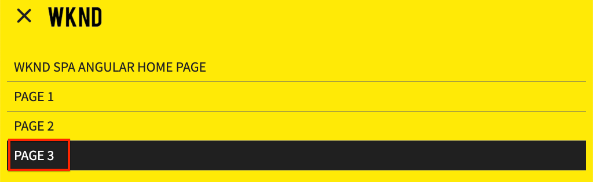

# Ajouter la navigation et le routage {#navigation-routing}

Découvrez comment plusieurs vues de la SPA sont prises en charge à l’aide de AEM Pages et du SDK de l’éditeur SPA. La navigation dynamique est implémentée à l’aide des itinéraires angulaires et ajoutée à un composant d’en-tête existant.

## Intention

1. Découvrez les options de routage de modèle SPA disponibles lors de l’utilisation de l’éditeur de SPA.
2. Apprenez à utiliser [routage angulaire](https://angular.io/guide/router) pour naviguer entre les différentes vues du SPA.
3. Implémentez une navigation dynamique pilotée par la hiérarchie des pages AEM.

## Ce que vous allez construire

Ce chapitre ajoute un menu de navigation à un composant `Header` existant. Le menu de navigation est piloté par la hiérarchie des pages AEM et utilise le modèle JSON fourni par le [composant principal de navigation](https://docs.adobe.com/content/help/fr/experience-manager-core-components/using/components/navigation.html).


## Conditions préalables

Examinez les outils et les instructions nécessaires pour configurer un [environnement de développement local](overview.md#local-dev-environment).

### Obtention du code

1. Téléchargez le point de départ de ce didacticiel via Git :

   ```shell
   $ git clone git@github.com:adobe/aem-guides-wknd-spa.git
   $ cd aem-guides-wknd-spa
   $ git checkout Angular/navigation-routing-start
   ```

2. Déployez la base de code sur une instance AEM locale à l’aide de Maven :

   ```shell
   $ mvn clean install -PautoInstallSinglePackage
   ```

   Si vous utilisez [AEM 6.x](overview.md#compatibility), ajoutez le profil `classic` :

   ```shell
   $ mvn clean install -PautoInstallSinglePackage -Pclassic
   ```

3. Installez le package fini pour le site de référence traditionnel [WKND](https://github.com/adobe/aem-guides-wknd/releases/latest). Les images fournies par [le site de référence WKND](https://github.com/adobe/aem-guides-wknd/releases/latest) seront réutilisées sur le SPA WKND. Le package peut être installé à l’aide de [AEM Package Manager](http://localhost:4502/crx/packmgr/index.jsp).

   

Vous pouvez toujours vue le code terminé sur [GitHub](https://github.com/adobe/aem-guides-wknd-spa/tree/Angular/navigation-routing-solution) ou vérifier le code localement en passant à la branche `Angular/navigation-routing-solution`.

## Mise à jour du composant d’en-tête Inspect {#inspect-header}

Dans les chapitres précédents, le composant `HeaderComponent` a été ajouté en tant que composant angulaire pur inclus par `app.component.html`. Dans ce chapitre, le composant `HeaderComponent` est supprimé de l’application et sera ajouté via l’[éditeur de modèles](https://docs.adobe.com/content/help/en/experience-manager-learn/sites/page-authoring/template-editor-feature-video-use.html). Cela permet aux utilisateurs de configurer le menu de navigation de `HeaderComponent` depuis l&#39;AEM.

>[!NOTE]
>
> Plusieurs mises à jour CSS et JavaScript ont déjà été apportées à la base de code pour début ce chapitre. Pour vous concentrer sur les concepts de base, et non **tous** des changements de code sont abordés. Vous pouvez vue les modifications complètes [ici](https://github.com/adobe/aem-guides-wknd-spa/compare/Angular/map-components-solution...Angular/navigation-routing-start).

1. Dans l&#39;IDE de votre choix, ouvrez le projet de démarrage SPA pour ce chapitre.
2. Sous le module `ui.frontend`, inspectez le fichier `header.component.ts` à l&#39;adresse : `ui.frontend/src/app/components/header/header.component.ts`.

   Plusieurs mises à jour ont été effectuées, notamment l&#39;ajout d&#39;un `HeaderEditConfig` et d&#39;un `MapTo` pour permettre le mappage du composant à un composant AEM `wknd-spa-angular/components/header`.

   ```js
   /* header.component.ts */
   ...
   const HeaderEditConfig = {
       ...
   };
   
   @Component({
   selector: 'app-header',
   templateUrl: './header.component.html',
   styleUrls: ['./header.component.scss']
   })
   export class HeaderComponent implements OnInit {
   @Input() items: object[];
       ...
   }
   ...
   MapTo('wknd-spa-angular/components/header')(withRouter(Header), HeaderEditConfig);
   ```

   Notez l&#39;annotation `@Input()` pour `items`. `items` contiendra un tableau d&#39;objets de navigation transmis par AEM.

3. Dans le module `ui.apps`, inspectez la définition du composant de l&#39;AEM `Header` : `ui.apps/src/main/content/jcr_root/apps/wknd-spa-angular/components/header/.content.xml` :

   ```xml
   <?xml version="1.0" encoding="UTF-8"?>
   <jcr:root xmlns:sling="http://sling.apache.org/jcr/sling/1.0" xmlns:cq="http://www.day.com/jcr/cq/1.0"
       xmlns:jcr="http://www.jcp.org/jcr/1.0"
       jcr:primaryType="cq:Component"
       jcr:title="Header"
       sling:resourceSuperType="wknd-spa-angular/components/navigation"
       componentGroup="WKND SPA Angular - Structure"/>
   ```

   Le composant `Header` de l&#39;AEM hérite de toutes les fonctionnalités du [composant principal de navigation](https://docs.adobe.com/content/help/en/experience-manager-core-components/using/components/navigation.html) par l&#39;intermédiaire de la propriété `sling:resourceSuperType`.

## Ajouter le composant HeaderComponent au modèle de SPA {#add-header-template}

1. Ouvrez un navigateur et connectez-vous à AEM, [http://localhost:4502/](http://localhost:4502/). La base de code de démarrage doit déjà être déployée.
2. Accédez au **[!UICONTROL modèle de page SPA]** : [http://localhost:4502/editor.html/conf/wknd-spa-angular/settings/wcm/templates/spa-page-template/structure.html](http://localhost:4502/editor.html/conf/wknd-spa-angular/settings/wcm/templates/spa-page-template/structure.html).
3. Sélectionnez le **[!UICONTROL Conteneur de mise en page racine le plus à l&#39;extérieur]** et cliquez sur son icône **[!UICONTROL Stratégie]**. Veillez à **ne pas** sélectionner le **[!UICONTROL Conteneur de mise en page]** déverrouillé pour la création.

   

4. Copiez la stratégie actuelle et créez une nouvelle stratégie nommée **[!UICONTROL SPA Structure]** :

   

   Sous **[!UICONTROL Composants autorisés]** > **[!UICONTROL Général]** > sélectionnez le composant **[!UICONTROL Conteneur de mise en page]**.

   Sous **[!UICONTROL Composants autorisés]** > **[!UICONTROL WKND SPA ANGULAIRE - STRUCTURE]** > sélectionnez le composant **[!UICONTROL En-tête]** :

   

   Sous **[!UICONTROL Composants autorisés]** > **[!UICONTROL WKND SPA ANGULAIRE - Contenu]** > sélectionnez les composants **[!UICONTROL Image]** et **[!UICONTROL Texte]**. Vous devez sélectionner 4 composants au total.

   Cliquez sur **[!UICONTROL Terminé]** pour enregistrer les modifications.

5. **Actualisez la page.** Ajoutez le composant **[!UICONTROL En-tête]** au-dessus du Conteneur de mise en page **[!UICONTROL non verrouillé]** :

   

6. Sélectionnez le composant **[!UICONTROL En-tête]** et cliquez sur son icône **Stratégie** pour modifier la stratégie.

   

7. Créez une nouvelle stratégie avec un **[!UICONTROL Titre de la stratégie]** de **&quot;En-tête SPA WKND&quot;**.

   Sous **[!UICONTROL Propriétés]** :

   * Définissez **[!UICONTROL Racine de navigation]** sur `/content/wknd-spa-angular/us/en`.
   * Définissez **[!UICONTROL Exclure les niveaux racine]** sur **1**.
   * Désélectionnez **[!UICONTROL Collecter toutes les pages enfants]**.
   * Définissez **[!UICONTROL Profondeur de structure de navigation]** sur **3**.

   

   Cette opération collectera les 2 niveaux de navigation en dessous de `/content/wknd-spa-angular/us/en`.

8. Après avoir enregistré vos modifications, vous devriez voir le `Header` renseigné dans le modèle :

   

## Créer des pages enfants

Créez ensuite des pages supplémentaires dans AEM qui serviront de vues différentes dans le SPA. Nous examinerons également la structure hiérarchique du modèle JSON fourni par AEM.

1. Accédez à la console **Sites** : [http://localhost:4502/sites.html/content/wknd-spa-angular/us/en/home](http://localhost:4502/sites.html/content/wknd-spa-angular/us/en/home). Sélectionnez la **Page d&#39;accueil angulaire SPA WKND** et cliquez sur **[!UICONTROL Créer]** > **[!UICONTROL Page]** :

   

2. Sous **[!UICONTROL Modèle]** sélectionnez **[!UICONTROL SPA Page]**. Sous **[!UICONTROL Propriétés]**, entrez **&quot;Page 1&quot;** pour le **[!UICONTROL titre]** et **&quot;page-1&quot;** comme nom.

   

   Cliquez sur **[!UICONTROL Créer]** et dans la fenêtre contextuelle de la boîte de dialogue, cliquez sur **[!UICONTROL Ouvrir]** pour ouvrir la page dans l’AEM SPA Editor.

3. Ajoutez un nouveau composant **[!UICONTROL Texte]** au Conteneur principal **[!UICONTROL Disposition]**. Modifiez le composant et saisissez le texte : **&quot;Page 1&quot;** à l’aide de l’élément RTE et **H1** (vous devrez passer en mode plein écran pour modifier les éléments de paragraphe)

   

   N’hésitez pas à ajouter du contenu supplémentaire, tel qu’une image.

4. Revenez à la console AEM Sites et répétez les étapes ci-dessus, en créant une deuxième page nommée **&quot;Page 2&quot;** en tant que frère de **Page 1**. Ajoutez le contenu à **Page 2** afin qu’il soit facilement identifié.
5. Enfin, créez une troisième page, **&quot;Page 3&quot;** mais en tant qu&#39;**enfant** de **Page 2**. Une fois la hiérarchie du site terminée, elle doit se présenter comme suit :

   

6. Dans un nouvel onglet, ouvrez l’API du modèle JSON fournie par AEM : [http://localhost:4502/content/wknd-spa-angular/us/en.model.json](http://localhost:4502/content/wknd-spa-angular/us/en.model.json). Ce contenu JSON est demandé lors du premier chargement du SPA. La structure extérieure ressemble à ce qui suit :

   ```json
   {
   "language": "en",
   "title": "en",
   "templateName": "spa-app-template",
   "designPath": "/libs/settings/wcm/designs/default",
   "cssClassNames": "spa page basicpage",
   ":type": "wknd-spa-angular/components/spa",
   ":items": {},
   ":itemsOrder": [],
   ":hierarchyType": "page",
   ":path": "/content/wknd-spa-angular/us/en",
   ":children": {
       "/content/wknd-spa-angular/us/en/home": {},
       "/content/wknd-spa-angular/us/en/home/page-1": {},
       "/content/wknd-spa-angular/us/en/home/page-2": {},
       "/content/wknd-spa-angular/us/en/home/page-2/page-3": {}
       }
   }
   ```

   Sous `:children`, vous devriez voir une entrée pour chacune des pages créées. Le contenu de toutes les pages figure dans cette requête JSON initiale. Une fois le routage de navigation mis en oeuvre, les vues suivantes du SPA seront rapidement chargées, puisque le contenu est déjà disponible côté client.

   Il n’est pas judicieux de charger **ALL** du contenu d’une SPA dans la demande JSON initiale, car cela ralentirait le chargement initial de la page. Examinons ensuite comment la profondeur d’hiérarchie des pages est collectée.

7. Accédez au modèle **SPA racine** à l&#39;adresse : [http://localhost:4502/editor.html/conf/wknd-spa-angular/settings/wcm/templates/spa-app-template/structure.html](http://localhost:4502/editor.html/conf/wknd-spa-angular/settings/wcm/templates/spa-app-template/structure.html).

   Cliquez sur le menu **[!UICONTROL Propriétés de la page]** > **[!UICONTROL Stratégie de page]** :

   

8. Le modèle **SPA racine** comporte un onglet **[!UICONTROL Structure hiérarchique]** supplémentaire pour contrôler le contenu JSON collecté. **[!UICONTROL Profondeur de structure]** détermine la profondeur dans la hiérarchie du site pour collecter les pages enfants sous la **racine**. Vous pouvez également utiliser le champ **[!UICONTROL Modèles de structure]** pour filtrer d’autres pages en fonction d’une expression régulière.

   Mettre à jour la **[!UICONTROL Profondeur de structure]** en **&quot;2&quot;** :

   

   Cliquez sur **[!UICONTROL Terminé]** pour enregistrer les modifications apportées à la stratégie.

9. Ouvrez de nouveau le modèle JSON [http://localhost:4502/content/wknd-spa-angular/us/en.model.json](http://localhost:4502/content/wknd-spa-angular/us/en.model.json).

   ```json
   {
   "language": "en",
   "title": "en",
   "templateName": "spa-app-template",
   "designPath": "/libs/settings/wcm/designs/default",
   "cssClassNames": "spa page basicpage",
   ":type": "wknd-spa-angular/components/spa",
   ":items": {},
   ":itemsOrder": [],
   ":hierarchyType": "page",
   ":path": "/content/wknd-spa-angular/us/en",
   ":children": {
       "/content/wknd-spa-angular/us/en/home": {},
       "/content/wknd-spa-angular/us/en/home/page-1": {},
       "/content/wknd-spa-angular/us/en/home/page-2": {}
       }
   }
   ```

   Notez que le chemin d&#39;accès **Page 3** a été supprimé : `/content/wknd-spa-angular/us/en/home/page-2/page-3` du modèle JSON initial.

   Par la suite, nous verrons comment le AEM SPA Editor SDK peut charger dynamiquement du contenu supplémentaire.

## Mise en oeuvre de la navigation

Ensuite, mettez en oeuvre le menu de navigation avec un nouveau `NavigationComponent`. Nous pourrions ajouter directement le code dans `header.component.html`, mais une meilleure pratique consiste à éviter les composants volumineux. Implémentez plutôt un `NavigationComponent` qui pourrait être réutilisé ultérieurement.

1. Examinez le fichier JSON exposé par le composant `Header` de l’AEM à l’adresse [http://localhost:4502/content/wknd-spa-angular/us/en.model.json](http://localhost:4502/content/wknd-spa-angular/us/en.model.json) :

   ```json
   ...
   "header": {
       "items": [
       {
       "level": 0,
       "active": true,
       "path": "/content/wknd-spa-angular/us/en/home",
       "description": null,
       "url": "/content/wknd-spa-angular/us/en/home.html",
       "lastModified": 1589062597083,
       "title": "WKND SPA Angular Home Page",
       "children": [
               {
               "children": [],
               "level": 1,
               "active": false,
               "path": "/content/wknd-spa-angular/us/en/home/page-1",
               "description": null,
               "url": "/content/wknd-spa-angular/us/en/home/page-1.html",
               "lastModified": 1589429385100,
               "title": "Page 1"
               },
               {
               "level": 1,
               "active": true,
               "path": "/content/wknd-spa-angular/us/en/home/page-2",
               "description": null,
               "url": "/content/wknd-spa-angular/us/en/home/page-2.html",
               "lastModified": 1589429603507,
               "title": "Page 2",
               "children": [
                   {
                   "children": [],
                   "level": 2,
                   "active": false,
                   "path": "/content/wknd-spa-angular/us/en/home/page-2/page-3",
                   "description": null,
                   "url": "/content/wknd-spa-angular/us/en/home/page-2/page-3.html",
                   "lastModified": 1589430413831,
                   "title": "Page 3"
                   }
               ],
               }
           ]
           }
       ],
   ":type": "wknd-spa-angular/components/header"
   ```

   La nature hiérarchique des pages AEM est modélisée dans le fichier JSON qui peut être utilisé pour remplir un menu de navigation. Rappelez-vous que le composant `Header` hérite de toutes les fonctionnalités du [Composant principal de navigation](https://www.aemcomponents.dev/content/core-components-examples/library/templating/navigation.html) et que le contenu exposé via le JSON est automatiquement mappé à l&#39;annotation angulaire `@Input`.

2. Ouvrez une nouvelle fenêtre de terminal et accédez au dossier `ui.frontend` du projet SPA. Créez un `NavigationComponent` à l’aide de l’outil d’interface de ligne de commande angulaire :

   ```shell
   $ cd ui.frontend
   $ ng generate component components/navigation
   CREATE src/app/components/navigation/navigation.component.scss (0 bytes)
   CREATE src/app/components/navigation/navigation.component.html (25 bytes)
   CREATE src/app/components/navigation/navigation.component.spec.ts (656 bytes)
   CREATE src/app/components/navigation/navigation.component.ts (286 bytes)
   UPDATE src/app/app.module.ts (2032 bytes)
   ```

3. Créez ensuite une classe nommée `NavigationLink` à l’aide de l’interface de ligne de commande angulaire dans le répertoire `components/navigation` nouvellement créé :

   ```shell
   $ cd src/app/components/navigation/
   $ ng generate class NavigationLink
   CREATE src/app/components/navigation/navigation-link.spec.ts (187 bytes)
   CREATE src/app/components/navigation/navigation-link.ts (32 bytes)
   ```

4. Retournez à l&#39;IDE de votre choix et ouvrez le fichier à l&#39;adresse `navigation-link.ts` `/src/app/components/navigation/navigation-link.ts`.

   

5. Remplissez `navigation-link.ts` avec les éléments suivants :

   ```js
   export class NavigationLink {
   
       title: string;
       path: string;
       url: string;
       level: number;
       children: NavigationLink[];
       active: boolean;
   
       constructor(data) {
           this.path = data.path;
           this.title = data.title;
           this.url = data.url;
           this.level = data.level;
           this.active = data.active;
           this.children = data.children.map( item => {
               return new NavigationLink(item);
           });
       }
   }
   ```

   Il s&#39;agit d&#39;une classe simple qui représente un lien de navigation individuel. Dans le constructeur de classe, nous nous attendons à ce que `data` soit l’objet JSON transmis par AEM. Cette classe sera utilisée à la fois dans `NavigationComponent` et `HeaderComponent` pour renseigner facilement la structure de navigation.

   Aucune transformation de données n’est effectuée, cette classe est principalement créée pour taper fortement le modèle JSON. Remarquez que `this.children` est tapé comme `NavigationLink[]` et que le constructeur crée de manière récursive de nouveaux objets `NavigationLink` pour chacun des éléments du tableau `children`. Rappelez-vous que le modèle JSON pour `Header` est hiérarchique.

6. Ouvrez le fichier `navigation-link.spec.ts`. Il s&#39;agit du fichier test de la classe `NavigationLink`. Mettez-le à jour avec les éléments suivants :

   ```js
   import { NavigationLink } from './navigation-link';
   
   describe('NavigationLink', () => {
       it('should create an instance', () => {
           const data = {
               children: [],
               level: 1,
               active: false,
               path: '/content/wknd-spa-angular/us/en/home/page-1',
               description: null,
               url: '/content/wknd-spa-angular/us/en/home/page-1.html',
               lastModified: 1589429385100,
               title: 'Page 1'
           };
           expect(new NavigationLink(data)).toBeTruthy();
       });
   });
   ```

   Remarquez que `const data` suit le même modèle JSON inspecté précédemment pour un lien unique. Il s&#39;agit là d&#39;un test d&#39;unité robuste, mais il devrait suffire de tester le constructeur de `NavigationLink`.

7. Ouvrez le fichier `navigation.component.ts`. Mettez-le à jour avec les éléments suivants :

   ```js
   import { Component, OnInit, Input } from '@angular/core';
   import { NavigationLink } from './navigation-link';
   
   @Component({
   selector: 'app-navigation',
   templateUrl: './navigation.component.html',
   styleUrls: ['./navigation.component.scss']
   })
   export class NavigationComponent implements OnInit {
   
       @Input() items: object[];
   
       constructor() { }
   
       get navigationLinks(): NavigationLink[] {
   
           if (this.items && this.items.length > 0) {
               return this.items.map(item => {
                   return new NavigationLink(item);
               });
           }
   
           return null;
       }
   
       ngOnInit() {}
   
   }
   ```

   `NavigationComponent` attend un  `object[]` nom  `items` correspondant au modèle JSON de l’AEM. Cette classe expose une méthode unique `get navigationLinks()` qui renvoie un tableau d&#39;objets `NavigationLink`.

8. Ouvrez le fichier `navigation.component.html` et mettez-le à jour avec ce qui suit :

   ```html
   <ul *ngIf="navigationLinks && navigationLinks.length > 0" class="navigation__group">
       <ng-container *ngTemplateOutlet="recursiveListTmpl; context:{ links: navigationLinks }"></ng-container>
   </ul>
   ```

   Cela génère un premier `<ul>` et appelle la méthode `get navigationLinks()` à partir de `navigation.component.ts`. Un `<ng-container>` est utilisé pour effectuer un appel à un modèle nommé `recursiveListTmpl` et le transmet à `navigationLinks` sous la forme d&#39;une variable nommée `links`.

   Ajoutez la `recursiveListTmpl` suivante :

   ```html
   <ng-template #recursiveListTmpl let-links="links">
       <li *ngFor="let link of links" class="{{'navigation__item navigation__item--' + link.level}}">
           <a [routerLink]="link.url" class="navigation__item-link" [title]="link.title" [attr.aria-current]="link.active">
               {{link.title}}
           </a>
           <ul *ngIf="link.children && link.children.length > 0">
               <ng-container *ngTemplateOutlet="recursiveListTmpl; context:{ links: link.children }"></ng-container>
           </ul>
       </li>
   </ng-template>
   ```

   Ici, le reste du rendu du lien de navigation est implémenté. Notez que la variable `link` est de type `NavigationLink` et que toutes les méthodes/propriétés créées par cette classe sont disponibles. [`[routerLink]`](https://angular.io/api/router/RouterLink) est utilisé à la place d’un  `href` attribut normal. Cela nous permet de créer des liens vers des itinéraires spécifiques dans l’application, sans actualisation de la page entière.

   La partie récursive de la navigation est également implémentée en créant un autre `<ul>` si le `link` actif a un tableau `children` non vide.

9. Mettre à jour `navigation.component.spec.ts` pour ajouter la prise en charge de `RouterTestingModule` :

   ```diff
    ...
   + import { RouterTestingModule } from '@angular/router/testing';
    ...
    beforeEach(async(() => {
       TestBed.configureTestingModule({
   +   imports: [ RouterTestingModule ],
       declarations: [ NavigationComponent ]
       })
       .compileComponents();
    }));
    ...
   ```

   Il est nécessaire d&#39;Ajouter `RouterTestingModule` car le composant utilise `[routerLink]`.

10. Mettez à jour `navigation.component.scss` pour ajouter des styles de base à `NavigationComponent` :

   ```scss
   @import "~src/styles/variables";
   
   $link-color: $black;
   $link-hover-color: $white;
   $link-background: $black;
   
   :host-context {
       display: block;
       width: 100%;
   }
   
   .navigation__item {
       list-style: none;
   }
   
   .navigation__item-link {
       color: $link-color;
       font-size: $font-size-large;
       text-transform: uppercase;
       padding: $gutter-padding;
       display: flex;
       border-bottom: 1px solid $gray;
   
       &:hover {
           background: $link-background;
           color: $link-hover-color;
       }
   
   }
   ```

## Mise à jour du composant d’en-tête

Maintenant que le `NavigationComponent` a été mis en oeuvre, le `HeaderComponent` doit être mis à jour pour y faire référence.

1. Ouvrez un terminal et accédez au dossier `ui.frontend` dans le projet SPA. Début du **serveur de développement webpack** :

   ```shell
   $ npm start
   ```

2. Ouvrez un onglet de navigateur et accédez à [http://localhost:4200/](http://localhost:4200/).

   Le **serveur de développement webpack** doit être configuré pour proxy du modèle JSON à partir d’une instance locale d’AEM (`ui.frontend/proxy.conf.json`). Cela nous permettra de coder directement par rapport au contenu créé dans AEM à partir de plus tôt dans le tutoriel.

   

   La fonction de basculement de menu `HeaderComponent` est actuellement mise en oeuvre. Ensuite, ajoutez le composant de navigation.

3. Retournez à l&#39;IDE de votre choix et ouvrez le fichier `header.component.ts` à `ui.frontend/src/app/components/header/header.component.ts`.
4. Mettez à jour la méthode `setHomePage()` pour supprimer la chaîne codée en dur et utilisez les props dynamiques transmises par le composant AEM :

   ```js
   /* header.component.ts */
   import { NavigationLink } from '../navigation/navigation-link';
   ...
    setHomePage() {
       if (this.hasNavigation) {
           const rootNavigationLink: NavigationLink = new NavigationLink(this.items[0]);
           this.isHome = rootNavigationLink.path === this.route.snapshot.data.path;
           this.homePageUrl = rootNavigationLink.url;
       }
   }
   ...
   ```

   Une nouvelle instance de `NavigationLink` est créée à partir de `items[0]`, la racine du modèle JSON de navigation transmise depuis AEM. `this.route.snapshot.data.path` renvoie le chemin de la route angulaire actuelle. Cette valeur est utilisée pour déterminer si l’itinéraire actuel est la **Page d&#39;accueil**. `this.homePageUrl` sert à remplir le lien d’ancrage sur le  **logo**.

5. Ouvrez `header.component.html` et remplacez l’espace réservé statique pour la navigation par une référence au `NavigationComponent` nouvellement créé :

   ```diff
       <div class="header-navigation">
           <div class="navigation">
   -            Navigation Placeholder
   +           <app-navigation [items]="items"></app-navigation>
           </div>
       </div>
   ```

   `[items]=items` transmet le  `@Input() items` de la  `HeaderComponent` à l’ `NavigationComponent` endroit où elle construira la navigation.

6. Ouvrez `header.component.spec.ts` et ajoutez une déclaration pour `NavigationComponent` :

   ```diff
       /* header.component.spect.ts */
   +   import { NavigationComponent } from '../navigation/navigation.component';
   
       describe('HeaderComponent', () => {
       let component: HeaderComponent;
       let fixture: ComponentFixture<HeaderComponent>;
   
       beforeEach(async(() => {
           TestBed.configureTestingModule({
           imports: [ RouterTestingModule ],
   +       declarations: [ HeaderComponent, NavigationComponent ]
           })
           .compileComponents();
       }));
   ```

   Puisque le `NavigationComponent` est maintenant utilisé comme partie du `HeaderComponent`, il doit être déclaré comme faisant partie du banc d&#39;essai.

7. Enregistrez les modifications apportées aux fichiers ouverts et revenez au **serveur de développement webpack** : [http://localhost:4200/](http://localhost:4200/)

   

   Ouvrez la navigation en cliquant sur la bascule du menu et vous devriez voir les liens de navigation renseignés. Vous devriez être en mesure de naviguer vers différentes vues du SPA.

## Comprendre le routage SPA

Maintenant que la navigation a été mise en oeuvre, inspectez le routage en AEM.

1. Dans l&#39;IDE, ouvrez le fichier `app-routing.module.ts` à `ui.frontend/src/app`.

   ```js
   /* app-routing.module.ts */
   import { AemPageDataResolver, AemPageRouteReuseStrategy } from '@adobe/cq-angular-editable-components';
   import { NgModule } from '@angular/core';
   import { RouteReuseStrategy, RouterModule, Routes, UrlMatchResult, UrlSegment } from '@angular/router';
   import { PageComponent } from './components/page/page.component';
   
   export function AemPageMatcher(url: UrlSegment[]): UrlMatchResult {
       if (url.length) {
           return {
               consumed: url,
               posParams: {
                   path: url[url.length - 1]
               }
           };
       }
   }
   
   const routes: Routes = [
       {
           matcher: AemPageMatcher,
           component: PageComponent,
           resolve: {
               path: AemPageDataResolver
           }
       }
   ];
   @NgModule({
       imports: [RouterModule.forRoot(routes)],
       exports: [RouterModule],
       providers: [
           AemPageDataResolver,
           {
           provide: RouteReuseStrategy,
           useClass: AemPageRouteReuseStrategy
           }
       ]
   })
   export class AppRoutingModule {}
   ```

   Le tableau `routes: Routes = [];` définit les itinéraires ou chemins de navigation vers les mappages de composants angulaires.

   `AemPageMatcher` est un routeur Angular personnalisé  [UrlMatcher](https://angular.io/api/router/UrlMatcher), qui correspond à tout ce qui &quot;ressemble&quot; à une page dans AEM qui fait partie de cette application Angular.

   `PageComponent` est le composant angulaire qui représente une page en AEM et les itinéraires correspondants seront appelés. Le `PageComponent` sera inspecté davantage.

   `AemPageDataResolver`, fourni par l&#39;AEM SPA Editor JS SDK, est un  [Angular Router ](https://angular.io/api/router/Resolve) Resolverused personnalisé pour transformer l&#39;URL d&#39;itinéraire, qui est le chemin d&#39;accès dans l&#39;extension de l&#39;élément AEM.html, au chemin de ressource dans l&#39;, qui est le chemin de page moins l&#39;extension.

   Par exemple, `AemPageDataResolver` transforme l’URL d’un itinéraire de `content/wknd-spa-angular/us/en/home.html` en un chemin d’accès de `/content/wknd-spa-angular/us/en/home`. Cette méthode permet de résoudre le contenu de la page en fonction du chemin d’accès dans l’API du modèle JSON.

   `AemPageRouteReuseStrategy`, fourni par l&#39;AEM SPA Editor JS SDK, est une stratégie  [](https://angular.io/api/router/RouteReuseStrategy) RouteReuseStrategypersonnalisée qui empêche la réutilisation des  `PageComponent` itinéraires. Sinon, le contenu de la page &quot;A&quot; peut s’afficher lors de la navigation vers la page &quot;B&quot;.

2. Ouvrez le fichier `page.component.ts` à `ui.frontend/src/app/components/page/`.

   ```js
   ...
   export class PageComponent {
       items;
       itemsOrder;
       path;
   
       constructor(
           private route: ActivatedRoute,
           private modelManagerService: ModelManagerService
       ) {
           this.modelManagerService
           .getData({ path: this.route.snapshot.data.path })
           .then(data => {
               this.path = data[Constants.PATH_PROP];
               this.items = data[Constants.ITEMS_PROP];
               this.itemsOrder = data[Constants.ITEMS_ORDER_PROP];
           });
       }
   }
   ```

   `PageComponent` est nécessaire pour traiter le JSON récupéré à partir de l&#39;AEM et est utilisé comme composant angulaire pour effectuer le rendu des itinéraires.

   `ActivatedRoute`, qui est fourni par le module Routeur angulaire, contient l&#39;état indiquant quel contenu JSON de AEM page doit être chargé dans cette instance de composant Page angulaire.

   `ModelManagerService`, obtient les données JSON en fonction de l’itinéraire et mappe les données aux variables de classe  `path`,  `items`,  `itemsOrder`. Ils seront ensuite transmis au [AEMPageComponent](https://www.npmjs.com/package/@adobe/cq-angular-editable-components#aempagecomponent.md)

3. Ouvrez le fichier `page.component.html` à `ui.frontend/src/app/components/page/`

   ```html
   <aem-page 
       class="structure-page" 
       [attr.data-cq-page-path]="path" 
       [cqPath]="path" 
       [cqItems]="items" 
       [cqItemsOrder]="itemsOrder">
   </aem-page>
   ```

   `aem-page` inclut le  [composant AEMPageComponent](https://www.npmjs.com/package/@adobe/cq-angular-editable-components#aempagecomponent.md). Les variables `path`, `items` et `itemsOrder` sont transmises à `AEMPageComponent`. Le `AemPageComponent`, fourni par le biais du SDK JavaScript de SPA Editor, effectue ensuite une itération sur ces données et instancie dynamiquement les composants angulaires en fonction des données JSON, comme le montre le didacticiel [Map Components](./map-components.md).

   Le `PageComponent` n&#39;est en fait qu&#39;un proxy pour le `AEMPageComponent` et c&#39;est le `AEMPageComponent` qui effectue la majeure partie du gros effort pour mapper correctement le modèle JSON aux composants Angular.

## Inspect, le routage SPA en AEM

1. Ouvrez un terminal et arrêtez le **serveur de développement webpack** si vous démarrez. Accédez à la racine du projet et déployez le projet pour AEM en utilisant vos compétences Maven :

   ```shell
   $ cd aem-guides-wknd-spa
   $ mvn clean install -PautoInstallSinglePackage
   ```

   >[!CAUTION]
   >
   > Le projet Angular a activé certaines règles d&#39;alignement très strictes. Si la génération Maven échoue, vérifiez l&#39;erreur et recherchez **les erreurs Lint détectées dans les fichiers répertoriés.**. Corrigez tous les problèmes détectés par le linter et relancez la commande Maven.

2. Accédez à la page d&#39;accueil SPA dans AEM : [http://localhost:4502/content/wknd-spa-angular/us/en/home.html](http://localhost:4502/content/wknd-spa-angular/us/en/home.html) et ouvrez les outils de développement de votre navigateur. Les captures d’écran ci-dessous sont extraites du navigateur Google Chrome.

   Actualisez la page et vous devriez voir une requête XHR à `/content/wknd-spa-angular/us/en.model.json`, qui est la racine SPA. Notez que seules trois pages enfants sont incluses en fonction de la configuration de la profondeur de hiérarchie du modèle racine SPA effectué plus tôt dans le didacticiel. Cela n&#39;inclut pas **Page 3**.

   

3. Les outils de développement étant ouverts, accédez à **Page 3** :

   

   Notez qu’une nouvelle demande XHR est envoyée à : `/content/wknd-spa-angular/us/en/home/page-2/page-3.model.json`

   

   Le Gestionnaire de modèles d&#39;AEM sait que le contenu JSON **Page 3** n&#39;est pas disponible et déclenche automatiquement la requête XHR supplémentaire.

4. Continuez à parcourir les SPA à l’aide des différents liens de navigation. Observez qu’aucune requête XHR supplémentaire n’est effectuée et qu’aucune actualisation de page complète n’est effectuée. Cela permet à l’utilisateur final de SPA plus rapidement et de réduire les demandes inutiles à l’AEM.

   

5. Testez les liens profonds en naviguant directement vers : [http://localhost:4502/content/wknd-spa-angular/us/en/home/page-2.html](http://localhost:4502/content/wknd-spa-angular/us/en/home/page-2.html). Observez que le bouton Retour du navigateur continue de fonctionner.

## Félicitations ! {#congratulations}

Félicitations, vous avez appris comment plusieurs vues du SPA peuvent être prises en charge en mappant sur AEM pages avec le SDK de l’éditeur de SPA. La navigation dynamique a été implémentée à l&#39;aide du routage angulaire et ajoutée au composant `Header`.

Vous pouvez toujours vue le code terminé sur [GitHub](https://github.com/adobe/aem-guides-wknd-spa/tree/Angular/navigation-routing-solution) ou vérifier le code localement en passant à la branche `Angular/navigation-routing-solution`.

### Étapes suivantes {#next-steps}

[Créer un composant](custom-component.md)  personnalisé - Découvrez comment créer un composant personnalisé à utiliser avec l&#39;AEM SPA Editor. Découvrez comment développer des boîtes de dialogue d’auteur et des modèles Sling pour étendre le modèle JSON afin de renseigner un composant personnalisé.
