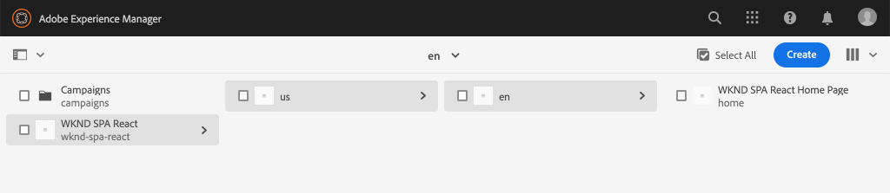

# Projet de l’éditeur SPA {#spa-editor-project}

Découvrez comment utiliser un projet Adobe Experience Manager (AEM) Maven comme point de départ pour une application React intégrée à l’éditeur d’applications d’une interface SPA AEM.

## Intention

1. Découvrez la structure d’un nouveau projet AEM SPA Editor créé à partir d’un archétype Maven.
2. Déployez le projet de démarrage sur une instance locale d’AEM.

## Ce que vous allez construire

Dans ce chapitre, un nouveau projet AEM sera déployé, en fonction de l&#39;archétype [de projet](https://github.com/adobe/aem-project-archetype)AEM. Le projet AEM sera amorcé avec un point de départ très simple pour l&#39;application d&#39;une seule page. Le projet utilisé dans le présent chapitre servira de base à la mise en oeuvre de l&#39;APM de WKND et sera élaboré sur la base des prochains chapitres.



*Hiérarchie du site de départ pour l’application d’une seule page.*

## Conditions préalables

Examiner les outils et les instructions nécessaires pour la mise en place d&#39;un environnement [de développement](overview.md#local-dev-environment)local. Assurez-vous qu’une nouvelle instance de Adobe Experience Manager, démarrée en mode **auteur** , s’exécute localement.

## Obtenir le projet

Il existe plusieurs options pour créer un projet Maven Multi-module pour AEM. Ce didacticiel a utilisé le dernier archétype [de projet](https://github.com/adobe/aem-project-archetype) AEM comme base du code du tutoriel. Des modifications ont été apportées au code du projet afin de prendre en charge plusieurs versions des AEM. Veuillez consulter [la note sur la compatibilité](overview.md#compatibility)en amont.

>[!CAUTION]
>
> Il est recommandé d’utiliser la **dernière** version de l’ [archétype](https://github.com/adobe/aem-project-archetype) pour générer un nouveau projet pour une mise en oeuvre dans le monde réel. Les projets AEM doivent cible une seule version d&#39;AEM utilisant la `aemVersion` propriété de l&#39;archétype.

1. Téléchargez le point de départ de ce didacticiel via Git :

   ```shell
   $ git clone git@github.com:adobe/aem-guides-wknd-spa.git
   $ cd aem-guides-wknd-spa
   $ git checkout React/create-project-start
   ```

2. La structure de dossiers et de fichiers suivante représente le projet AEM généré par l&#39;archétype Maven sur le système de fichiers local :

   ```plain
   |--- aem-guides-wknd-spa
       |--- all/
       |--- core/
       |--- dispatcher/
       |--- ui.apps/
       |--- ui.apps.structure/
       |--- ui.content/
       |--- ui.frontend /
       |--- it.tests/
       |--- pom.xml
       |--- README.md
       |--- .gitignore
       |--- archetype.properties
   ```

3. Les propriétés suivantes ont été utilisées lors de la génération du projet AEM à partir de l&#39;archétype [](https://github.com/Adobe-Marketing-Cloud/aem-project-archetype/releases/tag/aem-project-archetype-14)AEM Project :

   | Propriétés | Valeur |
   |-----------------|-------------------------------------|
   | aemVersion | nuage |
   | appTitle | Réaction de l&#39;application de gestion des actifs |
   | appId | wknd-spa-réagir |
   | groupId | com.adobe.aem.guides |
   | frontendModule | réagir |
   | package | com.adobe.aem.guides.wknd.spa.react |
   | includeExample | n |

   >[!NOTE]
   >
   > Notez la `frontendModule=react` propriété. Cela indique à l&#39;archétype de projet AEM de démarrer le projet avec une base [de code](https://docs.adobe.com/content/help/en/experience-manager-core-components/using/developing/archetype/uifrontend-react.html) Réaction de démarrage à utiliser avec l&#39;éditeur d&#39;applications d&#39;AEM.

## Création du projet

Ensuite, compilez, générez et déployez le code du projet sur une instance locale d&#39;AEM à l&#39;aide de Maven.

1. Assurez-vous qu’une instance d’AEM s’exécute localement sur le port **4502**.
2. Depuis le terminal de ligne de commande, vérifiez que Maven est installé :

   ```shell
   $ mvn --version
    Apache Maven 3.6.2
    Maven home: /Library/apache-maven-3.6.2
    Java version: 11.0.4, vendor: Oracle Corporation, runtime: /Library/Java/JavaVirtualMachines/jdk-11.0.4.jdk/Contents/Home
   ```

3. Exécutez la commande ci-dessous Maven à partir du `aem-guides-wknd-spa` répertoire pour créer et déployer le projet sur AEM :

   ```shell
   $ mvn clean install -PautoInstallSinglePackage
   ```

   Si vous utilisez [AEM 6.x](overview.md#compatibility):

   ```shell
   $ mvn clean install -PautoInstallSinglePackage -Pclassic
   ```

   Les multiples modules du projet doivent être compilés et déployés en AEM.

   ```plain
    [INFO] ------------------------------------------------------------------------
    [INFO] Reactor Summary for wknd-spa-react 1.0.0-SNAPSHOT:
    [INFO] 
    [INFO] wknd-spa-react ..................................... SUCCESS [  0.523 s]
    [INFO] WKND SPA React - Core .............................. SUCCESS [  8.069 s]
    [INFO] wknd-spa-react.ui.frontend - UI Frontend ........... SUCCESS [01:23 min]
    [INFO] WKND SPA React - Repository Structure Package ...... SUCCESS [  0.830 s]
    [INFO] WKND SPA React - UI apps ........................... SUCCESS [  4.654 s]
    [INFO] WKND SPA React - UI content ........................ SUCCESS [  1.607 s]
    [INFO] WKND SPA React - All ............................... SUCCESS [  0.384 s]
    [INFO] WKND SPA React - Integration Tests Bundles ......... SUCCESS [  0.770 s]
    [INFO] WKND SPA React - Integration Tests Launcher ........ SUCCESS [  1.407 s]
    [INFO] WKND SPA React - Dispatcher ........................ SUCCESS [  0.055 s]
    [INFO] ------------------------------------------------------------------------
    [INFO] BUILD SUCCESS
    [INFO] ------------------------------------------------------------------------
    [INFO] Total time:  01:44 min
   ```

   Le profil Maven ***autoInstallSinglePackage*** compile les modules individuels du projet et déploie un package unique sur l’instance AEM. Par défaut, ce package sera déployé sur une instance AEM s’exécutant localement sur le port **4502** et avec les informations d’identification de **admin:admin**.

4. Accédez à **[!UICONTROL Package Manager]** sur votre instance d’AEM locale : [http://localhost:4502/crx/packmgr/index.jsp](http://localhost:4502/crx/packmgr/index.jsp).

5. Vous devriez voir trois paquets pour `wknd-spa-react.all`, `wknd-spa-react.ui.apps` et `wknd-spa-react.ui.content`.

   

   *aem Package Manager*

   Tout le code personnalisé nécessaire au projet sera assemblé dans ces packages et installé sur l&#39;exécution AEM.

6. Vous devriez également voir plusieurs paquets pour `spa.project.core` et `core.wcm.components`. Ces dépendances sont automatiquement incluses par l&#39;archétype. Vous trouverez plus d&#39;informations sur [AEM Core Components ici](https://docs.adobe.com/content/help/fr-FR/experience-manager-core-components/using/introduction.html).

   `spa.project.core` est une dépendance nécessaire pour générer l’API du modèle JSON attendue par l’éditeur d’applications monopages.

## Contenu de l’auteur

Ouvrez ensuite l’application d’une seule page d’accueil qui a été générée par l’archétype et mettez à jour une partie du contenu.

1. Accédez à la console **[!UICONTROL Sites]** : [http://localhost:4502/sites.html/content](http://localhost:4502/sites.html/content).

   L’application d’une seule page comprend une structure de site de base avec un pays, une langue et une page d&#39;accueil. Cette hiérarchie est basée sur les valeurs par défaut de l&#39;archétype pour `language_country` et `isSingleCountryWebsite`. Ces valeurs peuvent être remplacées en mettant à jour les propriétés [](https://github.com/adobe/aem-project-archetype#available-properties) disponibles lors de la génération d’un projet.

2. Ouvrez la page **[!DNL us]** > **[!DNL en]** > **[!DNL WKND SPA React Home Page]** en la sélectionnant et en cliquant sur le bouton **[!UICONTROL Modifier]** dans la barre de menus :

   

3. Un composant **[!UICONTROL Texte]** a déjà été ajouté à la page. Vous pouvez modifier ce composant comme tout autre composant de l&#39;AEM.

   

4. ajoutez un composant **[!UICONTROL Texte]** supplémentaire sur la page.

   Notez que l’expérience de création est similaire à celle d’une page AEM Sites traditionnelle. Actuellement, un nombre limité de composants peuvent être utilisés. D&#39;autres seront ajoutés au cours du tutoriel.

## inspect pour l’application d’une seule page

Ensuite, vérifiez qu’il s’agit d’une application d’une seule page utilisant les outils de développement de votre navigateur.

1. Dans l’éditeur **[!UICONTROL de]** page, cliquez sur le bouton **[!UICONTROL Informations]** sur la page > **[!UICONTROL Vue telle que publiée]**:

   

   Un nouvel onglet s’ouvre avec le paramètre de requête `?wcmmode=disabled` qui désactive effectivement l’éditeur de AEM : [http://localhost:4502/content/wknd-spa-react/us/en/home.html?wcmmode=disabled](http://localhost:4502/content/wknd-spa-react/us/en/home.html?wcmmode=disabled)

2. Vue de la source de la page et notez que le contenu de texte **[!DNL Hello World]** ou tout autre contenu est introuvable. A la place, vous devriez voir du code HTML comme suit :

   ```html
   ...
   <body>
       <noscript>You need to enable JavaScript to run this app.</noscript>
       <div id="spa-root"></div>
       <script type="text/javascript" src="/etc.clientlibs/wknd-spa-react/clientlibs/clientlib-react.min.js"></script>
   </body>
   ...
   ```

   `clientlib-react.min.js` est l’application d’une seule page qui est chargée sur la page et responsable du rendu du contenu.

   Cependant, *d&#39;où vient le contenu ?*

3. Revenir à l’onglet : [http://localhost:4502/content/wknd-spa-react/us/en/home.html?wcmmode=disabled](http://localhost:4502/content/wknd-spa-react/us/en/home.html?wcmmode=disabled)
4. Ouvrez les outils de développement du navigateur et inspectez le trafic réseau de la page pendant une actualisation. Vue des requêtes **XHR** :

   

   Une demande doit être envoyée à [http://localhost:4502/content/wknd-spa-react/us/en.model.json](http://localhost:4502/content/wknd-spa-react/us/en.model.json). Contient tout le contenu, formaté en JSON, qui pilotera l’application d’une seule page.

5. Dans un nouvel onglet, ouvrez [http://localhost:4502/content/wknd-spa-react/us/en.model.json](http://localhost:4502/content/wknd-spa-react/us/en.model.json)

   La requête `en.model.json` représente le modèle de contenu qui pilotera l’application. inspect la sortie JSON et vous devriez être en mesure de trouver le fragment de code représentant les composants **[!UICONTROL Texte]** .

   ```json
   ...
   ":items": {
       "text": {
           "text": "<p>Hello World! Updated content!</p>\r\n",
           "richText": true,
           ":type": "wknd-spa-react/components/text"
       },
       "text_98796435": {
           "text": "<p>A new text component.</p>\r\n",
           "richText": true,
           ":type": "wknd-spa-react/components/text"
       },
   }
   ...
   ```

   Dans le chapitre suivant, nous allons examiner comment ce contenu JSON est mappé des composants AEM aux composants SPA pour former la base de l’expérience AEM SPA Editor.

   >[!NOTE]
   >
   > Il peut s’avérer utile d’installer une extension de navigateur pour formater automatiquement la sortie JSON.

## Félicitations ! {#congratulations}

Félicitations, vous venez de créer votre premier projet AEM SPA Editor !

Le SPA est assez simple. Dans les prochains chapitres, d&#39;autres fonctionnalités seront ajoutées.

### Étapes suivantes {#next-steps}

[Intégrer l&#39;application d&#39;une seule page - Découvrez comment le code source de l&#39;application d&#39;une seule page est intégré à l&#39;AEM Project et comprenez les outils disponibles pour développer rapidement l&#39;application d&#39;une seule page.](integrate-spa.md)
