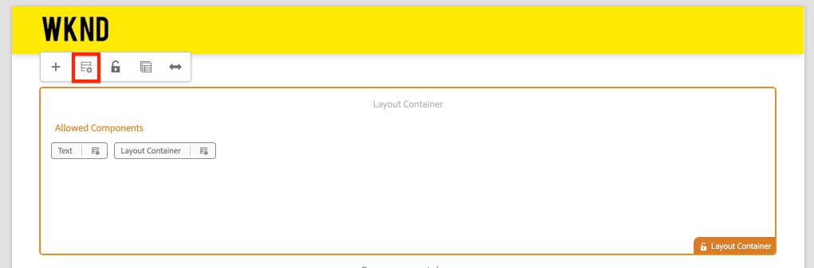

# Mappage des composants d’une application d’une seule page aux composants AEM {#map-components}

Découvrez comment mapper des composants de réaction à des composants Adobe Experience Manager (AEM) avec le SDK JS AEM SPA Editor. Le mappage de composants permet aux utilisateurs d’effectuer des mises à jour dynamiques des composants d’une application d’une seule page dans AEM éditeur d’applications d’une seule page, à l’instar de la création AEM traditionnelle.

Ce chapitre approfondit l’API de modèle JSON AEM et explique comment le contenu JSON exposé par un composant AEM peut être automatiquement injecté dans un composant React en tant que props.

## Intention

1. Découvrez comment mapper des composants AEM aux composants SPA.
2. Comprenez la différence entre les composants **Conteneur** et les composants **Contenu** .
3. Créez un composant Réagir qui mappe à un composant AEM existant.

## Ce que vous allez construire

Ce chapitre examine comment le composant `Text` SPA fourni est mappé au `Text`composant AEM. Un nouveau composant `Image` d’application d’une seule page sera créé et pourra être utilisé dans l’application d’une seule page et créé dans AEM. Les fonctionnalités prêtes à l’emploi des stratégies Conteneur **de** mise en page et Editeur **de** modèle seront également utilisées pour créer une vue un peu plus variée en apparence.


## Conditions préalables

Examiner les outils et les instructions nécessaires pour la mise en place d&#39;un environnement [de développement](overview.md#local-dev-environment)local.

### Obtention du code

1. Téléchargez le point de départ de ce didacticiel via Git :

   ```shell
   $ git clone git@github.com:adobe/aem-guides-wknd-spa.git
   $ cd aem-guides-wknd-spa
   $ git checkout React/map-components-start
   ```

2. Déployez la base de code sur une instance AEM locale à l’aide de Maven :

   ```shell
   $ mvn clean install -PautoInstallSinglePackage
   ```

   Si vous utilisez [AEM 6.x](overview.md#compatibility) , ajoutez le `classic` profil :

   ```shell
   $ mvn clean install -PautoInstallSinglePackage -Pclassic
   ```

Vous pouvez toujours vue le code fini sur [GitHub](https://github.com/adobe/aem-guides-wknd-spa/tree/React/map-components-solution) ou le retirer localement en passant à la branche `React/map-components-solution`.

## Approche de mappage

Le concept de base est de mapper un composant SPA à un composant AEM. aem composants, exécuter côté serveur, exporter du contenu dans le cadre de l’API du modèle JSON. Le contenu JSON est consommé par l’application d’une seule page, exécutant côté client dans le navigateur. Un mappage 1:1 entre les composants SPA et un composant AEM est créé.


*Présentation générale du mappage d&#39;un composant AEM à un composant de réaction*

## inspect du composant de texte

L&#39;archétype [de projet](https://github.com/adobe/aem-project-archetype) AEM fournit un `Text` composant mappé au composant [](https://docs.adobe.com/content/help/fr-FR/experience-manager-core-components/using/components/text.html)Texte AEM. Il s’agit d’un exemple de composant de **contenu** , en ce sens qu’il rend le *contenu* à partir d’AEM.

Voyons comment fonctionne le composant.

### inspect, modèle JSON

1. Avant de passer au code d’application d’une seule page, il est important de comprendre le modèle JSON fourni par AEM. Accédez à la bibliothèque [de composants](https://www.aemcomponents.dev/content/core-components-examples/library/page-authoring/text.html) principaux et vue la page du composant Texte. La bibliothèque de composants principaux fournit des exemples de tous les composants principaux AEM.
2. Sélectionnez l’onglet **JSON** pour l’un des exemples suivants :

   

   Trois propriétés doivent s’afficher : `text`, `richText`et `:type`.

   `:type` est une propriété réservée qui liste le `sling:resourceType` (ou chemin) du composant AEM. La valeur de `:type` est utilisée pour mapper le composant AEM au composant SPA.

   `text` et `richText` sont des propriétés supplémentaires qui seront exposées au composant SPA.

### inspect du composant Texte

1. Ouvrez un nouveau terminal et accédez au `ui.frontend` dossier à l’intérieur du projet. Exécutez `npm install` puis `npm start` pour début du **webpack-dev-server**:

   ```shell
   $ cd ui.frontend
   $ npm install
   $ npm start
   ```

   Le `ui.frontend` module est actuellement configuré pour utiliser le modèle [JSON](./integrate-spa.md#mock-json)simulé.

2. Une nouvelle fenêtre de navigateur s’ouvre sur [http://localhost:3000/content/wknd-spa-react/us/en/home.html.](http://localhost:3000/content/wknd-spa-react/us/en/home.html)

   

3. Dans l&#39;IDE de votre choix, ouvrez l&#39;AEM Project for the WKND SPA. Développez le `ui.frontend` module et ouvrez le fichier `Text.js` sous `ui.frontend/src/components/Text/Text.js`:

   

4. La première zone que nous allons inspecter est la `class Text` à ~ligne 40 :

   ```js
   class Text extends Component {
   
       get richTextContent() {
           return (<div
                   id={extractModelId(this.props.cqPath)}
                   data-rte-editelement
                   dangerouslySetInnerHTML={{__html: DOMPurify.sanitize(this.props.text)}} />
                   );
       }
   
       get textContent() {
           return <div>{this.props.text}</div>;
       }
   
       render() {
           return this.props.richText ? this.richTextContent : this.textContent;
       }
   }
   ```

   `Text` est un composant React standard. Le composant est utilisé `this.props.richText` pour déterminer si le contenu à rendre sera du texte enrichi ou du texte brut. Le &quot;contenu&quot; réel utilisé provient `this.props.text`. Pour éviter une attaque XSS potentielle, le texte enrichi est protégé par une séquence d’échappement `DOMPurify` avant d’utiliser [dangereusementSetInnerHTML](https://reactjs.org/docs/dom-elements.html#dangerouslysetinnerhtml) pour générer le contenu. Rappelez les propriétés `richText` et `text` des propriétés du modèle JSON plus tôt dans l’exercice.

5. Jetez ensuite un coup d&#39;oeil à la `TextEditConfig` ligne 29 :

   ```js
   const TextEditConfig = {
   emptyLabel: 'Text',
   
       isEmpty: function(props) {
           return !props || !props.text || props.text.trim().length < 1;
       }
   };
   ```

   Le code ci-dessus est chargé de déterminer quand rendre l’espace réservé dans l’environnement d’auteur AEM. Si la `isEmpty` méthode renvoie **true** , l’espace réservé est rendu.

6. Enfin, jetez un coup d&#39;oeil à l&#39; `MapTo` appel à la ligne 62 :

   ```js
   export default MapTo('wknd-spa-react/components/text')(Text, TextEditConfig);
   ```

   `MapTo` est fourni par l’AEM SPA Editor JS SDK (`@adobe/aem-react-editable-components`). Le chemin `wknd-spa-react/components/text` représente le `sling:resourceType` composant AEM. Ce chemin est mis en correspondance avec le `:type` exposé par le modèle JSON observé précédemment. `MapTo` prend soin d’analyser la réponse du modèle JSON et de transmettre les valeurs correctes `props` au composant SPA.

   Vous trouverez la définition du `Text` composant AEM à l’adresse `ui.apps/src/main/content/jcr_root/apps/wknd-spa-react/components/text`.

7. Testez en modifiant le `mock.model.json` fichier à `ui.frontend/public/mock-content/mock.model.json`. À ~line 62, mettez à jour la première `Text` valeur pour utiliser une **`H1`** balise et **`u`** :

   ```json
       "text": {
           "text": "<h1><u>Hello World!</u></h1>",
           "richText": true,
           ":type": "wknd-spa-react/components/text"
       }
   ```

   Accédez à [http://localhost:3000](http://localhost:3000) pour voir les effets :

   

   Essayez de faire basculer la `richText` propriété entre **true** / **false** pour voir la logique de rendu en action.

8. inspect `Text.scss` à `ui.frontend/src/components/Text/Text.scss`.

   Ce fichier a été ajouté par la base de code de démarrage de ce chapitre et utilise la fonction [Sass](https://sass-lang.com/) ajoutée au chapitre précédent. Notez les variables référencées à partir de `ui.frontend/src/styles/_variables.scss`.

## Création du composant Image

Créez ensuite un composant `Image` Réagir mappé au composant [AEM](https://docs.adobe.com/content/help/fr-FR/experience-manager-core-components/using/components/image.html)Image. Le `Image` composant est un autre exemple de composant de **contenu** .

### inspect et JSON

Avant de passer au code de l’application d’une seule page, inspectez le modèle JSON fourni par AEM.

1. Accédez aux exemples [d’images de la bibliothèque](https://www.aemcomponents.dev/content/core-components-examples/library/page-authoring/image.html)de composants principaux.

   

   Les propriétés de `src`, `alt`et `title` seront utilisées pour renseigner le `Image` composant SPA.

   >[!NOTE]
   >
   > D’autres propriétés Image exposées (`lazyEnabled`, `widths`) permettent au développeur de créer un composant de chargement adaptatif et différé. Le composant généré dans ce didacticiel sera simple et **n’utilisera pas** ces propriétés avancées.

2. Revenez à votre IDE et ouvrez le `mock.model.json` à `ui.frontend/public/mock-content/mock.model.json`. Comme il s&#39;agit d&#39;un composant net-new pour notre projet, nous devons nous moquer de l&#39;image JSON.

   À ~line 70, ajoutez une entrée JSON pour le `image` modèle (n&#39;oubliez pas la virgule de fin `,` après la seconde `text_23828680`) et mettez à jour le `:itemsOrder` tableau.

   ```json
   ...
   ":items": {
               ...
               "text_23828680": {
                   "text": "<p>Mock Model JSON!</p>",
                   "richText": true,
                   ":type": "wknd-spa-react/components/text"
               },
               "image": {
                   "alt": "Rock Climber in New Zealand",
                   "title": "Rock Climber in New Zealand",
                   "src": "/mock-content/adobestock-140634652.jpeg",
                   ":type": "wknd-spa-react/components/image"
               }
           },
           ":itemsOrder": [
               "text",
               "text_23828680",
               "image"
           ],
   ```

   Le projet inclut un exemple d&#39;image `/mock-content/adobestock-140634652.jpeg` qui sera utilisé avec le **webpack-dev-server**.

   Vous pouvez vue ici [le](https://github.com/adobe/aem-guides-wknd-spa/blob/React/map-components-solution/ui.frontend/public/mock-content/mock.model.json)fichier complet de mock.model.json.

### Mise en oeuvre du composant Image

1. Créez ensuite un nouveau dossier nommé `Image` sous `ui.frontend/src/components`.
2. Sous le `Image` dossier, créez un nouveau fichier nommé `Image.js`.

   

3. ajoutez les `import` instructions suivantes à `Image.js`:

   ```js
   import React, {Component} from 'react';
   import {MapTo} from '@adobe/aem-react-editable-components';
   ```

4. Ajoutez ensuite le `ImageEditConfig` afin de déterminer à quel moment afficher l’espace réservé dans AEM :

   ```js
   export const ImageEditConfig = {
   
       emptyLabel: 'Image',
   
       isEmpty: function(props) {
           return !props || !props.src || props.src.trim().length < 1;
       }
   };
   ```

   L’espace réservé s’affiche si la propriété n’est pas définie. `src`

5. Implémentez ensuite la `Image` classe :

   ```js
    export default class Image extends Component {
   
       get content() {
           return ;
       }
   
       render() {
           if(ImageEditConfig.isEmpty(this.props)) {
               return null;
           }
   
           return (
                   <div className="Image">
                       {this.content}
                   </div>
           );
       }
   }
   ```

   Le code ci-dessus effectue le rendu d’un `` rapport basé sur les props `src``alt``title` , et transmis par le modèle JSON.

6. ajoutez le `MapTo` code pour mapper le composant Réagir au composant AEM :

   ```js
   MapTo('wknd-spa-react/components/image')(Image, ImageEditConfig);
   ```

   Notez que la chaîne `wknd-spa-react/components/image` correspond à l’emplacement du composant AEM dans `ui.apps` : `ui.apps/src/main/content/jcr_root/apps/wknd-spa-react/components/image`.

7. Créez un nouveau fichier nommé `Image.scss` dans le même répertoire et ajoutez ce qui suit :

   ```scss
   .Image-src {
       margin: 1rem 0;
       width: 100%;
       border: 0;
   }
   ```

8. Dans `Image.js` ajoutez une référence au fichier dans la partie supérieure sous les `import` instructions :

   ```js
   import React, {Component} from 'react';
   import {MapTo} from '@adobe/aem-react-editable-components';
   
   require('./Image.scss');
   ```

   Vous pouvez vue le fichier [Image.js complet ici](https://github.com/adobe/aem-guides-wknd-spa/blob/React/map-components-solution/ui.frontend/src/components/Image/Image.js).

9. Ouvrez le fichier `ui.frontend/src/components/import-components.js` et ajoutez une référence au nouveau `Image` composant :

   ```js
   import './Page/Page';
   import './Text/Text';
   import './Image/Image'; //add reference to Image component
   ```

10. Si ce n&#39;est pas déjà fait, début le **webpack-dev-server**. Accédez à [http://localhost:3000](http://localhost:3000) et le rendu de l’image doit s’afficher :

   

   >[!NOTE]
   >
   > **Défi**: Mettez en oeuvre une nouvelle méthode dans `Image.js` pour afficher la valeur de `this.props.title` sous-image sous la forme d’une légende.

## Mettre à jour les stratégies dans AEM

Le `Image` composant n&#39;est visible que dans le serveur **** webpack-dev-dev. Ensuite, déployez l’application d’une seule page afin d’AEM et de mettre à jour les stratégies de modèle.

1. Arrêtez le **webpack-dev-server** et à partir de la racine du projet, déployez les modifications pour AEM en utilisant vos compétences Maven :

   ```shell
   $ cd aem-guides-wknd-spa
   $ mvn clean install -PautoInstallSinglePackage
   ```

2. Dans l’écran Début AEM, accédez à **Outils** > **Modèles** > Réaction **[](http://localhost:4502/libs/wcm/core/content/sites/templates.html/conf/wknd-spa-react)** de l’application d’une seule page.

   Sélectionnez et modifiez la page **** d’application d’une seule page :

   

3. Sélectionnez le Conteneur **de** mise en page et cliquez sur son icône de **stratégie** pour modifier la stratégie :

   

4. Sous Composants **** autorisés > Réaction de l’application d’une seule page **WKND - Contenu** > vérifiez le composant **Image** :

   

   Sous Composants **** par défaut > Mappage **des** Ajoutes et sélectionnez **Image - Réaction de l’application d’une seule page - Composant de contenu** :

   

   Entrez un type **** mime de `image/*`.

   Cliquez sur **Terminé** pour enregistrer les mises à jour de stratégie.

5. Dans le Conteneur **de** mise en page, cliquez sur l’icône de **stratégie** du composant **Texte** :

   

   Créez une nouvelle stratégie nommée **WKND SPA Text**. Sous **Plugins** > **Formatage** > cochez toutes les cases pour activer d’autres options de formatage :

   

   Sous **Plugins** > Styles **de** paragraphe > cochez la case **Activer les styles** de paragraphe :

   

   Cliquez sur **Terminé** pour enregistrer la mise à jour de la stratégie.

6. Accédez à la **page d&#39;accueil** [http://localhost:4502/editor.html/content/wknd-spa-react/us/en/home.html](http://localhost:4502/editor.html/content/wknd-spa-react/us/en/home.html).

   Vous devez également pouvoir modifier le `Text` composant et ajouter des styles de paragraphe supplémentaires en mode **plein écran** .

   

7. Vous devez également pouvoir faire glisser et déposer une image à partir de l’outil de recherche **de** ressources :

   

8. ajoutez vos propres images par [AEM Assets](http://localhost:4502/assets.html/content/dam) ou installez la base de code finalisée pour le site [](https://github.com/adobe/aem-guides-wknd/releases/latest)de référence WKND standard. Le site [de référence](https://github.com/adobe/aem-guides-wknd/releases/latest) WKND comprend de nombreuses images qui peuvent être réutilisées sur l&#39;application d&#39;une seule page. Le package peut être installé à l’aide d’ [AEM Package Manager](http://localhost:4502/crx/packmgr/index.jsp).

   

## inspect le Conteneur de mise en page

Le Conteneur **de** mise en page est automatiquement pris en charge par le SDK AEM SPA Editor. Le Conteneur **de** mise en page, tel qu’indiqué par son nom, est un composant de **conteneur** . Les composants de conteneur sont des composants qui acceptent les structures JSON qui représentent *d’autres* composants et les instancient dynamiquement.

Examinons le Conteneur de mise en page plus loin.

1. Dans un navigateur, accédez à [http://localhost:4502/content/wknd-spa-react/us/en.model.json](http://localhost:4502/content/wknd-spa-react/us/en.model.json)

   

   Le composant Conteneur **de** mise en page `sling:resourceType` possède une valeur `wcm/foundation/components/responsivegrid` de `:type` et est reconnu par l’éditeur d’applications monopages à l’aide de la propriété `Text` , tout comme les `Image` et composants.

   Les mêmes fonctionnalités de redimensionnement d’un composant à l’aide du mode [de](https://docs.adobe.com/content/help/en/experience-manager-65/authoring/siteandpage/responsive-layout.html#defining-layouts-layout-mode) mise en page sont disponibles avec l’éditeur d’applications monopages.

2. Revenez à [http://localhost:4502/editor.html/content/wknd-spa-react/us/en/home.html](http://localhost:4502/editor.html/content/wknd-spa-react/us/en/home.html). ajoutez d’autres composants **d’image** et essayez de les redimensionner à l’aide de l’option **Disposition** :

   

3. rouvrez le modèle JSON [http://localhost:4502/content/wknd-spa-react/us/en.model.json](http://localhost:4502/content/wknd-spa-react/us/en.model.json) et observez-le `columnClassNames` dans le cadre du fichier JSON :

   

   Le nom de classe `aem-GridColumn--default--4` indique que le composant doit avoir une largeur de 4 colonnes sur la base d&#39;une grille de 12 colonnes. Vous trouverez plus de détails sur la grille [réactive ici](https://adobe-marketing-cloud.github.io/aem-responsivegrid/).

4. Revenez à l&#39;IDE et dans le `ui.apps` module il y a une bibliothèque côté client définie à `ui.apps/src/main/content/jcr_root/apps/wknd-spa-react/clientlibs/clientlib-grid`. Open the file `less/grid.less`.

   Ce fichier détermine les points d’arrêt (`default`, `tablet`et `phone`) utilisés par le Conteneur **** de mise en page. Ce fichier est destiné à être personnalisé selon les spécifications du projet. Actuellement, les points d’arrêt sont définis sur `1200px` et `650px`.

5. Vous devez pouvoir utiliser les fonctionnalités réactives et les stratégies de texte enrichi mises à jour du `Text` composant pour créer une vue du type suivant :

   

## Félicitations ! {#congratulations}

Félicitations, vous avez appris à mapper des composants SPA à des composants AEM et vous avez mis en oeuvre un nouveau `Image` composant. Vous avez également la possibilité d’explorer les fonctionnalités réactives du Conteneur **de** mise en page.

Vous pouvez toujours vue le code fini sur [GitHub](https://github.com/adobe/aem-guides-wknd-spa/tree/React/map-components-solution) ou le retirer localement en passant à la branche `React/map-components-solution`.

### Étapes suivantes {#next-steps}

[Navigation et Routage](navigation-routing.md) : découvrez comment plusieurs vues de l’application d’une seule page peuvent être prises en charge en mappant des pages AEM avec le SDK de l’éditeur d’une seule page. La navigation dynamique est mise en oeuvre à l&#39;aide du Routeur de réaction et ajoutée à un composant d&#39;en-tête existant.

## Bonus - Configuration persistante du contrôle de code source {#bonus}

Dans de nombreux cas, en particulier au début d&#39;un projet AEM, il est important de conserver les configurations, comme les modèles et les stratégies de contenu connexes, pour contrôler la source. Ceci garantit que tous les développeurs travaillent sur le même ensemble de contenu et de configurations et peut garantir une cohérence supplémentaire entre les environnements. Une fois qu&#39;un projet atteint un certain niveau de maturité, la pratique de gestion des modèles peut être transmise à un groupe spécial d&#39;utilisateurs de la puissance.

Les prochaines étapes se dérouleront à l&#39;aide de l&#39;IDE du code Visual Studio et de la synchronisation [](https://marketplace.visualstudio.com/items?itemName=yamato-ltd.vscode-aem-sync) VSCode AEM, mais elles peuvent être effectuées à l&#39;aide de n&#39;importe quel outil et de tout IDE que vous avez configuré pour **extraire** ou **importer** du contenu d&#39;une instance locale d&#39;AEM.

1. Dans l’IDE du code Visual Studio, assurez-vous que **VSCode AEM Sync** est installé via l’extension Marketplace :

   

2. Développez le module **ui.content** dans l&#39;explorateur de projets et accédez à `/conf/wknd-spa-react/settings/wcm/templates`.

3. **Cliquez avec le bouton droit de la souris sur** le `templates` dossier et sélectionnez **Importer à partir du serveur** AEM :

   

4. Répétez les étapes pour importer du contenu, mais sélectionnez le dossier **policies** situé dans `/conf/wknd-spa-react/settings/wcm/templates/policies`.

5. inspect le `filter.xml` fichier situé dans `ui.content/src/main/content/META-INF/vault/filter.xml`.

   ```xml
   <!--ui.content filter.xml-->
   <?xml version="1.0" encoding="UTF-8"?>
    <workspaceFilter version="1.0">
        <filter root="/conf/wknd-spa-react" mode="merge"/>
        <filter root="/content/wknd-spa-react" mode="merge"/>
        <filter root="/content/dam/wknd-spa-react" mode="merge"/>
        <filter root="/content/experience-fragments/wknd-spa-react" mode="merge"/>
    </workspaceFilter>
   ```

   Le `filter.xml` fichier est chargé d&#39;identifier les chemins d&#39;accès des noeuds qui seront installés avec le package. Notez que `mode="merge"` sur chacun des filtres indique que le contenu existant ne sera pas modifié, seul le nouveau contenu sera ajouté. Les auteurs de contenu pouvant mettre à jour ces chemins, il est important qu’un déploiement de code **ne remplace pas** le contenu. Pour plus d&#39;informations sur l&#39;utilisation des éléments de filtre, consultez la documentation [](https://jackrabbit.apache.org/filevault/filter.html) FileVault.

   Comparer `ui.content/src/main/content/META-INF/vault/filter.xml` et `ui.apps/src/main/content/META-INF/vault/filter.xml` comprendre les différents noeuds gérés par chaque module.
